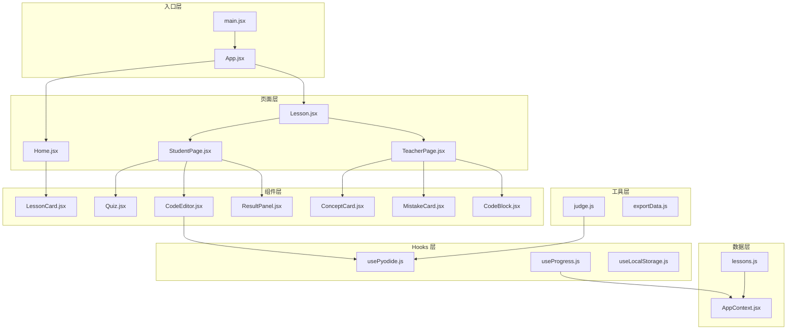
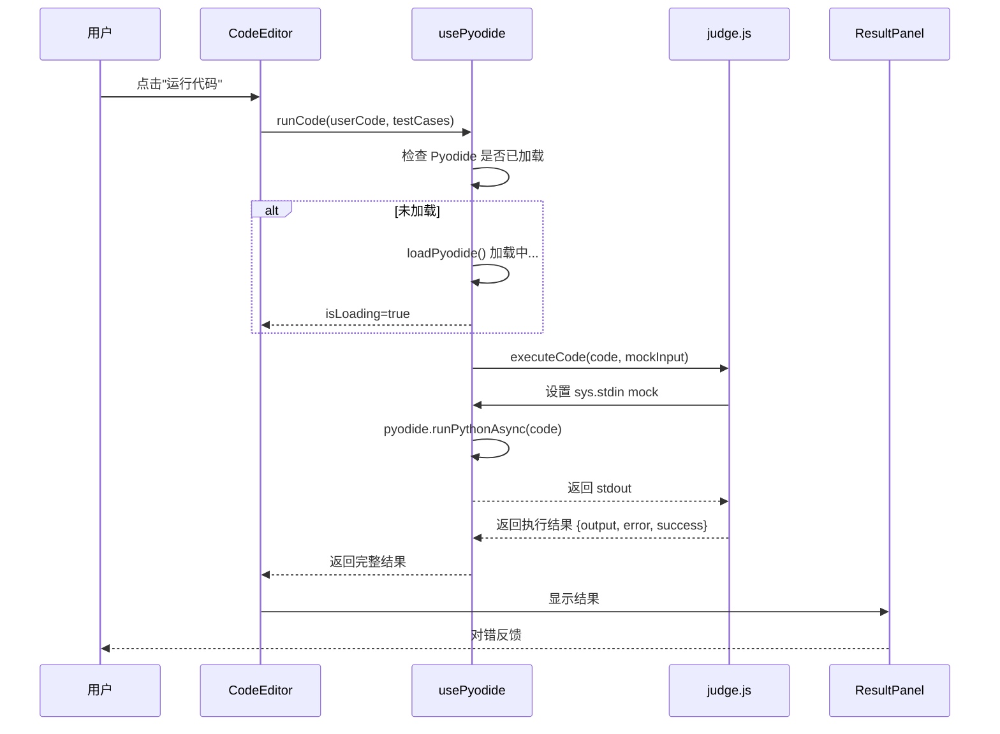
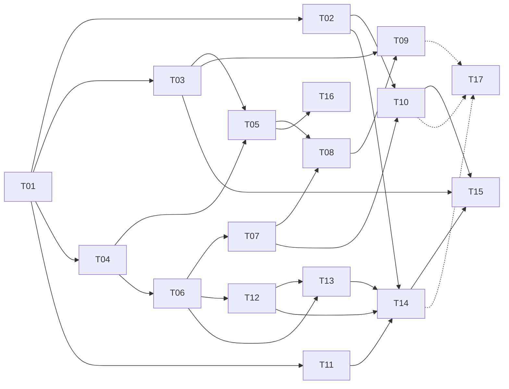

# YCL Python 四级互动教学课件 - 系统架构设计

> 版本：1.0 | 日期：2025-01-26 | 架构师：高见远

---

## 1 技术选型说明

### 1.1 核心技术栈

| 层级 | 技术选型 | 版本 | 说明 |
|------|---------|------|------|
| **构建工具** | Vite | ^5.0.0 | 快速冷启动、HMR 热更新 |
| **前端框架** | React | ^18.2.0 | 组件化、虚拟 DOM |
| **样式方案** | Tailwind CSS | ^3.4.0 | 原子化 CSS、快速开发 |
| **Python 运行时** | Pyodide | 0.24.1 | 浏览器内运行 Python |
| **代码高亮** | Prism.js | ^1.29.0 | 轻量、支持多种语言 |
| **Markdown** | react-markdown | ^9.0.0 | React 原生 Markdown 渲染 |
| **状态管理** | React Context | 内置 | 轻量级跨组件共享 |
| **数据持久化** | localStorage | 内置 | 本地存储进度 |

### 1.2 Pyodide CDN 集成方案

**CDN 选择**：使用 jsdelivr CDN（国内访问速度良好）

```
主 CDN：https://cdn.jsdelivr.net/pyodide/v0.24.1/full/
备选：https:// unpkg.com/pyodide@0.24.1/full/
```

**加载策略**：
1. **懒加载**：首次进入学生页（编程题）时才加载 Pyodide
2. **预加载提示**：教师页显示 "Pyodide 准备中..." 提示用户
3. **缓存**：加载后缓存到内存，后续直接使用

**版本锁定**：锁定 0.24.1 版本，避免自动升级导致兼容性问题

### 1.3 代码高亮方案

**选择**：Prism.js（轻量、高性能、主题丰富）

**集成方式**：
- 按需加载语言：python、javascript、bash
- 使用 `prismjs/components/prism-python.js` 按需导入
- 主题：`prism-tomorrow` 或 `prism-one-dark`

**替代方案备选**：若需更好看的效果，可考虑 `highlight.js`（但体积较大）

### 1.4 Markdown 渲染方案

**选择**：`react-markdown` + `remark-gfm`

**特性支持**：
- GitHub  flavored Markdown（表格、代码块、任务列表）
- 代码高亮（配合 Prism.js）
- 数学公式（配合 `remark-math` + `rehype-katex`）

---

## 2 目录结构设计

```
python-ycl-level4/
├── public/
│   └── favicon.ico
├── src/
│   ├── components/                 # 可复用组件
│   │   ├── LessonCard.jsx         # 课时卡片（首页）
│   │   ├── Quiz.jsx               # 选择题组件
│   │   ├── CodeEditor.jsx         # 代码编辑器
│   │   ├── ResultPanel.jsx        # 判题结果面板
│   │   ├── ConceptCard.jsx        # 概念讲解卡片
│   │   ├── MistakeCard.jsx        # 错误提醒卡片
│   │   └── CodeBlock.jsx          # 代码块（带高亮和复制）
│   │
│   ├── pages/                     # 页面组件
│   │   ├── Home.jsx               # 首页（课时列表）
│   │   ├── Lesson.jsx             # 课时容器（教师/学生模式）
│   │   ├── TeacherPage.jsx        # 教师页
│   │   └── StudentPage.jsx        # 学生页
│   │
│   ├── hooks/                     # 自定义 Hooks
│   │   ├── usePyodide.js          # Pyodide 加载与执行
│   │   ├── useProgress.js         # 进度存储与读取
│   │   └── useLocalStorage.js     # localStorage 通用 Hook
│   │
│   ├── context/                   # React Context
│   │   └── AppContext.jsx         # 全局状态（模式、进度）
│   │
│   ├── data/                      # 课程数据
│   │   └── lessons.js             # 30 课时完整数据
│   │
│   ├── utils/                     # 工具函数
│   │   ├── judge.js               # 判题逻辑
│   │   └── exportData.js          # 导入导出工具
│   │
│   ├── styles/                    # 样式文件
│   │   └── prism-theme.css        # Prism 代码高亮主题
│   │
│   ├── App.jsx                    # 根组件（路由）
│   └── main.jsx                   # 入口文件
│
├── index.html                     # HTML 入口
├── package.json                   # 依赖配置
├── vite.config.js                 # Vite 配置
├── tailwind.config.js             # Tailwind 配置
├── postcss.config.js              # PostCSS 配置
└── jsconfig.json                  # JS 路径别名配置
```

**目录设计原则**：
- `pages/` 放页面级组件（路由对应）
- `components/` 放可复用 UI 组件
- `data/` 集中管理课程内容数据
- `hooks/` 封装复杂逻辑
- `utils/` 放纯函数工具

---

## 3 组件职责说明

### 3.1 入口与根组件

| 文件 | 职责 | 关键逻辑 |
|------|------|---------|
| `main.jsx` | React 挂载、Provider 包裹 | 渲染 `<App />` 到 `#root` |
| `App.jsx` | 路由配置、全局状态、布局 | React Router 定义路由：`/` → Home，`/lesson/:id` → Lesson |

### 3.2 页面组件

| 文件 | 职责 | 关键逻辑 |
|------|------|---------|
| `Home.jsx` | 首页、课时列表展示 | 渲染 30 个 LessonCard，区分主线/拓展并读取进度显示完成状态 |
| `Lesson.jsx` | 课时容器、分发模式 | 根据 mode 显示 TeacherPage 或 StudentPage |
| `TeacherPage.jsx` | 教师页、概念讲解 | 渲染 Markdown 内容、概念卡片、代码示例、错误提醒 |
| `StudentPage.jsx` | 学生页、练习答题 | 渲染 Quiz + CodeEditor，管理答题状态 |

### 3.3 UI 组件

| 文件 | 职责 | 关键逻辑 |
|------|------|---------|
| `LessonCard.jsx` | 课时卡片（首页） | 显示课时号、标题、章节、完成状态，可点击跳转 |
| `Quiz.jsx` | 选择题组件 | 渲染题目、选项，处理选择、提交、反馈 |
| `CodeEditor.jsx` | 代码编辑器 | textarea 或 contenteditable，配合运行按钮 |
| `ResultPanel.jsx` | 判题结果展示 | 显示通过/失败、期望输出 vs 实际输出、错误信息 |
| `ConceptCard.jsx` | 概念卡片（教师页） | 一句话定义 + 代码示例 + 高亮 |
| `MistakeCard.jsx` | 错误提醒卡片 | 错误代码 + 正确代码对比 |
| `CodeBlock.jsx` | 代码块组件 | Prism 高亮 + 一键复制按钮 |

### 3.4 Hooks

| 文件 | 职责 | 关键逻辑 |
|------|------|---------|
| `usePyodide.js` | Pyodide 生命周期管理 | loadPyodide()、runPython()、captureStdout() |
| `useProgress.js` | 进度读写 | 读取、保存、导出、导入进度数据 |
| `useLocalStorage.js` | localStorage 封装 | get/set/delete，JSON 序列化 |

### 3.5 数据与工具

| 文件 | 职责 | 关键逻辑 |
|------|------|---------|
| `lessons.js` | 30 课时完整数据 | 导出序章、四级主线和拓展挑战的教师页/学生页内容 |
| `AppContext.jsx` | 全局状态管理 | 存储当前用户模式、进度数据 |
| `judge.js` | 判题逻辑 | executeCode()、compareOutput()、formatError() |
| `exportData.js` | 导入导出 | exportToJSON()、buildProgressExport()、importFromJSON() |

---

## 4 组件调用关系图

### 4.1 整体架构（Mermaid）



### 4.2 组件层级关系

```
App.jsx (根组件)
├── AppContext.Provider
│   └── Router
│       ├── Route: / → Home.jsx
│       └── Route: /lesson/:id → Lesson.jsx
│           ├── TeacherPage.jsx (mode="teacher")
│           │   ├── ConceptCard.jsx (循环渲染)
│           │   ├── MistakeCard.jsx (循环渲染)
│           │   └── CodeBlock.jsx (循环渲染)
│           └── StudentPage.jsx (mode="student")
│               ├── Quiz.jsx
│               │   └── (选择题逻辑)
│               └── CodeEditor.jsx
│                   └── ResultPanel.jsx
```

### 4.3 数据流向

```
用户操作
    │
    ▼
页面组件（Home/StudentPage/...）
    │
    ├── 读取状态 → AppContext（进度、模式）
    │
    ├── 读取课程 → lessons.js
    │
    └── 触发判题 → usePyodide.runPython()
                      │
                      ▼
                 judge.js 执行判题
                      │
                      ▼
                 ResultPanel 显示结果
                      │
                      ▼
                 useProgress 保存进度 → localStorage
```

---

## 5 Pyodide 判题流程详细设计

### 5.1 执行流程图



### 5.2 input() 模拟方案

**问题**：Pyodide 中 input() 会阻塞，无法在浏览器中工作

**解决方案**：重写 sys.stdin，注入预设输入值

```javascript
// usePyodide.js - 核心实现
export function usePyodide() {
  const pyodideRef = useRef(null);
  const inputQueueRef = useRef([]);

  // 加载 Pyodide
  const load = async () => {
    if (pyodideRef.current) return pyodideRef.current;

    const pyodide = await loadPyodide({
      indexURL: "https://cdn.jsdelivr.net/pyodide/v0.24.1/full/"
    });

    // 注入自定义 input
    pyodide.runPythonAsync(`
      import sys
      from io import StringIO

      class MockStdin:
          def __init__(self):
              self.queue = []

          def readline(self):
              if self.queue:
                  return self.queue.pop(0) + '\\n'
              return '\\n'

      sys.mock_stdin = MockStdin()
    `);

    pyodideRef.current = pyodide;
    return pyodide;
  };

  // 执行代码（带 input 模拟）
  const runCode = async (code, inputs = []) => {
    const pyodide = await load();

    // 将输入转换为换行分隔的字符串
    const inputStr = inputs.join('\n');

    // 重置 stdin 并设置输入
    await pyodide.runPythonAsync(`
      import sys
      sys.stdin = sys.mock_stdin
      sys.mock_stdin.queue = """${inputStr}""".split('\\n')
      sys.stdout = StringIO()
      sys.stderr = StringIO()
    `);

    // 执行用户代码
    try {
      await pyodide.runPythonAsync(code);

      // 获取输出
      const stdout = pyodide.runPython(`sys.stdout.getvalue()`);
      return { success: true, output: stdout, error: null };
    } catch (err) {
      const stderr = pyodide.runPython(`sys.stderr.getvalue()`);
      return { success: false, output: null, error: formatError(err, stderr) };
    }
  };

  return { load, runCode, isReady: !!pyodideRef.current };
}
```

### 5.3 print() 输出捕获方案

**方案**：重定向 sys.stdout 到 StringIO

```javascript
// 在执行前设置
await pyodide.runPythonAsync(`
  import sys
  from io import StringIO
  sys.stdout = StringIO()
  sys.stderr = StringIO()
`);

// 执行代码
await pyodide.runPythonAsync(userCode);

// 获取输出
const output = pyodide.runPython(`sys.stdout.getvalue()`);
```

### 5.4 结果比对方案

**精确匹配**：trim() 后完全相等

```javascript
// judge.js
export function judge(userCode, testCases) {
  const results = [];

  for (const { input, expected, label } of testCases) {
    const inputs = input.split('\n').filter(Boolean);
    const { output, error, success } = executeCode(userCode, inputs);

    if (!success) {
      results.push({
        label,
        passed: false,
        expected,
        actual: null,
        error: formatError(error)
      });
      continue;
    }

    // 标准化比对（去除首尾空白）
    const normalizedExpected = expected.trim();
    const normalizedActual = output.trim();

    results.push({
      label,
      passed: normalizedActual === normalizedExpected,
      expected: normalizedExpected,
      actual: normalizedActual,
      error: null
    });
  }

  return results;
}
```

### 5.5 错误处理机制

**错误类型分类**：

| 错误类型 | 捕获方式 | 用户提示 |
|---------|---------|---------|
| 语法错误 | try-catch `SyntaxError` | "代码有语法错误，请检查" |
| 运行时错误 | try-catch `Exception` | 显示错误类型 + 行号 |
| 超时错误 | setTimeout 监控 | "代码运行超时，请优化" |
| 死循环 | 执行时间监控 | "代码可能陷入死循环" |

**错误格式化**：

```javascript
function formatError(err, stderr = '') {
  // 清理 Pyodide 错误信息
  const errorMsg = stderr || err.message;
  const lines = errorMsg.split('\n');

  // 提取关键信息
  const tracebackStart = lines.findIndex(l => l.includes('Traceback'));
  const relevantLines = tracebackStart >= 0
    ? lines.slice(tracebackStart).join('\n')
    : lines.slice(-3).join('\n');

  return {
    type: 'RuntimeError', // 或 SyntaxError, TimeoutError
    message: relevantLines,
    raw: errorMsg
  };
}
```

### 5.6 判题参数说明

```javascript
// 测试用例数据结构
const testCases = [
  {
    label: "测试1",
    input: "Alice\n30",
    expected: "我叫Alice，今年30岁。"
  },
  {
    label: "测试2",
    input: "Bob\n25",
    expected: "我叫Bob，今年25岁。"
  }
];
```

**支持场景**：
- 单一输入：单行字符串
- 多行输入：用 `\n` 分隔
- 无输入：空字符串

---

## 6 完整任务分解（17 个任务）

### T01：项目基础设施（P0）

**任务名称**：搭建项目基础框架

**涉及文件**：
- `package.json`
- `vite.config.js`
- `tailwind.config.js`
- `postcss.config.js`
- `jsconfig.json`
- `index.html`
- `src/main.jsx`
- `src/App.jsx`

**依赖前置**：无

**实现要点**：
1. 初始化 Vite + React 项目
2. 配置 Tailwind CSS
3. 配置路径别名（`@/` → `src/`）
4. 引入 React Router
5. 创建基础 App 骨架（带路由配置）
6. 安装依赖：
   - `react`, `react-dom`
   - `react-router-dom`
   - `tailwindcss`, `postcss`, `autoprefixer`
   - `prismjs`
   - `react-markdown`

---

### T02：课程数据层（P0）

**任务名称**：构建课程数据

**涉及文件**：
- `src/data/lessons.js`

**依赖前置**：T01

**实现要点**：
1. 按 PRD 定义的 30 课时结构创建数据，其中课时 0-1 是序章，课时 2-13 是四级主线，课时 14-29 是拓展
2. 每个课时包含：
   - `id`, `title`, `chapter`
   - `examTopics`（考试考点）
   - `teacher`（教师页内容）
   - `student`（学生页内容）
3. 教师页数据：
   - `objectives`（学习目标）
   - `concepts`（概念列表）
   - `commonMistakes`（典型错误）
   - `teachingTips`（教学建议）
4. 学生页数据：
   - `quizzes`（选择题）
   - `codingChallenge`（编程题，含 testCases）

---

### T03：全局状态管理（P0）

**任务名称**：实现 AppContext

**涉及文件**：
- `src/context/AppContext.jsx`

**依赖前置**：T01

**实现要点**：
1. 创建 AppContext Provider
2. 状态定义：
   - `mode`: 'teacher' | 'student'
   - `progress`: 进度对象（从 localStorage 读取）
   - `currentLesson`: 当前课时 ID
3. 提供方法：
   - `setMode(mode)`
   - `updateProgress(lessonId, data)`
   - `getProgress(lessonId)`
4. 自动从 localStorage 初始化进度

---

### T04：localStorage Hooks（P0）

**任务名称**：封装 localStorage 操作

**涉及文件**：
- `src/hooks/useLocalStorage.js`

**依赖前置**：T01

**实现要点**：
1. 通用 Hook，支持任何类型的值
2. JSON 序列化/反序列化
3. 错误处理（超出容量、格式错误）
4. 返回 `[value, setValue, remove]`

---

### T05：进度管理 Hooks（P0）

**任务名称**：实现进度管理

**涉及文件**：
- `src/hooks/useProgress.js`
- `src/utils/exportData.js`

**依赖前置**：T03, T04

**实现要点**：
1. `useProgress()` Hook：
   - 读取单个课时进度
   - 更新单个课时进度
   - 获取所有课时进度
2. `exportData.js`：
   - `exportToJSON()`: 导出所有进度、答题明细和编程提交为 JSON
   - `buildProgressExport()`: 生成包含汇总记录的 JSON 数据结构
   - `importFromJSON()`: 从 JSON 恢复进度

---

### T06：Pyodide Hook（P0）

**任务名称**：实现 Pyodide 集成

**涉及文件**：
- `src/hooks/usePyodide.js`
- `src/utils/judge.js`

**依赖前置**：T04

**实现要点**：
1. `usePyodide.js` Hook：
   - `load()`: 加载 Pyodide（懒加载 + 缓存）
   - `runCode(code, inputs)`: 执行代码
   - `isLoading`, `isReady` 状态
2. `judge.js`：
   - `executeCode()`: 执行用户代码
   - `judge()`: 批量测试用例
   - `formatError()`: 错误格式化

---

### T07：基础 UI 组件（P0）

**任务名称**：实现基础 UI 组件

**涉及文件**：
- `src/components/CodeBlock.jsx`
- `src/components/ConceptCard.jsx`
- `src/components/MistakeCard.jsx`
- `src/styles/prism-theme.css`

**依赖前置**：T01, T06

**实现要点**：
1. `CodeBlock.jsx`：
   - Prism.js 代码高亮
   - 一键复制按钮
   - 语言标识（Python）
2. `ConceptCard.jsx`：
   - 概念名称（高亮）
   - 定义文本
   - 代码示例
3. `MistakeCard.jsx`：
   - 错误代码（红色背景）
   - 正确代码（绿色背景）
   - 对比展示

---

### T08：课时卡片组件（P0）

**任务名称**：实现课时卡片

**涉及文件**：
- `src/components/LessonCard.jsx`

**依赖前置**：T07

**实现要点**：
1. 显示：课时号、标题、章节
2. 完成状态：已完成（绿色勾）/ 未完成（灰色）
3. 可点击跳转 `/lesson/:id`
4. Hover 效果

---

### T09：首页（P0）

**任务名称**：实现首页

**涉及文件**：
- `src/pages/Home.jsx`

**依赖前置**：T03, T08

**实现要点**：
1. 标题：YCL Python 四级互动课件
2. 章节分组展示（6 章 × 2 课时）
3. 每个课时对应一个 LessonCard
4. 显示完成状态（从 progress 读取）
5. 底部：导入/导出按钮

---

### T10：教师页（P0）

**任务名称**：实现教师页

**涉及文件**：
- `src/pages/TeacherPage.jsx`

**依赖前置**：T02, T07

**实现要点**：
1. 学习目标区域
2. 概念讲解区域（循环 ConceptCard）
3. 代码示例区域（CodeBlock）
4. 典型错误区域（循环 MistakeCard）
5. 教学建议
6. "去练习" 按钮 → 切换到学生模式

---

### T11：选择题组件（P0）

**任务名称**：实现选择题组件

**涉及文件**：
- `src/components/Quiz.jsx`

**依赖前置**：T01

**实现要点**：
1. 渲染题目和选项
2. 支持单选题
3. 选择状态管理
4. 提交后即时反馈（正确/错误）
5. 显示正确答案（提交后）
6. 进度保存

---

### T12：代码编辑器（P0）

**任务名称**：实现代码编辑器

**涉及文件**：
- `src/components/CodeEditor.jsx`

**依赖前置**：T06

**实现要点**：
1. textarea 作为编辑器
2. 语法提示（行号）
3. 运行按钮
4. 加载 Pyodide 状态提示
5. 预设代码模板（题目要求）
6. 清空/重置按钮

---

### T13：结果面板组件（P0）

**任务名称**：实现结果面板

**涉及文件**：
- `src/components/ResultPanel.jsx`

**依赖前置**：T06

**实现要点**：
1. 显示测试结果列表
2. 每个结果：label、passed/failed
3. 通过：绿色 ✓，失败：红色 ✗
4. 期望输出 vs 实际输出对比
5. 错误信息展示
6. 综合判定（全部通过/部分通过/失败）

---

### T14：学生页（P0）

**任务名称**：实现学生页

**涉及文件**：
- `src/pages/StudentPage.jsx`

**依赖前置**：T02, T11, T12, T13

**实现要点**：
1. 选择题区域（Quiz 组件）
2. 编程题区域（CodeEditor + ResultPanel）
3. 编程题描述 + 提示
4. 判题结果实时反馈
5. 完成后标记课时完成

---

### T15：课时容器（P0）

**任务名称**：实现课时容器

**涉及文件**：
- `src/pages/Lesson.jsx`

**依赖前置**：T10, T14, T03

**实现要点**：
1. 从 URL 获取 lessonId
2. 根据 mode 渲染 TeacherPage 或 StudentPage
3. 顶部导航：返回首页、切换模式
4. 读取课程数据
5. 更新当前课时进度

---

### T16：数据导入导出（P2）

**任务名称**：实现导入导出功能

**涉及文件**：
- `src/utils/exportData.js`

**依赖前置**：T05

**实现要点**：
1. JSON 导出：下载 progress JSON 文件，包含答题明细和编程提交记录
2. JSON 导入：选择文件解析并恢复
3. 错误处理：文件格式错误提示

---

### T17：样式优化与响应式（P1）

**任务名称**：优化样式与响应式

**涉及文件**：
- `src/styles/` 下的 CSS 文件
- 组件内的 Tailwind 调整

**依赖前置**：全部组件完成

**实现要点**：
1. 响应式适配（1920x1080 投屏 + 移动端）
2. 深色模式支持（可选）
3. 代码编辑器样式优化
4. 打印样式（教师投屏友好）

---

## 7 任务依赖图



---

## 8 依赖包列表

```json
{
  "dependencies": {
    "react": "^18.2.0",
    "react-dom": "^18.2.0",
    "react-router-dom": "^6.20.0",
    "prismjs": "^1.29.0",
    "react-markdown": "^9.0.0",
    "remark-gfm": "^4.0.0"
  },
  "devDependencies": {
    "@vitejs/plugin-react": "^4.2.0",
    "vite": "^5.0.0",
    "tailwindcss": "^3.4.0",
    "postcss": "^8.4.0",
    "autoprefixer": "^10.4.0"
  }
}
```

**CDN 加载（无需 npm）**：
- Pyodide: `https://cdn.jsdelivr.net/pyodide/v0.24.1/full/pyodide.js`

---

## 9 共享知识（Shared Knowledge）

### 9.1 API 响应格式

无后端，纯前端 localStorage。

### 9.2 状态管理约定

```javascript
// AppContext 状态结构
{
  mode: 'teacher' | 'student',
  currentLessonId: number | null,
  progress: {
    [lessonId: number]: {
      completed: boolean,
      quizScore: number | null,
      codingPassed: boolean | null,
      lastUpdated: string // ISO 8601
    }
  }
}
```

### 9.3 日期格式

所有日期存储为 ISO 8601 UTC 格式：`new Date().toISOString()`

### 9.4 localStorage Key 约定

| Key | 用途 |
|-----|------|
| `ycl-python-level4-progress` | 进度数据 |
| `ycl-python-level4-mode` | 上次使用的模式 |

### 9.5 组件命名约定

- 页面组件：`PascalCase.jsx`（如 `TeacherPage.jsx`）
- UI 组件：`PascalCase.jsx`（如 `Quiz.jsx`）
- Hooks：`camelCase.js`，以 `use` 开头（如 `usePyodide.js`）
- 工具函数：`camelCase.js`（如 `judge.js`）

### 9.6 样式约定

- 使用 Tailwind CSS 作为主要样式方案
- 组件内部样式使用 `className` + Tailwind
- 复杂样式使用 `styles/` 目录下的 CSS 文件
- Prism 主题样式单独文件 `prism-theme.css`

---

## 10 潜在风险与注意事项

### 10.1 Pyodide 加载

- 国内网络可能访问 jsdelivr CDN 较慢
- 备选方案：unpkg CDN 或本地打包
- 建议：首次加载时显示加载动画

### 10.2 代码执行安全

- Pyodide 在浏览器沙箱中运行，相对安全
- 限制执行时间，避免死循环卡死页面
- 超时设置建议 10 秒

### 10.3 数据持久化

- localStorage 容量有限（约 5-10MB）
- 超出容量时需要提示用户导出清理
- 浏览器隐私模式可能无法存储

### 10.4 选择题数据

- 30 课时 × 3-5 道选择题，主线题与拓展题都保存在课程数据中
- 答案直接存储在 JSON 中（前端无需隐藏）

---

## 11 验收标准对照

| 验收项 | 对应任务 | 状态 |
|-------|---------|-----|
| 课程覆盖 30 课时并区分主线/拓展 | T02 | 🔄 待实现 |
| 判题功能正常 | T06, T12, T13 | 🔄 待实现 |
| 教师页完整 | T10 | 🔄 待实现 |
| 学生页完整 | T14 | 🔄 待实现 |
| 进度保存 | T05 | 🔄 待实现 |
| 导入导出 | T16 | 🔄 待实现 |
| 响应式适配 | T17 | 🔄 待实现 |

---

*文档结束 | 架构师：高见远*
