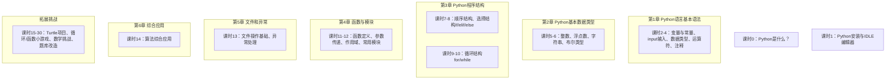
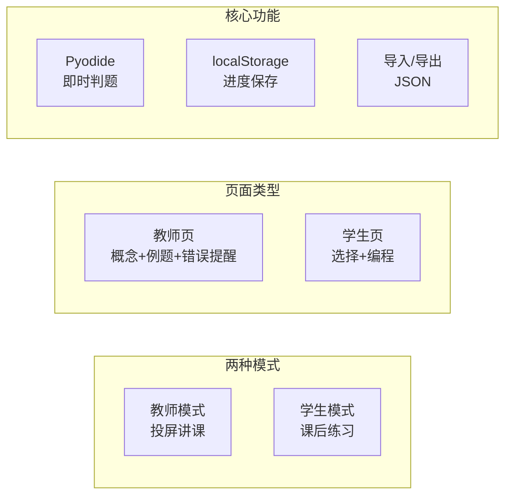
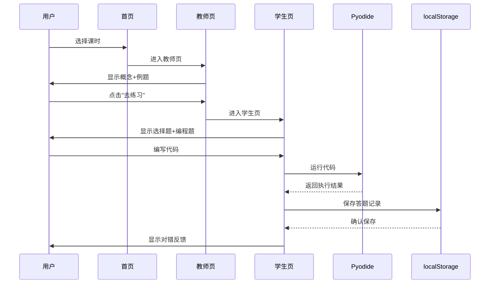

# YCL Python 四级互动教学课件 PRD

> 版本：1.0 | 日期：2025-01-26 | 产品经理：许清楚

---

## 1 产品概述

### 1.1 产品定位

| 属性 | 说明 |
|------|------|
| **产品名称** | YCL Python 四级互动教学课件 |
| **产品类型** | 教育类互动课件（静态单页应用） |
| **目标用户** | 教师（投屏上课）、学生（课后练习） |
| **核心价值** | 对照《人工智能编程水平测试(四级Python)》教材逐课讲解，配合即时判题练习 |
| **上线场景** | 线上教学平台、私塾课堂、家庭自学 |

### 1.2 业务背景

现有课件存在以下问题，亟需重构：

1. **app.js 体积过大**：54KB 单一文件，内容空洞
2. **章节不对应**：现有课程内容与教材章节脱节
3. **教师页缺失**：未讲清楚每课要教什么概念
4. **缺乏体系**：需按教材重新规划四级主线，并补充可选拓展挑战

### 1.3 目标与约束

**业务目标**
- 每课时严格对照教材章节，覆盖考试考点
- 支持教师投屏教学与学生自主练习两种模式
- 即时评判编程题，支持 Pyodide 浏览器内运行

**技术约束**
- 纯前端静态网站，无需后端
- 技术栈：Vite + React + Tailwind CSS + Pyodide CDN

---

## 2 课程大纲设计（31 课时）

当前课程分为三层：课时 0-1 为序章，课时 2-14 为 YCL Python 四级主线课，课时 15-30 为拓展挑战课。拓展挑战用于项目练习和能力拔高，不作为四级必学范围。



---

### 第1章 Python语言基本语法（2课时）

#### 课时1：变量与常量

| 项目 | 内容 |
|------|------|
| **对应教材** | 第1章 1.1 变量与常量 |
| **考试考点** | 变量命名规则、变量赋值理解 |
| **难度** | ⭐ |

**教师页内容**

**学习目标**
- 学生能说出：什么是变量、变量的命名规范
- 学生能写出：合法的变量名和赋值语句
- 学生能判断：一个变量名是否合法

**概念讲解**

| 概念 | 一句话定义 | 代码示例 |
|------|-----------|---------|
| 变量 | 用于存储数据的命名容器 | `name = "Alice"` |
| 变量命名规则 | 字母、数字、下划线组成，不能以数字开头 | `user_name` ✅ / `2name` ❌ |
| 变量赋值 | 用 `=` 将数据存入变量 | `x = 10` |
| 多重赋值 | 同时给多个变量赋值 | `a = b = c = 0` |
| 交换变量 | 两个变量值互换 | `a, b = b, a` |

**典型错误提醒**
1. 变量名以数字开头 → `1name = "test"` ❌
2. 变量名包含空格 → `my name = "test"` ❌
3. 使用 Python 保留字 → `if = 10` ❌

**教学建议**
- 教师演示：逐步书写变量，观察变量变化
- 学生练习：判断哪些变量名合法

**学生页内容**

*选择题（3道）*
1. 下列哪个是合法的变量名？
   - A. `my-name` B. `my_name` C. `my name` D. `2name`
2. 执行 `x = 5; x = x + 3` 后，x 的值是？
3. 以下哪个不是 Python 保留字？

*编程题（字符串拼接型）*
```
编写程序：输入你的姓名和年龄，输出 "我叫xxx，今年xx岁"。
```

---

#### 课时2：数据类型与运算符

| 项目 | 内容 |
|------|------|
| **对应教材** | 第1章 1.2-1.4 数据类型、运算符与表达式、注释 |
| **考试考点** | 基本数据类型识别、运算符优先级、注释用法 |
| **难度** | ⭐ |

**教师页内容**

**学习目标**
- 学生能识别：整数、浮点数、字符串、布尔类型
- 学生能计算：算术运算符、比较运算符的结果
- 学生能写出：单行注释和多行注释

**概念讲解**

| 概念 | 一句话定义 | 代码示例 |
|------|-----------|---------|
| 整数 (int) | 没有小数部分的数 | `age = 18` |
| 浮点数 (float) | 带小数部分的数 | `price = 19.99` |
| 字符串 (str) | 用引号包裹的文本序列 | `msg = "Hello"` |
| 算术运算符 | `+ - * / // % **` 用于数学运算 | `5 // 2` → 2 |
| 比较运算符 | `== != < > <= >=` 返回布尔值 | `3 > 2` → True |
| 注释 | 以 `#` 开始的说明文字，不被执行 | `# 这是注释` |

**典型错误提醒**
1. 字符串拼接用 `+` 时类型错误 → `"年龄" + 18` ❌
2. 除法 `/` 结果总是浮点数 → `5 / 2` → 2.5
3. `=` 与 `==` 混淆 → `if x = 5:` ❌（应该是 `==`）

**教学建议**
- 教师演示：打印不同类型，观察 type() 输出
- 学生练习：计算表达式结果，判断数据类型

**学生页内容**

*选择题（4道）*
1. `5 // 2` 的结果是？
2. `type(3.14)` 返回的类型名是？
3. 以下哪个是正确的注释？
4. `10 % 3` 的结果是？

*编程题（数学公式型）*
```
编写程序：计算圆面积（半径由输入给出），输出保留2位小数。
公式：面积 = π × r²
示例输入：3
示例输出：28.27
```

---

### 第2章 Python基本数据类型（2课时）

#### 课时3：整数与浮点数高级运算

| 项目 | 内容 |
|------|------|
| **对应教材** | 第2章 2.1-2.2 整数类型、浮点数类型 |
| **考试考点** | 进制转换、数值运算精度、math 模块 |
| **难度** | ⭐⭐ |

**教师页内容**

**学习目标**
- 学生能说出：十进制、二进制、十六进制的转换关系
- 学生能使用：math 模块的基本函数
- 学生能判断：浮点数运算的精度问题

**概念讲解**

| 概念 | 一句话定义 | 代码示例 |
|------|-----------|---------|
| 进制转换 | bin()转二进制，hex()转十六进制 | `bin(10)` → `'0b1010'` |
| 整数除法 `//` | 向下取整的除法 | `7 // 2` → 3 |
| 取余 `%` | 除法后的余数 | `7 % 2` → 1 |
| 幂运算 `**` | 乘方运算 | `2 ** 10` → 1024 |
| math.floor() | 向下取整 | `math.floor(3.7)` → 3 |
| math.ceil() | 向上取整 | `math.ceil(3.2)` → 4 |

**典型错误提醒**
1. 浮点数精度问题 → `0.1 + 0.2 == 0.3` 结果为 False
2. 整数除法忘记 `//` → `5 / 2` 得到 2.5 而非 2
3. 忘记导入 math 模块 → `math.sqrt(4)`

**教学建议**
- 教师演示：进制转换，浮点数精度陷阱
- 学生练习：使用 math 模块计算三角函数、开方

**学生页内容**

*选择题（4道）*
1. `bin(255)` 的输出是？
2. `math.floor(-2.5)` 的结果是？
3. `2 ** 3` 的结果是？
4. 关于浮点数精度，哪个描述正确？

*编程题（数学公式型）*
```
编写程序：输入直角三角形的两条直角边，计算斜边长度。
示例输入：3 4
示例输出：5.0
提示：使用 math.sqrt()
```

---

#### 课时4：字符串类型

| 项目 | 内容 |
|------|------|
| **对应教材** | 第2章 2.3 字符串类型 |
| **考试考点** | 字符串索引、切片、方法、格式化 |
| **难度** | ⭐⭐⭐ |

**教师页内容**

**学习目标**
- 学生能说出：字符串下标从 0 开始
- 学生能使用：切片、常用方法（upper/lower/replace/split）
- 学生能写出：字符串格式化 f-string

**概念讲解**

| 概念 | 一句话定义 | 代码示例 |
|------|-----------|---------|
| 字符串索引 | 下标从 0 开始，-1 表示最后一个 | `"hello"[0]` → 'h' |
| 字符串切片 | [start:end] 包含 start 不含 end | `"hello"[1:4]` → 'ell' |
| len() | 返回字符串长度 | `len("hello")` → 5 |
| upper()/lower() | 大小写转换 | `"Hello".upper()` → 'HELLO' |
| replace() | 替换子串 | `"hello".replace("l","x")` → 'hexxo' |
| f-string | 格式化字符串字面量 | `f"我叫{name}"` |

**典型错误提醒**
1. 切片越界不报错 → `"abc"[1:10]` 返回 'bc'
2. 字符串不可变 → `s[0] = "A"` 会报错
3. 忘记切片 end 是不包含的 → `"hello"[0:3]` 得到 'hel' 而非 'hell'

**教学建议**
- 教师演示：字符串操作链式调用
- 学生练习：提取文件名后缀、邮箱用户名

**学生页内容**

*选择题（5道）*
1. `"Python"[2]` 的结果是？
2. `"hello world"[:5]` 的结果是？
3. `len("你好")` 的结果是？
4. `"abc".upper().replace("A","X")` 的结果是？
5. 以下哪个是合法的 f-string？

*编程题（字符串拼接型）*
```
编写程序：输入邮箱地址，提取用户名部分并输出。
示例输入：student@example.com
示例输出：student
```

---

### 第3章 Python程序结构（4课时）

#### 课时5：顺序结构

| 项目 | 内容 |
|------|------|
| **对应教材** | 第3章 3.1 顺序结构 |
| **考试考点** | input/print、变量赋值顺序 |
| **难度** | ⭐ |

**教师页内容**

**学习目标**
- 学生能说出：顺序结构是按代码书写顺序依次执行
- 学生能写出：input 获取输入、print 输出
- 学生能理解：变量引用顺序影响结果

**概念讲解**

| 概念 | 一句话定义 | 代码示例 |
|------|-----------|---------|
| input() | 从控制台读取用户输入，返回字符串 | `name = input("请输入姓名：")` |
| print() | 输出内容到控制台 | `print("Hello")` |
| 类型转换 | int()/float() 将字符串转为数值 | `age = int(input())` |
| 顺序执行 | 代码从上到下依次执行 | `a=1; b=2; print(a+b)` |

**典型错误提醒**
1. input 直接参与运算未转换类型 → `print(1 + input())` ❌
2. print 多个值用逗号分隔会加空格 → `print("A", "B")` → 'A B'
3. 未保存 input 结果 → `input("输入：")` 而没有变量接收

**教学建议**
- 教师演示：简单计算器程序
- 学生练习：输入两个数，交换后输出

**学生页内容**

*选择题（3道）*
1. `int("123") + 4` 的结果是？
2. `print(1, 2, 3)` 的输出是？
3. 关于 input 函数的返回值类型，哪个正确？

*编程题（字符串拼接型）*
```
编写程序：输入你的姓名和出生年份，输出 "我叫xxx，出生于yyyy年，今年xx岁"。
假设今年为2025年。
```

---

#### 课时6：选择结构 if/elif/else

| 项目 | 内容 |
|------|------|
| **对应教材** | 第3章 3.2 选择结构 |
| **考试考点** | if 条件判断、elif 多分支、嵌套 if |
| **难度** | ⭐⭐ |

**教师页内容**

**学习目标**
- 学生能写出：if 单分支、if-else 二分支
- 学生能使用：elif 实现多分支判断
- 学生能判断：多分支的执行路径

**概念讲解**

| 概念 | 一句话定义 | 代码示例 |
|------|-----------|---------|
| if 单分支 | 条件为真时执行代码块 | `if x > 0: print("正数")` |
| if-else | 二选一执行 | `if x > 0: ... else: ...` |
| elif 多分支 | 多个条件依次判断 | `if score >= 90: ... elif score >= 60: ... else: ...` |
| 嵌套 if | 在 if 内再判断 | `if x > 0: if x < 10: ...` |

**典型错误提醒**
1. 忘记冒号 → `if x > 0 print("...")` ❌
2. if-elif-else 顺序写反 → elif 应在 else 前
3. 判断相等用 `=` 而非 `==` → `if x = 5:` ❌

**教学建议**
- 教师演示：成绩评级、BMI 计算
- 学生练习：判断闰年、判断三角形成立

**学生页内容**

*选择题（4道）*
1. 执行以下代码，x 的值是？
   ```python
   x = 5
   if x > 3:
       x = 10
   else:
       x = 0
   ```
2. `if-elif-else` 结构中，最多有多少个代码块被执行？
3. 下列哪个是正确的比较运算符？
4. 嵌套 if 的缩进要求是什么？

*编程题（if分支型）*
```
编写程序：输入一个成绩(0-100)，输出等级：
- 90及以上：A
- 80-89：B
- 60-79：C
- 60以下：D
```

---

#### 课时7：循环结构 for 循环

| 项目 | 内容 |
|------|------|
| **对应教材** | 第3章 3.3 循环结构（for） |
| **考试考点** | for 循环、range()、循环嵌套 |
| **难度** | ⭐⭐ |

**教师页内容**

**学习目标**
- 学生能说出：for 循环用于遍历已知次数
- 学生能使用：range() 生成序列
- 学生能写出：嵌套 for 循环打印图形

**概念讲解**

| 概念 | 一句话定义 | 代码示例 |
|------|-----------|---------|
| for 循环 | 遍历序列或迭代器 | `for i in range(5):` |
| range(n) | 生成 0 到 n-1 的整数序列 | `range(5)` → 0,1,2,3,4 |
| range(start, end) | 生成 start 到 end-1 | `range(1, 5)` → 1,2,3,4 |
| range(start, end, step) | 带步长的序列 | `range(0, 10, 2)` → 0,2,4,6,8 |
| break | 跳出当前循环 | `if i == 5: break` |
| continue | 跳过本次循环 | `if i % 2 == 0: continue` |

**典型错误提醒**
1. range 边界混淆 → range(5) 不包含 5
2. 忘记循环体缩进
3. 死循环 → 忘记更新循环变量

**教学建议**
- 教师演示：打印九九乘法表
- 学生练习：打印星号三角形

**学生页内容**

*选择题（4道）*
1. `for i in range(3): print(i)` 的输出是？
2. `list(range(2, 8, 2))` 的结果是？
3. 关于 break 和 continue，哪个描述正确？
4. 嵌套循环中，外层循环执行1次，内层循环执行几次？

*编程题（for循环型）*
```
编写程序：输入一个正整数 n，输出 1 到 n 之间所有奇数的和。
示例输入：7
示例输出：16（1+3+5+7=16）
```

---

#### 课时8：循环结构 while 循环

| 项目 | 内容 |
|------|------|
| **对应教材** | 第3章 3.3 循环结构（while） |
| **考试考点** | while 循环、无限循环、循环终止条件 |
| **难度** | ⭐⭐ |

**教师页内容**

**学习目标**
- 学生能说出：while 循环用于条件满足时重复执行
- 学生能写出：正确设置 while 终止条件
- 学生能区分：for 和 while 的使用场景

**概念讲解**

| 概念 | 一句话定义 | 代码示例 |
|------|-----------|---------|
| while 循环 | 条件为真时重复执行 | `while count < 10:` |
| 无限循环 | 条件永为真的循环（需 break 退出） | `while True: if x > 0: break` |
| 循环计数器 | 在 while 中手动更新计数变量 | `i = 0; while i < 5: i += 1` |
| while-else | 循环正常结束后执行 else | `while ... else: print("结束")` |

**典型错误提醒**
1. 忘记更新循环变量导致死循环
2. while 条件写错导致循环不执行
3. 混淆 for 和 while 的使用场景

**教学建议**
- 教师演示：猜数字游戏、累加器
- 学生练习：计算最大公约数（辗转相除法）

**学生页内容**

*选择题（4道）*
1. 执行以下代码，循环几次？
   ```python
   i = 0
   while i < 3:
       print(i)
       i += 1
   ```
2. 以下哪种情况会导致无限循环？
3. while-else 中，else 何时不执行？
4. for 和 while 的主要区别是什么？

*编程题（for循环型）*
```
编写程序：使用 while 循环，计算 1+2+3+...+100 的和。
不允许使用公式，必须用循环累加。
输出结果：5050
```

---

### 第4章 函数与模块（2课时）

#### 课时9：函数定义与调用

| 项目 | 内容 |
|------|------|
| **对应教材** | 第4章 4.1-4.2 函数定义与调用、参数传递 |
| **考试考点** | 函数定义、返回值、参数类型、返回值 |
| **难度** | ⭐⭐⭐ |

**教师页内容**

**学习目标**
- 学生能说出：函数的定义格式和调用方式
- 学生能写出：带参数和返回值的函数
- 学生能区分：位置参数和关键字参数

**概念讲解**

| 概念 | 一句话定义 | 代码示例 |
|------|-----------|---------|
| 函数定义 | 用 def 定义一段可重复使用的代码 | `def greet(): print("Hello")` |
| 函数调用 | 使用函数名加括号执行函数 | `greet()` |
| 函数参数 | 函数接收的输入值 | `def add(a, b): return a + b` |
| return | 返回函数结果给调用者 | `return result` |
| 位置参数 | 按顺序传递的参数 | `add(1, 2)` |
| 关键字参数 | 按名称传递的参数 | `add(b=2, a=1)` |

**典型错误提醒**
1. 调用函数时忘记括号 → `print greet()` ❌
2. return 遗漏或位置错误 → 函数没有返回值
3. 参数数量不匹配 → `add(1)` 而函数需要两个参数

**教学建议**
- 教师演示：封装计算器函数
- 学生练习：定义判断素数的函数

**学生页内容**

*选择题（5道）*
1. 执行以下代码，输出是？
   ```python
   def f(x):
       return x * 2
   print(f(3))
   ```
2. 函数的默认参数必须在什么位置？
3. 关于 return，以下哪个正确？
4. 关键字参数可以出现在位置参数之前吗？
5. 以下哪个是合法的函数名？

*编程题（for循环型）*
```
编写程序：定义函数 is_prime(n) 判断素数，
主程序输入一个数，调用函数输出 "prime" 或 "not prime"。

示例输入：7
示例输出：prime
```

---

#### 课时10：变量作用域与常用模块

| 项目 | 内容 |
|------|------|
| **对应教材** | 第4章 4.3-4.4 变量作用域、常用标准模块 |
| **考试考点** | 局部/全局变量、import、math/random 模块 |
| **难度** | ⭐⭐⭐ |

**教师页内容**

**学习目标**
- 学生能说出：局部变量与全局变量的区别
- 学生能使用：import 导入模块
- 学生能调用：math 和 random 模块的常用函数

**概念讲解**

| 概念 | 一句话定义 | 代码示例 |
|------|-----------|---------|
| 局部变量 | 在函数内部定义的变量 | `def f(): x = 1` |
| 全局变量 | 函数外部定义的变量 | `x = 1; def f(): print(x)` |
| global | 在函数内声明使用全局变量 | `global x; x = 10` |
| import | 导入模块的关键字 | `import math` |
| math.sqrt() | 开平方 | `math.sqrt(16)` → 4.0 |
| random.randint() | 生成随机整数 | `random.randint(1, 10)` |
| random.choice() | 从序列随机选一个 | `random.choice(["A","B"])` |

**典型错误提醒**
1. 在函数内修改全局变量未用 global
2. 导入模块后调用函数未加模块名前缀
3. random.randint 范围是闭区间 [a, b]

**教学建议**
- 教师演示：全局与局部变量冲突场景
- 学生练习：使用 random 模块实现随机点名

**学生页内容**

*选择题（4道）*
1. 以下代码的输出是？
   ```python
   x = 5
   def f():
       x = 10
       print(x)
   f()
   print(x)
   ```
2. `import math` 后，使用 pi 正确写法是？
3. `random.randint(1, 6)` 可以生成哪些值？
4. 下列哪个模块可以用于生成随机数？

*编程题（数学公式型）*
```
编写程序：模拟掷骰子游戏。
随机生成两个1-6的整数，代表两颗骰子。
计算并输出总点数。
示例输出（随机）：Total: 8
```

---

### 第5章 文件和异常（1课时）

#### 课时11：文件操作与异常处理

| 项目 | 内容 |
|------|------|
| **对应教材** | 第5章 5.1-5.2 文件操作基础、异常处理 |
| **考试考点** | open/close、read/write、try-except |
| **难度** | ⭐⭐⭐ |

**教师页内容**

**学习目标**
- 学生能说出：文件打开/关闭的流程
- 学生能使用：with 语句自动关闭文件
- 学生能写出：try-except 处理常见异常

**概念讲解**

| 概念 | 一句话定义 | 代码示例 |
|------|-----------|---------|
| open() | 打开文件，返回文件对象 | `f = open("data.txt", "r")` |
| 模式 | `r` 读、`w` 写、`a` 追加 | `open("f.txt", "w")` |
| read() | 读取文件全部内容 | `content = f.read()` |
| readline() | 读取一行 | `line = f.readline()` |
| write() | 写入内容到文件 | `f.write("hello")` |
| with 语句 | 自动管理资源，结束后自动关闭 | `with open("f.txt") as f:` |
| try-except | 捕获异常，防止程序崩溃 | `try: int("abc") except: print("错误")` |
| Exception | 常见异常类型基类 | `except ValueError:` |

**典型错误提醒**
1. 忘记关闭文件 → 资源泄漏
2. 读写模式混淆 → 以 `w` 打开已存在文件会清空
3. except 未指定具体异常类型

**教学建议**
- 教师演示：读写文本文件
- 学生练习：处理输入转换异常

**学生页内容**

*选择题（4道）*
1. `open("test.txt", "w")` 的作用是？
2. 以下哪个是正确的 with 语句用法？
3. `try-except` 结构中，except 块在何时执行？
4. `f.readlines()` 返回的类型是？

*编程题（字符串拼接型）*
```
编写程序：读取 data.txt 文件内容，
统计并输出文件中 "Python" 出现的次数。
假设文件存在且有如下内容：
"Python is great. Python is easy. Learn Python!"
预期输出：3
```

---

### 第6章 综合应用（1课时）

#### 课时12：算法综合应用

| 项目 | 内容 |
|------|------|
| **对应教材** | 第6章 6.1 算法综合应用 |
| **考试考点** | 综合运用：字符串、循环、条件、函数 |
| **难度** | ⭐⭐⭐⭐ |

**教师页内容**

**学习目标**
- 学生能综合：使用多种语法完成完整程序
- 学生能分析：简单算法的执行流程
- 学生能调试：找出并修复程序错误

**综合练习设计**

| 练习类型 | 描述 | 涉及知识点 |
|---------|------|-----------|
| 字符串处理 | 统计字符频率、提取数字 | 字符串、循环、字典 |
| 数学计算 | 判断质数、计算数列 | 函数、循环、条件 |
| 数据处理 | 找最大值、最小值、平均值 | 循环、变量、输出格式 |
| 综合应用 | 凯撒密码、简单加密解密 | 循环、条件、字符串方法 |

**教学建议**
- 教师演示：完整程序编写流程（需求→分析→编码→测试）
- 学生练习：限时编程挑战

**学生页内容**

*选择题（5道）*
1. 综合题：以下程序的功能是？
   ```python
   s = input()
   count = 0
   for c in s:
       if c in "aeiouAEIOU":
           count += 1
   print(count)
   ```
2. 哪个不是有效的算法评价标准？
3. 递归和循环的主要区别是？
4. 列表去重的方法哪个不正确？
5. 关于调试，以下哪个描述正确？

*编程题（综合型——考试第四题固定题型）*
```
编写程序：输入一个字符串，统计并输出：
1. 字母数量
2. 数字数量  
3. 其他字符数量

示例输入：Hello123!
示例输出：
letters: 5
digits: 3
others: 1
```

---

## 3 功能需求

### 3.1 整体架构



### 3.2 功能列表

| 模块 | 功能 | 优先级 | 说明 |
|------|------|--------|------|
| **首页** | 课时选择器 | P0 | 31课时卡片，区分主线与拓展，点击进入 |
| **教师页** | 概念讲解区 | P0 | Markdown 渲染，支持代码高亮 |
| **教师页** | 代码示例区 | P0 | 可复制运行的代码块 |
| **教师页** | 错误提醒卡片 | P0 | 高亮标注常见错误 |
| **学生页** | 选择题组件 | P0 | 单选、多选，即时反馈 |
| **学生页** | 编程题组件 | P0 | 代码编辑器 + 运行按钮 |
| **判题系统** | Pyodide 集成 | P0 | 浏览器内运行 Python 代码 |
| **判题系统** | 输出比对 | P0 | 标准输出比对，精确匹配 |
| **判题系统** | 错误提示 | P1 | 运行时错误友好提示 |
| **进度** | localStorage 存储 | P1 | 保存做题记录 |
| **进度** | 进度可视化 | P1 | 已完成/未完成标识 |
| **导入导出** | JSON 导出 | P2 | 导出所有进度、答题明细和编程提交记录 |
| **导入导出** | JSON 导入 | P2 | 恢复记录 |

### 3.3 用户流程



---

## 4 技术规范

### 4.1 技术栈

| 层级 | 技术选型 | 说明 |
|------|---------|------|
| 构建工具 | Vite | 快速开发与构建 |
| 框架 | React 18 | 组件化开发 |
| UI 样式 | Tailwind CSS | 快速样式开发 |
| Python 运行 | Pyodide CDN | 浏览器内运行 Python |
| 代码高亮 | Prism.js / highlight.js | 代码块渲染 |
| Markdown | react-markdown | 公式渲染 |
| 状态管理 | React Context | 轻量级状态共享 |
| 存储 | localStorage | 本地持久化 |

### 4.2 目录结构

```
python-ycl-level4/
├── public/
│   └── data/           # 课程 JSON 数据
├── src/
│   ├── components/    # React 组件
│   │   ├── LessonCard.jsx
│   │   ├── TeacherPage.jsx
│   │   ├── StudentPage.jsx
│   │   ├── Quiz.jsx
│   │   ├── CodeEditor.jsx
│   │   └── ResultPanel.jsx
│   ├── pages/         # 页面
│   │   ├── Home.jsx
│   │   └── Lesson.jsx
│   ├── data/          # 课程数据
│   │   └── lessons.js
│   ├── hooks/         # 自定义 Hooks
│   │   ├── usePyodide.js
│   │   └── useProgress.js
│   ├── context/       # React Context
│   │   └── AppContext.jsx
│   ├── utils/         # 工具函数
│   │   └── judge.js
│   ├── App.jsx
│   └── main.jsx
├── package.json
├── vite.config.js
└── tailwind.config.js
```

### 4.3 Pyodide 集成方案

```javascript
// usePyodide.js 伪代码
import { loadPyodide } from 'pyodide';

const pyodide = await loadPyodide('https://cdn.jsdelivr.net/pyodide/v0.24.1/full/pyodide.js');

// 执行用户代码
const result = await pyodide.runPythonAsync(userCode);

// 获取 stdout
const stdout = pyodide.runPython(`
import sys
from io import StringIO
sys.stdout = StringIO()
# user code here
sys.stdout.getvalue()
`);
```

### 4.4 判题逻辑

```javascript
// judge.js
function judge(userCode, testCases) {
  const results = [];
  for (const { input, expected } of testCases) {
    // 模拟 input() 返回值
    const mockInput = () => input;
    // 执行代码并捕获输出
    const output = executePython(userCode, mockInput);
    // 比对结果
    results.push({
      passed: output.trim() === expected.trim(),
      expected,
      actual: output
    });
  }
  return results;
}
```

---

## 5 数据规范

### 5.1 课程数据结构

```javascript
// lesson.js
const lesson = {
  id: 1,
  title: "变量与常量",
  chapter: "第1章",
  examTopics: ["变量命名规则", "变量赋值理解"],
  teacher: {
    objectives: ["学生能说出...", "学生能写出..."],
    concepts: [
      { name: "变量", definition: "...", example: "name = 'Alice'" },
      // ...
    ],
    commonMistakes: [
      { mistake: "...", correct: "..." },
      // ...
    ],
    teachingTips: "..."
  },
  student: {
    quizzes: [
      { type: "choice", question: "...", options: [...], answer: 0 },
      // ...
    ],
    codingChallenge: {
      type: "string", // string/math/for/if/comprehensive
      description: "...",
      testCases: [{ input: "...", expected: "..." }],
      hint: "..."
    }
  }
};
```

### 5.2 进度数据结构

```javascript
// localStorage key: "ycl-python-level4-progress"
{
  "userId": "local-user",
  "lessons": {
    "1": { "completed": true, "quizScore": 80, "codingPassed": true },
    "2": { "completed": false, "quizScore": null, "codingPassed": null }
  },
  "lastUpdated": "2025-01-26T10:00:00Z"
}
```

---

## 6 验收标准

| 项目 | 验收条件 | 优先级 |
|------|---------|--------|
| 课程覆盖 | 课时 0-1 为序章，课时 2-14 完整覆盖四级主线，课时 15-30 标记为拓展挑战 | P0 |
| 判题功能 | Pyodide 成功运行代码并判定对错 | P0 |
| 教师页 | 每个课时包含概念、示例、错误提醒 | P0 |
| 学生页 | 每课时 3-5 道选择题 + 1 道编程题 | P0 |
| 考试题型 | 编程题 4 种固定题型全覆盖 | P0 |
| 进度保存 | localStorage 正确保存和读取记录 | P1 |
| 导入导出 | JSON 导入导出功能正常 | P2 |
| 响应式 | 支持 1920x1080 投屏 + 移动端 | P1 |
| 首屏加载 | Pyodide CDN 加载完成后可交互 | P1 |

---

## 7 Open Questions（待确认）

| # | 问题 | 影响范围 | 状态 |
|---|------|---------|------|
| 1 | Pyodide CDN 在国内访问速度是否可接受？是否需要镜像？ | 核心功能 | 🔄 待确认 |
| 2 | 编程题判题是精确匹配还是容许格式差异（如空格）？ | 判题逻辑 | 🔄 待确认 |
| 3 | 是否需要登录功能？进度是否需要云端同步？ | 用户体系 | 🔄 待确认 |
| 4 | 教师页是否需要配套 PPT 导出功能？ | 教师功能 | 🔄 待确认 |
| 5 | 是否需要错题本功能，记录学生薄弱点？ | 学习闭环 | 🔄 待确认 |

---

*文档结束 | 产品经理：许清楚*
