# YCL Python 四级互动教学书

面向 7-8 岁低龄课堂的 Python 四级课程书稿。

内容来源：30 节互动课件数据、教师讲义、学生练习、编程挑战和课程配图。
生成方式：运行 `npm run book:generate` 可重新生成本书。

## 使用方式

- 老师备课时先看每课的学习目标、低龄课堂设计和课堂流程。
- 正式上课时可以按“老师话术”和“课堂演示稿”推进。
- 学生课后复习时重点看概念讲解、典型错误、学生练习和编程挑战。
- 家长沟通可以直接使用每课末尾的“家长沟通”文字。

## 课程地图

| 课时 | 章节 | 标题 | 类型 | 难度 | 关键词 |
| --- | --- | --- | --- | --- | --- |
| 第 0 课 | 序章 | Python是什么？ | 主线课 | ★ | Python起源、Python特点、运行方式、print输出 |
| 第 1 课 | 序章 | Python安装与IDLE编辑器 | 主线课 | ★ | Python安装、IDLE Shell、IDLE编辑器、保存.py文件、运行程序 |
| 第 2 课 | 第1章 Python语言基本语法 | 变量与常量 | 主线课 | ★ | 变量概念、变量命名规则、变量赋值、input输入、print输出 |
| 第 3 课 | 第1章 Python语言基本语法 | 数据类型与运算符 | 主线课 | ★ | int整数、float小数、str字符串、bool布尔、类型转换、算术运算符 |
| 第 4 课 | 第2章 Python基本数据类型 | 整数与浮点数高级运算 | 主线课 | ★★ | math模块、abs绝对值、pow幂运算、round四舍五入、整除//、取余% |
| 第 5 课 | 第2章 Python基本数据类型 | 字符串类型 | 主线课 | ★★ | 字符串索引、字符串切片、字符串方法upper/lower、len()长度、字符串拼接 |
| 第 6 课 | 第3章 Python程序结构 | 顺序结构 | 主线课 | ★ | 顺序执行、语句顺序、从上到下 |
| 第 7 课 | 第3章 Python程序结构 | 选择结构 if/elif/else | 主线课 | ★★ | if条件、else否则、elif多条件、比较符号 |
| 第 8 课 | 第3章 Python程序结构 | 循环结构 for 循环 | 主线课 | ★★ | for循环、range范围、循环变量 |
| 第 9 课 | 第3章 Python程序结构 | 循环结构 while 循环 | 主线课 | ★★ | while循环、条件循环、break退出、continue跳过 |
| 第 10 课 | 第4章 函数与模块 | 函数定义与调用 | 主线课 | ★★★ | 函数定义def、函数参数、函数返回值return、函数调用 |
| 第 11 课 | 第4章 函数与模块 | 变量作用域与常用模块 | 主线课 | ★★★ | 局部变量、全局变量、import导入、math模块、random随机数 |
| 第 12 课 | 第5章 文件和异常 | 文件操作与异常处理 | 主线课 | ★★★ | 文件读取、文件写入、open/close、try-except异常处理 |
| 第 13 课 | 第6章 综合应用 | 算法综合应用 | 主线课 | ★★★★ | 全部知识点回顾、综合应用、应试技巧 |
| 第 14 课 | Turtle趣味拓展 | Turtle小画家 | 拓展挑战 | ★ | turtle画布、前进后退、左右转向 |
| 第 15 课 | Turtle趣味拓展 | Turtle画正方形 | 拓展挑战 | ★★ | for循环画图、重复执行、角度计算 |
| 第 16 课 | Turtle趣味拓展 | Turtle画五角星 | 拓展挑战 | ★★ | for循环、五角星角度、综合画图 |
| 第 17 课 | Turtle趣味拓展 | Turtle综合创作 | 拓展挑战 | ★★★ | 创意画图、综合运用、颜色填充 |
| 第 18 课 | 循环进阶与小游戏 | 打破无尽的重复 | 拓展挑战 | ★★ | while循环、break退出、累加器、哨兵值 |
| 第 19 课 | 函数小工厂 | 初识函数 | 拓展挑战 | ★★ | def定义函数、函数调用、参数、缩进 |
| 第 20 课 | 函数小工厂 | 有问有答 | 拓展挑战 | ★★★ | 函数参数、return返回值、input输入、字符串拼接 |
| 第 21 课 | 文字秘密与综合应用 | 阿兰的密码 | 拓展挑战 | ★★★ | 字符串比较、if/else、strip处理空格、lower大小写处理 |
| 第 22 课 | 数学挑战关 | 分解质因数 | 拓展挑战 | ★★★★ | while循环、取余%、整除//、列表append、字符串join |
| 第 23 课 | Turtle复习与项目创作 | Turtle复习：正方形指令 | 拓展挑战 | ★★ | turtle基础、forward前进、right转弯、for循环画图 |
| 第 24 课 | Turtle复习与项目创作 | Turtle项目：海底小鱼 | 拓展挑战 | ★★★ | 函数复用、for循环、图形分解、Turtle综合创作 |
| 第 25 课 | 题库改造挑战 | 不重复的魔法盒 | 拓展挑战 | ★★ | 集合set、去重、len长度、split输入 |
| 第 26 课 | 题库改造挑战 | 糖果加工机 | 拓展挑战 | ★★★ | for循环、列表append、条件筛选、批量处理 |
| 第 27 课 | 题库改造挑战 | 花园浇水计划 | 拓展挑战 | ★★★★ | 连续区间、for循环、sum求和、abs绝对值、最小值更新 |
| 第 28 课 | 题库改造挑战 | 电梯小管家 | 拓展挑战 | ★★★★ | 模拟过程、列表遍历、if判断、差值计算、累加总时间 |
| 第 29 课 | 题库改造挑战 | 递归拆积木 | 拓展挑战 | ★★★★ | 递归、递归出口、函数调用自身、计数问题 |

# 序章

## 第 0 课：Python是什么？

章节：序章
课型：主线课
难度：★
考点：Python起源、Python特点、运行方式、print输出

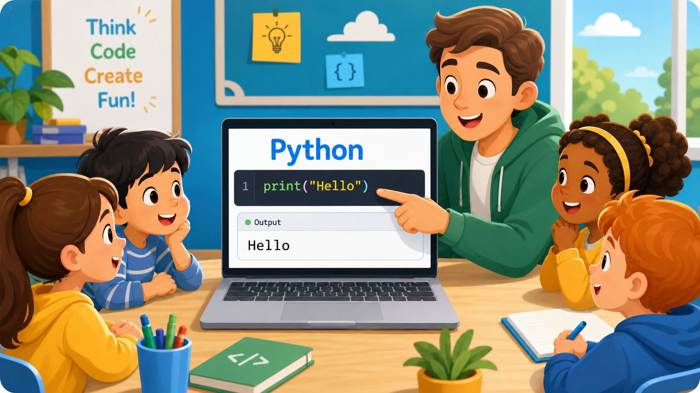

图示：Python 入门：让电脑听懂清楚指令

#### 学习目标

- 孩子能用自己的话说出：程序就是给电脑的清楚指令
- 孩子能说出：Python是一种让人和电脑说话的编程语言
- 孩子能记住：Python由Guido van Rossum创造，名字来自《Monty Python》
- 孩子能说出：Python简单、好读、能做很多事情
- 孩子能独立敲出并运行 print("Hello, World!")

#### 低龄课堂设计

| 项目 | 内容 |
| --- | --- |
| 适合对象 | 7-8岁，一二年级，注意力约5-8分钟需要切换一次 |
| 节奏安排 | 先故事，再动作，再敲代码；每个概念只保留一句核心话 |
| 统一语言 | 少说术语，多说比喻：指令、按钮、说话、听话、盒子 |

- 不要一开始讲安装、环境变量、解释器细节，先让孩子在网页编辑器里获得第一次成功。
- 每讲一个概念都让孩子做一个动作，比如老师说“电脑”，孩子坐直等指令。
- 代码只要求照着敲对一行，重点是括号、引号、大小写和运行按钮。

#### 课堂流程

| 时间 | 环节 | 老师做什么 | 学生做什么 |
| --- | --- | --- | --- |
| 0-5分钟 | 开场：电脑为什么听话 | 让孩子扮演电脑。老师发出“站起来、拍两下手、坐下”的清楚指令，再故意说一句模糊指令“弄一下”，让孩子发现电脑需要明确命令。 | 听指令做动作，说出“清楚的指令才有用”。 |
| 5-12分钟 | 故事：Python是一种语言 | 把Python讲成“和电脑说话的语言”。告诉孩子：人说中文，电脑听程序，Python就是比较容易学的一种程序语言。 | 回答：Python是和谁说话的语言？ |
| 12-20分钟 | 认识第一句咒语 print | 在投屏上敲 print("Hello, World!")，边敲边说：print像小喇叭，括号像小嘴巴，引号像小围栏，围栏里的字会被说出来。 | 用手比出括号和引号，跟读 print、括号、引号。 |
| 20-32分钟 | 孩子跟敲第一行代码 | 让孩子慢慢输入一行代码。先不要追求速度，只检查三件事：print拼对、括号成对、引号成对。 | 敲出并运行第一行代码，看到输出后读出屏幕结果。 |
| 32-40分钟 | 小改造：让电脑说自己的话 | 把Hello, World!换成孩子自己的名字或一句喜欢的话，强调只改引号里面的内容。 | 尝试输出“你好，我是___”。 |
| 40-45分钟 | 收口：今天学会了什么 | 用三句话复盘：程序是清楚指令；Python是和电脑说话的语言；print让电脑把文字显示出来。 | 完成3个口头抢答，再做选择题。 |

#### 老师话术

##### 1. 开场：把电脑变成“最听话的同学”

今天我们要教电脑做事。电脑很厉害，但它不会猜。你说得越清楚，它做得越准确。程序，就是写给电脑看的清楚指令。

检查点：孩子能不能说出“程序是清楚指令”。

##### 2. 讲Python：不用先讲难词

Python不是一条真的蛇。它是一种编程语言，就像我们用中文聊天，程序员用Python和电脑聊天。

检查点：孩子能不能回答：Python是和电脑说话的语言。

##### 3. 讲print：小喇叭比喻

print像一个小喇叭。括号里面放什么，小喇叭就把什么显示到屏幕上。文字要住在引号小房子里。

检查点：孩子能不能指出代码里的print、括号和引号。

##### 4. 孩子敲代码：慢一点也没关系

程序员不是比谁敲得快，程序员比谁更细心。我们先让这一行代码完全正确。

检查点：孩子能不能独立修正少一个引号或括号的问题。

#### 课堂演示稿

##### 演示 1：第1步：电脑听得懂什么？

电脑很厉害，但它不会猜。我们要给它清楚的指令。

课堂提问：请你当小电脑：站起来、拍两下手、坐下。

检查点：孩子能说出：清楚的指令才有用。

老师提示：

- 你可以照着这样讲
  - 同学们，今天老师要请你们当“小电脑”。电脑很厉害，但是它有一个特点：不会猜。
  - 我说什么，你们就做什么；我没说清楚，你们就可以举手说：老师，我听不懂。
- 课堂操作
  - 先说清楚指令：请大家站起来，拍两下手，然后坐下。
  - 等孩子完成后表扬：这就是清楚指令，大家一听就知道怎么做。
  - 再说模糊指令：请大家“弄一下”。停住不解释，观察孩子反应。
- 孩子可能会问
  - 孩子问“弄什么？”时，你就说：对，这就是电脑会遇到的问题。
  - 孩子乱做时，不批评，直接说：因为老师没说清楚，所以每台“小电脑”做得都不一样。
- 收束到知识点
  - 最后说：程序就是写给电脑的清楚指令。电脑不会猜，所以我们要把话说完整、说准确。

##### 演示 2：第2步：程序是什么？

程序就是写给电脑看的清楚指令。电脑会一步一步照着做。

课堂提问：如果我只说“快点”，电脑知道要做什么吗？

检查点：孩子能用自己的话复述“程序是指令”。

老师提示：

- 你可以照着这样讲
  - 刚才我们发现，电脑不怕任务难，它怕我们说不清楚。
  - 程序不是神秘的东西，程序就是一条一条写清楚的命令。
- 举例方式
  - 不清楚：快点。
  - 更清楚：请打开书包，拿出铅笔，放在桌子上。
  - 告诉孩子：第二句更像程序，因为它一步一步很明确。
- 新手老师注意
  - 不要讲“算法、语法、编译、解释器”。这一页只让孩子记住“程序=清楚指令”。
  - 如果孩子能复述这句话，就可以进入下一页。

##### 演示 3：第3步：Python是什么？

Python是一种编程语言。我们可以用Python和电脑说话。

课堂提问：我们用中文和人说话，那用什么和电脑说话？

检查点：孩子能选择：Python是一种编程语言。

老师提示：

- 你可以照着这样讲
  - 我们和同学说话可以用中文，也可以用英文。
  - 那我们和电脑说话，也要用电脑能听懂的语言。Python就是其中一种。
- 故事补充
  - Python是Guido van Rossum创造的。这个英文名孩子不用会拼，只要知道是一位程序员叔叔。
  - Python这个名字来自他喜欢的搞笑节目《Monty Python》，不是因为他养了一条蛇。
- 课堂提问
  - 问：Python是一种动物，还是一种编程语言？
  - 如果孩子回答“蛇”，就说：名字像蛇，但今天学的是编程语言。

##### 演示 4：第4步：认识第一句代码

print像一个小喇叭。括号里放什么，它就把什么显示出来。

```python
print("Hello, World!")
```

课堂提问：找一找：print、括号、引号分别在哪里？

检查点：孩子能指出print、左右括号、一对引号。

老师提示：

- 你可以照着这样讲
  - 这行代码先不用背，我们把它拆成三个小零件。
  - print像小喇叭，意思是：请电脑把内容显示出来。
  - 括号像小喇叭的嘴巴，里面放要说的话。
  - 引号像文字的小房子，文字要住在引号里面。
- 带孩子观察
  - 让孩子先指出print在哪里。
  - 再指出左括号和右括号。
  - 最后数一数有几个引号：前面一个，后面一个。
- 容易卡住的地方
  - 孩子可能会把print读成拼音，没关系，只要求拼写看对。
  - 不要马上讲字符串，只说“引号里面是文字”。

##### 演示 5：第5步：运行以后会发生什么？

写好代码后，点击运行。电脑会把文字显示在输出区。

```python
Hello, World!
```

课堂提问：看到输出以后，请把屏幕上的文字读出来。

检查点：孩子知道写完代码还要点运行。

老师提示：

- 你可以照着这样讲
  - 写代码像写指令，但电脑还没有开始做。
  - 点击运行，就像按下开始按钮。电脑开始照着代码做事。
- 课堂操作
  - 先让孩子看老师运行一次，不急着让全班同时动手。
  - 运行后指着输出区说：这里是电脑回答我们的地方。
  - 让孩子把Hello, World!读出来，强化“代码变成结果”的感觉。
- 如果没有输出
  - 先检查是不是没有点运行。
  - 再检查print有没有拼错。
  - 最后检查括号和引号有没有少一半。

##### 演示 6：第6步：换成自己的话

只改引号里面的文字，电脑就会说新的内容。

```python
print("你好，我是小程序员")
```

课堂提问：把“小程序员”换成你的名字，试试看。

检查点：孩子能完成一次个性化输出。

老师提示：

- 你可以照着这样讲
  - 现在我们不写新代码，只做一个小改造。
  - print、括号、引号都不要动，只改引号里面的文字。
- 课堂操作
  - 老师先示范：把“小程序员”改成自己的名字。
  - 请孩子只改一次，改完马上运行。
  - 请1-2个孩子读出自己的输出，比如“你好，我是小明”。
- 常见错误
  - 孩子容易把引号删掉。提醒：文字小房子不能拆。
  - 孩子容易把print也删掉。提醒：小喇叭还要留下。

##### 演示 7：最后：今天记住三句话

- 程序是给电脑的清楚指令。
- Python是一种和电脑说话的语言。
- print可以让电脑把文字显示出来。

课堂提问：请选一句你最记得的话，大声说出来。

检查点：孩子能说出至少一句核心结论。

老师提示：

- 你可以照着这样讲
  - 今天我们不是学了很多难东西，我们只要带走三句话。
  - 请你选一句自己最记得的，读给大家听。
- 收尾方式
  - 先全班齐读三句话。
  - 再请3位孩子分别说其中一句。
  - 最后切回学生练习，让孩子完成选择题和第一道编程题。
- 鼓励话术
  - 今天你已经让电脑听你说话了，这就是程序员的第一步。
  - 写错也没关系，程序员每天都在检查和修改。

#### 概念讲解

##### 1. 程序

程序就是一串清楚的指令。电脑不会猜，它只会按照你写下来的指令一步一步做。

例子：

```python
“向前走三步”是清楚指令；“去那边弄一下”不是清楚指令。
```

老师可以这样说：先让孩子听口令做动作，再告诉他们：刚才老师说的话就是给人的指令，代码就是给电脑的指令。

问孩子：如果我只对电脑说“快点”，电脑知道要做什么吗？

##### 2. Python

Python是一种编程语言。它的句子比较像人能读懂的话，所以很适合刚开始学编程的孩子。

例子：

```python
print("你好")
```

老师可以这样说：Python不是让我们背一堆难词，而是训练我们把想法说清楚。

问孩子：我们平时用中文和人说话，那用什么和电脑说话？

##### 3. Python的来历

Python由Guido van Rossum在1991年前后创造。Python这个名字来自他喜欢的英国喜剧《Monty Python》。

例子：

```python
记忆句：Guido创造Python，名字来自搞笑节目，不是因为真的蛇。
```

老师可以这样说：这一段只要求孩子听故事、会选择，不要求会拼英文名。

问孩子：Python这个名字是因为一条蛇，还是因为一个搞笑节目？

##### 4. print

print是让电脑把内容显示出来的命令。可以把它想成屏幕上的小喇叭。

例子：

```python
print("Hello, World!")
```

老师可以这样说：括号像小喇叭的嘴巴，引号像文字的小房子。文字住进引号里，电脑才能完整说出来。

问孩子：print后面的括号里放什么，屏幕上会发生什么？

##### 5. 引号和括号

括号和引号都要成双成对。少一半，电脑就看不懂这句话。

例子：

```python
print("Hello")
```

老师可以这样说：低龄孩子最容易漏掉右括号和右引号。不要急着讲语法错误，先让他们玩“找另一半”。

问孩子：这行代码里有几个左括号、几个右括号？有几个引号？

##### 6. 运行

运行就是让电脑开始照着代码做事。写好代码还不够，还要点运行按钮。

例子：

```python
写代码 -> 点运行 -> 看输出
```

老师可以这样说：把运行按钮说成“开始按钮”。孩子会更容易理解写完代码后还需要启动。

问孩子：写完代码以后，我们要按哪个按钮让电脑开始工作？

#### 典型错误

##### 1. 把 print 拼错

错误写法：

```python
pritn("Hello")
```

改正写法：

```python
print("Hello")
```

电脑认字很严格，print的字母顺序不能换。可以让孩子边指边读：p-r-i-n-t。

##### 2. 少写右括号

错误写法：

```python
print("Hello"
```

改正写法：

```python
print("Hello")
```

括号要像一双手，一左一右抱住里面的内容。少一只手，电脑就不知道这句话结束了。

##### 3. 少写一个引号

错误写法：

```python
print("Hello)
```

改正写法：

```python
print("Hello")
```

文字要住在引号小房子里。开门以后也要关门，所以引号要成对出现。

##### 4. 把中文括号或中文引号混进代码

错误写法：

```python
print（“Hello”）
```

改正写法：

```python
print("Hello")
```

Python更喜欢英文符号。老师可以提醒孩子：代码里的括号和引号要用英文输入法。

#### 课堂实操：跟做练习：让电脑第一次说话

- 第一步：老师投屏写出 print("Hello, World!")，孩子先只观察。
- 第二步：孩子找到三个零件：print、括号、引号。
- 第三步：孩子在编辑器里照着敲同一行代码。
- 第四步：点击运行，观察输出区是否出现 Hello, World!
- 第五步：只改引号里面的文字，比如 print("你好，我是小程序员")。
- 第六步：同桌互相检查：print有没有拼对？括号有没有一左一右？引号有没有一前一后？

#### 课堂小游戏

| 游戏 | 怎么玩 | 目标 |
| --- | --- | --- |
| 我是小电脑 | 老师发出清楚和不清楚的指令，让孩子判断自己能不能执行。 | 建立“程序必须清楚”的直觉。 |
| 括号引号找朋友 | 老师在黑板上写缺一半的代码，孩子上来补齐右括号或右引号。 | 训练低龄孩子最常见的符号配对能力。 |
| 换一句话 | 只改 print 引号里的文字，让电脑输出孩子自己的名字或口号。 | 让孩子知道代码不是死背，可以改出自己的作品。 |

#### 教学提醒

第0课的目标不是讲完所有Python背景，而是让孩子完成第一次“我能让电脑听我的话”。如果孩子能敲对、运行、看见输出，这节课就成功了。

#### 板书与课后沟通

板书建议：

- 程序 = 给电脑的清楚指令
- Python = 和电脑说话的一种语言
- print = 让电脑把文字显示出来
- 第一行代码：print("Hello, World!")
- 检查口诀：拼写对，括号成双，引号成双

家长沟通：

今天孩子第一次让电脑输出文字。课后不需要家长补讲安装或复杂概念，只需要让孩子再运行一次 print("你好")，并表扬他能用清楚指令控制电脑。

#### 学生练习

##### 1. 程序最像下面哪一种东西？

A. 给电脑的清楚指令
B. 电脑里的贴纸
C. 一张图片
D. 一首歌

答案：A. 给电脑的清楚指令
分值：10
解析：程序就是写给电脑看的清楚指令，电脑会一步一步照着做。

##### 2. Python是什么？

A. 一种编程语言
B. 一个铅笔盒
C. 一台电脑
D. 一个游戏手柄

答案：A. 一种编程语言
分值：10
解析：Python是一种编程语言，我们可以用它和电脑说话。

##### 3. print("你好") 会让电脑做什么？

A. 把“你好”显示出来
B. 关机
C. 画一只猫
D. 播放音乐

答案：A. 把“你好”显示出来
分值：10
解析：print像小喇叭，会把括号里的文字显示到屏幕上。

##### 4. 下面哪一行代码的括号和引号是成双成对的？

A. print("Hello")
B. print("Hello)
C. print"Hello")
D. pritn("Hello")

答案：A. print("Hello")
分值：10
解析：第一项的print拼写正确，括号和引号也都成双成对。

#### 编程挑战：第一道编程题：让电脑说Hello

通关徽章：第一次让电脑听话

分值：50

请让电脑在屏幕上显示：
Hello, World!

你只需要写一行代码。
记住：print像小喇叭，文字要放在引号里面。

提示：

```python
照着写这一行：

print("Hello, World!")

检查三件事：print拼对了吗？括号有一左一右吗？引号有一前一后吗？
```

起始代码：

```python
# 第一道Python程序
print("Hello, World!")
```

测试样例：

| 样例 | 输入 | 期望输出 |
| --- | --- | --- |
| 第一个程序 |  | Hello, World! |
| 再检查一次 |  | Hello, World! |

## 第 1 课：Python安装与IDLE编辑器

章节：序章
课型：主线课
难度：★
考点：Python安装、IDLE Shell、IDLE编辑器、保存.py文件、运行程序

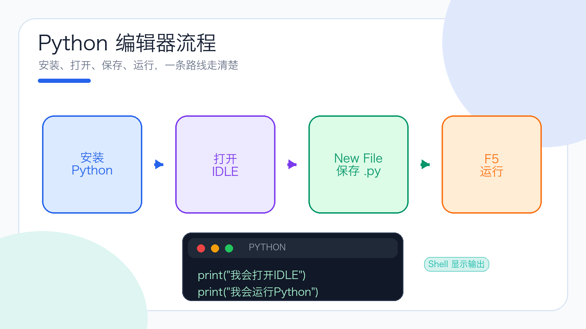

图示：Python 编辑器流程：安装、保存、运行

#### 学习目标

- 孩子能说出：Python需要先安装到电脑里，电脑才认识Python代码
- 孩子能认识：IDLE是Python自带的入门编辑器
- 孩子能区分：Shell适合试一行，编辑器窗口适合写完整程序
- 孩子能知道：代码文件要保存成.py，再点击Run Module或按F5运行
- 孩子能在编辑器里写出并运行一个两行print程序

#### 低龄课堂设计

| 项目 | 内容 |
| --- | --- |
| 适合对象 | 7-8岁，一二年级，已经在第0课写过第一行print |
| 节奏安排 | 先看安装入口，再认识IDLE两个窗口，最后一定让孩子亲手写两行代码 |
| 统一语言 | 安装=把Python请到电脑里；IDLE=写代码的小本子；Shell=电脑回答的地方；F5=开始运行 |

- 课堂上可以由老师演示安装，孩子重点掌握打开IDLE、写代码、保存和运行。
- 不要展开讲环境变量、PATH、解释器版本差异，只让孩子形成“安装-打开-写-保存-运行”的流程。
- 如果教室电脑已经装好Python，也要讲一遍安装界面里的Add Python to PATH勾选位置，避免家里安装卡住。

#### 课堂流程

| 时间 | 环节 | 老师做什么 | 学生做什么 |
| --- | --- | --- | --- |
| 0-5分钟 | 从第0课接过来：代码要写在哪里 | 先复习第0课的 print("Hello, World!")：代码是给电脑的清楚指令。再问：如果今天不用网页练习区，真实电脑里要在哪里写这些指令？ | 回答需要一个专门写代码的地方，知道今天要解决“在哪里写、怎么保存、怎么运行”。 |
| 5-12分钟 | 安装Python：把工具请进电脑 | 投屏展示 python.org 下载页或安装包界面，强调版本、Install Now，以及Add Python to PATH要勾选。 | 说出安装的意思：让电脑认识Python。 |
| 12-20分钟 | 认识IDLE Shell | 打开IDLE，展示带 >>> 的Shell窗口。说明这里像对话框，适合试一行代码，回车后马上看到回答。 | 在Shell里试一行 print("Hello")。 |
| 20-32分钟 | 认识编辑器窗口 | 点击 File -> New File，展示新的编辑器窗口。说明完整程序写在这里，可以写很多行。 | 在编辑器里写两行print，并保存成 hello.py。 |
| 32-40分钟 | 运行程序：Run Module / F5 | 点击 Run -> Run Module 或按 F5，让孩子观察输出回到Shell里出现。 | 运行自己的两行程序，并读出Shell里的输出。 |
| 40-45分钟 | 收口：五步口诀，连接下一课 | 带孩子复述：安装Python、打开IDLE、新建文件、保存.py、F5运行。最后告诉孩子：工具会用了，下一课就要让电脑记住我们的名字。 | 完成口头复述，再做练习，并知道下一课会写更像小程序的代码。 |

#### 老师话术

##### 1. 开场：为什么要讲编辑器

上节课我们知道了：代码是给电脑的清楚指令。网页练习区像课堂上的练习纸，今天我们要认识真实电脑里的Python小本子：IDLE。以后写代码、保存代码、运行代码，都要从这里开始。

检查点：孩子知道今天不是只听介绍，而是要自己写代码。

##### 2. 讲安装：安装不要讲太深

安装就像把铅笔放进文具盒。电脑装好Python以后，才知道Python代码是什么意思。

检查点：孩子能说出安装是让电脑认识Python。

##### 3. 讲Shell：Shell像聊天窗口

看到三个大于号 >>>，就像电脑在问：你想让我做什么？这里适合试一行小命令。

检查点：孩子能找到>>>提示符。

##### 4. 讲编辑器：编辑器像作文本

Shell适合试一句话，编辑器适合写一整篇小作文。我们的完整程序要写在新文件里，保存以后再运行。

检查点：孩子能说出Shell和编辑器的区别。

#### 课堂演示稿

##### 演示 1：复习：代码要写在哪里？

第0课解决“代码是什么”。今天解决“代码写在哪里、怎么跑起来”。

```python
print("Hello, World!")
```

课堂提问：如果不用网页编辑器，电脑里还可以在哪里写Python？

检查点：孩子知道今天要亲手写代码。

老师提示：

- 你可以照着这样讲
  - 上节课我们已经知道：代码是给电脑的清楚指令。
  - 今天往前走一步：清楚指令不能只停在纸上，还要写进一个工具里，让电脑真的跑起来。
- 过渡
  - 告诉孩子：今天的目标不是背安装步骤，而是学会一条真实路线：打开IDLE、写代码、保存、运行。
  - 这节课像给后面的所有编程课准备铅笔和本子。

##### 演示 2：第1步：安装Python

安装Python，就是把Python工具请到电脑里。

- 去 python.org 下载Python。
- 安装时勾选 Add Python to PATH。
- 点击 Install Now。

课堂提问：安装Python是为了让电脑认识什么？

检查点：孩子知道安装后电脑才认识Python。

老师提示：

- 课堂提示
  - 这页适合老师投屏演示，不建议低龄孩子在课堂上独立下载安装。
  - 强调Add Python to PATH只需要记住“安装时要勾选”，不要解释环境变量。
- 安全提醒
  - 让孩子知道下载安装到家里电脑时，要请家长一起操作。
  - 下载来源说清楚：官方网站 python.org。

##### 演示 3：第2步：IDLE Shell像聊天窗口

打开IDLE后，看到 >>> 的地方，电脑正在等你输入一行代码。

```python
>>> print("Hello")
Hello
```

课堂提问：>>> 后面适合试一行，还是写很多行完整程序？

检查点：孩子能找到Shell里的>>>。

老师提示：

- 你可以照着这样讲
  - Shell像电脑的聊天窗口。你写一行，它马上回答一行。
  - 它很适合测试小命令，比如print、简单加法。
- 课堂操作
  - 让孩子只输入 print("Hello")，按回车。
  - 指出上面那行是指令，下面那行是电脑回答。

##### 演示 4：第3步：编辑器窗口写完整程序

File -> New File 会打开新文件。完整程序写在这里。

```python
print("我会打开IDLE")
print("我会运行Python")
```

课堂提问：如果程序有两行、三行，要写在Shell里还是新文件里？

检查点：孩子知道完整程序写在New File里。

老师提示：

- 你可以照着这样讲
  - 新文件像代码作文本。我们可以在里面写很多行，慢慢检查。
  - 写完以后要保存，文件名后面通常是.py。
- 课堂操作
  - 示范 File -> New File。
  - 输入两行print。
  - 保存为 hello.py，提醒文件名不要用中文标点。

##### 演示 5：第4步：按F5运行

保存好.py文件后，点击 Run Module，或者按 F5，让程序跑起来。

- 先保存文件。
- 再按 F5 或 Run Module。
- 输出会显示在Shell窗口。

课堂提问：运行以后，结果会出现在哪里？

检查点：孩子知道F5是运行，输出在Shell。

老师提示：

- 常见卡点
  - 没有保存就运行，IDLE会先提醒保存。
  - 孩子找不到输出时，提醒他看Shell窗口。
  - 如果没有输出，先检查print拼写、括号和引号。

##### 演示 6：最后：五步口诀

- 安装Python。
- 打开IDLE。
- File -> New File。
- 保存成.py。
- 按F5运行。

课堂提问：请你按顺序说出这五步。

检查点：孩子能说出基本流程。

老师提示：

- 收尾方式
  - 全班一起读五步口诀。
  - 然后让孩子进入练习区，必须亲手写两行print。
  - 告诉孩子：会打开工具，才是真正开始写程序。
  - 自然带到下一课：下次我们会让电脑不只说固定话，还能记住同学输入的名字。

#### 概念讲解

##### 1. 安装Python

安装Python就是把Python工具放进电脑里，让电脑能够运行Python代码。

例子：

```python
从 python.org 下载Python，安装时点击 Install Now。
```

老师可以这样说：安装不是今天最难的内容，只要孩子知道：电脑要先装工具，才能运行Python。

问孩子：如果电脑没有安装Python，它能直接运行Python代码吗？

##### 2. IDLE

IDLE是Python自带的入门编辑器。安装Python以后，电脑里通常就会有IDLE。

例子：

```python
开始菜单或应用程序里搜索 IDLE。
```

老师可以这样说：把IDLE说成Python送给新手的小本子，孩子会更容易接受。

问孩子：IDLE是游戏，还是写Python代码的工具？

##### 3. Shell

Shell像电脑的聊天窗口，看到>>>时，可以输入一行Python代码试一试。

例子：

```python
>>> print("Hello")
```

老师可以这样说：Shell适合快速试一行，不适合写很长的完整程序。

问孩子：Shell里的>>>表示电脑在等什么？

##### 4. 编辑器窗口

编辑器窗口是写完整程序的地方，可以写多行代码，再保存成.py文件。

例子：

```python
File -> New File
```

老师可以这样说：Shell像聊天，编辑器像作文本。完整程序写在作文本里。

问孩子：两行以上的程序，更适合写在哪里？

##### 5. .py文件

.py是Python代码文件常用的后缀，表示这个文件里写的是Python程序。

例子：

```python
hello.py
```

老师可以这样说：文件名可以像给作业本起名字，.py表示这是Python作业本。

问孩子：hello.py后面的.py告诉电脑什么？

##### 6. 运行程序

运行就是让电脑照着代码做事。在IDLE里可以点击Run Module，或按F5。

例子：

```python
Run -> Run Module
```

老师可以这样说：F5可以叫开始按钮。孩子记住保存后按F5，就能看到结果。

问孩子：写完代码后，按什么可以让程序跑起来？

#### 典型错误

##### 1. 把代码写在Shell提示符后，忘记新建文件

错误写法：

```python
>>> print("第一行")
>>> print("第二行")
```

改正写法：

```python
print("第一行")
print("第二行")
```

完整程序要写在New File编辑器窗口里，不要把>>>也复制进去。

##### 2. 文件没有保存就找不到运行结果

错误写法：

```python
写完代码后直接关窗口
```

改正写法：

```python
先保存为 hello.py，再按F5运行
```

IDLE运行完整程序前需要保存文件，这样电脑知道要运行哪份代码。

##### 3. 复制了中文引号

错误写法：

```python
print(“Hello”)
```

改正写法：

```python
print("Hello")
```

Python代码里要使用英文引号。中文引号看起来漂亮，但电脑不认识。

##### 4. 按F5后看错窗口

错误写法：

```python
只盯着编辑器窗口找输出
```

改正写法：

```python
运行后到Shell窗口看输出
```

IDLE的输出通常显示在Shell窗口里，不在编辑器代码下面。

#### 课堂实操：跟做练习：在IDLE里运行两行代码

- 第一步：打开IDLE。
- 第二步：点击 File -> New File。
- 第三步：输入两行 print。
- 第四步：保存为 hello.py。
- 第五步：按 F5 或点击 Run -> Run Module。
- 第六步：回到Shell窗口读出输出结果。

#### 课堂小游戏

| 游戏 | 怎么玩 | 目标 |
| --- | --- | --- |
| 窗口分类 | 老师展示Shell和编辑器截图，让孩子举牌判断：试一行还是写完整程序。 | 区分Shell和编辑器窗口。 |
| 五步接龙 | 五个孩子分别说：安装、打开IDLE、新建文件、保存、运行。 | 记住真实写Python的流程。 |
| F5启动员 | 全班一起检查代码符号，确认无误后由一名孩子喊“F5启动”。 | 强化写完代码必须运行。 |

#### 教学提醒

这节课一定要让孩子亲手写代码。安装流程可以老师演示，但IDLE里的New File、保存和F5运行要让孩子至少完成一次。

#### 板书与课后沟通

板书建议：

- 安装Python = 让电脑认识Python
- IDLE = Python自带的新手编辑器
- Shell = 试一行，看回答
- New File = 写完整程序
- 保存.py -> F5运行 -> Shell看输出

家长沟通：

这节课孩子认识真实Python工具。家长在家协助安装时，请从 python.org 下载，安装时勾选 Add Python to PATH；课堂重点仍然是孩子能打开IDLE、写两行print、保存并运行。

#### 学生练习

##### 1. 安装Python主要是为了什么？

A. 让电脑能运行Python代码
B. 让电脑变成画板
C. 让键盘发光
D. 让电脑自动关机

答案：A. 让电脑能运行Python代码
分值：10
解析：安装Python以后，电脑才知道怎么运行Python代码。

##### 2. IDLE是什么？

A. Python自带的入门编辑器
B. 一种零食
C. 一张图片
D. 一个鼠标品牌

答案：A. Python自带的入门编辑器
分值：10
解析：IDLE是Python自带的写代码工具，适合刚开始学习。

##### 3. 在IDLE里，写完整程序通常先点击哪一个？

A. File -> New File
B. Close Window
C. Delete File
D. Turn Off

答案：A. File -> New File
分值：10
解析：完整程序要写在新文件里，所以先 File -> New File。

##### 4. 在IDLE里运行当前.py文件，可以按哪个键？

A. F5
B. A
C. Esc
D. 空格

答案：A. F5
分值：10
解析：IDLE里常用F5或Run Module来运行程序。

#### 编程挑战：编辑器练习：输出两句话

通关徽章：会用编辑器

分值：50

请写两行代码，分别输出：
我会打开IDLE
我会运行Python

注意每一行都要使用print。

提示：

```python
可以照着这样写：

print("我会打开IDLE")
print("我会运行Python")

如果在IDLE里练习，记得保存成.py后按F5运行。
```

起始代码：

```python
print("我会打开IDLE")
print("我会运行Python")
```

测试样例：

| 样例 | 输入 | 期望输出 |
| --- | --- | --- |
| 两行输出 |  | 我会打开IDLE<br>我会运行Python |
| 再次检查 |  | 我会打开IDLE<br>我会运行Python |

# 第1章 Python语言基本语法

## 第 2 课：变量与常量

章节：第1章 Python语言基本语法
课型：主线课
难度：★
考点：变量概念、变量命名规则、变量赋值、input输入、print输出

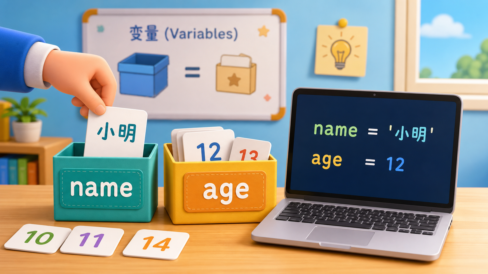

图示：变量像有名字的小盒子

#### 学习目标

- 孩子能接上前两课：代码是清楚指令，并且可以在IDLE里写、保存、运行
- 孩子能说出：变量像一个有名字的小盒子，可以保存信息
- 孩子能看懂：name = "小明" 是把“小明”放进 name 盒子
- 孩子能使用：print(name) 显示变量盒子里的内容
- 孩子能使用：input() 让电脑等同学输入一句话，再保存起来

#### 低龄课堂设计

| 项目 | 内容 |
| --- | --- |
| 适合对象 | 7-8岁，一二年级，已经会在IDLE或网页编辑器里运行print |
| 节奏安排 | 先复习IDLE里运行print，再用实物盒子演示变量，最后加入input |
| 统一语言 | 变量=有名字的小盒子；等号=放进去；input=电脑的小耳朵；print=电脑的小喇叭 |

- 不要一上来讲“内存地址、引用、对象”。孩子只需要理解“名字对应一个内容”。
- 低龄孩子容易把变量名和文字混淆，必须反复对比 print(name) 和 print("name")。
- 变量命名规则只讲三条：不能数字开头、不能有空格、建议用英文小写。

#### 课堂流程

| 时间 | 环节 | 老师做什么 | 学生做什么 |
| --- | --- | --- | --- |
| 0-5分钟 | 复习上一课：代码已经能跑起来 | 先让孩子回忆：打开IDLE、新建文件、保存.py、按F5运行。再齐读 print("Hello")，问：现在电脑会说固定的话了，如果想让它记住你的名字，只会说话够不够？ | 回答已经会运行print，但print只能显示固定文字，还不能保存名字。 |
| 5-12分钟 | 实物演示：变量是有名字的小盒子 | 拿一个真实盒子或在黑板画盒子，贴上name标签，把写着“小明”的纸条放进去。 | 说出：name盒子里面放着小明。 |
| 12-20分钟 | 认识赋值：等号是放进去 | 展示 name = "小明"，解释左边是盒子名，右边是要放进去的内容，中间等号表示放进去。 | 用手势表示：右边的内容放进左边的盒子。 |
| 20-28分钟 | 显示变量：print(name) | 对比 print("name") 和 print(name)。强调有引号就原样说name，没有引号就打开盒子看里面。 | 判断两行代码输出分别是什么。 |
| 28-38分钟 | 电脑的小耳朵：input() | 展示 name = input()。解释电脑会停下来听你输入，再把听到的话放进name盒子。 | 输入自己的名字，再运行 print("我叫" + name + "！")。 |
| 38-45分钟 | 收口：输入、保存、输出 | 把流程画成 input -> name盒子 -> print。让孩子用自己的话复述一遍。 | 完成口头流程复述，再进入练习。 |

#### 老师话术

##### 1. 开场复习：从编辑器接到变量

上节课我们会打开IDLE，会保存.py，也会按F5让代码跑起来。今天我们继续让电脑变聪明：不只是照着print说固定的话，还能把同学输入的名字先记住，再说出来。

检查点：孩子能说出：IDLE负责写和运行代码，print负责显示内容。

##### 2. 讲变量：盒子比喻

变量不是很难的词。你可以把变量想成一个贴了名字的小盒子。盒子有名字，盒子里面也有东西。

检查点：孩子能分清盒子名name和盒子里的“小明”。

##### 3. 讲等号：不要说数学等于

在Python里，这里的等号先不要读成数学里的等于。我们先把它想成‘放进去’：把右边的内容放进左边的盒子。

检查点：孩子能说出右边放进左边。

##### 4. 讲input：耳朵和盒子

input像电脑的小耳朵，它会等你说话。你说完以后，我们要用一个盒子把这句话保存起来。

检查点：孩子知道input输入后要存到变量里。

#### 课堂演示稿

##### 演示 1：复习：代码已经能跑起来

我们已经会在IDLE里写代码、保存.py、按F5运行。现在先复习print。

```python
print("Hello")
```

课堂提问：这行代码会让电脑说什么？

检查点：孩子能说出print会显示Hello。

老师提示：

- 你可以照着这样讲
  - 前面我们学会了两件事：代码是给电脑的清楚指令；代码要写进工具里，再运行。
  - print就是我们已经会运行的第一个指令，它像小喇叭，会把文字显示出来。
- 课堂操作
  - 让孩子齐读代码：print、左括号、引号、Hello、引号、右括号。
  - 问：引号里面是什么，屏幕上就会显示什么？
  - 确认孩子还记得括号和引号要成双。
- 过渡
  - 说：工具已经会用了，代码也能跑起来了。接下来让电脑从“只会说固定话”，升级到“能记住信息”。

##### 演示 2：第1步：变量像有名字的小盒子

盒子外面有名字，盒子里面可以放内容。

课堂提问：如果盒子叫name，里面放“小明”，我们叫盒子名字会想到谁？

检查点：孩子能说出name是盒子名，小明是内容。

老师提示：

- 实物演示
  - 拿一个盒子，贴上name标签；把写着“小明”的纸条放进去。
  - 告诉孩子：name是盒子的名字，小明是盒子里的内容。
  - 再换一张纸条“小红”，让孩子发现盒子名不变，里面内容可以变。
- 你可以照着这样讲
  - 变量就是一个有名字的小盒子。我们以后想用里面的东西，就叫盒子的名字。
  - 变量最厉害的地方是：它可以先保存，后面再拿出来用。
- 孩子容易混淆
  - 如果孩子说name就是小明，你就纠正：name是盒子名，小明是盒子里的东西。

##### 演示 3：第2步：等号表示放进去

把右边的内容，放进左边的变量盒子。

```python
name = "小明"
```

课堂提问：这行代码是把谁放进哪个盒子？

检查点：孩子能说出：把“小明”放进name。

老师提示：

- 你可以照着这样讲
  - 这一行代码左边是name盒子，右边是文字“小明”。
  - 中间的等号，我们今天先读成‘放进去’：把“小明”放进name盒子。
- 课堂动作
  - 让孩子右手拿“内容”，左手比“盒子”。
  - 全班一起说：右边放进左边。
  - 再问：name盒子现在装着什么？
- 新手老师注意
  - 不要展开讲赋值语句的严格定义。低龄孩子先形成方向感最重要。
  - 强调文字“小明”要在引号里，因为它是要保存的一段文字。

##### 演示 4：第3步：打开盒子给电脑看

print(name) 会显示name盒子里的内容。

```python
name = "小明"
print(name)
```

课堂提问：第二行会显示name，还是显示小明？

检查点：孩子能区分print(name)和print("name")。

老师提示：

- 你可以照着这样讲
  - 第一行先把“小明”放进name盒子。
  - 第二行print(name)，没有引号，意思是：打开name盒子，把里面的内容显示出来。
- 重点对比
  - print(name)：没有引号，打开盒子，显示小明。
  - print("name")：有引号，不打开盒子，直接显示name这四个字母。
  - 这一组对比是本课最重要的地方，可以多问几遍。
- 孩子回答错时
  - 不要直接说错，问：这里有没有引号？没有引号时，我们是不是要打开盒子？

##### 演示 5：第4步：input像电脑的小耳朵

input() 会等同学输入，再把输入保存到变量里。

```python
name = input()
```

课堂提问：电脑听到的名字，要放进哪个盒子？

检查点：孩子能说出input负责听，print负责说。

老师提示：

- 你可以照着这样讲
  - input像电脑的小耳朵。程序运行到这里时，电脑会停下来等你输入。
  - 但是听完以后，要把听到的话保存起来，所以左边要有name盒子。
- 课堂操作
  - 先让老师输入一次名字，孩子观察屏幕停下来等待输入。
  - 输入后告诉孩子：刚才输入的内容已经进了name盒子。
  - 再运行print(name)，证明盒子里真的有刚才输入的名字。
- 常见卡点
  - 孩子会以为input自己就能显示内容。提醒：input负责听，print负责说。
  - 孩子忘记左边name时，提醒：听到的话要有盒子保存。

##### 演示 6：第5步：把名字放进一句话

用加号把文字和变量连成一句完整的话。

```python
name = input()
print("我叫" + name + "！")
```

课堂提问：如果输入“小红”，电脑会说什么？

检查点：孩子能预测输入小红后输出“我叫小红！”。

老师提示：

- 你可以照着这样讲
  - 这一句有三段：第一段文字“我叫”，中间是name盒子，最后一段文字“！”。
  - 加号像胶水，把三段粘成一句话。
- 课堂拆句
  - 先遮住name，问孩子第一段是什么。
  - 再指着name，问盒子里会是谁的名字。
  - 最后指着感叹号，告诉孩子这也是一段文字，也要在引号里。
- 如果孩子看不懂加号
  - 拿三张纸条排成一行：我叫 / 小红 / ！
  - 告诉孩子：加号就是把纸条按顺序粘起来。

##### 演示 7：最后：今天的流程

- input负责听同学输入。
- 变量负责把输入保存起来。
- print负责把结果显示出来。

课堂提问：请按顺序说：先听，保存到盒子，再说出来。

检查点：孩子能说出input -> 变量 -> print的顺序。

老师提示：

- 收口话术
  - 今天我们让电脑从“能运行print”，升级成“能听名字、保存名字、再回答”。
  - 这就是很多程序的开始：先输入，保存，再输出。
- 课后练习衔接
  - 接下来学生练习会让电脑问名字，再输出“我叫XXX！”。
  - 提醒孩子：先把名字放进name盒子，再让print把句子说出来。

#### 概念讲解

##### 1. 变量（Variable）

变量就像一个有名字的小盒子。盒子名不变，里面的内容可以根据需要改变。

例子：

```python
name = "小明"
```

老师可以这样说：把“小明”放进name盒子，以后叫name，就能找到盒子里的“小明”。

问孩子：name是盒子名，还是盒子里的内容？

##### 2. 赋值（=）

在Python里，等号可以先理解成“放进去”：把右边的内容放进左边的变量。

例子：

```python
age = 8
```

老师可以这样说：低龄孩子先读成“把8放进age盒子”，暂时不要强调数学里的相等。

问孩子：这行代码是把8放进哪个盒子？

##### 3. print（小喇叭）

print负责把内容显示出来。它可以显示固定文字，也可以显示变量里的内容。

例子：

```python
print("你好")
print(name)
```

老师可以这样说：有引号就照着文字说；没有引号就去找变量盒子。

问孩子：print("name") 和 print(name) 一样吗？

##### 4. input（小耳朵）

input负责等待同学输入。输入后的内容通常要保存到变量里。

例子：

```python
name = input()
```

老师可以这样说：input是听，name是保存，print是说。三个角色分清楚，程序就顺了。

问孩子：电脑听到你的名字以后，要放进哪个盒子？

##### 5. 字符串拼接（+号）

加号可以把几段文字按顺序粘起来，变成一句完整的话。

例子：

```python
print("我叫" + name + "！")
```

老师可以这样说：这里的加号像胶水，不是做数学加法，而是把文字贴在一起。

问孩子：如果name盒子里是小红，最后会显示什么？

##### 6. 变量命名规则

变量名要让电脑看得懂：不能数字开头，不能有空格，建议用英文小写和下划线。

例子：

```python
my_name ✅
2name ❌
my name ❌
```

老师可以这样说：给盒子贴标签要清楚，标签不能乱写。电脑看到不合规则的名字会看不懂。

问孩子：my_name 和 2name，哪个更适合当盒子名字？

#### 典型错误

##### 1. 把变量名加了引号

错误写法：

```python
name = "小明"
print("name")
```

改正写法：

```python
name = "小明"
print(name)
```

有引号时电脑会原样显示name；没有引号时电脑才会打开name盒子。

##### 2. 字符串忘记加引号

错误写法：

```python
name = 小明
```

改正写法：

```python
name = "小明"
```

文字要住在引号小房子里。没有引号，电脑会以为小明也是一个变量名。

##### 3. input听到了，但没有保存

错误写法：

```python
input()
print(name)
```

改正写法：

```python
name = input()
print(name)
```

input只是电脑的小耳朵，听完要放进name盒子，后面才能拿出来用。

##### 4. 变量名有空格或数字开头

错误写法：

```python
my name = "小明"
2name = "小红"
```

改正写法：

```python
my_name = "小明"
name2 = "小红"
```

变量名像盒子标签，不能有空格，也不能用数字开头。

#### 课堂实操：跟做练习：让电脑记住我的名字

- 第一步：复习打开编辑器运行 print("Hello")，确认电脑会显示固定文字。
- 第二步：写 name = "小明"，说出这是把“小明”放进name盒子。
- 第三步：运行 print(name)，观察屏幕显示小明。
- 第四步：改成 name = input()，输入自己的名字。
- 第五步：运行 print("我叫" + name + "！")，让电脑说出自己的名字。
- 第六步：同桌互查：input负责听，name负责保存，print负责说。

#### 教学提醒

这节课不要追求孩子一次写很长代码。核心是让孩子理解 input -> 变量 -> print 的顺序，并能区分 print(name) 和 print("name")。

#### 板书与课后沟通

板书建议：

- 复习：IDLE/编辑器负责写代码和运行代码
- print = 小喇叭，负责显示
- 变量 = 有名字的小盒子
- name = "小明" 读作：把“小明”放进name盒子
- input = 小耳朵，负责等待输入
- 流程：input听 -> name保存 -> print说

家长沟通：

今天孩子学习了变量。可以让孩子在家解释：name是盒子名，输入的名字是盒子里的内容。家长只需要听孩子演示一遍 name = input() 和 print(name)。

#### 学生练习

##### 1. 变量最像下面哪一种东西？

A. 有名字的小盒子
B. 一把尺子
C. 一个按钮
D. 一首歌

答案：A. 有名字的小盒子
分值：10
解析：变量像有名字的小盒子，可以把内容保存起来，后面再用。

##### 2. name = "小红" 这行代码表示什么？

A. 把“小红”放进name盒子
B. 让电脑显示小红
C. 删除小红
D. 打开网页

答案：A. 把“小红”放进name盒子
分值：10
解析：等号可以理解成“放进去”：把右边的“小红”放进左边的name盒子。

##### 3. 如果 name = "小红"，print(name) 会显示什么？

A. name
B. 小红
C. "小红"
D. 没有输出

答案：B. 小红
分值：10
解析：print(name) 没有引号，会打开name盒子，显示里面的“小红”。

##### 4. input() 在程序里像什么？

A. 小耳朵，等你输入
B. 小喇叭，说出文字
C. 橡皮擦
D. 计算器

答案：A. 小耳朵，等你输入
分值：10
解析：input() 像电脑的小耳朵，会停下来等你输入内容。

#### 编程挑战：让电脑记住我的名字

通关徽章：变量小管家

分值：50

请写一个程序：

1. 先让电脑等待输入一个名字。
2. 把输入的名字保存到 name 盒子里。
3. 输出：我叫XXX！

例如输入：小明
输出：我叫小明！

提示：

```python
先让电脑听，再保存到name盒子，最后让电脑说出来。

name = input()
print("我叫" + name + "！")
```

起始代码：

```python
# 变量与输入：让电脑记住我的名字

name = input()
print("我叫" + name + "！")
```

测试样例：

| 样例 | 输入 | 期望输出 |
| --- | --- | --- |
| 名字测试 | 小明 | 我叫小明！ |
| 换个名字 | 小红 | 我叫小红！ |

## 第 3 课：数据类型与运算符

章节：第1章 Python语言基本语法
课型：主线课
难度：★
考点：int整数、float小数、str字符串、bool布尔、类型转换、算术运算符

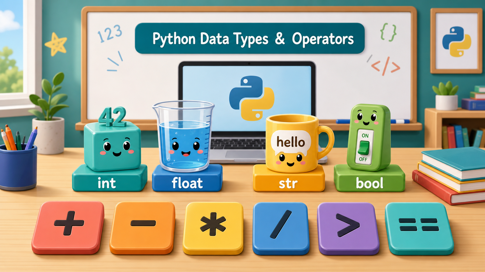

图示：数据类型和运算符工具箱

#### 学习目标

- 孩子能接上第1课：变量盒子里可以保存内容
- 孩子能说出：不同盒子里可能装文字、整数、小数、真假
- 孩子能区分："8"是文字，8是数字
- 孩子能理解：input()听到的内容默认是文字
- 孩子能使用：int() 把文字数字变成真正能计算的数字

#### 低龄课堂设计

| 项目 | 内容 |
| --- | --- |
| 适合对象 | 7-8岁，已经理解变量像盒子，但还容易把文字数字和数字混在一起 |
| 节奏安排 | 先做分类游戏，再看代码，再做简单计算 |
| 统一语言 | 数据类型=盒子里东西的种类；str=文字卡；int=整数积木；float=小数尺；bool=真假灯 |

- 这一课不要追求一次讲完所有运算符，重点是“文字数字不能直接当数字算”。
- bool可以轻讲，只作为真假灯引入，不急着进入复杂判断。
- 所有例子都要围绕第1课的name/age盒子展开，上下文会更顺。

#### 课堂流程

| 时间 | 环节 | 老师做什么 | 学生做什么 |
| --- | --- | --- | --- |
| 0-6分钟 | 复习第1课：盒子里装了什么 | 展示 name = "小明" 和 age = "8"。问孩子：两个盒子里都装着内容，但它们适合做同一件事吗？ | 回答name装名字，age装年龄。 |
| 6-14分钟 | 分类游戏：文字、整数、小数、真假 | 拿出卡片：小明、8、3.5、True，让孩子把卡片分到四个篮子：文字、整数、小数、真假。 | 举手判断每张卡属于哪一种。 |
| 14-22分钟 | 认识str和int："8"和8不一样 | 展示 "8" + "1" 和 8 + 1。说明穿着引号的8是文字卡，没引号的8是数字积木。 | 预测两个表达式的结果分别是什么。 |
| 22-32分钟 | input听到的都是文字 | 展示 age = input()。强调input听到的是文字，即使你输入8，电脑先当成"8"保存。 | 说出：要计算年龄，先要把文字8变成数字8。 |
| 32-40分钟 | int()变身术 | 展示 age = int(input())，解释int像变身机器，把"8"变成8，才能做加减法。 | 输入年龄，计算明年几岁。 |
| 40-45分钟 | 收口：看类型再操作 | 复盘：文字用来拼句子，数字用来计算。做题前先想盒子里装的是什么类型。 | 完成口头判断："10"、10、3.14、True分别是什么。 |

#### 老师话术

##### 1. 开场：从变量盒子接入

上节课我们认识了变量盒子。今天我们要打开盒子看一看：盒子里的东西也有不同种类。

检查点：孩子能说出变量是盒子。

##### 2. 讲类型：分类不是背单词

类型就是分类。像文具有铅笔、橡皮、尺子；数据也有文字、整数、小数、真假。

检查点：孩子能把小明归到文字，把8归到整数。

##### 3. 讲int：文字数字变真数字

穿着引号的数字像写在纸上的数字，可以看，但不能直接拿来计算。int()像变身机器，让它变成真正的数字。

检查点：孩子能区分"8"和8。

##### 4. 讲运算：计算前先检查类型

如果要做数学，盒子里要是真数字。如果盒子里是文字数字，要先用int()变身。

检查点：孩子知道input来的年龄要int转换。

#### 课堂演示稿

##### 演示 1：复习：变量盒子里装了什么？

上节课我们学会了：变量像有名字的小盒子。

```python
name = "小明"
age = "8"
```

课堂提问：name盒子和age盒子，里面装的是同一种东西吗？

检查点：孩子能说出盒子里可能装不同种类的内容。

老师提示：

- 你可以照着这样讲
  - 上节课我们学了变量盒子。name盒子可以装名字，age盒子可以装年龄。
  - 今天我们要再看细一点：盒子里的东西，也有自己的种类。
- 课堂操作
  - 先问：name里面是什么？孩子答“小明”。
  - 再问：age里面是什么？孩子答“8”。
  - 追问：名字和年龄能不能做同一件事？比如名字能拿来加1岁吗？
- 过渡
  - 说：所以电脑不只要知道盒子名字，还要知道盒子里的东西是什么类型。

##### 演示 2：第1步：数据类型就是分类

电脑会把内容分成不同种类：文字、整数、小数、真假。

- str：文字
- int：整数
- float：小数
- bool：真假

课堂提问：“小明”、8、3.5、True分别像哪一类？

检查点：孩子能完成中文分类：文字、整数、小数、真假。

老师提示：

- 你可以照着这样讲
  - 类型这个词听起来难，其实就是分类。
  - 文具可以分成铅笔、橡皮、尺子；电脑里的数据也可以分类。
- 课堂操作
  - 准备四张卡片：小明、8、3.5、True。
  - 让孩子判断：小明是文字，8是整数，3.5是小数，True是真。
  - 不要求孩子立刻背英文名，先把中文分类说清楚。
- 新手老师注意
  - bool这一页只讲“真/假开关”，不要展开if判断，后面选择结构再讲。

##### 演示 3：第2步：穿引号的数字是文字

"8"看起来像数字，但它穿着引号，电脑先把它当文字。

```python
"8"
8
```

课堂提问：上面两个8，哪个是文字？哪个是真数字？

检查点：孩子能说出"8"是文字，8是数字。

老师提示：

- 你可以照着这样讲
  - 引号像文字的小房子。只要住在引号里面，电脑就先把它当文字。
  - 所以"8"是文字8，8才是可以计算的数字8。
- 课堂比喻
  - 把"8"说成写在姓名贴上的8，只能看。
  - 把8说成真正的8块积木，可以拿来加减。
- 孩子常见误解
  - 孩子会说它们长得一样。你可以回应：长得像，不代表电脑认为它们一样；电脑会看有没有引号。

##### 演示 4：第3步：文字相加和数字相加不一样

文字用加号会粘起来，数字用加号会做计算。

```python
print("8" + "1")
print(8 + 1)
```

课堂提问：第一行和第二行的结果一样吗？

检查点：孩子能解释：文字粘起来，数字算出来。

老师提示：

- 你可以照着这样讲
  - 同样是加号，遇到文字和遇到数字，做的事情不一样。
  - 文字加文字：像胶水，粘起来。数字加数字：像数学，算出来。
- 课堂预测
  - 先让孩子猜第一行："8" + "1" 会变成什么？
  - 再让孩子猜第二行：8 + 1 会变成什么？
  - 运行后对比：81 和 9。
- 强调重点
  - 这不是电脑算错了，而是我们给的数据类型不同。

##### 演示 5：第4步：input听到的先是文字

就算你输入8，input()也会先把它当成文字"8"。

```python
age = input()
```

课堂提问：如果要算明年几岁，能直接用age + 1吗？

检查点：孩子知道input输入的年龄要先变成数字。

老师提示：

- 你可以照着这样讲
  - input是电脑的小耳朵。它听到什么，就先把听到的内容当文字保存。
  - 所以你输入8，电脑先保存的是文字"8"，不是数字8。
- 课堂操作
  - 问孩子：年龄要不要做计算？
  - 如果要算明年几岁，就必须把文字8变成数字8。
  - 这时引出int()。
- 不要急着讲
  - 不要讲input返回字符串这个专业说法。用“听到的先是文字”就够了。

##### 演示 6：第5步：int()是变身机器

int() 可以把文字数字变成真正的整数。

```python
age = int(input())
print(age + 1)
```

课堂提问：如果输入8，电脑会输出几？

检查点：孩子能说出int()把文字数字变成整数。

老师提示：

- 你可以照着这样讲
  - int像一台变身机器。文字"8"进去，数字8出来。
  - 变成数字以后，才可以做age + 1这样的计算。
- 课堂操作
  - 让孩子输入自己的年龄。
  - 运行后观察输出是不是明年的年龄。
  - 如果孩子输入中文数字“八”，会报错。告诉孩子：int机器只认识阿拉伯数字8。
- 新手老师救场
  - 如果报错，先检查输入是不是数字。
  - 再检查int和input的括号有没有成对。

##### 演示 7：第6步：小数和真假也有类型

3.5是小数float，True和False是真假bool。

```python
height = 1.25
is_student = True
```

课堂提问：1.25像整数还是小数？True像开还是关？

检查点：孩子能把3.5归为小数，把True归为真。

老师提示：

- 你可以照着这样讲
  - 整数是没有小数点的数字，小数是带小数点的数字。
  - True和False像开关，一个表示真，一个表示假。
- 轻讲即可
  - 这页是认识，不需要大量计算。
  - 告诉孩子后面判断题、选择结构会经常看到True和False。

##### 演示 8：最后：今天记住一件事

计算前，先看盒子里装的是文字还是数字。

- 文字适合拼句子。
- 数字适合做计算。
- input听到的内容，默认先是文字。

课堂提问：如果要计算年龄，要先用什么变身？

检查点：孩子能回答：用int()把文字数字变成数字。

老师提示：

- 收口话术
  - 上节课我们学会了把内容放进变量盒子。
  - 今天我们知道了：盒子里的东西有种类。类型不一样，电脑做的事情也不一样。
- 衔接下一课
  - 下一节会继续做数字运算，比如整除和余数。
  - 所以今天的int()非常重要，它能帮我们把输入变成能计算的数字。

#### 概念讲解

##### 1. str 文字类型

str就是文字类型。只要内容住在引号里面，电脑通常先把它当文字。

例子：

```python
name = "小明"
age = "8"
```

老师可以这样说：文字可以是汉字、英文，也可以是穿着引号的数字。

问孩子："8"为什么不是可以直接计算的数字？

##### 2. int 整数类型

int就是整数，没有小数点，可以做加减乘除。

例子：

```python
age = 8
print(age + 1)
```

老师可以这样说：整数像真正的数字积木，可以拿来计算。

问孩子：8 + 1 等于几？

##### 3. float 小数类型

float就是小数，带小数点，比如3.5、1.25。

例子：

```python
height = 1.25
```

老师可以这样说：只要看到小数点，就可以先把它归到小数float。

问孩子：3.5是整数还是小数？

##### 4. bool 真假类型

bool只有两个值：True表示真，False表示假。

例子：

```python
is_student = True
```

老师可以这样说：bool像一盏真假灯，只有开和关两种状态。

问孩子：True表示真还是假？

##### 5. int() 变身术

int()可以把文字数字变成真正的整数，变完以后才能计算。

例子：

```python
age = int(input())
print(age + 1)
```

老师可以这样说：input听到的是文字，int负责把文字数字变成真数字。

问孩子：如果输入8，age + 1会输出几？

##### 6. 算术运算符

+、-、*、/可以做加减乘除。注意乘号写*，除号写/。

例子：

```python
print(8 + 1)
print(6 * 2)
print(10 / 2)
```

老师可以这样说：键盘里没有数学书上的×和÷，Python用*和/来表示乘除。

问孩子：在Python里，乘法用哪个符号？

#### 典型错误

##### 1. 把文字数字直接拿去计算

错误写法：

```python
age = input()
print(age + 1)
```

改正写法：

```python
age = int(input())
print(age + 1)
```

input听到的是文字。要做年龄计算，先用int()把文字数字变成真正的整数。

##### 2. "8" + "1" 以为等于9

错误写法：

```python
print("8" + "1")  # 输出81
```

改正写法：

```python
print(8 + 1)  # 输出9
```

文字加文字会粘起来；数字加数字才会做数学计算。

##### 3. 中文数字不能直接给int()

错误写法：

```python
int("八")
```

改正写法：

```python
int("8")
```

int()这台变身机器认识阿拉伯数字8，不认识中文数字“八”。

##### 4. 乘除符号写成数学书里的样子

错误写法：

```python
print(6 × 2)
print(10 ÷ 2)
```

改正写法：

```python
print(6 * 2)
print(10 / 2)
```

Python里乘法用星号*，除法用斜杠/。

#### 课堂实操：跟做练习：计算明年几岁

- 第一步：复习 name = input()，知道input听到的是文字。
- 第二步：输入年龄8，观察它先像文字"8"。
- 第三步：写 age = int(input())，把输入变成整数。
- 第四步：运行 print(age + 1)，输出明年的年龄。
- 第五步：换不同年龄测试，比如7、8、9。
- 第六步：同桌互问：为什么这里要用int()？

#### 教学提醒

这一课最重要的不是让孩子背int/float/str/bool英文，而是建立“类型不同，电脑做法不同”的感觉。尤其要讲清楚 input() 输入来的年龄为什么要用 int()。

#### 板书与课后沟通

板书建议：

- 第1课：变量盒子保存内容
- 第2课：盒子里的内容有类型
- str = 文字，int = 整数，float = 小数，bool = 真假
- "8" 是文字8，8 是数字8
- input()听到的先是文字；int()把文字数字变成整数

家长沟通：

今天孩子学习了数据类型。核心不是背英文，而是知道："8"和8在电脑眼里不同。可以让孩子解释为什么输入年龄后要写 int(input())。

#### 学生练习

##### 1. "8" 是什么类型？

A. 文字 str
B. 整数 int
C. 小数 float
D. 真假 bool

答案：A. 文字 str
分值：10
解析："8"穿着引号，所以电脑先把它当文字。

##### 2. 8 + 1 的结果是？

A. 81
B. 9
C. "81"
D. 报错

答案：B. 9
分值：10
解析：8和1都是真数字，所以会做数学计算，结果是9。

##### 3. "8" + "1" 的结果更像什么？

A. 9
B. 81
C. 17
D. 报错

答案：B. 81
分值：10
解析：文字加文字会粘起来，所以"8" + "1"变成"81"。

##### 4. 想把 input() 输入的年龄拿来计算，通常要用什么？

A. print()
B. int()
C. name
D. True

答案：B. int()
分值：10
解析：input()听到的先是文字，int()能把文字数字变成整数。

#### 编程挑战：计算明年几岁

通关徽章：类型小侦探

分值：50

请写一个程序：

1. 输入你的年龄。
2. 把输入的年龄变成整数。
3. 输出明年的年龄。

例如输入：8
输出：9

提示：

```python
input听到的是文字，要先用int()变成整数。

age = int(input())
print(age + 1)
```

起始代码：

```python
# 数据类型与运算：计算明年几岁

age = int(input())
print(age + 1)
```

测试样例：

| 样例 | 输入 | 期望输出 |
| --- | --- | --- |
| 8岁测试 | 8 | 9 |
| 7岁测试 | 7 | 8 |
| 9岁测试 | 9 | 10 |

# 第2章 Python基本数据类型

## 第 4 课：整数与浮点数高级运算

章节：第2章 Python基本数据类型
课型：主线课
难度：★★
考点：math模块、abs绝对值、pow幂运算、round四舍五入、整除//、取余%

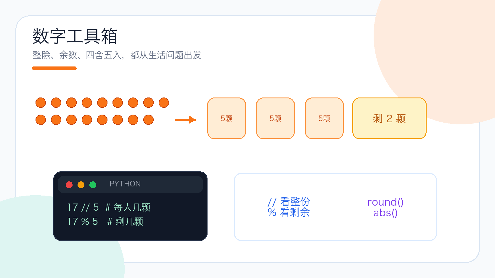

图示：数字工具箱：整除、余数和常用函数

#### 学习目标

- 孩子能用：abs()求绝对值
- 孩子能用：pow()进行幂运算
- 孩子能用：round()进行四舍五入
- 孩子能说出：//是整除，%是取余

#### 低龄课堂设计

| 项目 | 内容 |
| --- | --- |
| 适合对象 | 7-8岁，一二年级，适合先讲故事再看代码 |
| 节奏安排 | 复习3分钟，生活演示8分钟，代码拆解10分钟，上机练习10分钟，收口3分钟 |
| 统一语言 | 本课统一使用“数字工具箱”作比喻，少说抽象术语，多说动作和结果 |

- 每页演示只抓一个核心点，孩子能复述就进入下一页。
- 右侧老师提示可以照读；主画面给孩子看，不要把备课说明读给孩子。
- 如果孩子卡住，回到生活动作，不要停留在术语解释上。

#### 课堂流程

| 时间 | 环节 | 老师做什么 | 学生做什么 |
| --- | --- | --- | --- |
| 0-5分钟 | 复习连接 | 第2课我们学会了：input听到的先是文字，要用int()变成数字才能计算。 | 说出上一课的关键词，跟老师把旧知识接回来。 |
| 5-12分钟 | 本课故事 | 今天继续做数字运算，但不急着背公式。我们用“分糖果”的故事理解整除和余数。 | 回答本课开场问题，先用生活语言理解概念。 |
| 12-24分钟 | 代码拆解 | 展示关键代码：print(17 // 5) / print(17 % 5)。带孩子逐行说出每个零件的作用。 | 指出关键符号、函数名或变量名，预测输出。 |
| 24-34分钟 | 互动演示 | 拿17个小圆点或在黑板画17颗糖，先手动分给5个孩子，再把结果对应到//和%。 | 用手势、纸条、黑板或口头预测完成一次非电脑演示。 |
| 34-42分钟 | 上机练习 | 让孩子照着模板完成学生端编程题，重点检查本课最容易错的地方。 | 运行代码，看到输出后再交卷。 |
| 42-45分钟 | 收口衔接 | //看每人能分几整份，%看最后剩下几份。 下一课进入字符串，孩子会看到文字也能像一串珠子一样被编号和切开。 | 说出今天带走的一句话。 |

#### 老师话术

##### 1. 开场：先接上一课

第2课我们学会了：input听到的先是文字，要用int()变成数字才能计算。 今天我们继续往前走：今天继续做数字运算，但不急着背公式。我们用“分糖果”的故事理解整除和余数。

检查点：孩子能说出上一课关键词。

##### 2. 讲新概念：使用“数字工具箱”比喻

把今天的新知识想成“数字工具箱”。先用生活例子讲明白，再看代码。

检查点：//看每人能分几整份，%看最后剩下几份。

##### 3. 看代码：逐行翻译

不要让孩子整段背。老师逐行问：这一行先做什么？下一行又做什么？

检查点：孩子能说出代码执行顺序。

##### 4. 孩子出错：先定位一个坑

本课最常见的问题是：孩子会把/、//、%混在一起；先用糖果实物分清“每人几个”和“剩几个”。

检查点：孩子知道先检查哪里。

#### 课堂演示稿

##### 演示 1：复习：上一课接到这一课

第2课我们学会了：input听到的先是文字，要用int()变成数字才能计算。

课堂提问：请先说一句：上一课我们最重要学到了什么？

检查点：孩子能说出上一课的一个关键词。

老师提示：

- 你可以照着这样讲
  - 每节课开头先帮孩子把旧知识叫醒，不要直接进入新概念。
  - 第2课我们学会了：input听到的先是文字，要用int()变成数字才能计算。
- 课堂操作
  - 请1位孩子回答上一课关键词。
  - 老师把孩子的话整理成一句清楚的话，再进入本课。
- 新手老师提醒
  - 如果孩子答不上来，不要停太久。你直接给出关键词，让孩子跟读一遍即可。

##### 演示 2：本课任务：整数与浮点数高级运算

今天继续做数字运算，但不急着背公式。我们用“分糖果”的故事理解整除和余数。

课堂提问：17颗糖分给5个小朋友，每人几颗？还剩几颗？

检查点：//看每人能分几整份，%看最后剩下几份。

老师提示：

- 你可以照着这样讲
  - 第2课我们学会了：input听到的先是文字，要用int()变成数字才能计算。
  - 今天继续做数字运算，但不急着背公式。我们用“分糖果”的故事理解整除和余数。
- 课堂操作
  - 拿17个小圆点或在黑板画17颗糖，先手动分给5个孩子，再把结果对应到//和%。
  - 让孩子先预测，再运行或揭晓答案。低龄孩子先说出来，再敲代码，会更稳。
- 容易卡住的地方
  - 孩子会把/、//、%混在一起；先用糖果实物分清“每人几个”和“剩几个”。
  - 孩子回答错时先追问“你是怎么看出来的？”，再带回屏幕上的关键词或符号。
- 过渡
  - 下一课进入字符串，孩子会看到文字也能像一串珠子一样被编号和切开。

##### 演示 3：看代码：把代码拆成小零件

今天的关键词：数字工具箱

```python
print(17 // 5)
print(17 % 5)
```

课堂提问：你能找到今天最重要的符号或单词吗？

检查点：孩子能说出代码中的一个关键零件。

老师提示：

- 你可以照着这样讲
  - 我们不急着背整段代码，先把它拆成小零件。
  - 每个小零件都有自己的工作，找到它们，代码就不吓人了。
- 课堂操作
  - 先让孩子只看第一行，指出变量名、函数名或符号。
  - 再看第二行，让孩子预测电脑下一步会做什么。
  - 最后把每一行连成完整故事。
- 检查方式
  - 问孩子：这段代码先做什么？再做什么？最后输出什么？

##### 演示 4：互动：先动手，再敲代码

拿17个小圆点或在黑板画17颗糖，先手动分给5个孩子，再把结果对应到//和%。

课堂提问：17颗糖分给5个小朋友，每人几颗？还剩几颗？

检查点：孩子能把动作说成步骤。

老师提示：

- 你可以照着这样讲
  - 我们先不用电脑，用手、纸条或黑板把题目演一遍。
  - 演明白以后，再把动作翻译成代码。
- 课堂操作
  - 拿17个小圆点或在黑板画17颗糖，先手动分给5个孩子，再把结果对应到//和%。
  - 请孩子说出刚才动作里的顺序：第一步、第二步、第三步。
  - 把孩子说的话写成简短关键词。
- 低龄课堂提醒
  - 7-8岁孩子很需要身体动作和可见物品。先做动作，再看代码，理解会更顺。

##### 演示 5：避坑：最容易错在哪里？

孩子会把/、//、%混在一起；先用糖果实物分清“每人几个”和“剩几个”。

课堂提问：如果这里出错，我们第一步检查什么？

检查点：孩子知道本课最常见的错误点。

老师提示：

- 你可以照着这样讲
  - 程序员不是不犯错，程序员是会检查错误。
  - 今天我们先记住最常见的一个坑。
- 带孩子检查
  - 孩子会把/、//、%混在一起；先用糖果实物分清“每人几个”和“剩几个”。
  - 让孩子用手指屏幕上的关键位置，一起检查符号、顺序、括号或缩进。
- 鼓励话术
  - 写错不是失败，能找到错在哪里，就是程序员很厉害的能力。

##### 演示 6：收口：今天带走一句话

//看每人能分几整份，%看最后剩下几份。

- 第2课：数字能计算，文字数字要先int()
- 第3课：数字工具箱更丰富
- 17 // 5 = 每人分到几颗

课堂提问：请选一句你最记得的话读出来。

检查点：孩子能说出本课核心句。

老师提示：

- 收尾方式
  - 先全班齐读本页标题。
  - 请2-3位孩子各说一句自己记住的话。
  - 再切回学生练习，让孩子马上做一道题巩固。
- 衔接下一课
  - 下一课进入字符串，孩子会看到文字也能像一串珠子一样被编号和切开。

#### 概念讲解

##### 1. abs() 绝对值

绝对值就是不管正负，只管数字有多大！-5的绝对值是5，就像把符号去掉！

例子：

```python
abs(-10) = 10   /   abs(5) = 5
```

图像化理解：一个小天平，不管左边是正还是负，右边都显示正数

##### 2. pow() 幂运算

pow就是power（幂）的缩写！pow(2,3)就是2的3次方 = 2×2×2 = 8！

例子：

```python
pow(2, 3) = 8   /   pow(5, 2) = 25   /   pow(10, 2) = 100
```

图像化理解：一个指数塔，2的3次方就是2叠三层，每层翻倍

##### 3. round() 四舍五入

四舍五入就是：小数点后小于5就舍去，大于等于5就进一位！

例子：

```python
round(3.14) = 3   /   round(3.56) = 4   /   round(3.5) = 4
```

图像化理解：一个小算盘，上面标着3.14和3.56，算盘珠子会四舍五入

##### 4. // 整除

整除就是除完不要小数部分！10 // 3 = 3，因为10除以3等于3还剩1，余数不要了！

例子：

```python
10 // 3 = 3   /   15 // 4 = 3   /   7 // 2 = 3
```

图像化理解：一个分饼干机器，10块饼干分给3个人，每人最多分到3块，还剩1块

##### 5. % 取余

取余就是只关心分完剩下的部分！10 % 3 = 1，因为10除以3等于3余1！

例子：

```python
10 % 3 = 1   /   15 % 4 = 3   /   7 % 2 = 1
```

图像化理解：一个分饼干机器，只显示剩下的那1块饼干

##### 6. math.floor() 和 math.ceil()

floor是向下取整（往小的地方取），ceil是向上取整（往大的地方取）！

例子：

```python
import math
math.floor(3.7) = 3   /   math.ceil(3.2) = 4
```

图像化理解：一个数字电梯，floor按下去到3楼，ceil按上来到4楼

#### 典型错误

##### 1. 把 // 和 / 搞混

错误写法：

```python
10 / 3 以为是3，其实是3.333...
```

改正写法：

```python
10 // 3 = 3（整除）   /   10 / 3 = 3.333...（小数除法）
```

//是整除（要整数），/是小数除法！别搞混了！

##### 2. % 取余和 / 整除混淆

错误写法：

```python
10 % 3 以为等于3
```

改正写法：

```python
10 % 3 = 1（余数）   /   10 // 3 = 3（整除的结果）
```

%是看剩下的余数，//是看能分几整份！

#### 课堂实操：跟做练习：分糖游戏

- 第一步：想一个总数，比如15颗糖
- 第二步：分给4个小朋友，计算每人几颗：15 // 4 = ?
- 第三步：计算还剩几颗：15 % 4 = ?
- 第四步：用代码验证你的答案！

#### 教学提醒

建议拿实际例子：10颗糖分给3个小朋友，每人几颗？剩几颗？让孩子理解整除和取余！ 低龄课堂建议：孩子会把/、//、%混在一起；先用糖果实物分清“每人几个”和“剩几个”。

#### 板书与课后沟通

板书建议：

- 第2课：数字能计算，文字数字要先int()
- 第3课：数字工具箱更丰富
- 17 // 5 = 每人分到几颗
- 17 % 5 = 还剩几颗
- round()四舍五入，abs()去掉负号

家长沟通：

今天孩子用分糖果理解了//整除和%取余。家长可以问：17颗糖分给5人，每人几颗、剩几颗，对应哪个符号？

#### 学生练习

##### 1. abs(-8) 的结果是？

A. -8
B. 8
C. 0
D. -0

答案：B. 8
分值：10
解析：绝对值把负号去掉，所以-8变成8！

##### 2. pow(2, 4) 的结果是？

A. 6
B. 8
C. 16
D. 24

答案：C. 16
分值：10
解析：pow(2,4) = 2的4次方 = 2×2×2×2 = 16！

##### 3. 17 // 5 的结果是？

A. 3
B. 3.4
C. 2
D. 12

答案：A. 3
分值：10
解析：17除以5等于3还剩2，整除只看能分几整份，所以是3！

##### 4. 17 % 5 的结果是？

A. 3
B. 2
C. 3.4
D. 12

答案：B. 2
分值：10
解析：17除以5等于3余2，%取余数，所以是2！

#### 编程挑战：编程题：计算糖剩几颗！

通关徽章：数学小达人

分值：50

有17颗糖，分给5个小朋友。

请计算：
1. 每人分到几颗？（整除）
2. 还剩几颗？（取余）

输出格式：「每人X颗，剩Y颗」

提示：

```python
用 // 整除，用 % 取余！

print("每人" + str(17 // 5) + "颗，剩" + str(17 % 5) + "颗")
```

起始代码：

```python
# 分糖游戏：整除和取余

people = 5
candies = 17

print("每人" + str(candies // people) + "颗，剩" + str(candies % people) + "颗")
```

测试样例：

| 样例 | 输入 | 期望输出 |
| --- | --- | --- |
| 标准分糖 |  | 每人3颗，剩2颗 |
| 再次检查 |  | 每人3颗，剩2颗 |

## 第 5 课：字符串类型

章节：第2章 Python基本数据类型
课型：主线课
难度：★★
考点：字符串索引、字符串切片、字符串方法upper/lower、len()长度、字符串拼接

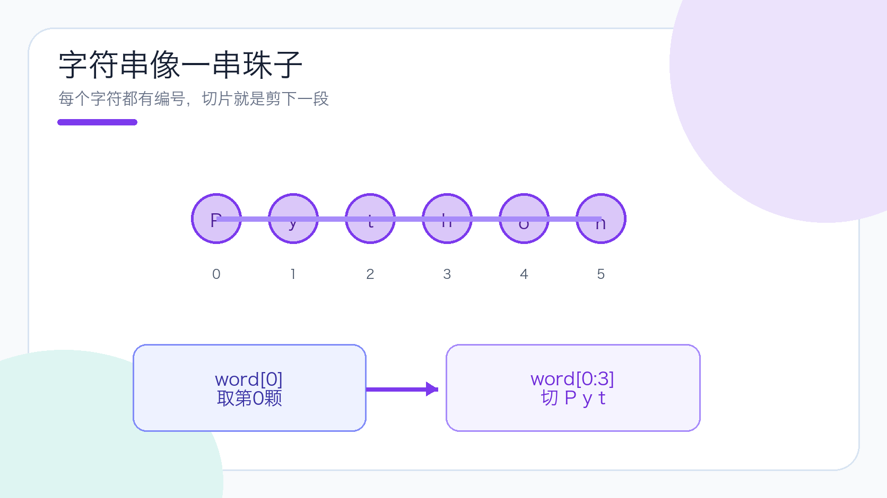

图示：字符串像一串有编号的珠子

#### 学习目标

- 孩子能说出：字符串就像一串珠子，每个位置有编号
- 孩子能做：用[0]、[1]拿出串子里的某一个珠子
- 孩子能做：用.upper()把字母变大，用.lower()把字母变小

#### 低龄课堂设计

| 项目 | 内容 |
| --- | --- |
| 适合对象 | 7-8岁，一二年级，适合先讲故事再看代码 |
| 节奏安排 | 复习3分钟，生活演示8分钟，代码拆解10分钟，上机练习10分钟，收口3分钟 |
| 统一语言 | 本课统一使用“文字珠子项链”作比喻，少说抽象术语，多说动作和结果 |

- 每页演示只抓一个核心点，孩子能复述就进入下一页。
- 右侧老师提示可以照读；主画面给孩子看，不要把备课说明读给孩子。
- 如果孩子卡住，回到生活动作，不要停留在术语解释上。

#### 课堂流程

| 时间 | 环节 | 老师做什么 | 学生做什么 |
| --- | --- | --- | --- |
| 0-5分钟 | 复习连接 | 前面我们知道str是文字类型，今天专门研究文字。 | 说出上一课的关键词，跟老师把旧知识接回来。 |
| 5-12分钟 | 本课故事 | 字符串像一串珠子，每个字母或汉字都是一颗珠子，电脑会给它们编号。 | 回答本课开场问题，先用生活语言理解概念。 |
| 12-24分钟 | 代码拆解 | 展示关键代码：word = "Python" / print(word[0]) / print(word[0:3])。带孩子逐行说出每个零件的作用。 | 指出关键符号、函数名或变量名，预测输出。 |
| 24-34分钟 | 互动演示 | 在黑板写P y t h o n，下面标0 1 2 3 4 5，让孩子上来指0号、1号、0到3。 | 用手势、纸条、黑板或口头预测完成一次非电脑演示。 |
| 34-42分钟 | 上机练习 | 让孩子照着模板完成学生端编程题，重点检查本课最容易错的地方。 | 运行代码，看到输出后再交卷。 |
| 42-45分钟 | 收口衔接 | 编号从0开始；切片左边要，右边停在前一颗。 下一课会讲程序从上到下一步步执行，就像按顺序穿珠子。 | 说出今天带走的一句话。 |

#### 老师话术

##### 1. 开场：先接上一课

前面我们知道str是文字类型，今天专门研究文字。 今天我们继续往前走：字符串像一串珠子，每个字母或汉字都是一颗珠子，电脑会给它们编号。

检查点：孩子能说出上一课关键词。

##### 2. 讲新概念：使用“文字珠子项链”比喻

把今天的新知识想成“文字珠子项链”。先用生活例子讲明白，再看代码。

检查点：编号从0开始；切片左边要，右边停在前一颗。

##### 3. 看代码：逐行翻译

不要让孩子整段背。老师逐行问：这一行先做什么？下一行又做什么？

检查点：孩子能说出代码执行顺序。

##### 4. 孩子出错：先定位一个坑

本课最常见的问题是：孩子会从1开始编号；用“电脑数数从0开始”反复提醒。

检查点：孩子知道先检查哪里。

#### 课堂演示稿

##### 演示 1：复习：上一课接到这一课

前面我们知道str是文字类型，今天专门研究文字。

课堂提问：请先说一句：上一课我们最重要学到了什么？

检查点：孩子能说出上一课的一个关键词。

老师提示：

- 你可以照着这样讲
  - 每节课开头先帮孩子把旧知识叫醒，不要直接进入新概念。
  - 前面我们知道str是文字类型，今天专门研究文字。
- 课堂操作
  - 请1位孩子回答上一课关键词。
  - 老师把孩子的话整理成一句清楚的话，再进入本课。
- 新手老师提醒
  - 如果孩子答不上来，不要停太久。你直接给出关键词，让孩子跟读一遍即可。

##### 演示 2：本课任务：字符串类型

字符串像一串珠子，每个字母或汉字都是一颗珠子，电脑会给它们编号。

课堂提问：Python这串珠子里，0号珠子是谁？0到3会切出哪几颗？

检查点：编号从0开始；切片左边要，右边停在前一颗。

老师提示：

- 你可以照着这样讲
  - 前面我们知道str是文字类型，今天专门研究文字。
  - 字符串像一串珠子，每个字母或汉字都是一颗珠子，电脑会给它们编号。
- 课堂操作
  - 在黑板写P y t h o n，下面标0 1 2 3 4 5，让孩子上来指0号、1号、0到3。
  - 让孩子先预测，再运行或揭晓答案。低龄孩子先说出来，再敲代码，会更稳。
- 容易卡住的地方
  - 孩子会从1开始编号；用“电脑数数从0开始”反复提醒。
  - 孩子回答错时先追问“你是怎么看出来的？”，再带回屏幕上的关键词或符号。
- 过渡
  - 下一课会讲程序从上到下一步步执行，就像按顺序穿珠子。

##### 演示 3：看代码：把代码拆成小零件

今天的关键词：文字珠子项链

```python
word = "Python"
print(word[0])
print(word[0:3])
```

课堂提问：你能找到今天最重要的符号或单词吗？

检查点：孩子能说出代码中的一个关键零件。

老师提示：

- 你可以照着这样讲
  - 我们不急着背整段代码，先把它拆成小零件。
  - 每个小零件都有自己的工作，找到它们，代码就不吓人了。
- 课堂操作
  - 先让孩子只看第一行，指出变量名、函数名或符号。
  - 再看第二行，让孩子预测电脑下一步会做什么。
  - 最后把每一行连成完整故事。
- 检查方式
  - 问孩子：这段代码先做什么？再做什么？最后输出什么？

##### 演示 4：互动：先动手，再敲代码

在黑板写P y t h o n，下面标0 1 2 3 4 5，让孩子上来指0号、1号、0到3。

课堂提问：Python这串珠子里，0号珠子是谁？0到3会切出哪几颗？

检查点：孩子能把动作说成步骤。

老师提示：

- 你可以照着这样讲
  - 我们先不用电脑，用手、纸条或黑板把题目演一遍。
  - 演明白以后，再把动作翻译成代码。
- 课堂操作
  - 在黑板写P y t h o n，下面标0 1 2 3 4 5，让孩子上来指0号、1号、0到3。
  - 请孩子说出刚才动作里的顺序：第一步、第二步、第三步。
  - 把孩子说的话写成简短关键词。
- 低龄课堂提醒
  - 7-8岁孩子很需要身体动作和可见物品。先做动作，再看代码，理解会更顺。

##### 演示 5：避坑：最容易错在哪里？

孩子会从1开始编号；用“电脑数数从0开始”反复提醒。

课堂提问：如果这里出错，我们第一步检查什么？

检查点：孩子知道本课最常见的错误点。

老师提示：

- 你可以照着这样讲
  - 程序员不是不犯错，程序员是会检查错误。
  - 今天我们先记住最常见的一个坑。
- 带孩子检查
  - 孩子会从1开始编号；用“电脑数数从0开始”反复提醒。
  - 让孩子用手指屏幕上的关键位置，一起检查符号、顺序、括号或缩进。
- 鼓励话术
  - 写错不是失败，能找到错在哪里，就是程序员很厉害的能力。

##### 演示 6：收口：今天带走一句话

编号从0开始；切片左边要，右边停在前一颗。

- str = 文字串
- 字符串像一串珠子
- 编号从0开始：P是0号

课堂提问：请选一句你最记得的话读出来。

检查点：孩子能说出本课核心句。

老师提示：

- 收尾方式
  - 先全班齐读本页标题。
  - 请2-3位孩子各说一句自己记住的话。
  - 再切回学生练习，让孩子马上做一道题巩固。
- 衔接下一课
  - 下一课会讲程序从上到下一步步执行，就像按顺序穿珠子。

#### 概念讲解

##### 1. 字符串是一串珠子

字符串就像一串项链珠子，每个珠子上有一个字符。编号从0开始，第一个珠子是0号！

例子：

```python
name = "Python"
print(name[0])   # P
print(name[1])   # y
```

图像化理解：一串项链，珠子下面标着0-P, 1-y, 2-t, 3-h, 4-o, 5-n

##### 2. 切片：切下一段珠子

[:3]就是切下0到2号珠子（不包含3），[1:4]就是切下1到3号珠子。切片是左闭右开！

例子：

```python
word = "Hello"
print(word[0:3])   # Hel
print(word[2:])    # llo
```

图像化理解：一把小刀，在串子上切一刀，抽出中间的几颗

##### 3. upper() 大写魔法

upper()就像按了一个变大按钮，所有小写字母都会变成大写！

例子：

```python
print("hello".upper())   # HELLO
```

图像化理解：一个小精灵拿着大写魔杖，h变成H，e变成E...

##### 4. lower() 小写魔法

lower()就像按了一个变小按钮，所有大写字母都会变成小写！

例子：

```python
print("HELLO".lower())   # hello
```

图像化理解：一个小精灵拿着小写魔杖，H变成h...

##### 5. len() 数珠子个数

len()就是数一数这串珠子有几颗！注意：数的时候从1开始数，但编号从0开始。

例子：

```python
print(len("Hello"))   # 5
```

图像化理解：一个小天平，左边放字符串，右边显示数字5

##### 6. 字符串拼接

用+号可以把多个字符串连起来！就像把橡皮泥捏在一起！

例子：

```python
"Hello" + " " + "World" = "Hello World"
```

图像化理解：三块不同颜色的橡皮泥，用+号粘在一起变成大橡皮泥

#### 典型错误

##### 1. 索引从1开始数？错！

错误写法：

```python
"Python"[1] = y   ❌（应该是P）
```

改正写法：

```python
"Python"[0] = P   ✅
```

字符串索引从0开始！第1个字符是[0]，第2个才是[1]！

##### 2. 切片[0:3]包含了3？错！

错误写法：

```python
以为[0:3]包含第3个
```

改正写法：

```python
[0:3]不包含第3个字符，实际是0、1、2三个字符
```

切片是【左闭右开】：包含开始，不包含结束！

#### 课堂实操：跟做练习：串子游戏

- 第一步：在心里想一个英文单词，比如"CAT"
- 第二步：找第一个字母（索引0），是什么？
- 第三步：试试.upper()让所有字母变大写
- 第四步：写出代码并运行！

#### 教学提醒

建议拿一根绳子穿5个珠子，标上编号，和小朋友一起找第0号、第3号是什么！ 低龄课堂建议：孩子会从1开始编号；用“电脑数数从0开始”反复提醒。

#### 板书与课后沟通

板书建议：

- str = 文字串
- 字符串像一串珠子
- 编号从0开始：P是0号
- word[0] 取一颗
- word[0:3] 切一段，不包含3

家长沟通：

今天孩子学习字符串索引和切片。可以让孩子给“Python”标编号：P是0号，y是1号。

#### 学生练习

##### 1. "Hello"[0] 的结果是？

A. H
B. e
C. o
D. Hello

答案：A. H
分值：10
解析：第0号（第一个）字符是H！索引从0开始～

##### 2. "Python"[0:3] 的结果是？

A. Pyt
B. yth
C. Pyth
D. Python

答案：A. Pyt
分值：10
解析：切0到2号字符：P-y-t → "Pyt"！

##### 3. "hello".upper() 的结果是？

A. hello
B. HELLO
C. Hello
D. hELLO

答案：B. HELLO
分值：10
解析：upper()把所有字母变成大写！

##### 4. len("Hi!") 的结果是？

A. 2
B. 3
C. 4
D. 1

答案：B. 3
分值：10
解析："H", "i", "!" 三个字符，所以是3！

#### 编程挑战：变大写小魔法！

通关徽章：字符串小厨师

分值：50

输入一个英文单词，程序会：

第1步：原样显示
第2步：全部变大写显示
第3步：全部变小写显示

例如：输入「Hello」
输出：
Hello
HELLO
hello

提示：

```python
模板：
word = input()
print(word)
print(word.upper())
print(word.lower())
```

起始代码：

```python
# 字符串大小写魔法

word = input()
print(word)
print(word.upper())
print(word.lower())
```

测试样例：

| 样例 | 输入 | 期望输出 |
| --- | --- | --- |
| World | World | World<br>WORLD<br>world |
| Hello | Hello | Hello<br>HELLO<br>hello |

# 第3章 Python程序结构

## 第 6 课：顺序结构

章节：第3章 Python程序结构
课型：主线课
难度：★
考点：顺序执行、语句顺序、从上到下

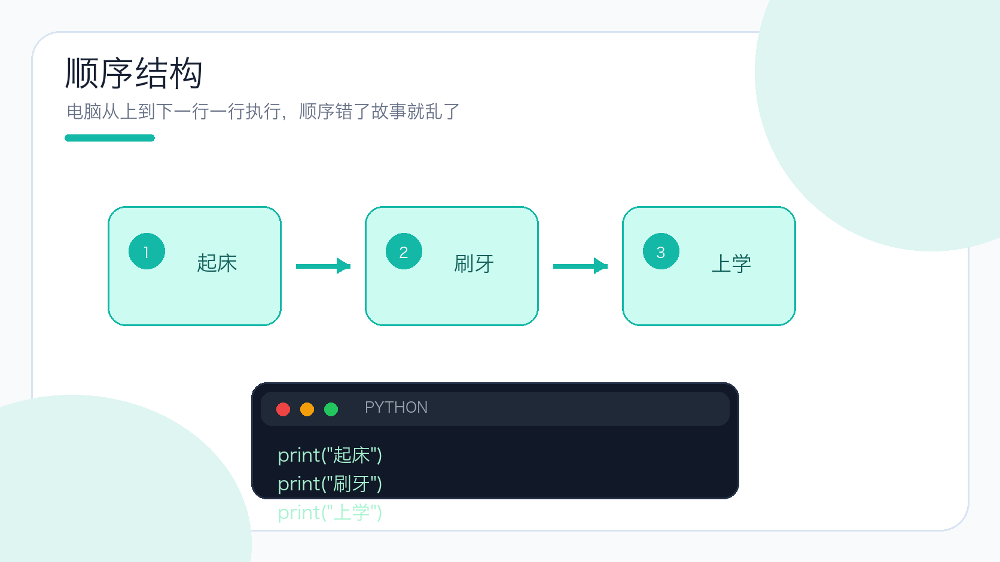

图示：顺序结构：电脑一行一行往下做

#### 学习目标

- 孩子能说出：顺序结构就是从上往下一步一步执行
- 孩子能写出：先做什么、再做什么、最后做什么的程序
- 孩子能判断两段代码交换顺序后，输出会不会变化
- 孩子能用生活步骤解释程序执行顺序

#### 低龄课堂设计

| 项目 | 内容 |
| --- | --- |
| 适合对象 | 7-8岁，一二年级，适合先讲故事再看代码 |
| 节奏安排 | 复习3分钟，生活演示8分钟，代码拆解10分钟，上机练习10分钟，收口3分钟 |
| 统一语言 | 本课统一使用“做早饭步骤清单”作比喻，少说抽象术语，多说动作和结果 |

- 每页演示只抓一个核心点，孩子能复述就进入下一页。
- 右侧老师提示可以照读；主画面给孩子看，不要把备课说明读给孩子。
- 如果孩子卡住，回到生活动作，不要停留在术语解释上。

#### 课堂流程

| 时间 | 环节 | 老师做什么 | 学生做什么 |
| --- | --- | --- | --- |
| 0-5分钟 | 复习连接 | 前面我们会写单行代码，也会处理数字和文字。 | 说出上一课的关键词，跟老师把旧知识接回来。 |
| 5-12分钟 | 本课故事 | 今天学习顺序结构：电脑会从上到下一行一行执行，顺序不同，结果可能不同。 | 回答本课开场问题，先用生活语言理解概念。 |
| 12-24分钟 | 代码拆解 | 展示关键代码：print("起床") / print("刷牙") / print("上学")。带孩子逐行说出每个零件的作用。 | 指出关键符号、函数名或变量名，预测输出。 |
| 24-34分钟 | 互动演示 | 让孩子排列三张卡片：起床、刷牙、上学。故意打乱顺序，让孩子纠正。 | 用手势、纸条、黑板或口头预测完成一次非电脑演示。 |
| 34-42分钟 | 上机练习 | 让孩子照着模板完成学生端编程题，重点检查本课最容易错的地方。 | 运行代码，看到输出后再交卷。 |
| 42-45分钟 | 收口衔接 | 程序默认从第一行开始，一行一行往下走。 下一课加入选择结构：电脑不只是按顺序走，还能根据条件走不同路线。 | 说出今天带走的一句话。 |

#### 老师话术

##### 1. 开场：先接上一课

前面我们会写单行代码，也会处理数字和文字。 今天我们继续往前走：今天学习顺序结构：电脑会从上到下一行一行执行，顺序不同，结果可能不同。

检查点：孩子能说出上一课关键词。

##### 2. 讲新概念：使用“做早饭步骤清单”比喻

把今天的新知识想成“做早饭步骤清单”。先用生活例子讲明白，再看代码。

检查点：程序默认从第一行开始，一行一行往下走。

##### 3. 看代码：逐行翻译

不要让孩子整段背。老师逐行问：这一行先做什么？下一行又做什么？

检查点：孩子能说出代码执行顺序。

##### 4. 孩子出错：先定位一个坑

本课最常见的问题是：孩子容易只看单行，不看顺序；让他们读出第1行、第2行、第3行。

检查点：孩子知道先检查哪里。

#### 课堂演示稿

##### 演示 1：复习：上一课接到这一课

前面我们会写单行代码，也会处理数字和文字。

课堂提问：请先说一句：上一课我们最重要学到了什么？

检查点：孩子能说出上一课的一个关键词。

老师提示：

- 你可以照着这样讲
  - 每节课开头先帮孩子把旧知识叫醒，不要直接进入新概念。
  - 前面我们会写单行代码，也会处理数字和文字。
- 课堂操作
  - 请1位孩子回答上一课关键词。
  - 老师把孩子的话整理成一句清楚的话，再进入本课。
- 新手老师提醒
  - 如果孩子答不上来，不要停太久。你直接给出关键词，让孩子跟读一遍即可。

##### 演示 2：本课任务：顺序结构

今天学习顺序结构：电脑会从上到下一行一行执行，顺序不同，结果可能不同。

课堂提问：如果把“上学”放到“起床”前面，会不会奇怪？

检查点：程序默认从第一行开始，一行一行往下走。

老师提示：

- 你可以照着这样讲
  - 前面我们会写单行代码，也会处理数字和文字。
  - 今天学习顺序结构：电脑会从上到下一行一行执行，顺序不同，结果可能不同。
- 课堂操作
  - 让孩子排列三张卡片：起床、刷牙、上学。故意打乱顺序，让孩子纠正。
  - 让孩子先预测，再运行或揭晓答案。低龄孩子先说出来，再敲代码，会更稳。
- 容易卡住的地方
  - 孩子容易只看单行，不看顺序；让他们读出第1行、第2行、第3行。
  - 孩子回答错时先追问“你是怎么看出来的？”，再带回屏幕上的关键词或符号。
- 过渡
  - 下一课加入选择结构：电脑不只是按顺序走，还能根据条件走不同路线。

##### 演示 3：看代码：把代码拆成小零件

今天的关键词：做早饭步骤清单

```python
print("起床")
print("刷牙")
print("上学")
```

课堂提问：你能找到今天最重要的符号或单词吗？

检查点：孩子能说出代码中的一个关键零件。

老师提示：

- 你可以照着这样讲
  - 我们不急着背整段代码，先把它拆成小零件。
  - 每个小零件都有自己的工作，找到它们，代码就不吓人了。
- 课堂操作
  - 先让孩子只看第一行，指出变量名、函数名或符号。
  - 再看第二行，让孩子预测电脑下一步会做什么。
  - 最后把每一行连成完整故事。
- 检查方式
  - 问孩子：这段代码先做什么？再做什么？最后输出什么？

##### 演示 4：互动：先动手，再敲代码

让孩子排列三张卡片：起床、刷牙、上学。故意打乱顺序，让孩子纠正。

课堂提问：如果把“上学”放到“起床”前面，会不会奇怪？

检查点：孩子能把动作说成步骤。

老师提示：

- 你可以照着这样讲
  - 我们先不用电脑，用手、纸条或黑板把题目演一遍。
  - 演明白以后，再把动作翻译成代码。
- 课堂操作
  - 让孩子排列三张卡片：起床、刷牙、上学。故意打乱顺序，让孩子纠正。
  - 请孩子说出刚才动作里的顺序：第一步、第二步、第三步。
  - 把孩子说的话写成简短关键词。
- 低龄课堂提醒
  - 7-8岁孩子很需要身体动作和可见物品。先做动作，再看代码，理解会更顺。

##### 演示 5：避坑：最容易错在哪里？

孩子容易只看单行，不看顺序；让他们读出第1行、第2行、第3行。

课堂提问：如果这里出错，我们第一步检查什么？

检查点：孩子知道本课最常见的错误点。

老师提示：

- 你可以照着这样讲
  - 程序员不是不犯错，程序员是会检查错误。
  - 今天我们先记住最常见的一个坑。
- 带孩子检查
  - 孩子容易只看单行，不看顺序；让他们读出第1行、第2行、第3行。
  - 让孩子用手指屏幕上的关键位置，一起检查符号、顺序、括号或缩进。
- 鼓励话术
  - 写错不是失败，能找到错在哪里，就是程序员很厉害的能力。

##### 演示 6：收口：今天带走一句话

程序默认从第一行开始，一行一行往下走。

- 顺序结构 = 一步一步做
- 电脑从上往下执行
- 第1行先做，第2行再做

课堂提问：请选一句你最记得的话读出来。

检查点：孩子能说出本课核心句。

老师提示：

- 收尾方式
  - 先全班齐读本页标题。
  - 请2-3位孩子各说一句自己记住的话。
  - 再切回学生练习，让孩子马上做一道题巩固。
- 衔接下一课
  - 下一课加入选择结构：电脑不只是按顺序走，还能根据条件走不同路线。

#### 概念讲解

##### 1. 顺序结构是什么

顺序结构就像做事情的步骤清单！电脑会按照写好的顺序，一条一条往下执行，就像我们做事一样！

例子：

```python
第一步：起床
第二步：刷牙
第三步：吃早饭

代码也是一样：
print("起床")
print("刷牙")
print("吃早饭")
```

图像化理解：一张步骤清单，1、2、3按顺序打勾

##### 2. 程序的执行顺序

代码是从上往下一行一行执行的！上面先执行，下面后执行！

例子：

```python
print("第一步：先洗脸")
print("第二步：再吃早饭")
print("完成！")
```

图像化理解：一条河流从上往下流，水车按顺序转动

##### 3. 顺序不能乱

有些任务必须按正确顺序做，顺序乱了，故事就会变奇怪。

例子：

```python
正确：穿袜子 -> 穿鞋
奇怪：穿鞋 -> 穿袜子
```

图像化理解：两张卡片交换位置后，孩子判断哪一个更合理

#### 典型错误

##### 1. 以为电脑会同时执行多条语句

错误写法：

```python
以为所有print会一起显示
```

改正写法：

```python
程序会按顺序一行一行执行，每行等待上一行完成
```

电脑很乖，会老老实实按顺序执行！

##### 2. 把输出顺序写反

错误写法：

```python
print("吃早饭")
print("刷牙")
print("起床")
```

改正写法：

```python
print("起床")
print("刷牙")
print("吃早饭")
```

题目要求什么顺序，print就要按什么顺序写。

##### 3. 漏写其中一步

错误写法：

```python
print("起床")
print("吃早饭")
```

改正写法：

```python
print("起床")
print("刷牙")
print("吃早饭")
```

顺序题要一边读要求，一边检查每一步有没有漏掉。

#### 课堂实操：跟做练习：一天的顺序

- 第一步：想一件你每天要做的事，比如做作业
- 第二步：把这件事分成3步
- 第三步：按顺序写在代码里
- 第四步：运行看结果！

#### 教学提醒

建议让小朋友画流程图：先做什么 → 再做什么 → 最后做什么！ 低龄课堂建议：孩子容易只看单行，不看顺序；让他们读出第1行、第2行、第3行。

#### 板书与课后沟通

板书建议：

- 顺序结构 = 一步一步做
- 电脑从上往下执行
- 第1行先做，第2行再做
- 顺序错了，故事就乱了

家长沟通：

今天孩子学习程序的顺序执行。可以请孩子说出早晨三步：起床、刷牙、上学，再对应三行print。

#### 学生练习

##### 1. 顺序结构是什么？

A. 想做什么就做什么
B. 从上往下按顺序执行
C. 随机执行
D. 跳着执行

答案：B. 从上往下按顺序执行
分值：10
解析：顺序结构就是按顺序执行！像步骤清单一样！

##### 2. 如果代码有三行，哪行先执行？

A. 最下面
B. 最上面
C. 随机
D. 中间

答案：B. 最上面
分值：10
解析：最上面的先执行，然后往下依次执行！

##### 3. 下面哪组生活步骤顺序更合理？

A. 穿鞋 -> 穿袜子
B. 起床 -> 刷牙 -> 吃早饭
C. 吃饭 -> 洗手 -> 拿筷子
D. 上学 -> 背书包 -> 起床

答案：B. 起床 -> 刷牙 -> 吃早饭
分值：10
解析：顺序结构就像生活步骤，要按合理顺序一步一步做。

##### 4. print("A")在print("B")上面，会先显示什么？

A. A
B. B
C. AB同时显示
D. 不显示

答案：A. A
分值：10
解析：上面的代码先执行，所以先显示A。

#### 编程挑战：编程题：我的早晨

通关徽章：乖宝宝

分值：30

写一个程序，按顺序输出你早晨的三件事！

要求：
1. 第一行输出「起床」
2. 第二行输出「刷牙」
3. 第三行输出「吃早饭」

提示：

```python
直接用三个print按顺序写：

print("起床")
print("刷牙")
print("吃早饭")
```

起始代码：

```python
# 顺序结构：我的早晨
# 请按题目要求，一行一行输出

print("起床")
print("刷牙")
print("吃早饭")
```

测试样例：

| 样例 | 输入 | 期望输出 |
| --- | --- | --- |
| 标准顺序 |  | 起床<br>刷牙<br>吃早饭 |
| 再次检查 |  | 起床<br>刷牙<br>吃早饭 |

## 第 7 课：选择结构 if/elif/else

章节：第3章 Python程序结构
课型：主线课
难度：★★
考点：if条件、else否则、elif多条件、比较符号

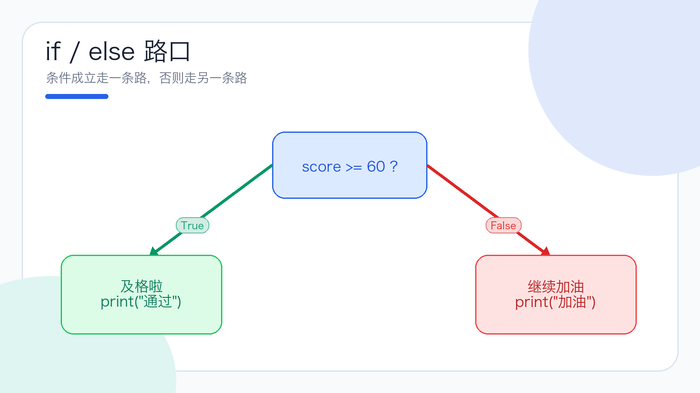

图示：if / else 路口：条件决定走哪条路

#### 学习目标

- 孩子能说出：if是'如果'的意思，电脑会做选择
- 孩子能写出：if...else... 让电脑二选一
- 孩子能说出：==是判断等不等于，!=是不等于

#### 低龄课堂设计

| 项目 | 内容 |
| --- | --- |
| 适合对象 | 7-8岁，一二年级，适合先讲故事再看代码 |
| 节奏安排 | 复习3分钟，生活演示8分钟，代码拆解10分钟，上机练习10分钟，收口3分钟 |
| 统一语言 | 本课统一使用“路口小交警”作比喻，少说抽象术语，多说动作和结果 |

- 每页演示只抓一个核心点，孩子能复述就进入下一页。
- 右侧老师提示可以照读；主画面给孩子看，不要把备课说明读给孩子。
- 如果孩子卡住，回到生活动作，不要停留在术语解释上。

#### 课堂流程

| 时间 | 环节 | 老师做什么 | 学生做什么 |
| --- | --- | --- | --- |
| 0-5分钟 | 复习连接 | 第5课我们学会了电脑从上到下一步步做。 | 说出上一课的关键词，跟老师把旧知识接回来。 |
| 5-12分钟 | 本课故事 | 今天电脑学会看情况：如果条件成立，就走一条路；否则，走另一条路。 | 回答本课开场问题，先用生活语言理解概念。 |
| 12-24分钟 | 代码拆解 | 展示关键代码：score = int(input()) / if score >= 60: /     print("及格啦") / else: /     print("继续加油")。带孩子逐行说出每个零件的作用。 | 指出关键符号、函数名或变量名，预测输出。 |
| 24-34分钟 | 互动演示 | 在地上或白板画两条路：>=60 和 <60，让孩子拿分数卡片走对应路线。 | 用手势、纸条、黑板或口头预测完成一次非电脑演示。 |
| 34-42分钟 | 上机练习 | 让孩子照着模板完成学生端编程题，重点检查本课最容易错的地方。 | 运行代码，看到输出后再交卷。 |
| 42-45分钟 | 收口衔接 | if后面是条件，冒号下面要缩进，else表示否则。 下一课讲循环：有些事情不是选择一次，而是要重复很多次。 | 说出今天带走的一句话。 |

#### 老师话术

##### 1. 开场：先接上一课

第5课我们学会了电脑从上到下一步步做。 今天我们继续往前走：今天电脑学会看情况：如果条件成立，就走一条路；否则，走另一条路。

检查点：孩子能说出上一课关键词。

##### 2. 讲新概念：使用“路口小交警”比喻

把今天的新知识想成“路口小交警”。先用生活例子讲明白，再看代码。

检查点：if后面是条件，冒号下面要缩进，else表示否则。

##### 3. 看代码：逐行翻译

不要让孩子整段背。老师逐行问：这一行先做什么？下一行又做什么？

检查点：孩子能说出代码执行顺序。

##### 4. 孩子出错：先定位一个坑

本课最常见的问题是：孩子容易漏冒号、忘缩进、把=和==混淆；先只抓冒号和缩进。

检查点：孩子知道先检查哪里。

#### 课堂演示稿

##### 演示 1：复习：上一课接到这一课

第5课我们学会了电脑从上到下一步步做。

课堂提问：请先说一句：上一课我们最重要学到了什么？

检查点：孩子能说出上一课的一个关键词。

老师提示：

- 你可以照着这样讲
  - 每节课开头先帮孩子把旧知识叫醒，不要直接进入新概念。
  - 第5课我们学会了电脑从上到下一步步做。
- 课堂操作
  - 请1位孩子回答上一课关键词。
  - 老师把孩子的话整理成一句清楚的话，再进入本课。
- 新手老师提醒
  - 如果孩子答不上来，不要停太久。你直接给出关键词，让孩子跟读一遍即可。

##### 演示 2：本课任务：选择结构 if/elif/else

今天电脑学会看情况：如果条件成立，就走一条路；否则，走另一条路。

课堂提问：如果输入80，会走哪条路？如果输入50呢？

检查点：if后面是条件，冒号下面要缩进，else表示否则。

老师提示：

- 你可以照着这样讲
  - 第5课我们学会了电脑从上到下一步步做。
  - 今天电脑学会看情况：如果条件成立，就走一条路；否则，走另一条路。
- 课堂操作
  - 在地上或白板画两条路：>=60 和 <60，让孩子拿分数卡片走对应路线。
  - 让孩子先预测，再运行或揭晓答案。低龄孩子先说出来，再敲代码，会更稳。
- 容易卡住的地方
  - 孩子容易漏冒号、忘缩进、把=和==混淆；先只抓冒号和缩进。
  - 孩子回答错时先追问“你是怎么看出来的？”，再带回屏幕上的关键词或符号。
- 过渡
  - 下一课讲循环：有些事情不是选择一次，而是要重复很多次。

##### 演示 3：看代码：把代码拆成小零件

今天的关键词：路口小交警

```python
score = int(input())
if score >= 60:
    print("及格啦")
else:
    print("继续加油")
```

课堂提问：你能找到今天最重要的符号或单词吗？

检查点：孩子能说出代码中的一个关键零件。

老师提示：

- 你可以照着这样讲
  - 我们不急着背整段代码，先把它拆成小零件。
  - 每个小零件都有自己的工作，找到它们，代码就不吓人了。
- 课堂操作
  - 先让孩子只看第一行，指出变量名、函数名或符号。
  - 再看第二行，让孩子预测电脑下一步会做什么。
  - 最后把每一行连成完整故事。
- 检查方式
  - 问孩子：这段代码先做什么？再做什么？最后输出什么？

##### 演示 4：互动：先动手，再敲代码

在地上或白板画两条路：>=60 和 <60，让孩子拿分数卡片走对应路线。

课堂提问：如果输入80，会走哪条路？如果输入50呢？

检查点：孩子能把动作说成步骤。

老师提示：

- 你可以照着这样讲
  - 我们先不用电脑，用手、纸条或黑板把题目演一遍。
  - 演明白以后，再把动作翻译成代码。
- 课堂操作
  - 在地上或白板画两条路：>=60 和 <60，让孩子拿分数卡片走对应路线。
  - 请孩子说出刚才动作里的顺序：第一步、第二步、第三步。
  - 把孩子说的话写成简短关键词。
- 低龄课堂提醒
  - 7-8岁孩子很需要身体动作和可见物品。先做动作，再看代码，理解会更顺。

##### 演示 5：避坑：最容易错在哪里？

孩子容易漏冒号、忘缩进、把=和==混淆；先只抓冒号和缩进。

课堂提问：如果这里出错，我们第一步检查什么？

检查点：孩子知道本课最常见的错误点。

老师提示：

- 你可以照着这样讲
  - 程序员不是不犯错，程序员是会检查错误。
  - 今天我们先记住最常见的一个坑。
- 带孩子检查
  - 孩子容易漏冒号、忘缩进、把=和==混淆；先只抓冒号和缩进。
  - 让孩子用手指屏幕上的关键位置，一起检查符号、顺序、括号或缩进。
- 鼓励话术
  - 写错不是失败，能找到错在哪里，就是程序员很厉害的能力。

##### 演示 6：收口：今天带走一句话

if后面是条件，冒号下面要缩进，else表示否则。

- if = 如果
- else = 否则
- 条件后面要冒号 :

课堂提问：请选一句你最记得的话读出来。

检查点：孩子能说出本课核心句。

老师提示：

- 收尾方式
  - 先全班齐读本页标题。
  - 请2-3位孩子各说一句自己记住的话。
  - 再切回学生练习，让孩子马上做一道题巩固。
- 衔接下一课
  - 下一课讲循环：有些事情不是选择一次，而是要重复很多次。

#### 概念讲解

##### 1. if 如果（条件判断）

if就像一个小交警，站在路口看情况。如果条件是对的，就走这条路；如果不对，就不走。

例子：

```python
if age >= 6:
    print("可以上学！")
```

图像化理解：一个小交警站在红绿灯下，判断年龄够不够6岁

##### 2. else 否则

else就是'否则'，如果if的条件不对，就走else这条路！

例子：

```python
if score >= 60:
    print("及格啦！")
else:
    print("加油哦！")
```

图像化理解：两条路：一条是if的，一条是else的，只能走一条

##### 3. elif 多条件

elif是'否则如果'，可以加更多条件！就像有很多门，只有符合的门才会开！

例子：

```python
if score >= 90:
    print("优秀！")
elif score >= 60:
    print("及格！")
else:
    print("加油！")
```

图像化理解：三扇门，每扇门有不同的条件，只有符合的门会开

##### 4. 比较符号

==判断等不等于（就像天平称东西），!=是不等于，>是大于，<是小于，>=是大于等于，<=是小于等于

例子：

```python
5 == 5（对的）  /  3 != 5（对的）  /  4 > 2（对的）
```

图像化理解：四个小天平：==两端一样重，!=不一样重，>左边重，<右边重

#### 典型错误

##### 1. if后面忘记加冒号

错误写法：

```python
if x > 5   ❌（忘加冒号）
```

改正写法：

```python
if x > 5:   ✅
```

if的每一行后面都要有冒号:，这是Python的规矩！

##### 2. 用 = 判断相等（赋值不是判断！）

错误写法：

```python
if x = 5:   ❌（这是把5放进x，不是判断！）
```

改正写法：

```python
if x == 5:   ✅
```

一个等号是赋值（放进盒子），两个等号才是判断等不等于！

#### 课堂实操：跟做练习：设计你的选择机器

- 第一步：想一个条件，比如'如果年龄大于6岁'
- 第二步：想条件对的时候说什么，比如'可以骑自行车'
- 第三步：想条件不对的时候说什么，比如'再等一年'
- 第四步：在电脑上写出 if age > 6: print(...) else: print(...)

#### 教学提醒

建议玩'如果...就...'游戏：老师说'如果今天下雨，就带伞'，让小朋友举牌子判断！ 低龄课堂建议：孩子容易漏冒号、忘缩进、把=和==混淆；先只抓冒号和缩进。

#### 板书与课后沟通

板书建议：

- if = 如果
- else = 否则
- 条件后面要冒号 :
- 条件成立走if，不成立走else
- 缩进表示属于这条路

家长沟通：

今天孩子学习if/else选择结构。家长可以问：如果分数>=60输出什么？否则输出什么？

#### 学生练习

##### 1. if后面要加什么符号？

A. .
B. ,
C. :
D. ;

答案：C. :
分值：10
解析：if的每一行结尾都要加冒号:！这是Python的规矩～

##### 2. 10 > 5 的结果是？

A. True（对的）
B. False（错的）
C. 10
D. 5

答案：A. True（对的）
分值：10
解析：10确实大于5，所以是True！

##### 3. 5 == 5 的意思是？

A. 把5放进5里
B. 5不等于5
C. 5等于5（判断）
D. 5大于5

答案：C. 5等于5（判断）
分值：10
解析：==是判断等不等于，=是赋值（放进去）！别搞混哦～

##### 4. if和else分别代表什么？

A. 如果/如果
B. 否则/如果
C. 如果/否则
D. 或者/而且

答案：C. 如果/否则
分值：10
解析：if=如果，else=否则。条件对走if，不对走else！

#### 编程挑战：编程题：判断及格了吗？

通关徽章：判断小交警

分值：50

考试分数来了！
如果分数大于等于60分，就输出「及格啦！」
如果分数小于60分，就输出「加油哦！」

程序会给你一个分数，你要判断及不及格～

提示：

```python
模板：
score = int(input())
if score >= 60:
    print("及格啦！")
else:
    print("加油哦！")
```

起始代码：

```python
# if分支练习：判断及格了吗

score = int(input())

if score >= 60:
    print("及格啦！")
else:
    print("加油哦！")
```

测试样例：

| 样例 | 输入 | 期望输出 |
| --- | --- | --- |
| 及格 | 75 | 及格啦！ |
| 不及格 | 55 | 加油哦！ |

## 第 8 课：循环结构 for 循环

章节：第3章 Python程序结构
课型：主线课
难度：★★
考点：for循环、range范围、循环变量

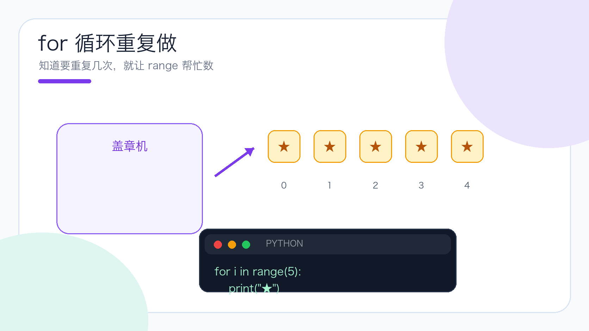

图示：for 循环：知道次数就重复做

#### 学习目标

- 孩子能说出：循环就是让电脑一直重复做同样的事
- 孩子能写出：for i in range(5) 让电脑做5次
- 孩子能说出：range()的范围是左闭右开

#### 低龄课堂设计

| 项目 | 内容 |
| --- | --- |
| 适合对象 | 7-8岁，一二年级，适合先讲故事再看代码 |
| 节奏安排 | 复习3分钟，生活演示8分钟，代码拆解10分钟，上机练习10分钟，收口3分钟 |
| 统一语言 | 本课统一使用“重复盖章机”作比喻，少说抽象术语，多说动作和结果 |

- 每页演示只抓一个核心点，孩子能复述就进入下一页。
- 右侧老师提示可以照读；主画面给孩子看，不要把备课说明读给孩子。
- 如果孩子卡住，回到生活动作，不要停留在术语解释上。

#### 课堂流程

| 时间 | 环节 | 老师做什么 | 学生做什么 |
| --- | --- | --- | --- |
| 0-5分钟 | 复习连接 | 第6课电脑会根据条件走不同路。 | 说出上一课的关键词，跟老师把旧知识接回来。 |
| 5-12分钟 | 本课故事 | 今天电脑学会重复做事。for循环适合“我知道要做几次”的任务。 | 回答本课开场问题，先用生活语言理解概念。 |
| 12-24分钟 | 代码拆解 | 展示关键代码：for i in range(5): /     print("★")。带孩子逐行说出每个零件的作用。 | 指出关键符号、函数名或变量名，预测输出。 |
| 24-34分钟 | 互动演示 | 让孩子当盖章机，老师说重复5次，孩子每次数一个编号0、1、2、3、4。 | 用手势、纸条、黑板或口头预测完成一次非电脑演示。 |
| 34-42分钟 | 上机练习 | 让孩子照着模板完成学生端编程题，重点检查本课最容易错的地方。 | 运行代码，看到输出后再交卷。 |
| 42-45分钟 | 收口衔接 | range(5)一共5次，但数字从0数到4。 下一课讲while：如果不知道重复几次，就看条件是否还成立。 | 说出今天带走的一句话。 |

#### 老师话术

##### 1. 开场：先接上一课

第6课电脑会根据条件走不同路。 今天我们继续往前走：今天电脑学会重复做事。for循环适合“我知道要做几次”的任务。

检查点：孩子能说出上一课关键词。

##### 2. 讲新概念：使用“重复盖章机”比喻

把今天的新知识想成“重复盖章机”。先用生活例子讲明白，再看代码。

检查点：range(5)一共5次，但数字从0数到4。

##### 3. 看代码：逐行翻译

不要让孩子整段背。老师逐行问：这一行先做什么？下一行又做什么？

检查点：孩子能说出代码执行顺序。

##### 4. 孩子出错：先定位一个坑

本课最常见的问题是：孩子以为range(5)会数到5；强调“到5门口停下，不包含5”。

检查点：孩子知道先检查哪里。

#### 课堂演示稿

##### 演示 1：复习：上一课接到这一课

第6课电脑会根据条件走不同路。

课堂提问：请先说一句：上一课我们最重要学到了什么？

检查点：孩子能说出上一课的一个关键词。

老师提示：

- 你可以照着这样讲
  - 每节课开头先帮孩子把旧知识叫醒，不要直接进入新概念。
  - 第6课电脑会根据条件走不同路。
- 课堂操作
  - 请1位孩子回答上一课关键词。
  - 老师把孩子的话整理成一句清楚的话，再进入本课。
- 新手老师提醒
  - 如果孩子答不上来，不要停太久。你直接给出关键词，让孩子跟读一遍即可。

##### 演示 2：本课任务：循环结构 for 循环

今天电脑学会重复做事。for循环适合“我知道要做几次”的任务。

课堂提问：range(5)会让星星出现几次？

检查点：range(5)一共5次，但数字从0数到4。

老师提示：

- 你可以照着这样讲
  - 第6课电脑会根据条件走不同路。
  - 今天电脑学会重复做事。for循环适合“我知道要做几次”的任务。
- 课堂操作
  - 让孩子当盖章机，老师说重复5次，孩子每次数一个编号0、1、2、3、4。
  - 让孩子先预测，再运行或揭晓答案。低龄孩子先说出来，再敲代码，会更稳。
- 容易卡住的地方
  - 孩子以为range(5)会数到5；强调“到5门口停下，不包含5”。
  - 孩子回答错时先追问“你是怎么看出来的？”，再带回屏幕上的关键词或符号。
- 过渡
  - 下一课讲while：如果不知道重复几次，就看条件是否还成立。

##### 演示 3：看代码：把代码拆成小零件

今天的关键词：重复盖章机

```python
for i in range(5):
    print("★")
```

课堂提问：你能找到今天最重要的符号或单词吗？

检查点：孩子能说出代码中的一个关键零件。

老师提示：

- 你可以照着这样讲
  - 我们不急着背整段代码，先把它拆成小零件。
  - 每个小零件都有自己的工作，找到它们，代码就不吓人了。
- 课堂操作
  - 先让孩子只看第一行，指出变量名、函数名或符号。
  - 再看第二行，让孩子预测电脑下一步会做什么。
  - 最后把每一行连成完整故事。
- 检查方式
  - 问孩子：这段代码先做什么？再做什么？最后输出什么？

##### 演示 4：互动：先动手，再敲代码

让孩子当盖章机，老师说重复5次，孩子每次数一个编号0、1、2、3、4。

课堂提问：range(5)会让星星出现几次？

检查点：孩子能把动作说成步骤。

老师提示：

- 你可以照着这样讲
  - 我们先不用电脑，用手、纸条或黑板把题目演一遍。
  - 演明白以后，再把动作翻译成代码。
- 课堂操作
  - 让孩子当盖章机，老师说重复5次，孩子每次数一个编号0、1、2、3、4。
  - 请孩子说出刚才动作里的顺序：第一步、第二步、第三步。
  - 把孩子说的话写成简短关键词。
- 低龄课堂提醒
  - 7-8岁孩子很需要身体动作和可见物品。先做动作，再看代码，理解会更顺。

##### 演示 5：避坑：最容易错在哪里？

孩子以为range(5)会数到5；强调“到5门口停下，不包含5”。

课堂提问：如果这里出错，我们第一步检查什么？

检查点：孩子知道本课最常见的错误点。

老师提示：

- 你可以照着这样讲
  - 程序员不是不犯错，程序员是会检查错误。
  - 今天我们先记住最常见的一个坑。
- 带孩子检查
  - 孩子以为range(5)会数到5；强调“到5门口停下，不包含5”。
  - 让孩子用手指屏幕上的关键位置，一起检查符号、顺序、括号或缩进。
- 鼓励话术
  - 写错不是失败，能找到错在哪里，就是程序员很厉害的能力。

##### 演示 6：收口：今天带走一句话

range(5)一共5次，但数字从0数到4。

- for = 重复做
- range(5) = 重复5次
- 电脑数数从0开始：0,1,2,3,4

课堂提问：请选一句你最记得的话读出来。

检查点：孩子能说出本课核心句。

老师提示：

- 收尾方式
  - 先全班齐读本页标题。
  - 请2-3位孩子各说一句自己记住的话。
  - 再切回学生练习，让孩子马上做一道题巩固。
- 衔接下一课
  - 下一课讲while：如果不知道重复几次，就看条件是否还成立。

#### 概念讲解

##### 1. 循环是什么

循环就像转陀螺！转起来之后就一直转一直转，直到停下来为止。电脑也这样，重复执行同样的代码！

例子：

```python
for i in range(3):
    print("转！")   # 打印三次"转！"
```

图像化理解：一个彩色陀螺在旋转，旁边写着'重复执行'

##### 2. range(n) 数数器

range(5)就像数数从0开始：0、1、2、3、4，数到5就停。一共数5个数字！

例子：

```python
for i in range(5):
    print(i)   # 打印 0 1 2 3 4
```

图像化理解：一个计数器从0开始数，数到5就喊停！

##### 3. range(start, end) 范围数数

range(1, 5)从1开始数：1、2、3、4，数到5就停（不包含5）。

例子：

```python
for i in range(1, 5):
    print(i)   # 打印 1 2 3 4
```

图像化理解：一个计数器从1开始，跳过0，数到5前就停

##### 4. 循环变量的作用

i在循环里会变！每次循环都会变成下一个数字，可以在循环里用！

例子：

```python
for i in range(3):
    print("第" + str(i) + "次")
# 第0次
# 第1次
# 第2次
```

图像化理解：一个小人走楼梯，每次踩的台阶数字都不一样

#### 典型错误

##### 1. range(5)打印的是1到5？错！

错误写法：

```python
range(5)会打印1,2,3,4,5   ❌
```

改正写法：

```python
range(5)会打印0,1,2,3,4   ✅
```

range从0开始数！range(5)是从0数到4，一共5个数字！

##### 2. for后面忘记加冒号

错误写法：

```python
for i in range(3)   ❌
```

改正写法：

```python
for i in range(3):   ✅
```

for的每一行后面都要有冒号:！

#### 课堂实操：跟做练习：数数小陀螺

- 第一步：想一个数字，比如3
- 第二步：用range(3)让程序数0、1、2（数3次）
- 第三步：每次数到就打印"转！"
- 第四步：写出 for i in range(3): print("转！")

#### 教学提醒

建议先让小朋友在纸上画圈圈：一个圈写'打印你好'，然后画3个箭头连回去，看看打印几次！ 低龄课堂建议：孩子以为range(5)会数到5；强调“到5门口停下，不包含5”。

#### 板书与课后沟通

板书建议：

- for = 重复做
- range(5) = 重复5次
- 电脑数数从0开始：0,1,2,3,4
- 冒号和缩进不能丢

家长沟通：

今天孩子学习for循环。可以问孩子：range(3)会数哪几个数？答案是0、1、2。

#### 学生练习

##### 1. range(3) 会打印哪几个数字？

A. 1, 2, 3
B. 0, 1, 2
C. 0, 1, 2, 3
D. 1, 2

答案：B. 0, 1, 2
分值：10
解析：range从0开始数！range(3) = 0, 1, 2，一共3个数字！

##### 2. range(1, 4) 会打印哪几个数字？

A. 1, 2, 3
B. 1, 2, 3, 4
C. 0, 1, 2, 3
D. 2, 3

答案：A. 1, 2, 3
分值：10
解析：从1开始数，数到4之前停下：1, 2, 3！

##### 3. for i in range(2): print("Hello") 会打印几次Hello？

A. 1次
B. 2次
C. 3次
D. 无限次

答案：B. 2次
分值：10
解析：range(2) = 0, 1，循环2次，所以打印2次Hello！

##### 4. range(5)[0] 的范围是？

A. 0, 1, 2, 3, 4
B. 1, 2, 3, 4, 5
C. 0, 1, 2, 3
D. 1, 2, 3, 4

答案：A. 0, 1, 2, 3, 4
分值：10
解析：range(5)从0开始，到5之前停下：0, 1, 2, 3, 4！

#### 编程挑战：编程题：打印5颗星星！

通关徽章：循环小陀螺

分值：50

请用循环打印5颗星星！

程序会输出5行，每行一个「*」

效果：
*
*
*
*
*

提示：

```python
用 for i in range(5) 循环5次，每次打印一颗星～

for i in range(5):
    print("*")
```

起始代码：

```python
# for循环：打印5颗星星

for i in range(5):
    print("*")
```

测试样例：

| 样例 | 输入 | 期望输出 |
| --- | --- | --- |
| 星星测试 |  | *<br>*<br>*<br>*<br>* |
| 再次检查 |  | *<br>*<br>*<br>*<br>* |

## 第 9 课：循环结构 while 循环

章节：第3章 Python程序结构
课型：主线课
难度：★★
考点：while循环、条件循环、break退出、continue跳过

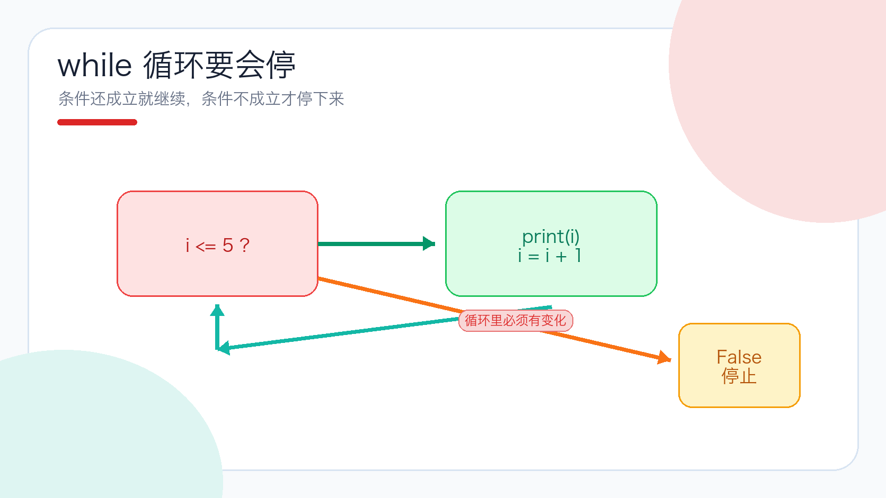

图示：while 循环：条件还成立就继续

#### 学习目标

- 孩子能说出：while是'当...的时候'一直做
- 孩子能写出：while条件循环
- 孩子能说出：break是退出循环，continue是跳过本次

#### 低龄课堂设计

| 项目 | 内容 |
| --- | --- |
| 适合对象 | 7-8岁，一二年级，适合先讲故事再看代码 |
| 节奏安排 | 复习3分钟，生活演示8分钟，代码拆解10分钟，上机练习10分钟，收口3分钟 |
| 统一语言 | 本课统一使用“红绿灯和停止按钮”作比喻，少说抽象术语，多说动作和结果 |

- 每页演示只抓一个核心点，孩子能复述就进入下一页。
- 右侧老师提示可以照读；主画面给孩子看，不要把备课说明读给孩子。
- 如果孩子卡住，回到生活动作，不要停留在术语解释上。

#### 课堂流程

| 时间 | 环节 | 老师做什么 | 学生做什么 |
| --- | --- | --- | --- |
| 0-5分钟 | 复习连接 | 第7课我们用for循环重复固定次数。 | 说出上一课的关键词，跟老师把旧知识接回来。 |
| 5-12分钟 | 本课故事 | 今天学习while循环：只要条件还成立，就继续做；条件不成立才停。 | 回答本课开场问题，先用生活语言理解概念。 |
| 12-24分钟 | 代码拆解 | 展示关键代码：i = 1 / while i <= 5: /     print(i) /     i = i + 1。带孩子逐行说出每个零件的作用。 | 指出关键符号、函数名或变量名，预测输出。 |
| 24-34分钟 | 互动演示 | 让孩子扮演计数器，从1数到5；每数一次必须把数字加1，否则永远卡在1。 | 用手势、纸条、黑板或口头预测完成一次非电脑演示。 |
| 34-42分钟 | 上机练习 | 让孩子照着模板完成学生端编程题，重点检查本课最容易错的地方。 | 运行代码，看到输出后再交卷。 |
| 42-45分钟 | 收口衔接 | while一定要让条件有机会变成False，否则会停不下来。 下一课讲函数：把一组会重复用的步骤装进小工厂。 | 说出今天带走的一句话。 |

#### 老师话术

##### 1. 开场：先接上一课

第7课我们用for循环重复固定次数。 今天我们继续往前走：今天学习while循环：只要条件还成立，就继续做；条件不成立才停。

检查点：孩子能说出上一课关键词。

##### 2. 讲新概念：使用“红绿灯和停止按钮”比喻

把今天的新知识想成“红绿灯和停止按钮”。先用生活例子讲明白，再看代码。

检查点：while一定要让条件有机会变成False，否则会停不下来。

##### 3. 看代码：逐行翻译

不要让孩子整段背。老师逐行问：这一行先做什么？下一行又做什么？

检查点：孩子能说出代码执行顺序。

##### 4. 孩子出错：先定位一个坑

本课最常见的问题是：孩子最容易写死循环；反复强调“循环里要有变化”。

检查点：孩子知道先检查哪里。

#### 课堂演示稿

##### 演示 1：复习：上一课接到这一课

第7课我们用for循环重复固定次数。

课堂提问：请先说一句：上一课我们最重要学到了什么？

检查点：孩子能说出上一课的一个关键词。

老师提示：

- 你可以照着这样讲
  - 每节课开头先帮孩子把旧知识叫醒，不要直接进入新概念。
  - 第7课我们用for循环重复固定次数。
- 课堂操作
  - 请1位孩子回答上一课关键词。
  - 老师把孩子的话整理成一句清楚的话，再进入本课。
- 新手老师提醒
  - 如果孩子答不上来，不要停太久。你直接给出关键词，让孩子跟读一遍即可。

##### 演示 2：本课任务：循环结构 while 循环

今天学习while循环：只要条件还成立，就继续做；条件不成立才停。

课堂提问：如果最后忘了 i = i + 1，会发生什么？

检查点：while一定要让条件有机会变成False，否则会停不下来。

老师提示：

- 你可以照着这样讲
  - 第7课我们用for循环重复固定次数。
  - 今天学习while循环：只要条件还成立，就继续做；条件不成立才停。
- 课堂操作
  - 让孩子扮演计数器，从1数到5；每数一次必须把数字加1，否则永远卡在1。
  - 让孩子先预测，再运行或揭晓答案。低龄孩子先说出来，再敲代码，会更稳。
- 容易卡住的地方
  - 孩子最容易写死循环；反复强调“循环里要有变化”。
  - 孩子回答错时先追问“你是怎么看出来的？”，再带回屏幕上的关键词或符号。
- 过渡
  - 下一课讲函数：把一组会重复用的步骤装进小工厂。

##### 演示 3：看代码：把代码拆成小零件

今天的关键词：红绿灯和停止按钮

```python
i = 1
while i <= 5:
    print(i)
    i = i + 1
```

课堂提问：你能找到今天最重要的符号或单词吗？

检查点：孩子能说出代码中的一个关键零件。

老师提示：

- 你可以照着这样讲
  - 我们不急着背整段代码，先把它拆成小零件。
  - 每个小零件都有自己的工作，找到它们，代码就不吓人了。
- 课堂操作
  - 先让孩子只看第一行，指出变量名、函数名或符号。
  - 再看第二行，让孩子预测电脑下一步会做什么。
  - 最后把每一行连成完整故事。
- 检查方式
  - 问孩子：这段代码先做什么？再做什么？最后输出什么？

##### 演示 4：互动：先动手，再敲代码

让孩子扮演计数器，从1数到5；每数一次必须把数字加1，否则永远卡在1。

课堂提问：如果最后忘了 i = i + 1，会发生什么？

检查点：孩子能把动作说成步骤。

老师提示：

- 你可以照着这样讲
  - 我们先不用电脑，用手、纸条或黑板把题目演一遍。
  - 演明白以后，再把动作翻译成代码。
- 课堂操作
  - 让孩子扮演计数器，从1数到5；每数一次必须把数字加1，否则永远卡在1。
  - 请孩子说出刚才动作里的顺序：第一步、第二步、第三步。
  - 把孩子说的话写成简短关键词。
- 低龄课堂提醒
  - 7-8岁孩子很需要身体动作和可见物品。先做动作，再看代码，理解会更顺。

##### 演示 5：避坑：最容易错在哪里？

孩子最容易写死循环；反复强调“循环里要有变化”。

课堂提问：如果这里出错，我们第一步检查什么？

检查点：孩子知道本课最常见的错误点。

老师提示：

- 你可以照着这样讲
  - 程序员不是不犯错，程序员是会检查错误。
  - 今天我们先记住最常见的一个坑。
- 带孩子检查
  - 孩子最容易写死循环；反复强调“循环里要有变化”。
  - 让孩子用手指屏幕上的关键位置，一起检查符号、顺序、括号或缩进。
- 鼓励话术
  - 写错不是失败，能找到错在哪里，就是程序员很厉害的能力。

##### 演示 6：收口：今天带走一句话

while一定要让条件有机会变成False，否则会停不下来。

- while = 当条件成立时一直做
- 条件变False才会停
- 循环里要有变化

课堂提问：请选一句你最记得的话读出来。

检查点：孩子能说出本课核心句。

老师提示：

- 收尾方式
  - 先全班齐读本页标题。
  - 请2-3位孩子各说一句自己记住的话。
  - 再切回学生练习，让孩子马上做一道题巩固。
- 衔接下一课
  - 下一课讲函数：把一组会重复用的步骤装进小工厂。

#### 概念讲解

##### 1. while 当...时

while就像'当...的时候'。只要条件是对的，就一直做下去！注意：一定要有结束的时候，不然会停不下来！

例子：

```python
i = 0
while i < 3:
    print(i)
    i = i + 1
```

图像化理解：一个跑道，选手一直跑，只要没到终点就一直跑

##### 2. while vs for

for知道要循环几次，while不知道要循环几次，只要条件对就一直做！

例子：

```python
# for：知道要做5次
for i in range(5):
    print(i)

# while：不知道要做几次，只到条件不对才停
i = 0
while i < 5:
    print(i)
    i = i + 1
```

图像化理解：两个人跑步：一个（for）知道自己要跑5圈；一个（while）只知道跑到累为止

##### 3. break 退出循环

break就是'突然停止'！不管循环有没有做完，直接跳出循环！

例子：

```python
for i in range(10):
    if i == 3:
        break
    print(i)   # 只打印0, 1, 2，然后 break
```

图像化理解：一个人跑着跑着突然看到STOP标志，就停下来不跑了

##### 4. continue 跳过本次

continue就是'跳过这一个'！这次后面的代码不执行，直接去执行下一次循环！

例子：

```python
for i in range(5):
    if i == 2:
        continue
    print(i)   # 打印0, 1, 3, 4，跳过了2
```

图像化理解：一个人跳过第2个台阶，继续跳到第3个

#### 典型错误

##### 1. while忘记让条件变成False

错误写法：

```python
while True:（永远停不下来！）
    print(1)
```

改正写法：

```python
i = 0
while i < 5:
    print(i)
    i = i + 1
```

while循环里一定要改变条件变量，不然会变成永远转下去的陀螺！

##### 2. while条件写错导致死循环

错误写法：

```python
i = 1
while i > 0:
    print(i)
    i = i + 1   # i永远大于0，死循环！
```

改正写法：

```python
设置正确的退出条件，或者用break退出
```

死循环会让程序卡住！一定要确保条件会变成False！

#### 课堂实操：跟做练习：数到停下来

- 第一步：设一个计数器 i = 0
- 第二步：while i < 5：只要i小于5就继续
- 第三步：每次打印i，然后 i = i + 1
- 第四步：运行看看数到几停下来！

#### 教学提醒

建议先让小朋友在纸上画流程：开始 → 条件对吗？→ 做事情 → 改变条件 → 再问条件对吗？ 低龄课堂建议：孩子最容易写死循环；反复强调“循环里要有变化”。

#### 板书与课后沟通

板书建议：

- while = 当条件成立时一直做
- 条件变False才会停
- 循环里要有变化
- break = 直接停止
- continue = 跳过这一次

家长沟通：

今天孩子学习while循环。请重点让孩子记住：while里要有变化，不然程序可能一直停不下来。

#### 学生练习

##### 1. while循环什么时候会停下来？

A. 永远不会停
B. 当条件变成False的时候
C. 电脑关机的时候
D. 打印完一次就停

答案：B. 当条件变成False的时候
分值：10
解析：while会一直转，直到条件变成False才停！

##### 2. break的作用是什么？

A. 跳过本次循环
B. 继续下一次循环
C. 直接退出整个循环
D. 暂停一下

答案：C. 直接退出整个循环
分值：10
解析：break是直接退出整个循环，不管循环有没有做完！

##### 3. continue的作用是什么？

A. 退出整个循环
B. 跳过这次循环，继续下一次
C. 停止程序
D. 重新开始

答案：B. 跳过这次循环，继续下一次
分值：10
解析：continue是跳过这一次循环的后面部分，直接去执行下一次！

##### 4. 下面哪个会变成死循环？

A. while i < 5: i = i + 1
B. while i > 0: i = i - 1
C. while True: break
D. while True: i = i + 1

答案：D. while True: i = i + 1
分值：10
解析：while True: i = i + 1 条件永远是True且i一直在增加，会死循环！

#### 编程挑战：编程题：数到5就停！

通关徽章：while小能手

分值：50

用while循环，从1开始数，每次加1。
当数到5的时候停止（不打印5）。

输出：
1
2
3
4

提示：

```python
模板：
i = 1
while i < 5:
    print(i)
    i = i + 1
```

起始代码：

```python
# while循环：数到5就停

i = 1
while i < 5:
    print(i)
    i = i + 1
```

测试样例：

| 样例 | 输入 | 期望输出 |
| --- | --- | --- |
| 数到4 |  | 1<br>2<br>3<br>4 |
| 再次检查 |  | 1<br>2<br>3<br>4 |

# 第4章 函数与模块

## 第 10 课：函数定义与调用

章节：第4章 函数与模块
课型：主线课
难度：★★★
考点：函数定义def、函数参数、函数返回值return、函数调用

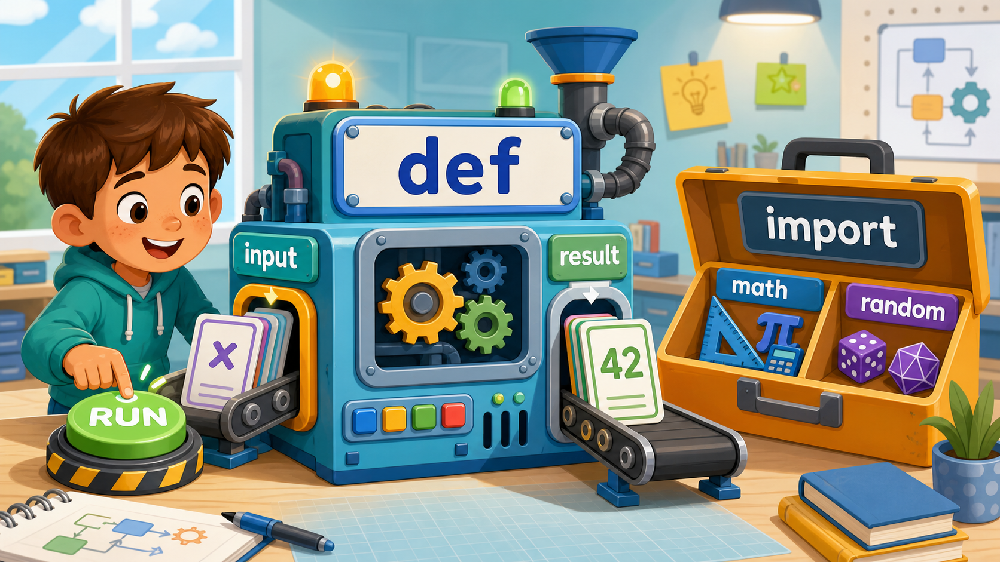

图示：函数工厂与模块工具箱

#### 学习目标

- 孩子能说出：函数就像一个可以重复使用的做菜机器
- 孩子能写出：def make_cake() 造一个蛋糕机器
- 孩子能做：给函数传参数，让它做出不同的东西

#### 低龄课堂设计

| 项目 | 内容 |
| --- | --- |
| 适合对象 | 7-8岁，一二年级，适合先讲故事再看代码 |
| 节奏安排 | 复习3分钟，生活演示8分钟，代码拆解10分钟，上机练习10分钟，收口3分钟 |
| 统一语言 | 本课统一使用“小工厂”作比喻，少说抽象术语，多说动作和结果 |

- 每页演示只抓一个核心点，孩子能复述就进入下一页。
- 右侧老师提示可以照读；主画面给孩子看，不要把备课说明读给孩子。
- 如果孩子卡住，回到生活动作，不要停留在术语解释上。

#### 课堂流程

| 时间 | 环节 | 老师做什么 | 学生做什么 |
| --- | --- | --- | --- |
| 0-5分钟 | 复习连接 | 前面我们写了很多步骤，有些步骤会重复出现。 | 说出上一课的关键词，跟老师把旧知识接回来。 |
| 5-12分钟 | 本课故事 | 函数像一个小工厂：把步骤装起来，想用时叫名字，工厂就开始工作。 | 回答本课开场问题，先用生活语言理解概念。 |
| 12-24分钟 | 代码拆解 | 展示关键代码：def say_hello(name): /     print("你好" + name) /  / say_hello("小明")。带孩子逐行说出每个零件的作用。 | 指出关键符号、函数名或变量名，预测输出。 |
| 24-34分钟 | 互动演示 | 画一个工厂：入口是参数name，里面是print步骤，出口是显示结果。先画工厂，再按按钮调用。 | 用手势、纸条、黑板或口头预测完成一次非电脑演示。 |
| 34-42分钟 | 上机练习 | 让孩子照着模板完成学生端编程题，重点检查本课最容易错的地方。 | 运行代码，看到输出后再交卷。 |
| 42-45分钟 | 收口衔接 | def是建工厂，函数名加括号是开工厂；参数是放进去的原料。 下一课讲模块：别人已经做好的工具箱，我们可以import来用。 | 说出今天带走的一句话。 |

#### 老师话术

##### 1. 开场：先接上一课

前面我们写了很多步骤，有些步骤会重复出现。 今天我们继续往前走：函数像一个小工厂：把步骤装起来，想用时叫名字，工厂就开始工作。

检查点：孩子能说出上一课关键词。

##### 2. 讲新概念：使用“小工厂”比喻

把今天的新知识想成“小工厂”。先用生活例子讲明白，再看代码。

检查点：def是建工厂，函数名加括号是开工厂；参数是放进去的原料。

##### 3. 看代码：逐行翻译

不要让孩子整段背。老师逐行问：这一行先做什么？下一行又做什么？

检查点：孩子能说出代码执行顺序。

##### 4. 孩子出错：先定位一个坑

本课最常见的问题是：孩子会写了def但忘记调用；强调“建好工厂不等于开工”。

检查点：孩子知道先检查哪里。

#### 课堂演示稿

##### 演示 1：复习：上一课接到这一课

前面我们写了很多步骤，有些步骤会重复出现。

课堂提问：请先说一句：上一课我们最重要学到了什么？

检查点：孩子能说出上一课的一个关键词。

老师提示：

- 你可以照着这样讲
  - 每节课开头先帮孩子把旧知识叫醒，不要直接进入新概念。
  - 前面我们写了很多步骤，有些步骤会重复出现。
- 课堂操作
  - 请1位孩子回答上一课关键词。
  - 老师把孩子的话整理成一句清楚的话，再进入本课。
- 新手老师提醒
  - 如果孩子答不上来，不要停太久。你直接给出关键词，让孩子跟读一遍即可。

##### 演示 2：本课任务：函数定义与调用

函数像一个小工厂：把步骤装起来，想用时叫名字，工厂就开始工作。

课堂提问：函数定义好了，如果不调用，它会自己工作吗？

检查点：def是建工厂，函数名加括号是开工厂；参数是放进去的原料。

老师提示：

- 你可以照着这样讲
  - 前面我们写了很多步骤，有些步骤会重复出现。
  - 函数像一个小工厂：把步骤装起来，想用时叫名字，工厂就开始工作。
- 课堂操作
  - 画一个工厂：入口是参数name，里面是print步骤，出口是显示结果。先画工厂，再按按钮调用。
  - 让孩子先预测，再运行或揭晓答案。低龄孩子先说出来，再敲代码，会更稳。
- 容易卡住的地方
  - 孩子会写了def但忘记调用；强调“建好工厂不等于开工”。
  - 孩子回答错时先追问“你是怎么看出来的？”，再带回屏幕上的关键词或符号。
- 过渡
  - 下一课讲模块：别人已经做好的工具箱，我们可以import来用。

##### 演示 3：看代码：把代码拆成小零件

今天的关键词：小工厂

```python
def say_hello(name):
    print("你好" + name)

say_hello("小明")
```

课堂提问：你能找到今天最重要的符号或单词吗？

检查点：孩子能说出代码中的一个关键零件。

老师提示：

- 你可以照着这样讲
  - 我们不急着背整段代码，先把它拆成小零件。
  - 每个小零件都有自己的工作，找到它们，代码就不吓人了。
- 课堂操作
  - 先让孩子只看第一行，指出变量名、函数名或符号。
  - 再看第二行，让孩子预测电脑下一步会做什么。
  - 最后把每一行连成完整故事。
- 检查方式
  - 问孩子：这段代码先做什么？再做什么？最后输出什么？

##### 演示 4：互动：先动手，再敲代码

画一个工厂：入口是参数name，里面是print步骤，出口是显示结果。先画工厂，再按按钮调用。

课堂提问：函数定义好了，如果不调用，它会自己工作吗？

检查点：孩子能把动作说成步骤。

老师提示：

- 你可以照着这样讲
  - 我们先不用电脑，用手、纸条或黑板把题目演一遍。
  - 演明白以后，再把动作翻译成代码。
- 课堂操作
  - 画一个工厂：入口是参数name，里面是print步骤，出口是显示结果。先画工厂，再按按钮调用。
  - 请孩子说出刚才动作里的顺序：第一步、第二步、第三步。
  - 把孩子说的话写成简短关键词。
- 低龄课堂提醒
  - 7-8岁孩子很需要身体动作和可见物品。先做动作，再看代码，理解会更顺。

##### 演示 5：避坑：最容易错在哪里？

孩子会写了def但忘记调用；强调“建好工厂不等于开工”。

课堂提问：如果这里出错，我们第一步检查什么？

检查点：孩子知道本课最常见的错误点。

老师提示：

- 你可以照着这样讲
  - 程序员不是不犯错，程序员是会检查错误。
  - 今天我们先记住最常见的一个坑。
- 带孩子检查
  - 孩子会写了def但忘记调用；强调“建好工厂不等于开工”。
  - 让孩子用手指屏幕上的关键位置，一起检查符号、顺序、括号或缩进。
- 鼓励话术
  - 写错不是失败，能找到错在哪里，就是程序员很厉害的能力。

##### 演示 6：收口：今天带走一句话

def是建工厂，函数名加括号是开工厂；参数是放进去的原料。

- 函数 = 可重复使用的小工厂
- def = 建工厂
- 参数 = 原料

课堂提问：请选一句你最记得的话读出来。

检查点：孩子能说出本课核心句。

老师提示：

- 收尾方式
  - 先全班齐读本页标题。
  - 请2-3位孩子各说一句自己记住的话。
  - 再切回学生练习，让孩子马上做一道题巩固。
- 衔接下一课
  - 下一课讲模块：别人已经做好的工具箱，我们可以import来用。

#### 概念讲解

##### 1. 函数是什么

函数就像一个小工厂！你给它放原料，它就会按照说明书加工，然后产出产品！可以重复使用！

例子：

```python
def say_hello():
    print("你好！")

say_hello()   # 叫工厂开工！
```

图像化理解：一个小工厂，门口写着def，上面有原料入口和产品出口

##### 2. 参数：给函数的原料

参数就是给函数的原料！def add(a, b)就是告诉工厂，它需要两个原料a和b。

例子：

```python
def add(a, b):
    return a + b

result = add(3, 5)   # 给工厂3和5，得到8
```

图像化理解：一个加法工厂，有两个原料入口和一个产品出口

##### 3. return 产出产品

return就是函数产出产品！return后面的东西会被送出来，给别人用。

例子：

```python
def double(x):
    return x * 2

print(double(5))   # 10
```

图像化理解：一个小窗口，return的东西从窗口送出来

##### 4. 函数的调用

调用函数就是让函数开始工作！函数名后面加括号就是调用！

例子：

```python
def greet():
    print("Hello!")

greet()   # 调用，打印Hello!
```

图像化理解：按工厂的启动按钮，工厂就开始工作了

#### 典型错误

##### 1. 调用函数忘记加括号

错误写法：

```python
say_hello   ❌（只是说了名字，没开工）
```

改正写法：

```python
say_hello()   ✅（这才叫工厂开工！）
```

say_hello只是念名字，say_hello()才是真正执行！

##### 2. 函数里忘记return

错误写法：

```python
def double(x):
    x * 2   ❌（产品没送出来！）
```

改正写法：

```python
def double(x):
    return x * 2   ✅
```

没有return，函数就不知道产出什么！

#### 课堂实操：跟做练习：建造我的第一个工厂

- 第一步：想一个简单的功能，比如"打印Hello"
- 第二步：用def定义这个工厂：def say_hello():
- 第三步：在工厂里写上要做什么：print("Hello")
- 第四步：调用工厂：say_hello()

#### 教学提醒

建议让小朋友扮演函数：def add(a, b) = 一个小朋友扮演的加法机器人！ 低龄课堂建议：孩子会写了def但忘记调用；强调“建好工厂不等于开工”。

#### 板书与课后沟通

板书建议：

- 函数 = 可重复使用的小工厂
- def = 建工厂
- 参数 = 原料
- return/print = 产出或显示
- 函数名() = 调用，让工厂开工

家长沟通：

今天孩子学习函数。可以问：def是在建工厂，还是在开工厂？函数名加括号才是调用。

#### 学生练习

##### 1. 下面哪个是正确的函数定义？

A. function add():
B. def add():
C. func add():
D. make add():

答案：B. def add():
分值：10
解析：Python里定义函数要用 def 这个关键字！

##### 2. add(3, 5)里的3和5是什么？

A. 两个函数
B. 两个参数
C. 两个结果
D. 两个名字

答案：B. 两个参数
分值：10
解析：3和5是给函数的原料，叫做参数！

##### 3. return的作用是什么？

A. 结束函数
B. 把结果送出来
C. 开始函数
D. 打印结果

答案：B. 把结果送出来
分值：10
解析：return把函数算出来的结果送出来给别人用！

##### 4. say_hello 和 say_hello() 有什么区别？

A. 没有区别
B. 前者是念名字，后者是执行
C. 前者是执行，后者是念名字
D. 都执行

答案：B. 前者是念名字，后者是执行
分值：10
解析：say_hello只是说这台机器，say_hello()才是真正让它工作！

#### 编程挑战：编程题：建造乘法工厂！

通关徽章：函数小厂长

分值：50

建造一个乘法工厂，给它两个数字，它会返回它们的乘积。

主程序会输入两个数字，调用你的工厂，输出结果。

例如：输入「3」和「4」，输出「12」

提示：

```python
模板：
def multiply(a, b):
    return a * b

x = int(input())
y = int(input())
print(multiply(x, y))
```

起始代码：

```python
# 函数定义与调用：乘法工厂

def multiply(a, b):
    return a * b

x = int(input())
y = int(input())
print(multiply(x, y))
```

测试样例：

| 样例 | 输入 | 期望输出 |
| --- | --- | --- |
| 3乘4 | 3<br>4 | 12 |
| 6乘7 | 6<br>7 | 42 |

## 第 11 课：变量作用域与常用模块

章节：第4章 函数与模块
课型：主线课
难度：★★★
考点：局部变量、全局变量、import导入、math模块、random随机数

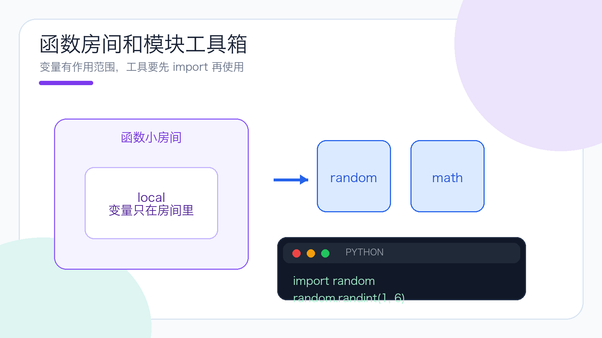

图示：函数房间和模块工具箱

#### 学习目标

- 孩子能说出：局部变量只在函数里有用，全局变量到处都能用
- 孩子能说出：模块就像一个有很多工具的大仓库
- 孩子能用：import math 来借工具
- 孩子能用：random.randint() 产生随机数

#### 低龄课堂设计

| 项目 | 内容 |
| --- | --- |
| 适合对象 | 7-8岁，一二年级，适合先讲故事再看代码 |
| 节奏安排 | 复习3分钟，生活演示8分钟，代码拆解10分钟，上机练习10分钟，收口3分钟 |
| 统一语言 | 本课统一使用“小房间和工具箱”作比喻，少说抽象术语，多说动作和结果 |

- 每页演示只抓一个核心点，孩子能复述就进入下一页。
- 右侧老师提示可以照读；主画面给孩子看，不要把备课说明读给孩子。
- 如果孩子卡住，回到生活动作，不要停留在术语解释上。

#### 课堂流程

| 时间 | 环节 | 老师做什么 | 学生做什么 |
| --- | --- | --- | --- |
| 0-5分钟 | 复习连接 | 第9课我们会自己做函数小工厂。 | 说出上一课的关键词，跟老师把旧知识接回来。 |
| 5-12分钟 | 本课故事 | 今天学习两件事：函数里的变量有自己的小房间；模块是别人准备好的工具箱。 | 回答本课开场问题，先用生活语言理解概念。 |
| 12-24分钟 | 代码拆解 | 展示关键代码：import random / print(random.randint(1, 6))。带孩子逐行说出每个零件的作用。 | 指出关键符号、函数名或变量名，预测输出。 |
| 24-34分钟 | 互动演示 | 把函数画成房间，房间里的变量出门就不一定认识；再拿出工具箱卡片math、random。 | 用手势、纸条、黑板或口头预测完成一次非电脑演示。 |
| 34-42分钟 | 上机练习 | 让孩子照着模板完成学生端编程题，重点检查本课最容易错的地方。 | 运行代码，看到输出后再交卷。 |
| 42-45分钟 | 收口衔接 | import表示借工具；random能做随机数，math能做数学工具。 下一课进入文件和异常，程序会开始和电脑里的本子打交道。 | 说出今天带走的一句话。 |

#### 老师话术

##### 1. 开场：先接上一课

第9课我们会自己做函数小工厂。 今天我们继续往前走：今天学习两件事：函数里的变量有自己的小房间；模块是别人准备好的工具箱。

检查点：孩子能说出上一课关键词。

##### 2. 讲新概念：使用“小房间和工具箱”比喻

把今天的新知识想成“小房间和工具箱”。先用生活例子讲明白，再看代码。

检查点：import表示借工具；random能做随机数，math能做数学工具。

##### 3. 看代码：逐行翻译

不要让孩子整段背。老师逐行问：这一行先做什么？下一行又做什么？

检查点：孩子能说出代码执行顺序。

##### 4. 孩子出错：先定位一个坑

本课最常见的问题是：孩子会忘记import就直接用工具；强调“先借工具箱，再用工具”。

检查点：孩子知道先检查哪里。

#### 课堂演示稿

##### 演示 1：复习：上一课接到这一课

第9课我们会自己做函数小工厂。

课堂提问：请先说一句：上一课我们最重要学到了什么？

检查点：孩子能说出上一课的一个关键词。

老师提示：

- 你可以照着这样讲
  - 每节课开头先帮孩子把旧知识叫醒，不要直接进入新概念。
  - 第9课我们会自己做函数小工厂。
- 课堂操作
  - 请1位孩子回答上一课关键词。
  - 老师把孩子的话整理成一句清楚的话，再进入本课。
- 新手老师提醒
  - 如果孩子答不上来，不要停太久。你直接给出关键词，让孩子跟读一遍即可。

##### 演示 2：本课任务：变量作用域与常用模块

今天学习两件事：函数里的变量有自己的小房间；模块是别人准备好的工具箱。

课堂提问：如果想摇骰子，应该先借哪个工具箱？

检查点：import表示借工具；random能做随机数，math能做数学工具。

老师提示：

- 你可以照着这样讲
  - 第9课我们会自己做函数小工厂。
  - 今天学习两件事：函数里的变量有自己的小房间；模块是别人准备好的工具箱。
- 课堂操作
  - 把函数画成房间，房间里的变量出门就不一定认识；再拿出工具箱卡片math、random。
  - 让孩子先预测，再运行或揭晓答案。低龄孩子先说出来，再敲代码，会更稳。
- 容易卡住的地方
  - 孩子会忘记import就直接用工具；强调“先借工具箱，再用工具”。
  - 孩子回答错时先追问“你是怎么看出来的？”，再带回屏幕上的关键词或符号。
- 过渡
  - 下一课进入文件和异常，程序会开始和电脑里的本子打交道。

##### 演示 3：看代码：把代码拆成小零件

今天的关键词：小房间和工具箱

```python
import random
print(random.randint(1, 6))
```

课堂提问：你能找到今天最重要的符号或单词吗？

检查点：孩子能说出代码中的一个关键零件。

老师提示：

- 你可以照着这样讲
  - 我们不急着背整段代码，先把它拆成小零件。
  - 每个小零件都有自己的工作，找到它们，代码就不吓人了。
- 课堂操作
  - 先让孩子只看第一行，指出变量名、函数名或符号。
  - 再看第二行，让孩子预测电脑下一步会做什么。
  - 最后把每一行连成完整故事。
- 检查方式
  - 问孩子：这段代码先做什么？再做什么？最后输出什么？

##### 演示 4：互动：先动手，再敲代码

把函数画成房间，房间里的变量出门就不一定认识；再拿出工具箱卡片math、random。

课堂提问：如果想摇骰子，应该先借哪个工具箱？

检查点：孩子能把动作说成步骤。

老师提示：

- 你可以照着这样讲
  - 我们先不用电脑，用手、纸条或黑板把题目演一遍。
  - 演明白以后，再把动作翻译成代码。
- 课堂操作
  - 把函数画成房间，房间里的变量出门就不一定认识；再拿出工具箱卡片math、random。
  - 请孩子说出刚才动作里的顺序：第一步、第二步、第三步。
  - 把孩子说的话写成简短关键词。
- 低龄课堂提醒
  - 7-8岁孩子很需要身体动作和可见物品。先做动作，再看代码，理解会更顺。

##### 演示 5：避坑：最容易错在哪里？

孩子会忘记import就直接用工具；强调“先借工具箱，再用工具”。

课堂提问：如果这里出错，我们第一步检查什么？

检查点：孩子知道本课最常见的错误点。

老师提示：

- 你可以照着这样讲
  - 程序员不是不犯错，程序员是会检查错误。
  - 今天我们先记住最常见的一个坑。
- 带孩子检查
  - 孩子会忘记import就直接用工具；强调“先借工具箱，再用工具”。
  - 让孩子用手指屏幕上的关键位置，一起检查符号、顺序、括号或缩进。
- 鼓励话术
  - 写错不是失败，能找到错在哪里，就是程序员很厉害的能力。

##### 演示 6：收口：今天带走一句话

import表示借工具；random能做随机数，math能做数学工具。

- 局部变量 = 函数房间里的变量
- 全局变量 = 外面大家都能看到的变量
- 模块 = 工具箱

课堂提问：请选一句你最记得的话读出来。

检查点：孩子能说出本课核心句。

老师提示：

- 收尾方式
  - 先全班齐读本页标题。
  - 请2-3位孩子各说一句自己记住的话。
  - 再切回学生练习，让孩子马上做一道题巩固。
- 衔接下一课
  - 下一课进入文件和异常，程序会开始和电脑里的本子打交道。

#### 概念讲解

##### 1. 局部变量

在函数里面创建的变量叫局部变量，它只在函数里面有用，出了函数就不认识了！

例子：

```python
def test():
    a = 10   # 局部变量，只在test()里有
    print(a)

test()   # 打印10
print(a)   # 报错！a不存在
```

图像化理解：一个小盒子，只能在这个房间里用，出了房间就消失

##### 2. 全局变量

在所有函数外面创建的变量叫全局变量，到处都能用！

例子：

```python
b = 20   # 全局变量
def test2():
    print(b)   # 可以用到b

test2()   # 打印20
```

图像化理解：一个大盒子，放在房间中间，所有房间都能用

##### 3. 模块是什么

模块就像一个装满工具的大仓库！import就是去仓库借工具，借了就能用！

例子：

```python
import math
print(math.pi)   # 借用pi
```

图像化理解：一个大仓库，门口写着import，里面有各种工具柜

##### 4. math.sqrt() 开平方根

sqrt就是开根号！比如sqrt(9)=3，因为3×3=9。

例子：

```python
import math
print(math.sqrt(16))   # 4.0
```

图像化理解：一个小精灵拿着放大镜找数字的根

##### 5. random.randint() 随机数

randint就是随机选一个数字！就像掷骰子，randint(1,6)会随机给你1到6中的一个数字。

例子：

```python
import random
print(random.randint(1, 6))   # 随机1-6之间的数字
```

图像化理解：一个骰子精灵，一摇就出来一个1-6的数字

##### 6. random.choice() 随机选一个

choice就是从一群东西里随机挑一个！

例子：

```python
import random
print(random.choice(["红", "黄", "蓝"]))   # 随机选一个颜色
```

图像化理解：一个小转盘，上面有红黄蓝，一转随机停在某一个颜色

#### 典型错误

##### 1. 用sqrt但没import math

错误写法：

```python
print(sqrt(16))   ❌（找不到sqrt！）
```

改正写法：

```python
import math
print(math.sqrt(16))   ✅
```

用任何math工具前都要先import！

##### 2. randint范围写错了

错误写法：

```python
以为randint(1,6)可能得到7
```

改正写法：

```python
randint(1, 6)是闭区间，就是1、2、3、4、5、6
```

randint(1,6)是闭区间，包括1和6！

#### 课堂实操：跟做练习：摇骰子游戏

- 第一步：import random 打开随机仓库
- 第二步：用random.randint(1,6)摇一个骰子
- 第三步：再摇一个
- 第四步：输出两个骰子的点数和

#### 教学提醒

建议玩骰子游戏：每人写一个randint(1,6)，比大小！ 低龄课堂建议：孩子会忘记import就直接用工具；强调“先借工具箱，再用工具”。

#### 板书与课后沟通

板书建议：

- 局部变量 = 函数房间里的变量
- 全局变量 = 外面大家都能看到的变量
- 模块 = 工具箱
- import = 借工具箱
- random.randint(1,6) = 随机摇骰子

家长沟通：

今天孩子学习模块和作用域。家长可以问：使用random.randint前为什么要先写import random？

#### 学生练习

##### 1. 想用math里的工具，第一步要做什么？

A. 打开电脑
B. import math
C. print(math)
D. 写sqrt

答案：B. import math
分值：10
解析：先import仓库，才能借工具！

##### 2. math.sqrt(9) 的结果是？

A. 3
B. 9
C. 4.5
D. 81

答案：A. 3
分值：10
解析：sqrt是开平方根，3×3=9，所以sqrt(9)=3！

##### 3. random.randint(1, 6) 可能得到哪些数字？

A. 1,2,3,4,5
B. 1,2,3,4,5,6
C. 0,1,2,3,4,5,6
D. 2,3,4,5,6

答案：B. 1,2,3,4,5,6
分值：10
解析：randint(1,6)是闭区间，包括1和6！

##### 4. 局部变量和全局变量的区别是？

A. 没有区别
B. 局部只在函数内有效
C. 全局只在函数内有效
D. 局部到处都能用

答案：B. 局部只在函数内有效
分值：10
解析：局部变量只在创建它的函数内有效，全局变量到处都能用！

#### 编程挑战：编程题：骰子总和裁判

通关徽章：骰子小王子

分值：50

为了方便自动检查，这里先用输入模拟两颗骰子的点数。

程序会输入两行：
第1行是第一颗骰子的点数。
第2行是第二颗骰子的点数。

请输出：总和是：X

例如输入「3」「5」
输出「总和是：8」

提示：

```python
先读取两个点数，再相加输出：

d1 = int(input())
d2 = int(input())
print("总和是：" + str(d1 + d2))

如果在真实课堂想随机摇骰子，可以把输入换成random.randint(1, 6)。
```

起始代码：

```python
# 骰子总和裁判

d1 = int(input())
d2 = int(input())

print("总和是：" + str(d1 + d2))
```

测试样例：

| 样例 | 输入 | 期望输出 |
| --- | --- | --- |
| 3和5 | 3<br>5 | 总和是：8 |
| 1和6 | 1<br>6 | 总和是：7 |

# 第5章 文件和异常

## 第 12 课：文件操作与异常处理

章节：第5章 文件和异常
课型：主线课
难度：★★★
考点：文件读取、文件写入、open/close、try-except异常处理

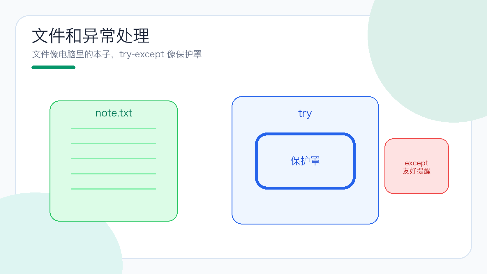

图示：文件像本子，异常处理像保护罩

#### 学习目标

- 孩子能说出：文件就是存在电脑里的记事本
- 孩子能做：用open()打开文件，用.read()读取内容
- 孩子能做：用try-except保护程序不让它崩溃

#### 低龄课堂设计

| 项目 | 内容 |
| --- | --- |
| 适合对象 | 7-8岁，一二年级，适合先讲故事再看代码 |
| 节奏安排 | 复习3分钟，生活演示8分钟，代码拆解10分钟，上机练习10分钟，收口3分钟 |
| 统一语言 | 本课统一使用“电脑本子和保护罩”作比喻，少说抽象术语，多说动作和结果 |

- 每页演示只抓一个核心点，孩子能复述就进入下一页。
- 右侧老师提示可以照读；主画面给孩子看，不要把备课说明读给孩子。
- 如果孩子卡住，回到生活动作，不要停留在术语解释上。

#### 课堂流程

| 时间 | 环节 | 老师做什么 | 学生做什么 |
| --- | --- | --- | --- |
| 0-5分钟 | 复习连接 | 前面程序大多只在屏幕上显示结果。 | 说出上一课的关键词，跟老师把旧知识接回来。 |
| 5-12分钟 | 本课故事 | 今天程序开始读写文件：文件像电脑里的本子；异常处理像保护罩。 | 回答本课开场问题，先用生活语言理解概念。 |
| 12-24分钟 | 代码拆解 | 展示关键代码：try: /     f = open("note.txt", "r") /     print(f.read()) / except: /     print("文件没找到")。带孩子逐行说出每个零件的作用。 | 指出关键符号、函数名或变量名，预测输出。 |
| 24-34分钟 | 互动演示 | 拿一本真实本子演示：打开、读、写、合上；再演示找不到本子时要说清楚原因。 | 用手势、纸条、黑板或口头预测完成一次非电脑演示。 |
| 34-42分钟 | 上机练习 | 让孩子照着模板完成学生端编程题，重点检查本课最容易错的地方。 | 运行代码，看到输出后再交卷。 |
| 42-45分钟 | 收口衔接 | r是读，w是写；try包住可能出错的地方，except处理错误。 下一课综合复习，把前面所有知识连成完整解题流程。 | 说出今天带走的一句话。 |

#### 老师话术

##### 1. 开场：先接上一课

前面程序大多只在屏幕上显示结果。 今天我们继续往前走：今天程序开始读写文件：文件像电脑里的本子；异常处理像保护罩。

检查点：孩子能说出上一课关键词。

##### 2. 讲新概念：使用“电脑本子和保护罩”比喻

把今天的新知识想成“电脑本子和保护罩”。先用生活例子讲明白，再看代码。

检查点：r是读，w是写；try包住可能出错的地方，except处理错误。

##### 3. 看代码：逐行翻译

不要让孩子整段背。老师逐行问：这一行先做什么？下一行又做什么？

检查点：孩子能说出代码执行顺序。

##### 4. 孩子出错：先定位一个坑

本课最常见的问题是：孩子容易忘记文件名要加引号；也容易不知道w会覆盖旧内容。

检查点：孩子知道先检查哪里。

#### 课堂演示稿

##### 演示 1：复习：上一课接到这一课

前面程序大多只在屏幕上显示结果。

课堂提问：请先说一句：上一课我们最重要学到了什么？

检查点：孩子能说出上一课的一个关键词。

老师提示：

- 你可以照着这样讲
  - 每节课开头先帮孩子把旧知识叫醒，不要直接进入新概念。
  - 前面程序大多只在屏幕上显示结果。
- 课堂操作
  - 请1位孩子回答上一课关键词。
  - 老师把孩子的话整理成一句清楚的话，再进入本课。
- 新手老师提醒
  - 如果孩子答不上来，不要停太久。你直接给出关键词，让孩子跟读一遍即可。

##### 演示 2：本课任务：文件操作与异常处理

今天程序开始读写文件：文件像电脑里的本子；异常处理像保护罩。

课堂提问：如果本子不存在，程序应该崩掉，还是友好提醒？

检查点：r是读，w是写；try包住可能出错的地方，except处理错误。

老师提示：

- 你可以照着这样讲
  - 前面程序大多只在屏幕上显示结果。
  - 今天程序开始读写文件：文件像电脑里的本子；异常处理像保护罩。
- 课堂操作
  - 拿一本真实本子演示：打开、读、写、合上；再演示找不到本子时要说清楚原因。
  - 让孩子先预测，再运行或揭晓答案。低龄孩子先说出来，再敲代码，会更稳。
- 容易卡住的地方
  - 孩子容易忘记文件名要加引号；也容易不知道w会覆盖旧内容。
  - 孩子回答错时先追问“你是怎么看出来的？”，再带回屏幕上的关键词或符号。
- 过渡
  - 下一课综合复习，把前面所有知识连成完整解题流程。

##### 演示 3：看代码：把代码拆成小零件

今天的关键词：电脑本子和保护罩

```python
try:
    f = open("note.txt", "r")
    print(f.read())
except:
    print("文件没找到")
```

课堂提问：你能找到今天最重要的符号或单词吗？

检查点：孩子能说出代码中的一个关键零件。

老师提示：

- 你可以照着这样讲
  - 我们不急着背整段代码，先把它拆成小零件。
  - 每个小零件都有自己的工作，找到它们，代码就不吓人了。
- 课堂操作
  - 先让孩子只看第一行，指出变量名、函数名或符号。
  - 再看第二行，让孩子预测电脑下一步会做什么。
  - 最后把每一行连成完整故事。
- 检查方式
  - 问孩子：这段代码先做什么？再做什么？最后输出什么？

##### 演示 4：互动：先动手，再敲代码

拿一本真实本子演示：打开、读、写、合上；再演示找不到本子时要说清楚原因。

课堂提问：如果本子不存在，程序应该崩掉，还是友好提醒？

检查点：孩子能把动作说成步骤。

老师提示：

- 你可以照着这样讲
  - 我们先不用电脑，用手、纸条或黑板把题目演一遍。
  - 演明白以后，再把动作翻译成代码。
- 课堂操作
  - 拿一本真实本子演示：打开、读、写、合上；再演示找不到本子时要说清楚原因。
  - 请孩子说出刚才动作里的顺序：第一步、第二步、第三步。
  - 把孩子说的话写成简短关键词。
- 低龄课堂提醒
  - 7-8岁孩子很需要身体动作和可见物品。先做动作，再看代码，理解会更顺。

##### 演示 5：避坑：最容易错在哪里？

孩子容易忘记文件名要加引号；也容易不知道w会覆盖旧内容。

课堂提问：如果这里出错，我们第一步检查什么？

检查点：孩子知道本课最常见的错误点。

老师提示：

- 你可以照着这样讲
  - 程序员不是不犯错，程序员是会检查错误。
  - 今天我们先记住最常见的一个坑。
- 带孩子检查
  - 孩子容易忘记文件名要加引号；也容易不知道w会覆盖旧内容。
  - 让孩子用手指屏幕上的关键位置，一起检查符号、顺序、括号或缩进。
- 鼓励话术
  - 写错不是失败，能找到错在哪里，就是程序员很厉害的能力。

##### 演示 6：收口：今天带走一句话

r是读，w是写；try包住可能出错的地方，except处理错误。

- 文件 = 电脑里的本子
- open(..., "r") = 读
- open(..., "w") = 写

课堂提问：请选一句你最记得的话读出来。

检查点：孩子能说出本课核心句。

老师提示：

- 收尾方式
  - 先全班齐读本页标题。
  - 请2-3位孩子各说一句自己记住的话。
  - 再切回学生练习，让孩子马上做一道题巩固。
- 衔接下一课
  - 下一课综合复习，把前面所有知识连成完整解题流程。

#### 概念讲解

##### 1. 文件是什么

文件就是存在电脑里的本子！有的是.txt记事本，有的是其他格式。文件里有内容，电脑可以读取和写入。

例子：

```python
f = open("note.txt", "r")   # 打开文件来读
content = f.read()
f.close()
```

图像化理解：一个文件夹，里面有纸和笔，可以读写内容

##### 2. open() 打开文件

open()就是打开文件！"r"是读，"w"是写。读的时候文件要存在，写的时候文件不存在会自动创建！

例子：

```python
f = open("note.txt", "r")   # 读模式
f = open("note.txt", "w")   # 写模式
```

图像化理解：一把钥匙开门，r是读（看里面有什么），w是写（往里面放东西）

##### 3. .read() 读内容

.read()就是翻开本子，把里面的字全部读出来！

例子：

```python
f = open("note.txt")
print(f.read())
f.close()
```

图像化理解：一个小精灵在翻书，把书里所有字都读出来

##### 4. .write() 写内容

.write()就是拿笔写字！会覆盖原来的内容。

例子：

```python
f = open("note.txt", "w")
f.write("Hello!")
f.close()
```

图像化理解：一个小精灵在写字，写完把笔放下（close）

##### 5. try-except 保护罩

try-except就像给程序穿保护罩。如果可能会出错，用这个罩住，错了也不会崩溃！

例子：

```python
try:
    x = int(input())
except:
    print("输入错误！")
```

图像化理解：一个透明保护罩，程序在里面工作，炸弹来了也不怕

#### 典型错误

##### 1. 写完文件忘记close()

错误写法：

```python
f.write("hi")   # 没关文件！
```

改正写法：

```python
f.write("hi")
f.close()   # 关掉才安全！
```

写完文件要close()，不然可能会丢失内容！

##### 2. 忘了写模式"r"或"w"

错误写法：

```python
open("file.txt")   # 可能报错！
```

改正写法：

```python
open("file.txt", "r")   指定模式
```

open要告诉电脑你要读还是写！r=读，w=写

#### 课堂实操：跟做练习：我的第一个文件程序

- 第一步：在电脑上创建一个test.txt，写几句话
- 第二步：用open("test.txt", "r")打开它
- 第三步：用.read()读取内容
- 第四步：用print()把内容显示出来

#### 教学提醒

建议先在电脑上创建一个.txt文件，用代码读取它！ 低龄课堂建议：孩子容易忘记文件名要加引号；也容易不知道w会覆盖旧内容。

#### 板书与课后沟通

板书建议：

- 文件 = 电脑里的本子
- open(..., "r") = 读
- open(..., "w") = 写
- read() = 读内容
- try-except = 程序保护罩

家长沟通：

今天孩子认识了文件读写和try-except。重点是理解：程序遇到错误也可以友好处理。

#### 学生练习

##### 1. open("a.txt", "r")里的"r"是什么意思？

A. read读
B. write写
C. run运行
D. return返回

答案：A. read读
分值：10
解析："r"=read，表示打开来读取内容！

##### 2. open("a.txt", "w")打开后写内容，会怎样？

A. 在后面加内容
B. 清空原来的内容再写
C. 报错
D. 什么都不做

答案：B. 清空原来的内容再写
分值：10
解析："w"模式会先清空原内容，再写入新内容！

##### 3. try-except是做什么用的？

A. 加速程序
B. 保护程序不让它崩溃
C. 关闭文件
D. 打开文件

答案：B. 保护程序不让它崩溃
分值：10
解析：try-except是保护罩，出错了程序也不会崩溃！

##### 4. .read()的作用是？

A. 写内容到文件
B. 读取文件内容
C. 关闭文件
D. 创建文件

答案：B. 读取文件内容
分值：10
解析：read就是读！把文件里的内容读出来～

#### 编程挑战：编程题：读到一句话

通关徽章：文件小管家

分值：50

我们先用input模拟“从文件读到的一句话”，方便自动检查。

程序会输入一行文字。
请统计里面有多少个「好」字，最后输出：
'好'字出现了X次

例如输入「今天天气真好」
输出「'好'字出现了1次」

提示：

```python
用.count()数一数有几个「好」字：

content = input()
count = content.count("好")
print("'好'字出现了" + str(count) + "次")

真实文件课里，content也可以来自f.read()。
```

起始代码：

```python
# 文件和异常：先模拟读到一句话

content = input()
count = content.count("好")

print("'好'字出现了" + str(count) + "次")
```

测试样例：

| 样例 | 输入 | 期望输出 |
| --- | --- | --- |
| 一个好 | 今天天气真好 | '好'字出现了1次 |
| 两个好 | 好好学习 | '好'字出现了2次 |

# 第6章 综合应用

## 第 13 课：算法综合应用

章节：第6章 综合应用
课型：主线课
难度：★★★★
考点：全部知识点回顾、综合应用、应试技巧

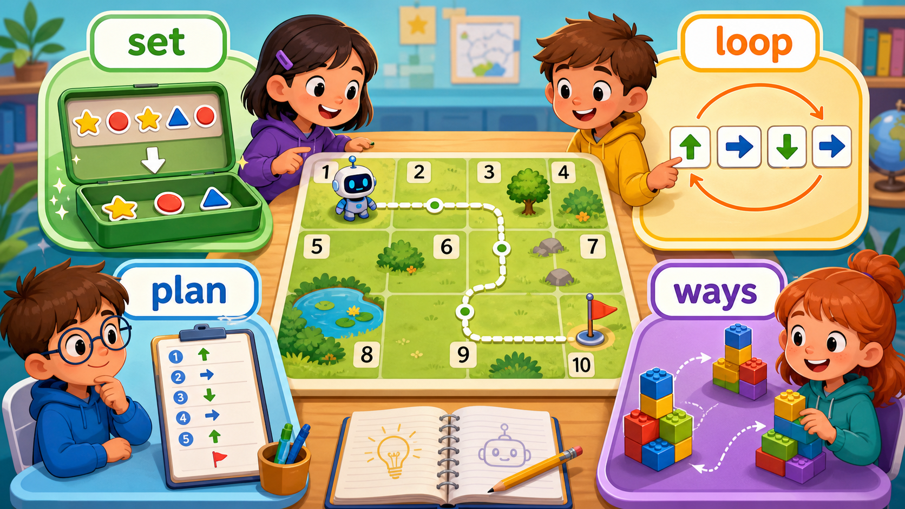

图示：综合挑战：把问题拆成步骤

#### 学习目标

- 孩子能回顾序章到第11课的四级主线知识点
- 孩子能说出应试技巧和常见错误
- 孩子能独立完成一道综合编程题

#### 低龄课堂设计

| 项目 | 内容 |
| --- | --- |
| 适合对象 | 7-8岁，一二年级，适合先讲故事再看代码 |
| 节奏安排 | 复习3分钟，生活演示8分钟，代码拆解10分钟，上机练习10分钟，收口3分钟 |
| 统一语言 | 本课统一使用“闯关地图”作比喻，少说抽象术语，多说动作和结果 |

- 每页演示只抓一个核心点，孩子能复述就进入下一页。
- 右侧老师提示可以照读；主画面给孩子看，不要把备课说明读给孩子。
- 如果孩子卡住，回到生活动作，不要停留在术语解释上。

#### 课堂流程

| 时间 | 环节 | 老师做什么 | 学生做什么 |
| --- | --- | --- | --- |
| 0-5分钟 | 复习连接 | 前面的主线课已经覆盖变量、类型、程序结构、函数、模块和文件。 | 说出上一课的关键词，跟老师把旧知识接回来。 |
| 5-12分钟 | 本课故事 | 今天不学新招式，而是学会把题目拆开，按步骤解决。 | 回答本课开场问题，先用生活语言理解概念。 |
| 12-24分钟 | 代码拆解 | 展示关键代码：name = input() / score = int(input()) / if score >= 60: /     print(name + "通过") / else: /     print(name + "加油")。带孩子逐行说出每个零件的作用。 | 指出关键符号、函数名或变量名，预测输出。 |
| 24-34分钟 | 互动演示 | 把一道综合题拆成三栏：输入什么、怎么处理、输出什么，让孩子先填表再写代码。 | 用手势、纸条、黑板或口头预测完成一次非电脑演示。 |
| 34-42分钟 | 上机练习 | 让孩子照着模板完成学生端编程题，重点检查本课最容易错的地方。 | 运行代码，看到输出后再交卷。 |
| 42-45分钟 | 收口衔接 | 综合题先读题，找输入、处理、输出，再写代码。 后面进入Turtle趣味拓展，用代码画图，继续练顺序、循环和函数思维。 | 说出今天带走的一句话。 |

#### 老师话术

##### 1. 开场：先接上一课

前面的主线课已经覆盖变量、类型、程序结构、函数、模块和文件。 今天我们继续往前走：今天不学新招式，而是学会把题目拆开，按步骤解决。

检查点：孩子能说出上一课关键词。

##### 2. 讲新概念：使用“闯关地图”比喻

把今天的新知识想成“闯关地图”。先用生活例子讲明白，再看代码。

检查点：综合题先读题，找输入、处理、输出，再写代码。

##### 3. 看代码：逐行翻译

不要让孩子整段背。老师逐行问：这一行先做什么？下一行又做什么？

检查点：孩子能说出代码执行顺序。

##### 4. 孩子出错：先定位一个坑

本课最常见的问题是：孩子会一看到题就敲代码；训练先画流程、再写代码。

检查点：孩子知道先检查哪里。

#### 课堂演示稿

##### 演示 1：复习：上一课接到这一课

前面的主线课已经覆盖变量、类型、程序结构、函数、模块和文件。

课堂提问：请先说一句：上一课我们最重要学到了什么？

检查点：孩子能说出上一课的一个关键词。

老师提示：

- 你可以照着这样讲
  - 每节课开头先帮孩子把旧知识叫醒，不要直接进入新概念。
  - 前面的主线课已经覆盖变量、类型、程序结构、函数、模块和文件。
- 课堂操作
  - 请1位孩子回答上一课关键词。
  - 老师把孩子的话整理成一句清楚的话，再进入本课。
- 新手老师提醒
  - 如果孩子答不上来，不要停太久。你直接给出关键词，让孩子跟读一遍即可。

##### 演示 2：本课任务：算法综合应用

今天不学新招式，而是学会把题目拆开，按步骤解决。

课堂提问：读题时，我们先找输入、处理，还是输出？

检查点：综合题先读题，找输入、处理、输出，再写代码。

老师提示：

- 你可以照着这样讲
  - 前面的主线课已经覆盖变量、类型、程序结构、函数、模块和文件。
  - 今天不学新招式，而是学会把题目拆开，按步骤解决。
- 课堂操作
  - 把一道综合题拆成三栏：输入什么、怎么处理、输出什么，让孩子先填表再写代码。
  - 让孩子先预测，再运行或揭晓答案。低龄孩子先说出来，再敲代码，会更稳。
- 容易卡住的地方
  - 孩子会一看到题就敲代码；训练先画流程、再写代码。
  - 孩子回答错时先追问“你是怎么看出来的？”，再带回屏幕上的关键词或符号。
- 过渡
  - 后面进入Turtle趣味拓展，用代码画图，继续练顺序、循环和函数思维。

##### 演示 3：看代码：把代码拆成小零件

今天的关键词：闯关地图

```python
name = input()
score = int(input())
if score >= 60:
    print(name + "通过")
else:
    print(name + "加油")
```

课堂提问：你能找到今天最重要的符号或单词吗？

检查点：孩子能说出代码中的一个关键零件。

老师提示：

- 你可以照着这样讲
  - 我们不急着背整段代码，先把它拆成小零件。
  - 每个小零件都有自己的工作，找到它们，代码就不吓人了。
- 课堂操作
  - 先让孩子只看第一行，指出变量名、函数名或符号。
  - 再看第二行，让孩子预测电脑下一步会做什么。
  - 最后把每一行连成完整故事。
- 检查方式
  - 问孩子：这段代码先做什么？再做什么？最后输出什么？

##### 演示 4：互动：先动手，再敲代码

把一道综合题拆成三栏：输入什么、怎么处理、输出什么，让孩子先填表再写代码。

课堂提问：读题时，我们先找输入、处理，还是输出？

检查点：孩子能把动作说成步骤。

老师提示：

- 你可以照着这样讲
  - 我们先不用电脑，用手、纸条或黑板把题目演一遍。
  - 演明白以后，再把动作翻译成代码。
- 课堂操作
  - 把一道综合题拆成三栏：输入什么、怎么处理、输出什么，让孩子先填表再写代码。
  - 请孩子说出刚才动作里的顺序：第一步、第二步、第三步。
  - 把孩子说的话写成简短关键词。
- 低龄课堂提醒
  - 7-8岁孩子很需要身体动作和可见物品。先做动作，再看代码，理解会更顺。

##### 演示 5：避坑：最容易错在哪里？

孩子会一看到题就敲代码；训练先画流程、再写代码。

课堂提问：如果这里出错，我们第一步检查什么？

检查点：孩子知道本课最常见的错误点。

老师提示：

- 你可以照着这样讲
  - 程序员不是不犯错，程序员是会检查错误。
  - 今天我们先记住最常见的一个坑。
- 带孩子检查
  - 孩子会一看到题就敲代码；训练先画流程、再写代码。
  - 让孩子用手指屏幕上的关键位置，一起检查符号、顺序、括号或缩进。
- 鼓励话术
  - 写错不是失败，能找到错在哪里，就是程序员很厉害的能力。

##### 演示 6：收口：今天带走一句话

综合题先读题，找输入、处理、输出，再写代码。

- 综合题三步：输入 -> 处理 -> 输出
- 先读题，不急着敲
- input通常要考虑是否int()

课堂提问：请选一句你最记得的话读出来。

检查点：孩子能说出本课核心句。

老师提示：

- 收尾方式
  - 先全班齐读本页标题。
  - 请2-3位孩子各说一句自己记住的话。
  - 再切回学生练习，让孩子马上做一道题巩固。
- 衔接下一课
  - 后面进入Turtle趣味拓展，用代码画图，继续练顺序、循环和函数思维。

#### 概念讲解

##### 1. 知识点大盘点

课时0认识Python和print；第1课认识Python安装和IDLE编辑器；第2课变量/input；第3课数据类型和运算符；第4课数字运算；第5课字符串；第6课顺序结构；第7课if选择；第8课for循环；第9课while循环；第10课函数；第11课作用域和模块；第12课文件和异常。

图像化理解：一个大地图，上面标记着0-13课的知识点宝藏

##### 2. 考试易错点提醒

1. 变量名不能数字开头  2. if/for后面要加冒号  3. ==是判断，=是赋值  4. range从0开始数  5. input()返回字符串，要计算先int()转换！

图像化理解：一个红色警告牌，上面写着各种易错点

#### 典型错误

##### 1. 考前最后提醒：一定要先读懂题再动手！

错误写法：

```python
不读题就开始写
```

改正写法：

```python
先读3遍题，想好用什么工具，再动手
```

磨刀不误砍柴工！

##### 2. 忘记把分数转成整数

错误写法：

```python
score = input()
if score >= 90:
```

改正写法：

```python
score = int(input())
if score >= 90:
```

input听到的是文字，和90比较前要先int()。

##### 3. if/elif顺序写反

错误写法：

```python
if score >= 60:
    grade = "C"
elif score >= 90:
    grade = "A"
```

改正写法：

```python
if score >= 90:
    grade = "A"
elif score >= 60:
    grade = "C"
```

分数等级要从高到低判断，否则95会先被>=60接走。

#### 课堂实操：最后的练习：全真模拟

- 第一步：限时10分钟，独立完成一道编程题
- 第二步：自己检查代码有没有低级错误
- 第三步：用示例输入运行验证
- 第四步：加油！你已经学会Python啦！

#### 教学提醒

建议做限时模拟题，训练考试节奏感！ 低龄课堂建议：孩子会一看到题就敲代码；训练先画流程、再写代码。

#### 板书与课后沟通

板书建议：

- 综合题三步：输入 -> 处理 -> 输出
- 先读题，不急着敲
- input通常要考虑是否int()
- if/for/函数看题目需要再使用
- 写完用测试数据检查

家长沟通：

今天孩子做综合复习。家长可以提醒孩子：先说清输入、处理、输出，再开始写代码。

#### 学生练习

##### 1. 以下哪一组最符合四级主线的学习顺序？

A. 变量和类型 -> 程序结构 -> 函数模块 -> 文件异常 -> 综合应用
B. 文件异常 -> print输出 -> 变量 -> 顺序结构
C. Turtle画图 -> 递归 -> set集合 -> print输出
D. 先背答案 -> 再读题 -> 最后猜输出

答案：A. 变量和类型 -> 程序结构 -> 函数模块 -> 文件异常 -> 综合应用
分值：10
解析：四级主线先打好变量和类型基础，再学习结构、函数模块、文件异常，最后做综合题。

##### 2. 综合题开始前，第一步最好做什么？

A. 先读题找输入和输出
B. 马上乱敲代码
C. 只看最后一行
D. 关闭编辑器

答案：A. 先读题找输入和输出
分值：10
解析：综合题先找输入、处理、输出，再写代码。

##### 3. score = input()后要比较分数，通常需要先做什么？

A. int(score)
B. upper(score)
C. break
D. import turtle

答案：A. int(score)
分值：10
解析：input得到的是字符串，要比较数字大小需要转成int。

##### 4. 判断等级时，为什么要先判断>=90？

A. 避免高分先被低等级条件接走
B. 因为90最小
C. 因为不能写60
D. 因为print只能写一次

答案：A. 避免高分先被低等级条件接走
分值：10
解析：如果先判断>=60，95也会满足，就拿不到A等。

#### 编程挑战：主线综合挑战：Python小冠军

通关徽章：Python小冠军

分值：100

欢迎来到四级主线综合关！

请写一个完整的程序：
输入你的姓名和你考试的分数（0-100），
程序会：
1. 判断等级（>=90:A, >=80:B, >=60:C, <60:D）
2. 输出「姓名：你考了XX分，获得X等！」

例如输入「明明」「95」
输出「明明：你考了95分，获得A等！」

提示：

```python
综合题需要用到input、变量、if-elif-else、print～

name = input()
score = int(input())
if score >= 90:
    grade = "A"
elif score >= 80:
    grade = "B"
elif score >= 60:
    grade = "C"
else:
    grade = "D"
print(name + "：你考了" + str(score) + "分，获得" + grade + "等！")
```

起始代码：

```python
# 综合应用：Python小冠军挑战

name = input()
score = int(input())

if score >= 90:
    grade = "A"
elif score >= 80:
    grade = "B"
elif score >= 60:
    grade = "C"
else:
    grade = "D"

print(name + "：你考了" + str(score) + "分，获得" + grade + "等！")
```

测试样例：

| 样例 | 输入 | 期望输出 |
| --- | --- | --- |
| A等生 | 明明<br>95 | 明明：你考了95分，获得A等！ |
| C等生 | 小红<br>70 | 小红：你考了70分，获得C等！ |

# Turtle趣味拓展

## 第 14 课：Turtle小画家

章节：Turtle趣味拓展
课型：拓展挑战
难度：★
考点：turtle画布、前进后退、左右转向

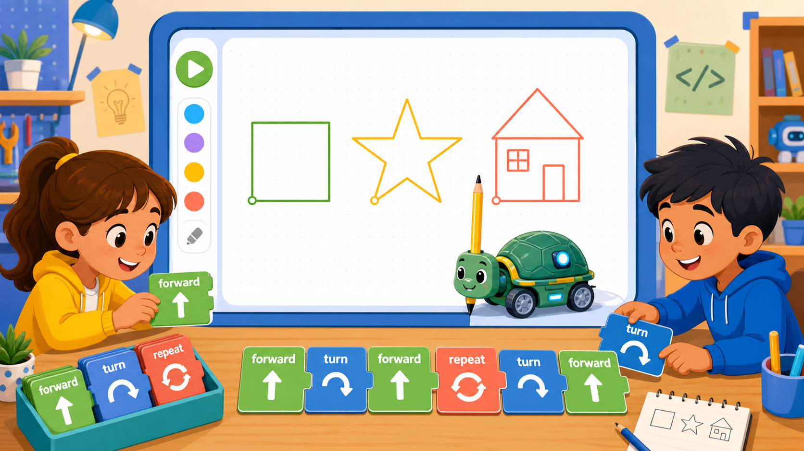

图示：Turtle 创作：把代码变成图画

#### 学习目标

- 孩子能说出：turtle是小海龟，能在画布上画画
- 孩子能写出：forward(100) 让海龟前进100步
- 孩子能写出：left(90) 让海龟左转90度
- 孩子能区分：前进会画线，转弯只改变方向

#### 低龄课堂设计

| 项目 | 内容 |
| --- | --- |
| 适合对象 | 7-8岁，一二年级，适合先讲故事再看代码 |
| 节奏安排 | 复习3分钟，生活演示8分钟，代码拆解10分钟，上机练习10分钟，收口3分钟 |
| 统一语言 | 本课统一使用“会走路的小画笔”作比喻，少说抽象术语，多说动作和结果 |

- 每页演示只抓一个核心点，孩子能复述就进入下一页。
- 右侧老师提示可以照读；主画面给孩子看，不要把备课说明读给孩子。
- 如果孩子卡住，回到生活动作，不要停留在术语解释上。

#### 课堂流程

| 时间 | 环节 | 老师做什么 | 学生做什么 |
| --- | --- | --- | --- |
| 0-5分钟 | 复习连接 | 主线课学会了让电脑输出文字和计算。 | 说出上一课的关键词，跟老师把旧知识接回来。 |
| 5-12分钟 | 本课故事 | Turtle让代码变成图画。小画笔走到哪里，就会留下线条。 | 回答本课开场问题，先用生活语言理解概念。 |
| 12-24分钟 | 代码拆解 | 展示关键代码：import turtle / t = turtle.Turtle() / t.forward(100) / t.left(90)。带孩子逐行说出每个零件的作用。 | 指出关键符号、函数名或变量名，预测输出。 |
| 24-34分钟 | 互动演示 | 让孩子站起来当小画笔：向前走几步，再左转。用身体理解方向。 | 用手势、纸条、黑板或口头预测完成一次非电脑演示。 |
| 34-42分钟 | 上机练习 | 让孩子照着模板完成学生端编程题，重点检查本课最容易错的地方。 | 运行代码，看到输出后再交卷。 |
| 42-45分钟 | 收口衔接 | forward前进，left/right转方向；画图也是顺序执行。 下一课用for循环画正方形，把循环知识用在画图里。 | 说出今天带走的一句话。 |

#### 老师话术

##### 1. 开场：先接上一课

主线课学会了让电脑输出文字和计算。 今天我们继续往前走：Turtle让代码变成图画。小画笔走到哪里，就会留下线条。

检查点：孩子能说出上一课关键词。

##### 2. 讲新概念：使用“会走路的小画笔”比喻

把今天的新知识想成“会走路的小画笔”。先用生活例子讲明白，再看代码。

检查点：forward前进，left/right转方向；画图也是顺序执行。

##### 3. 看代码：逐行翻译

不要让孩子整段背。老师逐行问：这一行先做什么？下一行又做什么？

检查点：孩子能说出代码执行顺序。

##### 4. 孩子出错：先定位一个坑

本课最常见的问题是：孩子以为left会画线；强调转弯只是换方向，forward才画线。

检查点：孩子知道先检查哪里。

#### 课堂演示稿

##### 演示 1：复习：上一课接到这一课

主线课学会了让电脑输出文字和计算。

课堂提问：请先说一句：上一课我们最重要学到了什么？

检查点：孩子能说出上一课的一个关键词。

老师提示：

- 你可以照着这样讲
  - 每节课开头先帮孩子把旧知识叫醒，不要直接进入新概念。
  - 主线课学会了让电脑输出文字和计算。
- 课堂操作
  - 请1位孩子回答上一课关键词。
  - 老师把孩子的话整理成一句清楚的话，再进入本课。
- 新手老师提醒
  - 如果孩子答不上来，不要停太久。你直接给出关键词，让孩子跟读一遍即可。

##### 演示 2：本课任务：Turtle小画家

Turtle让代码变成图画。小画笔走到哪里，就会留下线条。

课堂提问：小画笔向前走100步，再左转90度，会发生什么？

检查点：forward前进，left/right转方向；画图也是顺序执行。

老师提示：

- 你可以照着这样讲
  - 主线课学会了让电脑输出文字和计算。
  - Turtle让代码变成图画。小画笔走到哪里，就会留下线条。
- 课堂操作
  - 让孩子站起来当小画笔：向前走几步，再左转。用身体理解方向。
  - 让孩子先预测，再运行或揭晓答案。低龄孩子先说出来，再敲代码，会更稳。
- 容易卡住的地方
  - 孩子以为left会画线；强调转弯只是换方向，forward才画线。
  - 孩子回答错时先追问“你是怎么看出来的？”，再带回屏幕上的关键词或符号。
- 过渡
  - 下一课用for循环画正方形，把循环知识用在画图里。

##### 演示 3：看代码：把代码拆成小零件

今天的关键词：会走路的小画笔

```python
import turtle
t = turtle.Turtle()
t.forward(100)
t.left(90)
```

课堂提问：你能找到今天最重要的符号或单词吗？

检查点：孩子能说出代码中的一个关键零件。

老师提示：

- 你可以照着这样讲
  - 我们不急着背整段代码，先把它拆成小零件。
  - 每个小零件都有自己的工作，找到它们，代码就不吓人了。
- 课堂操作
  - 先让孩子只看第一行，指出变量名、函数名或符号。
  - 再看第二行，让孩子预测电脑下一步会做什么。
  - 最后把每一行连成完整故事。
- 检查方式
  - 问孩子：这段代码先做什么？再做什么？最后输出什么？

##### 演示 4：互动：先动手，再敲代码

让孩子站起来当小画笔：向前走几步，再左转。用身体理解方向。

课堂提问：小画笔向前走100步，再左转90度，会发生什么？

检查点：孩子能把动作说成步骤。

老师提示：

- 你可以照着这样讲
  - 我们先不用电脑，用手、纸条或黑板把题目演一遍。
  - 演明白以后，再把动作翻译成代码。
- 课堂操作
  - 让孩子站起来当小画笔：向前走几步，再左转。用身体理解方向。
  - 请孩子说出刚才动作里的顺序：第一步、第二步、第三步。
  - 把孩子说的话写成简短关键词。
- 低龄课堂提醒
  - 7-8岁孩子很需要身体动作和可见物品。先做动作，再看代码，理解会更顺。

##### 演示 5：避坑：最容易错在哪里？

孩子以为left会画线；强调转弯只是换方向，forward才画线。

课堂提问：如果这里出错，我们第一步检查什么？

检查点：孩子知道本课最常见的错误点。

老师提示：

- 你可以照着这样讲
  - 程序员不是不犯错，程序员是会检查错误。
  - 今天我们先记住最常见的一个坑。
- 带孩子检查
  - 孩子以为left会画线；强调转弯只是换方向，forward才画线。
  - 让孩子用手指屏幕上的关键位置，一起检查符号、顺序、括号或缩进。
- 鼓励话术
  - 写错不是失败，能找到错在哪里，就是程序员很厉害的能力。

##### 演示 6：收口：今天带走一句话

forward前进，left/right转方向；画图也是顺序执行。

- Turtle = 代码小画笔
- forward = 前进
- left/right = 转方向

课堂提问：请选一句你最记得的话读出来。

检查点：孩子能说出本课核心句。

老师提示：

- 收尾方式
  - 先全班齐读本页标题。
  - 请2-3位孩子各说一句自己记住的话。
  - 再切回学生练习，让孩子马上做一道题巩固。
- 衔接下一课
  - 下一课用for循环画正方形，把循环知识用在画图里。

#### 概念讲解

##### 1. Turtle是什么

Turtle是Python里的小海龟画笔。你让它走，它就在画布上留下轨迹。

例子：

```python
import turtle
t = turtle.Turtle()
t.forward(100)
```

老师可以这样说：小海龟不是动物园里的海龟，是一支会听代码的小画笔。

问孩子：小海龟听到forward会做什么？

##### 2. forward() 前进

forward就是前进。括号里的数字越大，线越长。

例子：

```python
t.forward(100)
t.forward(50)
```

老师可以这样说：100步比50步长，所以画出来的线也更长。

问孩子：forward(30)和forward(80)，哪条线更长？

##### 3. left() right() 转弯

left是左转，right是右转。转弯只改变方向，不会自己画线。

例子：

```python
t.forward(100)
t.left(90)
t.forward(100)
```

老师可以这样说：转弯像原地转身，下一次前进时方向才改变。

问孩子：left(90)会不会自己画出一条线？

#### 典型错误

##### 1. 忘记 import turtle

错误写法：

```python
t = Turtle()
```

改正写法：

```python
import turtle
t = turtle.Turtle()
```

用turtle要先导入，就像先打开画布工具箱。

##### 2. 把转弯当成画线

错误写法：

```python
t.left(90)  # 以为会画线
```

改正写法：

```python
t.left(90)
t.forward(100)
```

转弯只换方向，forward才会前进画线。

#### 课堂实操：跟做练习：画一条线

- 第一步：用身体演示前进和转弯
- 第二步：在黑板写出“前进100”指令
- 第三步：展示t.forward(100)
- 第四步：让孩子修改步数，观察线变长或变短

#### 教学提醒

让孩子先用身体当海龟：向前走、左转、右转。学生端先输出指令清单，教师端再演示真实turtle代码。 低龄课堂建议：孩子以为left会画线；强调转弯只是换方向，forward才画线。

#### 板书与课后沟通

板书建议：

- Turtle = 代码小画笔
- forward = 前进
- left/right = 转方向
- 先走再转，顺序很重要

家长沟通：

今天孩子认识Turtle画图。可以让孩子用身体演示：前进、左转、右转。

#### 学生练习

##### 1. 如何让小海龟左转90度？

A. t.left(90)
B. t.turn(90)
C. t.go_left(90)
D. t.left-turn(90)

答案：A. t.left(90)
分值：10
解析：用 t.left(角度) 就可以左转，right()是右转。

##### 2. t.forward(100)里的100表示什么？

A. 前进100步
B. 左转100度
C. 颜色编号
D. 重复100次

答案：A. 前进100步
分值：10
解析：forward括号里的数字表示前进多少步。

##### 3. 转弯指令left/right会自己画线吗？

A. 不会，只改变方向
B. 会，画一条线
C. 会，画星星
D. 会输出文字

答案：A. 不会，只改变方向
分值：10
解析：转弯只是换方向，真正画线要forward。

#### 编程挑战：第一道Turtle题：直线指令

通关徽章：小画家

分值：40

先写一张小海龟指令卡！

输入一个数字step，表示小海龟要前进多少步。
输出：前进step

例如输入：
100

输出：
前进100

提示：

```python
先读取步数，再输出指令：

step = int(input())
print(f"前进{step}")

真实turtle里可以换成：
t.forward(step)
```

起始代码：

```python
# Turtle小画家：直线指令

step = int(input())
print(f"前进{step}")
```

测试样例：

| 样例 | 输入 | 期望输出 |
| --- | --- | --- |
| 100步 | 100 | 前进100 |
| 60步 | 60 | 前进60 |

## 第 15 课：Turtle画正方形

章节：Turtle趣味拓展
课型：拓展挑战
难度：★★
考点：for循环画图、重复执行、角度计算

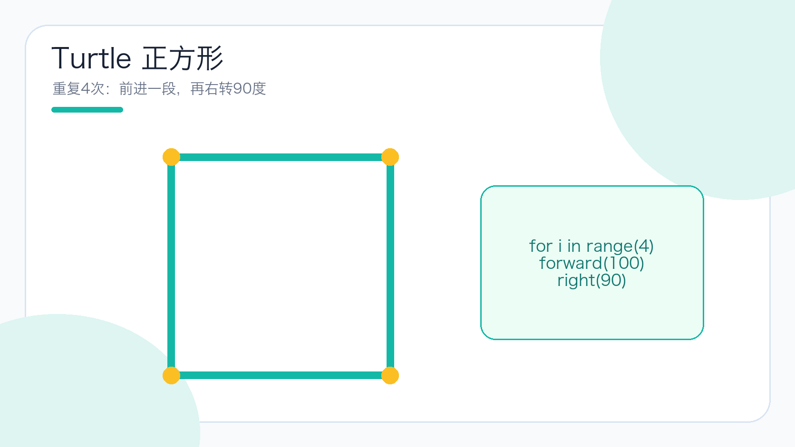

图示：Turtle 正方形：重复4次前进和转弯

#### 学习目标

- 孩子能用for循环让海龟重复走4次画正方形
- 孩子能说出：正方形每个角是90度，所以转90度
- 孩子能判断前进和转弯都要放进循环里面
- 孩子能先写正方形指令清单，再迁移到turtle代码

#### 低龄课堂设计

| 项目 | 内容 |
| --- | --- |
| 适合对象 | 7-8岁，一二年级，适合先讲故事再看代码 |
| 节奏安排 | 复习3分钟，生活演示8分钟，代码拆解10分钟，上机练习10分钟，收口3分钟 |
| 统一语言 | 本课统一使用“四条边的操场”作比喻，少说抽象术语，多说动作和结果 |

- 每页演示只抓一个核心点，孩子能复述就进入下一页。
- 右侧老师提示可以照读；主画面给孩子看，不要把备课说明读给孩子。
- 如果孩子卡住，回到生活动作，不要停留在术语解释上。

#### 课堂流程

| 时间 | 环节 | 老师做什么 | 学生做什么 |
| --- | --- | --- | --- |
| 0-5分钟 | 复习连接 | 第13课小画笔会前进和转弯。 | 说出上一课的关键词，跟老师把旧知识接回来。 |
| 5-12分钟 | 本课故事 | 正方形是4条边和4个90度角。重复“走一段、转90度”4次就画好了。 | 回答本课开场问题，先用生活语言理解概念。 |
| 12-24分钟 | 代码拆解 | 展示关键代码：for i in range(4): /     t.forward(100) /     t.right(90)。带孩子逐行说出每个零件的作用。 | 指出关键符号、函数名或变量名，预测输出。 |
| 24-34分钟 | 互动演示 | 让孩子用手在空中画四条边，每画一条边就转一次90度。 | 用手势、纸条、黑板或口头预测完成一次非电脑演示。 |
| 34-42分钟 | 上机练习 | 让孩子照着模板完成学生端编程题，重点检查本课最容易错的地方。 | 运行代码，看到输出后再交卷。 |
| 42-45分钟 | 收口衔接 | for循环负责重复4次；每次先走边，再转弯。 下一课画五角星，重复次数和转弯角度都会改变。 | 说出今天带走的一句话。 |

#### 老师话术

##### 1. 开场：先接上一课

第13课小画笔会前进和转弯。 今天我们继续往前走：正方形是4条边和4个90度角。重复“走一段、转90度”4次就画好了。

检查点：孩子能说出上一课关键词。

##### 2. 讲新概念：使用“四条边的操场”比喻

把今天的新知识想成“四条边的操场”。先用生活例子讲明白，再看代码。

检查点：for循环负责重复4次；每次先走边，再转弯。

##### 3. 看代码：逐行翻译

不要让孩子整段背。老师逐行问：这一行先做什么？下一行又做什么？

检查点：孩子能说出代码执行顺序。

##### 4. 孩子出错：先定位一个坑

本课最常见的问题是：孩子会把转弯写到循环外；强调走和转都要放在循环里面。

检查点：孩子知道先检查哪里。

#### 课堂演示稿

##### 演示 1：复习：上一课接到这一课

第13课小画笔会前进和转弯。

课堂提问：请先说一句：上一课我们最重要学到了什么？

检查点：孩子能说出上一课的一个关键词。

老师提示：

- 你可以照着这样讲
  - 每节课开头先帮孩子把旧知识叫醒，不要直接进入新概念。
  - 第13课小画笔会前进和转弯。
- 课堂操作
  - 请1位孩子回答上一课关键词。
  - 老师把孩子的话整理成一句清楚的话，再进入本课。
- 新手老师提醒
  - 如果孩子答不上来，不要停太久。你直接给出关键词，让孩子跟读一遍即可。

##### 演示 2：本课任务：Turtle画正方形

正方形是4条边和4个90度角。重复“走一段、转90度”4次就画好了。

课堂提问：画正方形要重复几次？每次转多少度？

检查点：for循环负责重复4次；每次先走边，再转弯。

老师提示：

- 你可以照着这样讲
  - 第13课小画笔会前进和转弯。
  - 正方形是4条边和4个90度角。重复“走一段、转90度”4次就画好了。
- 课堂操作
  - 让孩子用手在空中画四条边，每画一条边就转一次90度。
  - 让孩子先预测，再运行或揭晓答案。低龄孩子先说出来，再敲代码，会更稳。
- 容易卡住的地方
  - 孩子会把转弯写到循环外；强调走和转都要放在循环里面。
  - 孩子回答错时先追问“你是怎么看出来的？”，再带回屏幕上的关键词或符号。
- 过渡
  - 下一课画五角星，重复次数和转弯角度都会改变。

##### 演示 3：看代码：把代码拆成小零件

今天的关键词：四条边的操场

```python
for i in range(4):
    t.forward(100)
    t.right(90)
```

课堂提问：你能找到今天最重要的符号或单词吗？

检查点：孩子能说出代码中的一个关键零件。

老师提示：

- 你可以照着这样讲
  - 我们不急着背整段代码，先把它拆成小零件。
  - 每个小零件都有自己的工作，找到它们，代码就不吓人了。
- 课堂操作
  - 先让孩子只看第一行，指出变量名、函数名或符号。
  - 再看第二行，让孩子预测电脑下一步会做什么。
  - 最后把每一行连成完整故事。
- 检查方式
  - 问孩子：这段代码先做什么？再做什么？最后输出什么？

##### 演示 4：互动：先动手，再敲代码

让孩子用手在空中画四条边，每画一条边就转一次90度。

课堂提问：画正方形要重复几次？每次转多少度？

检查点：孩子能把动作说成步骤。

老师提示：

- 你可以照着这样讲
  - 我们先不用电脑，用手、纸条或黑板把题目演一遍。
  - 演明白以后，再把动作翻译成代码。
- 课堂操作
  - 让孩子用手在空中画四条边，每画一条边就转一次90度。
  - 请孩子说出刚才动作里的顺序：第一步、第二步、第三步。
  - 把孩子说的话写成简短关键词。
- 低龄课堂提醒
  - 7-8岁孩子很需要身体动作和可见物品。先做动作，再看代码，理解会更顺。

##### 演示 5：避坑：最容易错在哪里？

孩子会把转弯写到循环外；强调走和转都要放在循环里面。

课堂提问：如果这里出错，我们第一步检查什么？

检查点：孩子知道本课最常见的错误点。

老师提示：

- 你可以照着这样讲
  - 程序员不是不犯错，程序员是会检查错误。
  - 今天我们先记住最常见的一个坑。
- 带孩子检查
  - 孩子会把转弯写到循环外；强调走和转都要放在循环里面。
  - 让孩子用手指屏幕上的关键位置，一起检查符号、顺序、括号或缩进。
- 鼓励话术
  - 写错不是失败，能找到错在哪里，就是程序员很厉害的能力。

##### 演示 6：收口：今天带走一句话

for循环负责重复4次；每次先走边，再转弯。

- 正方形 = 4条边
- 每个角 = 90度
- 重复4次：走100，转90

课堂提问：请选一句你最记得的话读出来。

检查点：孩子能说出本课核心句。

老师提示：

- 收尾方式
  - 先全班齐读本页标题。
  - 请2-3位孩子各说一句自己记住的话。
  - 再切回学生练习，让孩子马上做一道题巩固。
- 衔接下一课
  - 下一课画五角星，重复次数和转弯角度都会改变。

#### 概念讲解

##### 1. 画正方形的秘诀

正方形有4条边，每条边一样长，每个角都是90度。

例子：

```python
走100 -> 转90度，重复4次
```

老师可以这样说：画正方形不是四行魔法，而是一个动作重复4次。

问孩子：正方形有几条边？

##### 2. for循环帮忙重复

for i in range(4)会让循环里的动作重复4次。

例子：

```python
for i in range(4):
    t.forward(100)
    t.left(90)
```

老师可以这样说：如果不用循环，就要把同样的两行动作写4遍。

问孩子：range(4)会重复几次？

##### 3. 循环里的两步

每一次循环都要先前进，再转弯。

例子：

```python
前进100
左转90
```

老师可以这样说：只前进不转弯会变成直线，只转一次也围不成方形。

问孩子：前进和转弯，哪一步可以放到循环外面？

#### 典型错误

##### 1. 转错角度

错误写法：

```python
t.left(45)
```

改正写法：

```python
t.left(90)
```

正方形每个角90度，转错角度就不是正方形了。

##### 2. 把转弯写到循环外面

错误写法：

```python
for i in range(4):
    t.forward(100)
t.left(90)
```

改正写法：

```python
for i in range(4):
    t.forward(100)
    t.left(90)
```

每画一条边都要转一次，所以转弯也要缩进到循环里。

#### 课堂实操：跟做练习：画正方形

- 第一步：说出正方形有4条边
- 第二步：用for i in range(4)重复4次
- 第三步：循环里前进side步
- 第四步：循环里左转90度
- 第五步：把指令清单换成turtle代码

#### 教学提醒

画之前先让孩子站起来走正方形：走一步，转90度，重复4次。 低龄课堂建议：孩子会把转弯写到循环外；强调走和转都要放在循环里面。

#### 板书与课后沟通

板书建议：

- 正方形 = 4条边
- 每个角 = 90度
- 重复4次：走100，转90
- for循环帮我们少写重复代码

家长沟通：

今天孩子用for循环画正方形。重点是理解：循环里同时包含前进和转弯。

#### 学生练习

##### 1. 画正方形，海龟需要转几次弯？

A. 3次
B. 4次
C. 5次
D. 6次

答案：B. 4次
分值：10
解析：正方形有4条边，所以要转4次弯。

##### 2. 正方形每次通常转多少度？

A. 90度
B. 144度
C. 45度
D. 180度

答案：A. 90度
分值：10
解析：正方形每个角是90度。

##### 3. for i in range(4)会重复几次？

A. 4次
B. 3次
C. 5次
D. 一直重复

答案：A. 4次
分值：10
解析：range(4)重复4次。

#### 编程挑战：编程题：正方形指令清单

通关徽章：方形画家

分值：50

输入一个边长side，输出画正方形的指令清单。

每次输出：
前进side
左转90

重复4次。

例如输入50，输出4组前进50和左转90。

提示：

```python
用for循环重复4次：

side = int(input())
for i in range(4):
    print(f"前进{side}")
    print("左转90")
```

起始代码：

```python
# Turtle画正方形：指令清单

side = int(input())

for i in range(4):
    print(f"前进{side}")
    print("左转90")
```

测试样例：

| 样例 | 输入 | 期望输出 |
| --- | --- | --- |
| 边长50 | 50 | 前进50<br>左转90<br>前进50<br>左转90<br>前进50<br>左转90<br>前进50<br>左转90 |
| 边长20 | 20 | 前进20<br>左转90<br>前进20<br>左转90<br>前进20<br>左转90<br>前进20<br>左转90 |

## 第 16 课：Turtle画五角星

章节：Turtle趣味拓展
课型：拓展挑战
难度：★★
考点：for循环、五角星角度、综合画图

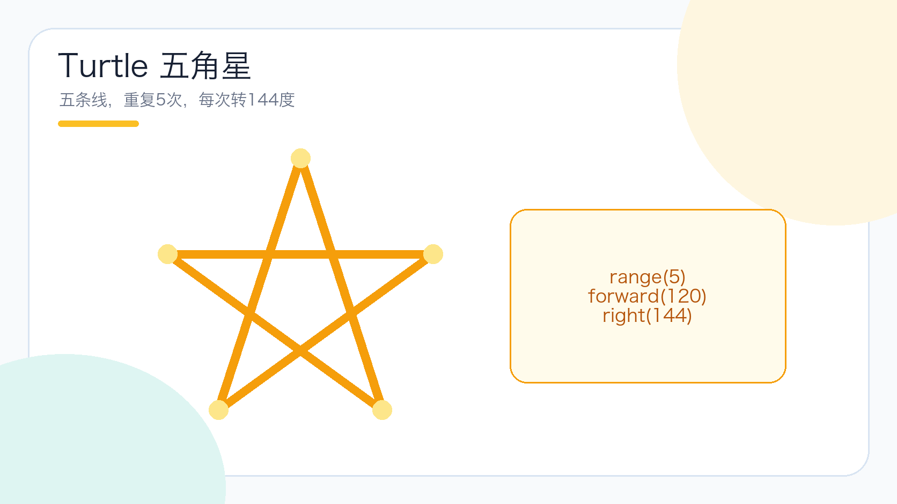

图示：Turtle 五角星：5条线和144度

#### 学习目标

- 孩子能说出：画五角星要转144度
- 孩子能用for循环重复5次画星星
- 孩子能区分：五角星144度，正方形90度
- 孩子能先写五角星指令清单，再迁移到turtle代码

#### 低龄课堂设计

| 项目 | 内容 |
| --- | --- |
| 适合对象 | 7-8岁，一二年级，适合先讲故事再看代码 |
| 节奏安排 | 复习3分钟，生活演示8分钟，代码拆解10分钟，上机练习10分钟，收口3分钟 |
| 统一语言 | 本课统一使用“星星路线图”作比喻，少说抽象术语，多说动作和结果 |

- 每页演示只抓一个核心点，孩子能复述就进入下一页。
- 右侧老师提示可以照读；主画面给孩子看，不要把备课说明读给孩子。
- 如果孩子卡住，回到生活动作，不要停留在术语解释上。

#### 课堂流程

| 时间 | 环节 | 老师做什么 | 学生做什么 |
| --- | --- | --- | --- |
| 0-5分钟 | 复习连接 | 第14课用循环画了正方形。 | 说出上一课的关键词，跟老师把旧知识接回来。 |
| 5-12分钟 | 本课故事 | 五角星也是重复画出来的：走一段，转144度，重复5次。 | 回答本课开场问题，先用生活语言理解概念。 |
| 12-24分钟 | 代码拆解 | 展示关键代码：for i in range(5): /     t.forward(120) /     t.right(144)。带孩子逐行说出每个零件的作用。 | 指出关键符号、函数名或变量名，预测输出。 |
| 24-34分钟 | 互动演示 | 先展示星星图，再让孩子数5条线。强调角度144可以先当作画星星的固定秘诀。 | 用手势、纸条、黑板或口头预测完成一次非电脑演示。 |
| 34-42分钟 | 上机练习 | 让孩子照着模板完成学生端编程题，重点检查本课最容易错的地方。 | 运行代码，看到输出后再交卷。 |
| 42-45分钟 | 收口衔接 | 五角星重复5次；转144度是画五角星的常用角度。 下一课做Turtle综合创作，把图形组合成房子。 | 说出今天带走的一句话。 |

#### 老师话术

##### 1. 开场：先接上一课

第14课用循环画了正方形。 今天我们继续往前走：五角星也是重复画出来的：走一段，转144度，重复5次。

检查点：孩子能说出上一课关键词。

##### 2. 讲新概念：使用“星星路线图”比喻

把今天的新知识想成“星星路线图”。先用生活例子讲明白，再看代码。

检查点：五角星重复5次；转144度是画五角星的常用角度。

##### 3. 看代码：逐行翻译

不要让孩子整段背。老师逐行问：这一行先做什么？下一行又做什么？

检查点：孩子能说出代码执行顺序。

##### 4. 孩子出错：先定位一个坑

本课最常见的问题是：孩子会把144改成90；对比正方形90、五角星144。

检查点：孩子知道先检查哪里。

#### 课堂演示稿

##### 演示 1：复习：上一课接到这一课

第14课用循环画了正方形。

课堂提问：请先说一句：上一课我们最重要学到了什么？

检查点：孩子能说出上一课的一个关键词。

老师提示：

- 你可以照着这样讲
  - 每节课开头先帮孩子把旧知识叫醒，不要直接进入新概念。
  - 第14课用循环画了正方形。
- 课堂操作
  - 请1位孩子回答上一课关键词。
  - 老师把孩子的话整理成一句清楚的话，再进入本课。
- 新手老师提醒
  - 如果孩子答不上来，不要停太久。你直接给出关键词，让孩子跟读一遍即可。

##### 演示 2：本课任务：Turtle画五角星

五角星也是重复画出来的：走一段，转144度，重复5次。

课堂提问：五角星要走几条线？每次转多少度？

检查点：五角星重复5次；转144度是画五角星的常用角度。

老师提示：

- 你可以照着这样讲
  - 第14课用循环画了正方形。
  - 五角星也是重复画出来的：走一段，转144度，重复5次。
- 课堂操作
  - 先展示星星图，再让孩子数5条线。强调角度144可以先当作画星星的固定秘诀。
  - 让孩子先预测，再运行或揭晓答案。低龄孩子先说出来，再敲代码，会更稳。
- 容易卡住的地方
  - 孩子会把144改成90；对比正方形90、五角星144。
  - 孩子回答错时先追问“你是怎么看出来的？”，再带回屏幕上的关键词或符号。
- 过渡
  - 下一课做Turtle综合创作，把图形组合成房子。

##### 演示 3：看代码：把代码拆成小零件

今天的关键词：星星路线图

```python
for i in range(5):
    t.forward(120)
    t.right(144)
```

课堂提问：你能找到今天最重要的符号或单词吗？

检查点：孩子能说出代码中的一个关键零件。

老师提示：

- 你可以照着这样讲
  - 我们不急着背整段代码，先把它拆成小零件。
  - 每个小零件都有自己的工作，找到它们，代码就不吓人了。
- 课堂操作
  - 先让孩子只看第一行，指出变量名、函数名或符号。
  - 再看第二行，让孩子预测电脑下一步会做什么。
  - 最后把每一行连成完整故事。
- 检查方式
  - 问孩子：这段代码先做什么？再做什么？最后输出什么？

##### 演示 4：互动：先动手，再敲代码

先展示星星图，再让孩子数5条线。强调角度144可以先当作画星星的固定秘诀。

课堂提问：五角星要走几条线？每次转多少度？

检查点：孩子能把动作说成步骤。

老师提示：

- 你可以照着这样讲
  - 我们先不用电脑，用手、纸条或黑板把题目演一遍。
  - 演明白以后，再把动作翻译成代码。
- 课堂操作
  - 先展示星星图，再让孩子数5条线。强调角度144可以先当作画星星的固定秘诀。
  - 请孩子说出刚才动作里的顺序：第一步、第二步、第三步。
  - 把孩子说的话写成简短关键词。
- 低龄课堂提醒
  - 7-8岁孩子很需要身体动作和可见物品。先做动作，再看代码，理解会更顺。

##### 演示 5：避坑：最容易错在哪里？

孩子会把144改成90；对比正方形90、五角星144。

课堂提问：如果这里出错，我们第一步检查什么？

检查点：孩子知道本课最常见的错误点。

老师提示：

- 你可以照着这样讲
  - 程序员不是不犯错，程序员是会检查错误。
  - 今天我们先记住最常见的一个坑。
- 带孩子检查
  - 孩子会把144改成90；对比正方形90、五角星144。
  - 让孩子用手指屏幕上的关键位置，一起检查符号、顺序、括号或缩进。
- 鼓励话术
  - 写错不是失败，能找到错在哪里，就是程序员很厉害的能力。

##### 演示 6：收口：今天带走一句话

五角星重复5次；转144度是画五角星的常用角度。

- 五角星 = 5条线
- 重复5次
- 每次前进，再右转144度

课堂提问：请选一句你最记得的话读出来。

检查点：孩子能说出本课核心句。

老师提示：

- 收尾方式
  - 先全班齐读本页标题。
  - 请2-3位孩子各说一句自己记住的话。
  - 再切回学生练习，让孩子马上做一道题巩固。
- 衔接下一课
  - 下一课做Turtle综合创作，把图形组合成房子。

#### 概念讲解

##### 1. 五角星的秘密

五角星需要走5条线，每走一条线就右转144度。

例子：

```python
前进100 -> 右转144，重复5次
```

老师可以这样说：144度先当作画五角星的小秘诀，不要求孩子推公式。

问孩子：五角星要走几条线？

##### 2. 重复5次

for i in range(5)会让海龟走5条线。

例子：

```python
for i in range(5):
    t.forward(100)
    t.right(144)
```

老师可以这样说：每一次循环画一条星星边，5次刚好连成五角星。

问孩子：range(5)会重复几次？

##### 3. 角度不同，图形不同

同样是重复前进和转弯，转角不同，图形就不同。

例子：

```python
正方形转90度，五角星转144度。
```

老师可以这样说：角度像方向盘，方向盘打得不同，路线就不同。

问孩子：把144改成90，还会是五角星吗？

#### 典型错误

##### 1. 转错角度画成五边形

错误写法：

```python
t.right(72)
```

改正写法：

```python
t.right(144)
```

五角星要转144度，转72度更像五边形路线。

##### 2. 重复次数写成4次

错误写法：

```python
for i in range(4):
```

改正写法：

```python
for i in range(5):
```

五角星有5条线，所以要重复5次。

#### 课堂实操：跟做练习：画五角星

- 第一步：数一数五角星有5条线
- 第二步：写for i in range(5)
- 第三步：循环里前进side步
- 第四步：循环里右转144度
- 第五步：把指令清单换成turtle代码

#### 教学提醒

让孩子先数五角星有几条线，再告诉他们144是这节课的“星星密码”。 低龄课堂建议：孩子会把144改成90；对比正方形90、五角星144。

#### 板书与课后沟通

板书建议：

- 五角星 = 5条线
- 重复5次
- 每次前进，再右转144度
- 不同图形有不同转角

家长沟通：

今天孩子用循环画五角星。可以问：正方形转90度，五角星这节课转多少度？

#### 学生练习

##### 1. 画五角星，每次要转多少度？

A. 72度
B. 108度
C. 144度
D. 180度

答案：C. 144度
分值：10
解析：五角星这节课记住144度。

##### 2. 画五角星要重复几次？

A. 5次
B. 4次
C. 3次
D. 10次

答案：A. 5次
分值：10
解析：五角星有5条线，所以重复5次。

##### 3. 正方形和五角星最明显的区别是什么？

A. 转角不同
B. 都不能用循环
C. 都只能画一条线
D. 都不用forward

答案：A. 转角不同
分值：10
解析：正方形常转90度，五角星转144度。

#### 编程挑战：编程题：五角星指令清单

通关徽章：星星画家

分值：60

输入一个边长side，输出画五角星的指令清单。

每次输出：
前进side
右转144

重复5次。

例如输入100，就输出5组前进100和右转144。

提示：

```python
用for循环重复5次：

side = int(input())
for i in range(5):
    print(f"前进{side}")
    print("右转144")
```

起始代码：

```python
# Turtle画五角星：指令清单

side = int(input())

for i in range(5):
    print(f"前进{side}")
    print("右转144")
```

测试样例：

| 样例 | 输入 | 期望输出 |
| --- | --- | --- |
| 边长100 | 100 | 前进100<br>右转144<br>前进100<br>右转144<br>前进100<br>右转144<br>前进100<br>右转144<br>前进100<br>右转144 |
| 边长60 | 60 | 前进60<br>右转144<br>前进60<br>右转144<br>前进60<br>右转144<br>前进60<br>右转144<br>前进60<br>右转144 |

## 第 17 课：Turtle综合创作

章节：Turtle趣味拓展
课型：拓展挑战
难度：★★★
考点：创意画图、综合运用、颜色填充


图示：Turtle 创作：把代码变成图画

#### 学习目标

- 孩子能独立创作：用turtle画一个房子或树
- 孩子能用不同的颜色和粗细画画
- 孩子能把复杂图形拆成墙、屋顶、门窗等小部分
- 孩子能理解penup/pendown可以帮助移动位置

#### 低龄课堂设计

| 项目 | 内容 |
| --- | --- |
| 适合对象 | 7-8岁，一二年级，适合先讲故事再看代码 |
| 节奏安排 | 复习3分钟，生活演示8分钟，代码拆解10分钟，上机练习10分钟，收口3分钟 |
| 统一语言 | 本课统一使用“积木搭房子”作比喻，少说抽象术语，多说动作和结果 |

- 每页演示只抓一个核心点，孩子能复述就进入下一页。
- 右侧老师提示可以照读；主画面给孩子看，不要把备课说明读给孩子。
- 如果孩子卡住，回到生活动作，不要停留在术语解释上。

#### 课堂流程

| 时间 | 环节 | 老师做什么 | 学生做什么 |
| --- | --- | --- | --- |
| 0-5分钟 | 复习连接 | 前面我们会画线、正方形和五角星。 | 说出上一课的关键词，跟老师把旧知识接回来。 |
| 5-12分钟 | 本课故事 | 综合创作就是把小图形组合起来。房子可以拆成墙、屋顶、门窗。 | 回答本课开场问题，先用生活语言理解概念。 |
| 12-24分钟 | 代码拆解 | 展示关键代码：t.pencolor("blue") / t.pensize(3) / # 先画墙，再画屋顶。带孩子逐行说出每个零件的作用。 | 指出关键符号、函数名或变量名，预测输出。 |
| 24-34分钟 | 互动演示 | 在黑板画房子，让孩子指出正方形墙、三角形屋顶、长方形门。 | 用手势、纸条、黑板或口头预测完成一次非电脑演示。 |
| 34-42分钟 | 上机练习 | 让孩子照着模板完成学生端编程题，重点检查本课最容易错的地方。 | 运行代码，看到输出后再交卷。 |
| 42-45分钟 | 收口衔接 | 复杂图形先拆小图形；画完一部分再移动到下一部分。 后面回到循环和函数，把“停下来、重复用、组合起来”讲得更细。 | 说出今天带走的一句话。 |

#### 老师话术

##### 1. 开场：先接上一课

前面我们会画线、正方形和五角星。 今天我们继续往前走：综合创作就是把小图形组合起来。房子可以拆成墙、屋顶、门窗。

检查点：孩子能说出上一课关键词。

##### 2. 讲新概念：使用“积木搭房子”比喻

把今天的新知识想成“积木搭房子”。先用生活例子讲明白，再看代码。

检查点：复杂图形先拆小图形；画完一部分再移动到下一部分。

##### 3. 看代码：逐行翻译

不要让孩子整段背。老师逐行问：这一行先做什么？下一行又做什么？

检查点：孩子能说出代码执行顺序。

##### 4. 孩子出错：先定位一个坑

本课最常见的问题是：孩子会想一次画完整个房子；引导先拆分再组合。

检查点：孩子知道先检查哪里。

#### 课堂演示稿

##### 演示 1：复习：上一课接到这一课

前面我们会画线、正方形和五角星。

课堂提问：请先说一句：上一课我们最重要学到了什么？

检查点：孩子能说出上一课的一个关键词。

老师提示：

- 你可以照着这样讲
  - 每节课开头先帮孩子把旧知识叫醒，不要直接进入新概念。
  - 前面我们会画线、正方形和五角星。
- 课堂操作
  - 请1位孩子回答上一课关键词。
  - 老师把孩子的话整理成一句清楚的话，再进入本课。
- 新手老师提醒
  - 如果孩子答不上来，不要停太久。你直接给出关键词，让孩子跟读一遍即可。

##### 演示 2：本课任务：Turtle综合创作

综合创作就是把小图形组合起来。房子可以拆成墙、屋顶、门窗。

课堂提问：一座房子可以拆成哪些小图形？

检查点：复杂图形先拆小图形；画完一部分再移动到下一部分。

老师提示：

- 你可以照着这样讲
  - 前面我们会画线、正方形和五角星。
  - 综合创作就是把小图形组合起来。房子可以拆成墙、屋顶、门窗。
- 课堂操作
  - 在黑板画房子，让孩子指出正方形墙、三角形屋顶、长方形门。
  - 让孩子先预测，再运行或揭晓答案。低龄孩子先说出来，再敲代码，会更稳。
- 容易卡住的地方
  - 孩子会想一次画完整个房子；引导先拆分再组合。
  - 孩子回答错时先追问“你是怎么看出来的？”，再带回屏幕上的关键词或符号。
- 过渡
  - 后面回到循环和函数，把“停下来、重复用、组合起来”讲得更细。

##### 演示 3：看代码：把代码拆成小零件

今天的关键词：积木搭房子

```python
t.pencolor("blue")
t.pensize(3)
# 先画墙，再画屋顶
```

课堂提问：你能找到今天最重要的符号或单词吗？

检查点：孩子能说出代码中的一个关键零件。

老师提示：

- 你可以照着这样讲
  - 我们不急着背整段代码，先把它拆成小零件。
  - 每个小零件都有自己的工作，找到它们，代码就不吓人了。
- 课堂操作
  - 先让孩子只看第一行，指出变量名、函数名或符号。
  - 再看第二行，让孩子预测电脑下一步会做什么。
  - 最后把每一行连成完整故事。
- 检查方式
  - 问孩子：这段代码先做什么？再做什么？最后输出什么？

##### 演示 4：互动：先动手，再敲代码

在黑板画房子，让孩子指出正方形墙、三角形屋顶、长方形门。

课堂提问：一座房子可以拆成哪些小图形？

检查点：孩子能把动作说成步骤。

老师提示：

- 你可以照着这样讲
  - 我们先不用电脑，用手、纸条或黑板把题目演一遍。
  - 演明白以后，再把动作翻译成代码。
- 课堂操作
  - 在黑板画房子，让孩子指出正方形墙、三角形屋顶、长方形门。
  - 请孩子说出刚才动作里的顺序：第一步、第二步、第三步。
  - 把孩子说的话写成简短关键词。
- 低龄课堂提醒
  - 7-8岁孩子很需要身体动作和可见物品。先做动作，再看代码，理解会更顺。

##### 演示 5：避坑：最容易错在哪里？

孩子会想一次画完整个房子；引导先拆分再组合。

课堂提问：如果这里出错，我们第一步检查什么？

检查点：孩子知道本课最常见的错误点。

老师提示：

- 你可以照着这样讲
  - 程序员不是不犯错，程序员是会检查错误。
  - 今天我们先记住最常见的一个坑。
- 带孩子检查
  - 孩子会想一次画完整个房子；引导先拆分再组合。
  - 让孩子用手指屏幕上的关键位置，一起检查符号、顺序、括号或缩进。
- 鼓励话术
  - 写错不是失败，能找到错在哪里，就是程序员很厉害的能力。

##### 演示 6：收口：今天带走一句话

复杂图形先拆小图形；画完一部分再移动到下一部分。

- 综合创作 = 拆小图形再组合
- 房子 = 墙 + 屋顶 + 门窗
- pencolor改颜色

课堂提问：请选一句你最记得的话读出来。

检查点：孩子能说出本课核心句。

老师提示：

- 收尾方式
  - 先全班齐读本页标题。
  - 请2-3位孩子各说一句自己记住的话。
  - 再切回学生练习，让孩子马上做一道题巩固。
- 衔接下一课
  - 后面回到循环和函数，把“停下来、重复用、组合起来”讲得更细。

#### 概念讲解

##### 1. 画房子

房子可以拆成正方形墙、三角形屋顶、长方形门和小窗户。

例子：

```python
墙：重复4次前进和左转
屋顶：重复3次前进和左转120度
```

老师可以这样说：复杂图形不是一口气画出来的，是像搭积木一样拼出来的。

问孩子：一座房子可以拆成哪些小图形？

##### 2. 颜色和粗细

pencolor改变线条颜色，pensize改变线条粗细。

例子：

```python
t.pencolor('red')
t.pensize(5)
```

老师可以这样说：颜色和粗细是装饰工具，让作品更像自己的。

问孩子：想让线变粗，应该用pencolor还是pensize？

##### 3. 抬笔换位置

penup抬起笔移动，pendown放下笔继续画。

例子：

```python
t.penup()
t.goto(0, 100)
t.pendown()
```

老师可以这样说：抬笔走路不会留下线，放下笔才继续画。

问孩子：如果移动位置不抬笔，会发生什么？

#### 典型错误

##### 1. 画完忘记抬笔换位置

错误写法：

```python
画完墙直接走到屋顶，路上留下乱线
```

改正写法：

```python
t.penup()
t.goto(0, 100)
t.pendown()
```

换位置前要抬笔，到了新位置再放笔。

##### 2. 想一次画完整个房子

错误写法：

```python
一边想墙，一边想屋顶，一边想门
```

改正写法：

```python
先画墙，再画屋顶，最后画门窗
```

综合创作要先拆小图形，再按顺序组合。

#### 课堂实操：跟做练习：画一个房子

- 第一步：把房子拆成墙、屋顶、门
- 第二步：画正方形的墙
- 第三步：抬笔移动到屋顶开始的位置
- 第四步：放笔画三角形屋顶
- 第五步：添加门和颜色

#### 教学提醒

鼓励孩子自由创作，但要先画草图。先说清楚“我先画什么，再画什么”，再写代码。 低龄课堂建议：孩子会想一次画完整个房子；引导先拆分再组合。

#### 板书与课后沟通

板书建议：

- 综合创作 = 拆小图形再组合
- 房子 = 墙 + 屋顶 + 门窗
- pencolor改颜色
- pensize改线条粗细
- penup/pendown帮助移动位置

家长沟通：

今天孩子做Turtle综合创作。重点不是画得多像，而是学会把大图形拆成小步骤。

#### 学生练习

##### 1. 要换位置画画，应该先？

A. 直接走
B. penup()然后走
C. 关掉画布
D. 倒着走

答案：B. penup()然后走
分值：10
解析：先penup()抬笔，移动后再pendown()放笔。

##### 2. 复杂图形最好怎么画？

A. 拆成小图形一步步画
B. 一口气乱画
C. 只写一行代码
D. 不需要顺序

答案：A. 拆成小图形一步步画
分值：10
解析：先拆小图形，再组合，最适合低龄孩子理解。

##### 3. pensize(5)可以做什么？

A. 让线条变粗
B. 让小海龟停止
C. 把字母变小写
D. 读取输入

答案：A. 让线条变粗
分值：10
解析：pensize控制画笔粗细。

#### 编程挑战：综合创作：房子步骤清单

通关徽章：建筑大师

分值：70

先写出画房子的步骤清单。

程序会输入门的颜色color。
请输出：
画正方形墙
移动到屋顶
画三角形屋顶
画color门

例如输入：
红色

输出：
画正方形墙
移动到屋顶
画三角形屋顶
画红色门

提示：

```python
先输入颜色，再按顺序输出4步：

color = input()
print("画正方形墙")
print("移动到屋顶")
print("画三角形屋顶")
print("画" + color + "门")
```

起始代码：

```python
# Turtle综合创作：房子步骤清单

color = input()

print("画正方形墙")
print("移动到屋顶")
print("画三角形屋顶")
print("画" + color + "门")
```

测试样例：

| 样例 | 输入 | 期望输出 |
| --- | --- | --- |
| 红色门 | 红色 | 画正方形墙<br>移动到屋顶<br>画三角形屋顶<br>画红色门 |
| 蓝色门 | 蓝色 | 画正方形墙<br>移动到屋顶<br>画三角形屋顶<br>画蓝色门 |

# 循环进阶与小游戏

## 第 18 课：打破无尽的重复

章节：循环进阶与小游戏
课型：拓展挑战
难度：★★
考点：while循环、break退出、累加器、哨兵值

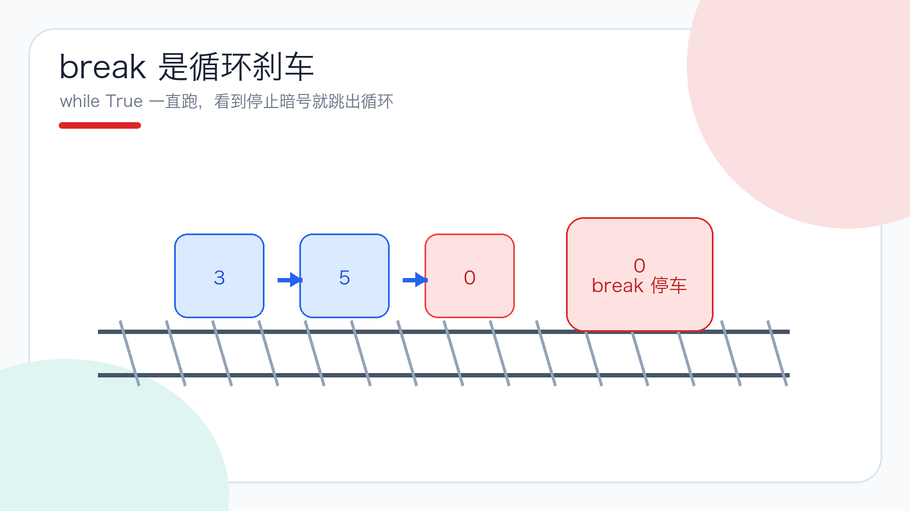

图示：break 是循环刹车

#### 学习目标

- 孩子能说出：while True会一直重复，需要停止暗号
- 孩子能看懂：break像刹车，能立刻跳出循环
- 孩子能使用一个变量total不断累加输入的数字
- 孩子能理解：0可以当作“停止输入”的暗号
- 孩子能按输入、判断、累加、输出四步完成循环题

#### 低龄课堂设计

| 项目 | 内容 |
| --- | --- |
| 适合对象 | 7-8岁，一二年级，适合先讲故事再看代码 |
| 节奏安排 | 复习3分钟，生活演示8分钟，代码拆解10分钟，上机练习10分钟，收口3分钟 |
| 统一语言 | 本课统一使用“小火车刹车”作比喻，少说抽象术语，多说动作和结果 |

- 每页演示只抓一个核心点，孩子能复述就进入下一页。
- 右侧老师提示可以照读；主画面给孩子看，不要把备课说明读给孩子。
- 如果孩子卡住，回到生活动作，不要停留在术语解释上。

#### 课堂流程

| 时间 | 环节 | 老师做什么 | 学生做什么 |
| --- | --- | --- | --- |
| 0-5分钟 | 复习连接 | 前面学过while会一直重复，也知道循环里必须有变化。 | 说出上一课的关键词，跟老师把旧知识接回来。 |
| 5-12分钟 | 本课故事 | 今天专门学习怎么让循环停下来：给程序一个停止暗号，看到暗号就break。 | 回答本课开场问题，先用生活语言理解概念。 |
| 12-24分钟 | 代码拆解 | 展示关键代码：total = 0 / while True: /     candy = int(input()) /     if candy == 0: /         break /     total += candy。带孩子逐行说出每个零件的作用。 | 指出关键符号、函数名或变量名，预测输出。 |
| 24-34分钟 | 互动演示 | 让孩子当糖果记录员。老师报3、5、0，孩子听到普通数字就累加，听到0就举手喊停。 | 用手势、纸条、黑板或口头预测完成一次非电脑演示。 |
| 34-42分钟 | 上机练习 | 让孩子照着模板完成学生端编程题，重点检查本课最容易错的地方。 | 运行代码，看到输出后再交卷。 |
| 42-45分钟 | 收口衔接 | while True需要停止暗号；break像刹车，能跳出循环。 下一课进入函数：把一组步骤装成可以重复使用的小工厂。 | 说出今天带走的一句话。 |

#### 老师话术

##### 1. 开场：先接上一课

前面学过while会一直重复，也知道循环里必须有变化。 今天我们继续往前走：今天专门学习怎么让循环停下来：给程序一个停止暗号，看到暗号就break。

检查点：孩子能说出上一课关键词。

##### 2. 讲新概念：使用“小火车刹车”比喻

把今天的新知识想成“小火车刹车”。先用生活例子讲明白，再看代码。

检查点：while True需要停止暗号；break像刹车，能跳出循环。

##### 3. 看代码：逐行翻译

不要让孩子整段背。老师逐行问：这一行先做什么？下一行又做什么？

检查点：孩子能说出代码执行顺序。

##### 4. 孩子出错：先定位一个坑

本课最常见的问题是：孩子会写了if candy == 0却忘记break，导致循环没有真正停下。

检查点：孩子知道先检查哪里。

#### 课堂演示稿

##### 演示 1：复习：上一课接到这一课

前面学过while会一直重复，也知道循环里必须有变化。

课堂提问：请先说一句：上一课我们最重要学到了什么？

检查点：孩子能说出上一课的一个关键词。

老师提示：

- 你可以照着这样讲
  - 每节课开头先帮孩子把旧知识叫醒，不要直接进入新概念。
  - 前面学过while会一直重复，也知道循环里必须有变化。
- 课堂操作
  - 请1位孩子回答上一课关键词。
  - 老师把孩子的话整理成一句清楚的话，再进入本课。
- 新手老师提醒
  - 如果孩子答不上来，不要停太久。你直接给出关键词，让孩子跟读一遍即可。

##### 演示 2：本课任务：打破无尽的重复

今天专门学习怎么让循环停下来：给程序一个停止暗号，看到暗号就break。

课堂提问：如果输入3、5、0，程序应该什么时候停？最后总数是多少？

检查点：while True需要停止暗号；break像刹车，能跳出循环。

老师提示：

- 你可以照着这样讲
  - 前面学过while会一直重复，也知道循环里必须有变化。
  - 今天专门学习怎么让循环停下来：给程序一个停止暗号，看到暗号就break。
- 课堂操作
  - 让孩子当糖果记录员。老师报3、5、0，孩子听到普通数字就累加，听到0就举手喊停。
  - 让孩子先预测，再运行或揭晓答案。低龄孩子先说出来，再敲代码，会更稳。
- 容易卡住的地方
  - 孩子会写了if candy == 0却忘记break，导致循环没有真正停下。
  - 孩子回答错时先追问“你是怎么看出来的？”，再带回屏幕上的关键词或符号。
- 过渡
  - 下一课进入函数：把一组步骤装成可以重复使用的小工厂。

##### 演示 3：看代码：把代码拆成小零件

今天的关键词：小火车刹车

```python
total = 0
while True:
    candy = int(input())
    if candy == 0:
        break
    total += candy
```

课堂提问：你能找到今天最重要的符号或单词吗？

检查点：孩子能说出代码中的一个关键零件。

老师提示：

- 你可以照着这样讲
  - 我们不急着背整段代码，先把它拆成小零件。
  - 每个小零件都有自己的工作，找到它们，代码就不吓人了。
- 课堂操作
  - 先让孩子只看第一行，指出变量名、函数名或符号。
  - 再看第二行，让孩子预测电脑下一步会做什么。
  - 最后把每一行连成完整故事。
- 检查方式
  - 问孩子：这段代码先做什么？再做什么？最后输出什么？

##### 演示 4：互动：先动手，再敲代码

让孩子当糖果记录员。老师报3、5、0，孩子听到普通数字就累加，听到0就举手喊停。

课堂提问：如果输入3、5、0，程序应该什么时候停？最后总数是多少？

检查点：孩子能把动作说成步骤。

老师提示：

- 你可以照着这样讲
  - 我们先不用电脑，用手、纸条或黑板把题目演一遍。
  - 演明白以后，再把动作翻译成代码。
- 课堂操作
  - 让孩子当糖果记录员。老师报3、5、0，孩子听到普通数字就累加，听到0就举手喊停。
  - 请孩子说出刚才动作里的顺序：第一步、第二步、第三步。
  - 把孩子说的话写成简短关键词。
- 低龄课堂提醒
  - 7-8岁孩子很需要身体动作和可见物品。先做动作，再看代码，理解会更顺。

##### 演示 5：避坑：最容易错在哪里？

孩子会写了if candy == 0却忘记break，导致循环没有真正停下。

课堂提问：如果这里出错，我们第一步检查什么？

检查点：孩子知道本课最常见的错误点。

老师提示：

- 你可以照着这样讲
  - 程序员不是不犯错，程序员是会检查错误。
  - 今天我们先记住最常见的一个坑。
- 带孩子检查
  - 孩子会写了if candy == 0却忘记break，导致循环没有真正停下。
  - 让孩子用手指屏幕上的关键位置，一起检查符号、顺序、括号或缩进。
- 鼓励话术
  - 写错不是失败，能找到错在哪里，就是程序员很厉害的能力。

##### 演示 6：收口：今天带走一句话

while True需要停止暗号；break像刹车，能跳出循环。

- while True = 一直重复
- 0 = 停止暗号
- break = 循环刹车

课堂提问：请选一句你最记得的话读出来。

检查点：孩子能说出本课核心句。

老师提示：

- 收尾方式
  - 先全班齐读本页标题。
  - 请2-3位孩子各说一句自己记住的话。
  - 再切回学生练习，让孩子马上做一道题巩固。
- 衔接下一课
  - 下一课进入函数：把一组步骤装成可以重复使用的小工厂。

#### 概念讲解

##### 1. 无尽的重复

while True会让电脑一直做同一件事，直到我们主动喊停。

例子：

```python
while True:
    print("继续")
```

老师可以这样说：这像一列不会自己停的小火车，所以我们要给它一个刹车。

问孩子：如果小火车一直往前开，需要什么东西让它停下来？

##### 2. break 刹车

break会让程序马上跳出当前循环。

例子：

```python
if number == 0:
    break
```

老师可以这样说：看到停止暗号0，就踩刹车，不再继续问下一次。

问孩子：break出现后，还会继续执行循环里的下一轮吗？

##### 3. 哨兵值

哨兵值是一个特殊输入，用来告诉程序：到这里停下。

例子：

```python
0表示不再输入糖果数量。
```

老师可以这样说：0不是糖果数量，它是门口的小哨兵，告诉程序该收工了。

问孩子：为什么这里输入0不是加0颗糖，而是停止？

##### 4. 累加器 total

累加器负责把每一次得到的数字加到一起。

例子：

```python
total = total + candy
```

老师可以这样说：total像一个总篮子，每来一把糖就倒进去。

问孩子：如果先来3颗，又来5颗，total最后是多少？

##### 5. 循环里的顺序

先输入，再判断是否停止，没停止才累加。

例子：

```python
candy = int(input())
if candy == 0:
    break
total += candy
```

老师可以这样说：顺序不能反。如果先加再判断，0虽然不影响总数，但孩子会误以为停止暗号也要参与计算。

问孩子：我们应该先判断0，还是先把它放进篮子？

#### 典型错误

##### 1. 忘记写break，循环停不下来

错误写法：

```python
while True:
    candy = int(input())
    if candy == 0:
        print(total)
```

改正写法：

```python
while True:
    candy = int(input())
    if candy == 0:
        break
```

判断到0以后，要用break真正跳出循环。

##### 2. 忘记把输入转成整数

错误写法：

```python
candy = input()
total = total + candy
```

改正写法：

```python
candy = int(input())
total = total + candy
```

input听到的是文字，做加法前要用int()变成数字。

##### 3. 每次循环都把total重新变成0

错误写法：

```python
while True:
    total = 0
    candy = int(input())
    total += candy
```

改正写法：

```python
total = 0
while True:
    candy = int(input())
    total += candy
```

总篮子要放在循环外面，只准备一次。

#### 课堂实操：停止暗号小游戏

- 老师连续说几个糖果数量，比如3、5、2、0
- 孩子听到普通数字就把它加进总数
- 孩子听到0就举手喊“停”
- 最后把动作翻译成while True、if、break和total

#### 教学提醒

这一课用“小火车刹车”和“糖果总篮子”讲，不要先讲抽象的无限循环。先让孩子演一次：老师不断报数字，孩子听到0就喊停。 低龄课堂建议：孩子会写了if candy == 0却忘记break，导致循环没有真正停下。

#### 板书与课后沟通

板书建议：

- while True = 一直重复
- 0 = 停止暗号
- break = 循环刹车
- total = 总篮子
- 先判断是否停止，再累加

家长沟通：

今天孩子学习用break打破无尽重复。家长可以问：为什么输入0时不是继续加，而是停止？

#### 学生练习

##### 1. while True最像什么？

A. 一直重复的小火车
B. 只做一次的按钮
C. 一段普通文字
D. 一个变量盒子

答案：A. 一直重复的小火车
分值：10
解析：while True会一直重复，所以要准备停止办法。

##### 2. 在循环里，break的作用是什么？

A. 让循环马上停下
B. 让数字变大
C. 显示文字
D. 把文字变大写

答案：A. 让循环马上停下
分值：10
解析：break像刹车，会跳出循环。

##### 3. 本课里输入0表示什么？

A. 停止输入
B. 加0颗糖后继续
C. 输入错了
D. 输出0

答案：A. 停止输入
分值：10
解析：0是停止暗号，也叫哨兵值。

##### 4. total = total + candy是在做什么？

A. 把新糖果加进总数
B. 清空总数
C. 判断是否停止
D. 创建字符串

答案：A. 把新糖果加进总数
分值：10
解析：total是总篮子，每次把新的candy加进去。

#### 编程挑战：收糖果，听到0就停

通关徽章：循环刹车手

分值：60

糖果收集员来了！

程序会不断收到一个数字，表示这次收到了几颗糖。
如果输入的是0，表示收集结束。
请输出一共收集了多少颗糖。

例如输入：
3
5
0

输出：
一共收集8颗糖

提示：

```python
先准备总篮子total，再用while True一直听输入。
听到0就break，没听到0就累加：

total = 0
while True:
    candy = int(input())
    if candy == 0:
        break
    total += candy
print(f"一共收集{total}颗糖")
```

起始代码：

```python
# 打破无尽的重复：收糖果
# 输入多个数字，0表示停止

total = 0

while True:
    candy = int(input())
    if candy == 0:
        break
    total += candy

print(f"一共收集{total}颗糖")
```

测试样例：

| 样例 | 输入 | 期望输出 |
| --- | --- | --- |
| 3颗和5颗 | 3<br>5<br>0 | 一共收集8颗糖 |
| 1颗、2颗、3颗 | 1<br>2<br>3<br>0 | 一共收集6颗糖 |
| 马上停止 | 0 | 一共收集0颗糖 |

# 函数小工厂

## 第 19 课：初识函数

章节：函数小工厂
课型：拓展挑战
难度：★★
考点：def定义函数、函数调用、参数、缩进


图示：函数工厂与模块工具箱

#### 学习目标

- 孩子能说出：函数像可以反复使用的小工厂
- 孩子能看懂：def是在建函数，不是立刻运行
- 孩子能说出：函数名加括号才是调用函数
- 孩子能理解：参数像放进工厂的原料
- 孩子能写出一个带名字参数的问好函数

#### 低龄课堂设计

| 项目 | 内容 |
| --- | --- |
| 适合对象 | 7-8岁，一二年级，适合先讲故事再看代码 |
| 节奏安排 | 复习3分钟，生活演示8分钟，代码拆解10分钟，上机练习10分钟，收口3分钟 |
| 统一语言 | 本课统一使用“函数小工厂”作比喻，少说抽象术语，多说动作和结果 |

- 每页演示只抓一个核心点，孩子能复述就进入下一页。
- 右侧老师提示可以照读；主画面给孩子看，不要把备课说明读给孩子。
- 如果孩子卡住，回到生活动作，不要停留在术语解释上。

#### 课堂流程

| 时间 | 环节 | 老师做什么 | 学生做什么 |
| --- | --- | --- | --- |
| 0-5分钟 | 复习连接 | 上一课我们学会了让循环在合适的时候停下来。 | 说出上一课的关键词，跟老师把旧知识接回来。 |
| 5-12分钟 | 本课故事 | 今天把几行常用代码装进函数小工厂。工厂建好后，调用它才会开始工作。 | 回答本课开场问题，先用生活语言理解概念。 |
| 12-24分钟 | 代码拆解 | 展示关键代码：def say_hello(name): /     print("你好，" + name) /  / say_hello("小明")。带孩子逐行说出每个零件的作用。 | 指出关键符号、函数名或变量名，预测输出。 |
| 24-34分钟 | 互动演示 | 画一个工厂，入口写name，里面写print。先放入“小明”卡片，再按say_hello("小明")按钮。 | 用手势、纸条、黑板或口头预测完成一次非电脑演示。 |
| 34-42分钟 | 上机练习 | 让孩子照着模板完成学生端编程题，重点检查本课最容易错的地方。 | 运行代码，看到输出后再交卷。 |
| 42-45分钟 | 收口衔接 | def是定义函数；函数名加括号才是调用函数。 下一课继续用函数做问答卡，认识return把结果交回来。 | 说出今天带走的一句话。 |

#### 老师话术

##### 1. 开场：先接上一课

上一课我们学会了让循环在合适的时候停下来。 今天我们继续往前走：今天把几行常用代码装进函数小工厂。工厂建好后，调用它才会开始工作。

检查点：孩子能说出上一课关键词。

##### 2. 讲新概念：使用“函数小工厂”比喻

把今天的新知识想成“函数小工厂”。先用生活例子讲明白，再看代码。

检查点：def是定义函数；函数名加括号才是调用函数。

##### 3. 看代码：逐行翻译

不要让孩子整段背。老师逐行问：这一行先做什么？下一行又做什么？

检查点：孩子能说出代码执行顺序。

##### 4. 孩子出错：先定位一个坑

本课最常见的问题是：孩子会定义函数但忘记调用，或函数里面的代码没有缩进。

检查点：孩子知道先检查哪里。

#### 课堂演示稿

##### 演示 1：复习：上一课接到这一课

上一课我们学会了让循环在合适的时候停下来。

课堂提问：请先说一句：上一课我们最重要学到了什么？

检查点：孩子能说出上一课的一个关键词。

老师提示：

- 你可以照着这样讲
  - 每节课开头先帮孩子把旧知识叫醒，不要直接进入新概念。
  - 上一课我们学会了让循环在合适的时候停下来。
- 课堂操作
  - 请1位孩子回答上一课关键词。
  - 老师把孩子的话整理成一句清楚的话，再进入本课。
- 新手老师提醒
  - 如果孩子答不上来，不要停太久。你直接给出关键词，让孩子跟读一遍即可。

##### 演示 2：本课任务：初识函数

今天把几行常用代码装进函数小工厂。工厂建好后，调用它才会开始工作。

课堂提问：def是在建工厂，还是已经让工厂开工？

检查点：def是定义函数；函数名加括号才是调用函数。

老师提示：

- 你可以照着这样讲
  - 上一课我们学会了让循环在合适的时候停下来。
  - 今天把几行常用代码装进函数小工厂。工厂建好后，调用它才会开始工作。
- 课堂操作
  - 画一个工厂，入口写name，里面写print。先放入“小明”卡片，再按say_hello("小明")按钮。
  - 让孩子先预测，再运行或揭晓答案。低龄孩子先说出来，再敲代码，会更稳。
- 容易卡住的地方
  - 孩子会定义函数但忘记调用，或函数里面的代码没有缩进。
  - 孩子回答错时先追问“你是怎么看出来的？”，再带回屏幕上的关键词或符号。
- 过渡
  - 下一课继续用函数做问答卡，认识return把结果交回来。

##### 演示 3：看代码：把代码拆成小零件

今天的关键词：函数小工厂

```python
def say_hello(name):
    print("你好，" + name)

say_hello("小明")
```

课堂提问：你能找到今天最重要的符号或单词吗？

检查点：孩子能说出代码中的一个关键零件。

老师提示：

- 你可以照着这样讲
  - 我们不急着背整段代码，先把它拆成小零件。
  - 每个小零件都有自己的工作，找到它们，代码就不吓人了。
- 课堂操作
  - 先让孩子只看第一行，指出变量名、函数名或符号。
  - 再看第二行，让孩子预测电脑下一步会做什么。
  - 最后把每一行连成完整故事。
- 检查方式
  - 问孩子：这段代码先做什么？再做什么？最后输出什么？

##### 演示 4：互动：先动手，再敲代码

画一个工厂，入口写name，里面写print。先放入“小明”卡片，再按say_hello("小明")按钮。

课堂提问：def是在建工厂，还是已经让工厂开工？

检查点：孩子能把动作说成步骤。

老师提示：

- 你可以照着这样讲
  - 我们先不用电脑，用手、纸条或黑板把题目演一遍。
  - 演明白以后，再把动作翻译成代码。
- 课堂操作
  - 画一个工厂，入口写name，里面写print。先放入“小明”卡片，再按say_hello("小明")按钮。
  - 请孩子说出刚才动作里的顺序：第一步、第二步、第三步。
  - 把孩子说的话写成简短关键词。
- 低龄课堂提醒
  - 7-8岁孩子很需要身体动作和可见物品。先做动作，再看代码，理解会更顺。

##### 演示 5：避坑：最容易错在哪里？

孩子会定义函数但忘记调用，或函数里面的代码没有缩进。

课堂提问：如果这里出错，我们第一步检查什么？

检查点：孩子知道本课最常见的错误点。

老师提示：

- 你可以照着这样讲
  - 程序员不是不犯错，程序员是会检查错误。
  - 今天我们先记住最常见的一个坑。
- 带孩子检查
  - 孩子会定义函数但忘记调用，或函数里面的代码没有缩进。
  - 让孩子用手指屏幕上的关键位置，一起检查符号、顺序、括号或缩进。
- 鼓励话术
  - 写错不是失败，能找到错在哪里，就是程序员很厉害的能力。

##### 演示 6：收口：今天带走一句话

def是定义函数；函数名加括号才是调用函数。

- 函数 = 小工厂
- def = 建工厂
- 参数 = 原料

课堂提问：请选一句你最记得的话读出来。

检查点：孩子能说出本课核心句。

老师提示：

- 收尾方式
  - 先全班齐读本页标题。
  - 请2-3位孩子各说一句自己记住的话。
  - 再切回学生练习，让孩子马上做一道题巩固。
- 衔接下一课
  - 下一课继续用函数做问答卡，认识return把结果交回来。

#### 概念讲解

##### 1. 函数小工厂

函数把几行代码装成一个小工厂，想用时叫它的名字。

例子：

```python
def say_hello():
    print("你好")
```

老师可以这样说：def像是在盖工厂，缩进里的代码就是工厂里的机器。

问孩子：工厂建好了，会不会自己开工？

##### 2. 调用函数

写函数名加括号，才会让函数真正开始工作。

例子：

```python
say_hello()
```

老师可以这样说：函数名后面的小括号，像按下工厂的开工按钮。

问孩子：只写def和写say_hello()，哪一个会让电脑输出？

##### 3. 参数

参数是送进函数的小原料，不同原料会做出不同结果。

例子：

```python
def say_hello(name):
```

老师可以这样说：name像入口处的小篮子，谁的名字放进去，函数就问候谁。

问孩子：如果name里放小红，问候语应该给谁？

##### 4. 函数缩进

缩进表示这些代码属于函数里面。

例子：

```python
def say_hello(name):
    print(name)
```

老师可以这样说：缩进像把代码推进工厂房间里，不缩进就站在工厂外面。

问孩子：print这一行要不要缩进到函数里面？

##### 5. 先定义，后调用

Python通常要先认识函数，再让函数工作。

例子：

```python
def say_hello(name):
    print(name)

say_hello("小明")
```

老师可以这样说：先告诉电脑工厂怎么建，再按按钮开工。

问孩子：调用函数应该写在def前面还是后面？

#### 典型错误

##### 1. 定义了函数但忘记调用

错误写法：

```python
def say_hello(name):
    print("你好，" + name)
```

改正写法：

```python
def say_hello(name):
    print("你好，" + name)

say_hello("小明")
```

def只是建工厂，函数名加括号才会让工厂开工。

##### 2. 函数里的代码没有缩进

错误写法：

```python
def say_hello(name):
print(name)
```

改正写法：

```python
def say_hello(name):
    print(name)
```

函数里面的代码要向右缩进。

##### 3. 调用时忘记放参数

错误写法：

```python
def say_hello(name):
    print(name)

say_hello()
```

改正写法：

```python
def say_hello(name):
    print(name)

say_hello("小明")
```

函数需要name这个原料，调用时要把名字放进去。

#### 课堂实操：问好小工厂

- 在黑板画一个工厂，入口写name
- 让孩子把自己的名字卡片送进工厂
- 工厂输出“你好，某某！”
- 再把这个流程翻译成def、参数和调用

#### 教学提醒

这一课不要先讲“封装、抽象”。用小工厂比喻：def建工厂，参数是原料，函数名加括号是按开工按钮。 低龄课堂建议：孩子会定义函数但忘记调用，或函数里面的代码没有缩进。

#### 板书与课后沟通

板书建议：

- 函数 = 小工厂
- def = 建工厂
- 参数 = 原料
- 缩进 = 工厂里面的步骤
- 函数名() = 调用开工

家长沟通：

今天孩子初识函数。家长可以问：为什么只写def不会自动输出？

#### 学生练习

##### 1. def say_hello(name): 是在做什么？

A. 定义一个函数小工厂
B. 马上输出一句话
C. 输入一个数字
D. 结束循环

答案：A. 定义一个函数小工厂
分值：10
解析：def是在定义函数，也就是建一个可以反复用的小工厂。

##### 2. 怎样让函数真正开始工作？

A. 写函数名加括号调用
B. 只写def
C. 写一行注释
D. 把代码放进引号

答案：A. 写函数名加括号调用
分值：10
解析：函数名加括号才是调用，比如 say_hello("小明")。

##### 3. 函数里的代码通常有什么特点？

A. 要缩进
B. 必须全是大写
C. 不能有print
D. 不能换行

答案：A. 要缩进
分值：10
解析：缩进表示这些代码属于函数里面。

##### 4. 参数name最像什么？

A. 送进函数的原料
B. 停止按钮
C. 画笔颜色
D. 文件名字

答案：A. 送进函数的原料
分值：10
解析：参数是函数工作时需要的原料。

#### 编程挑战：问好小工厂

通关徽章：函数小工厂主

分值：60

请建一个问好函数！

程序会输入一个名字。
你要定义函数say_hello(name)，并调用它。
输出格式：
你好，名字！欢迎来到Python小队！

例如输入「小明」
输出「你好，小明！欢迎来到Python小队！」

提示：

```python
先定义函数，再读取名字，最后调用函数：

def say_hello(name):
    print("你好，" + name + "！欢迎来到Python小队！")

name = input()
say_hello(name)
```

起始代码：

```python
# 初识函数：问好小工厂

def say_hello(name):
    print("你好，" + name + "！欢迎来到Python小队！")

name = input()
say_hello(name)
```

测试样例：

| 样例 | 输入 | 期望输出 |
| --- | --- | --- |
| 小明 | 小明 | 你好，小明！欢迎来到Python小队！ |
| Lily | Lily | 你好，Lily！欢迎来到Python小队！ |

## 第 20 课：有问有答

章节：函数小工厂
课型：拓展挑战
难度：★★★
考点：函数参数、return返回值、input输入、字符串拼接

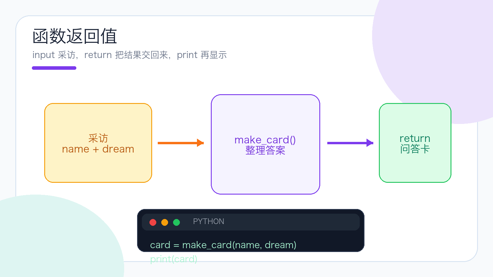

图示：函数返回值：把结果交回来再显示

#### 学习目标

- 孩子能说出：input负责提问并听答案
- 孩子能使用两个input收集两条信息
- 孩子能理解：return是函数把结果交回来
- 孩子能把函数返回值保存到变量里
- 孩子能写出一个会生成完整句子的问答函数

#### 低龄课堂设计

| 项目 | 内容 |
| --- | --- |
| 适合对象 | 7-8岁，一二年级，适合先讲故事再看代码 |
| 节奏安排 | 复习3分钟，生活演示8分钟，代码拆解10分钟，上机练习10分钟，收口3分钟 |
| 统一语言 | 本课统一使用“采访卡片生成器”作比喻，少说抽象术语，多说动作和结果 |

- 每页演示只抓一个核心点，孩子能复述就进入下一页。
- 右侧老师提示可以照读；主画面给孩子看，不要把备课说明读给孩子。
- 如果孩子卡住，回到生活动作，不要停留在术语解释上。

#### 课堂流程

| 时间 | 环节 | 老师做什么 | 学生做什么 |
| --- | --- | --- | --- |
| 0-5分钟 | 复习连接 | 上一课函数像小工厂，参数是送进去的原料。 | 说出上一课的关键词，跟老师把旧知识接回来。 |
| 5-12分钟 | 本课故事 | 今天让程序会提问、会整理答案。input负责听，return负责把函数做好的结果交回来。 | 回答本课开场问题，先用生活语言理解概念。 |
| 12-24分钟 | 代码拆解 | 展示关键代码：def make_card(name, dream): /     return name + "想成为" + dream + "。" /  / card = make_card(name, dream) / print(card)。带孩子逐行说出每个零件的作用。 | 指出关键符号、函数名或变量名，预测输出。 |
| 24-34分钟 | 互动演示 | 让孩子采访同桌两个问题：名字和梦想。把两张答案卡送进函数工厂，拼成一张完整问答卡。 | 用手势、纸条、黑板或口头预测完成一次非电脑演示。 |
| 34-42分钟 | 上机练习 | 让孩子照着模板完成学生端编程题，重点检查本课最容易错的地方。 | 运行代码，看到输出后再交卷。 |
| 42-45分钟 | 收口衔接 | return把结果交回来；想显示结果还要print。 下一课把字符串、if和函数思维放进一个密码宝箱故事。 | 说出今天带走的一句话。 |

#### 老师话术

##### 1. 开场：先接上一课

上一课函数像小工厂，参数是送进去的原料。 今天我们继续往前走：今天让程序会提问、会整理答案。input负责听，return负责把函数做好的结果交回来。

检查点：孩子能说出上一课关键词。

##### 2. 讲新概念：使用“采访卡片生成器”比喻

把今天的新知识想成“采访卡片生成器”。先用生活例子讲明白，再看代码。

检查点：return把结果交回来；想显示结果还要print。

##### 3. 看代码：逐行翻译

不要让孩子整段背。老师逐行问：这一行先做什么？下一行又做什么？

检查点：孩子能说出代码执行顺序。

##### 4. 孩子出错：先定位一个坑

本课最常见的问题是：孩子会把return当成print，函数返回了结果但屏幕没有显示。

检查点：孩子知道先检查哪里。

#### 课堂演示稿

##### 演示 1：复习：上一课接到这一课

上一课函数像小工厂，参数是送进去的原料。

课堂提问：请先说一句：上一课我们最重要学到了什么？

检查点：孩子能说出上一课的一个关键词。

老师提示：

- 你可以照着这样讲
  - 每节课开头先帮孩子把旧知识叫醒，不要直接进入新概念。
  - 上一课函数像小工厂，参数是送进去的原料。
- 课堂操作
  - 请1位孩子回答上一课关键词。
  - 老师把孩子的话整理成一句清楚的话，再进入本课。
- 新手老师提醒
  - 如果孩子答不上来，不要停太久。你直接给出关键词，让孩子跟读一遍即可。

##### 演示 2：本课任务：有问有答

今天让程序会提问、会整理答案。input负责听，return负责把函数做好的结果交回来。

课堂提问：return回来的内容，如果不print，屏幕上能看到吗？

检查点：return把结果交回来；想显示结果还要print。

老师提示：

- 你可以照着这样讲
  - 上一课函数像小工厂，参数是送进去的原料。
  - 今天让程序会提问、会整理答案。input负责听，return负责把函数做好的结果交回来。
- 课堂操作
  - 让孩子采访同桌两个问题：名字和梦想。把两张答案卡送进函数工厂，拼成一张完整问答卡。
  - 让孩子先预测，再运行或揭晓答案。低龄孩子先说出来，再敲代码，会更稳。
- 容易卡住的地方
  - 孩子会把return当成print，函数返回了结果但屏幕没有显示。
  - 孩子回答错时先追问“你是怎么看出来的？”，再带回屏幕上的关键词或符号。
- 过渡
  - 下一课把字符串、if和函数思维放进一个密码宝箱故事。

##### 演示 3：看代码：把代码拆成小零件

今天的关键词：采访卡片生成器

```python
def make_card(name, dream):
    return name + "想成为" + dream + "。"

card = make_card(name, dream)
print(card)
```

课堂提问：你能找到今天最重要的符号或单词吗？

检查点：孩子能说出代码中的一个关键零件。

老师提示：

- 你可以照着这样讲
  - 我们不急着背整段代码，先把它拆成小零件。
  - 每个小零件都有自己的工作，找到它们，代码就不吓人了。
- 课堂操作
  - 先让孩子只看第一行，指出变量名、函数名或符号。
  - 再看第二行，让孩子预测电脑下一步会做什么。
  - 最后把每一行连成完整故事。
- 检查方式
  - 问孩子：这段代码先做什么？再做什么？最后输出什么？

##### 演示 4：互动：先动手，再敲代码

让孩子采访同桌两个问题：名字和梦想。把两张答案卡送进函数工厂，拼成一张完整问答卡。

课堂提问：return回来的内容，如果不print，屏幕上能看到吗？

检查点：孩子能把动作说成步骤。

老师提示：

- 你可以照着这样讲
  - 我们先不用电脑，用手、纸条或黑板把题目演一遍。
  - 演明白以后，再把动作翻译成代码。
- 课堂操作
  - 让孩子采访同桌两个问题：名字和梦想。把两张答案卡送进函数工厂，拼成一张完整问答卡。
  - 请孩子说出刚才动作里的顺序：第一步、第二步、第三步。
  - 把孩子说的话写成简短关键词。
- 低龄课堂提醒
  - 7-8岁孩子很需要身体动作和可见物品。先做动作，再看代码，理解会更顺。

##### 演示 5：避坑：最容易错在哪里？

孩子会把return当成print，函数返回了结果但屏幕没有显示。

课堂提问：如果这里出错，我们第一步检查什么？

检查点：孩子知道本课最常见的错误点。

老师提示：

- 你可以照着这样讲
  - 程序员不是不犯错，程序员是会检查错误。
  - 今天我们先记住最常见的一个坑。
- 带孩子检查
  - 孩子会把return当成print，函数返回了结果但屏幕没有显示。
  - 让孩子用手指屏幕上的关键位置，一起检查符号、顺序、括号或缩进。
- 鼓励话术
  - 写错不是失败，能找到错在哪里，就是程序员很厉害的能力。

##### 演示 6：收口：今天带走一句话

return把结果交回来；想显示结果还要print。

- input = 采访小话筒
- 两个问题 -> 两个变量
- return = 交回结果

课堂提问：请选一句你最记得的话读出来。

检查点：孩子能说出本课核心句。

老师提示：

- 收尾方式
  - 先全班齐读本页标题。
  - 请2-3位孩子各说一句自己记住的话。
  - 再切回学生练习，让孩子马上做一道题巩固。
- 衔接下一课
  - 下一课把字符串、if和函数思维放进一个密码宝箱故事。

#### 概念讲解

##### 1. 程序提问

input()会让程序停下来，等待同学输入答案。

例子：

```python
name = input()
```

老师可以这样说：input像采访小话筒，问完以后要把答案放进变量盒子。

问孩子：电脑听到名字以后，放进哪个盒子？

##### 2. 多个输入

程序可以连续问多个问题，每个答案放进不同变量。

例子：

```python
name = input()
dream = input()
```

老师可以这样说：第一个问题问名字，第二个问题问梦想，两个答案不能放混。

问孩子：如果两个input，程序会停下来听几次？

##### 3. return 交回结果

return会把函数做好的结果交回给调用它的地方。

例子：

```python
return name + "想成为" + dream
```

老师可以这样说：return不像小喇叭直接说出来，它像把成品卡片递出来。

问孩子：return是直接显示，还是把结果交回来？

##### 4. 保存返回值

函数交回来的结果可以放进变量，再用print显示。

例子：

```python
card = make_card(name, dream)
print(card)
```

老师可以这样说：card像一张写好的问答卡，最后用print读出来。

问孩子：如果不print(card)，同学能看到这张卡吗？

##### 5. 函数里的完整句子

函数可以把输入的碎片拼成一句完整的话。

例子：

```python
name + "想成为" + dream + "。"
```

老师可以这样说：名字和梦想是两块拼图，函数负责把它们拼成一句话。

问孩子：如果name是小雨，dream是宇航员，句子会是什么？

#### 典型错误

##### 1. 把return当成print

错误写法：

```python
def make_card(name, dream):
    return name + dream

make_card("小雨", "宇航员")
```

改正写法：

```python
def make_card(name, dream):
    return name + dream

card = make_card("小雨", "宇航员")
print(card)
```

return只是把结果交回来，想看见结果还要print。

##### 2. 两个输入放进同一个变量

错误写法：

```python
answer = input()
answer = input()
```

改正写法：

```python
name = input()
dream = input()
```

第二次输入会盖掉第一次，两个答案要放进两个盒子。

##### 3. 调用函数时参数顺序写反

错误写法：

```python
card = make_card(dream, name)
```

改正写法：

```python
card = make_card(name, dream)
```

参数顺序很重要，名字要进name，梦想要进dream。

#### 课堂实操：同桌采访卡

- 老师示范问两个问题：你叫什么？你想成为什么？
- 孩子把两个答案写在两张纸条上
- 把两张纸条放进“函数小工厂”，拼成一句完整的话
- 最后说明：return把这张卡片交回来，print把卡片读出来

#### 教学提醒

这一课把函数讲成“采访卡片生成器”。先让孩子口头采访同桌：你叫什么？你想成为什么？再把问答变成input和return。 低龄课堂建议：孩子会把return当成print，函数返回了结果但屏幕没有显示。

#### 板书与课后沟通

板书建议：

- input = 采访小话筒
- 两个问题 -> 两个变量
- return = 交回结果
- card = 保存返回值
- print(card) = 读出问答卡

家长沟通：

今天孩子学习函数返回值。家长可以问：return和print有什么不同？

#### 学生练习

##### 1. 两个input()会让程序听几次输入？

A. 2次
B. 1次
C. 0次
D. 无限次

答案：A. 2次
分值：10
解析：每个input都会停下来听一次。

##### 2. return最像什么？

A. 把函数做好的结果交回来
B. 直接显示到屏幕
C. 结束整个程序
D. 画一条线

答案：A. 把函数做好的结果交回来
分值：10
解析：return会把结果交给调用函数的地方。

##### 3. 想看到return回来的内容，通常还需要什么？

A. print()
B. break
C. upper()
D. import turtle

答案：A. print()
分值：10
解析：return本身不负责显示，print才会把内容显示出来。

##### 4. name = input(); dream = input()中，两个答案应该怎样保存？

A. 放进两个不同变量
B. 都放进name
C. 都放进dream
D. 不用保存

答案：A. 放进两个不同变量
分值：10
解析：不同问题的答案最好放进不同变量，后面才不会混。

#### 编程挑战：制作梦想问答卡

通关徽章：问答卡设计师

分值：70

请做一个会生成问答卡的函数！

程序会输入两行：
第1行是名字。
第2行是梦想。

请定义make_card(name, dream)，返回一句话：
名字想成为梦想。

例如输入：
小雨
宇航员

输出：
小雨想成为宇航员。

提示：

```python
return把句子交回来，print负责显示：

def make_card(name, dream):
    return name + "想成为" + dream + "。"

name = input()
dream = input()
card = make_card(name, dream)
print(card)
```

起始代码：

```python
# 有问有答：制作梦想问答卡

def make_card(name, dream):
    return name + "想成为" + dream + "。"

name = input()
dream = input()
card = make_card(name, dream)
print(card)
```

测试样例：

| 样例 | 输入 | 期望输出 |
| --- | --- | --- |
| 小雨的梦想 | 小雨<br>宇航员 | 小雨想成为宇航员。 |
| Alex的梦想 | Alex<br>工程师 | Alex想成为工程师。 |

# 文字秘密与综合应用

## 第 21 课：阿兰的密码

章节：文字秘密与综合应用
课型：拓展挑战
难度：★★★
考点：字符串比较、if/else、strip处理空格、lower大小写处理

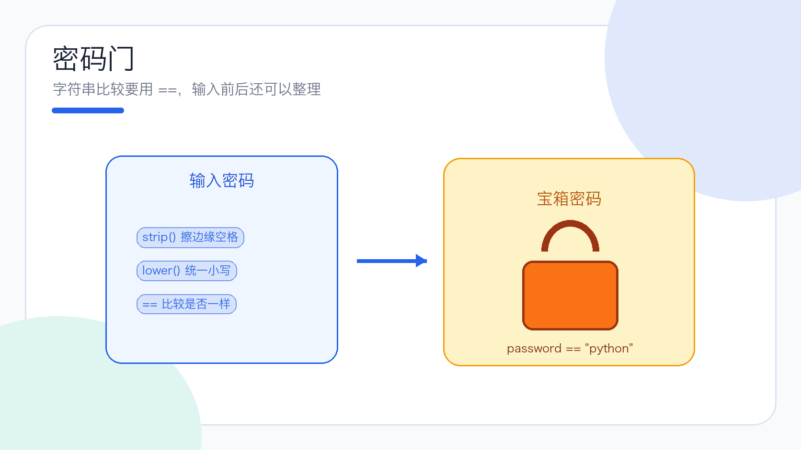

图示：密码门：字符串比较要用 ==

#### 学习目标

- 孩子能说出：密码本质上是一段字符串
- 孩子能使用==判断输入的密码是否正确
- 孩子能理解strip()可以去掉输入前后的空格
- 孩子能使用lower()让大小写不影响判断
- 孩子能写出一个完整的密码判断程序

#### 低龄课堂设计

| 项目 | 内容 |
| --- | --- |
| 适合对象 | 7-8岁，一二年级，适合先讲故事再看代码 |
| 节奏安排 | 复习3分钟，生活演示8分钟，代码拆解10分钟，上机练习10分钟，收口3分钟 |
| 统一语言 | 本课统一使用“文字钥匙和密码门”作比喻，少说抽象术语，多说动作和结果 |

- 每页演示只抓一个核心点，孩子能复述就进入下一页。
- 右侧老师提示可以照读；主画面给孩子看，不要把备课说明读给孩子。
- 如果孩子卡住，回到生活动作，不要停留在术语解释上。

#### 课堂流程

| 时间 | 环节 | 老师做什么 | 学生做什么 |
| --- | --- | --- | --- |
| 0-5分钟 | 复习连接 | 上一课程序会提问并整理答案，今天这些答案会变成一把文字钥匙。 | 说出上一课的关键词，跟老师把旧知识接回来。 |
| 5-12分钟 | 本课故事 | 密码就是字符串。程序用==比较输入和正确密码，再用if/else决定宝箱开不开。 | 回答本课开场问题，先用生活语言理解概念。 |
| 12-24分钟 | 代码拆解 | 展示关键代码：password = input().strip().lower() / if password == "python": /     print("密码正确，宝箱打开！") / else: /     print("密码错误，再试一次！")。带孩子逐行说出每个零件的作用。 | 指出关键符号、函数名或变量名，预测输出。 |
| 24-34分钟 | 互动演示 | 准备三张密码卡：python、Python、 python 。让孩子先猜哪张能开门，再介绍strip和lower。 | 用手势、纸条、黑板或口头预测完成一次非电脑演示。 |
| 34-42分钟 | 上机练习 | 让孩子照着模板完成学生端编程题，重点检查本课最容易错的地方。 | 运行代码，看到输出后再交卷。 |
| 42-45分钟 | 收口衔接 | 一个等号是赋值，两个等号是比较；strip和lower让密码判断更稳。 下一课进入数学挑战：用%和//把一个数拆成质因数。 | 说出今天带走的一句话。 |

#### 老师话术

##### 1. 开场：先接上一课

上一课程序会提问并整理答案，今天这些答案会变成一把文字钥匙。 今天我们继续往前走：密码就是字符串。程序用==比较输入和正确密码，再用if/else决定宝箱开不开。

检查点：孩子能说出上一课关键词。

##### 2. 讲新概念：使用“文字钥匙和密码门”比喻

把今天的新知识想成“文字钥匙和密码门”。先用生活例子讲明白，再看代码。

检查点：一个等号是赋值，两个等号是比较；strip和lower让密码判断更稳。

##### 3. 看代码：逐行翻译

不要让孩子整段背。老师逐行问：这一行先做什么？下一行又做什么？

检查点：孩子能说出代码执行顺序。

##### 4. 孩子出错：先定位一个坑

本课最常见的问题是：孩子容易用=做比较，或忘记给正确密码加引号。

检查点：孩子知道先检查哪里。

#### 课堂演示稿

##### 演示 1：复习：上一课接到这一课

上一课程序会提问并整理答案，今天这些答案会变成一把文字钥匙。

课堂提问：请先说一句：上一课我们最重要学到了什么？

检查点：孩子能说出上一课的一个关键词。

老师提示：

- 你可以照着这样讲
  - 每节课开头先帮孩子把旧知识叫醒，不要直接进入新概念。
  - 上一课程序会提问并整理答案，今天这些答案会变成一把文字钥匙。
- 课堂操作
  - 请1位孩子回答上一课关键词。
  - 老师把孩子的话整理成一句清楚的话，再进入本课。
- 新手老师提醒
  - 如果孩子答不上来，不要停太久。你直接给出关键词，让孩子跟读一遍即可。

##### 演示 2：本课任务：阿兰的密码

密码就是字符串。程序用==比较输入和正确密码，再用if/else决定宝箱开不开。

课堂提问：输入Python和输入python，经过lower()以后一样吗？

检查点：一个等号是赋值，两个等号是比较；strip和lower让密码判断更稳。

老师提示：

- 你可以照着这样讲
  - 上一课程序会提问并整理答案，今天这些答案会变成一把文字钥匙。
  - 密码就是字符串。程序用==比较输入和正确密码，再用if/else决定宝箱开不开。
- 课堂操作
  - 准备三张密码卡：python、Python、 python 。让孩子先猜哪张能开门，再介绍strip和lower。
  - 让孩子先预测，再运行或揭晓答案。低龄孩子先说出来，再敲代码，会更稳。
- 容易卡住的地方
  - 孩子容易用=做比较，或忘记给正确密码加引号。
  - 孩子回答错时先追问“你是怎么看出来的？”，再带回屏幕上的关键词或符号。
- 过渡
  - 下一课进入数学挑战：用%和//把一个数拆成质因数。

##### 演示 3：看代码：把代码拆成小零件

今天的关键词：文字钥匙和密码门

```python
password = input().strip().lower()
if password == "python":
    print("密码正确，宝箱打开！")
else:
    print("密码错误，再试一次！")
```

课堂提问：你能找到今天最重要的符号或单词吗？

检查点：孩子能说出代码中的一个关键零件。

老师提示：

- 你可以照着这样讲
  - 我们不急着背整段代码，先把它拆成小零件。
  - 每个小零件都有自己的工作，找到它们，代码就不吓人了。
- 课堂操作
  - 先让孩子只看第一行，指出变量名、函数名或符号。
  - 再看第二行，让孩子预测电脑下一步会做什么。
  - 最后把每一行连成完整故事。
- 检查方式
  - 问孩子：这段代码先做什么？再做什么？最后输出什么？

##### 演示 4：互动：先动手，再敲代码

准备三张密码卡：python、Python、 python 。让孩子先猜哪张能开门，再介绍strip和lower。

课堂提问：输入Python和输入python，经过lower()以后一样吗？

检查点：孩子能把动作说成步骤。

老师提示：

- 你可以照着这样讲
  - 我们先不用电脑，用手、纸条或黑板把题目演一遍。
  - 演明白以后，再把动作翻译成代码。
- 课堂操作
  - 准备三张密码卡：python、Python、 python 。让孩子先猜哪张能开门，再介绍strip和lower。
  - 请孩子说出刚才动作里的顺序：第一步、第二步、第三步。
  - 把孩子说的话写成简短关键词。
- 低龄课堂提醒
  - 7-8岁孩子很需要身体动作和可见物品。先做动作，再看代码，理解会更顺。

##### 演示 5：避坑：最容易错在哪里？

孩子容易用=做比较，或忘记给正确密码加引号。

课堂提问：如果这里出错，我们第一步检查什么？

检查点：孩子知道本课最常见的错误点。

老师提示：

- 你可以照着这样讲
  - 程序员不是不犯错，程序员是会检查错误。
  - 今天我们先记住最常见的一个坑。
- 带孩子检查
  - 孩子容易用=做比较，或忘记给正确密码加引号。
  - 让孩子用手指屏幕上的关键位置，一起检查符号、顺序、括号或缩进。
- 鼓励话术
  - 写错不是失败，能找到错在哪里，就是程序员很厉害的能力。

##### 演示 6：收口：今天带走一句话

一个等号是赋值，两个等号是比较；strip和lower让密码判断更稳。

- 密码 = 字符串
- = 是放进去
- == 是比较是否一样

课堂提问：请选一句你最记得的话读出来。

检查点：孩子能说出本课核心句。

老师提示：

- 收尾方式
  - 先全班齐读本页标题。
  - 请2-3位孩子各说一句自己记住的话。
  - 再切回学生练习，让孩子马上做一道题巩固。
- 衔接下一课
  - 下一课进入数学挑战：用%和//把一个数拆成质因数。

#### 概念讲解

##### 1. 密码是字符串

密码可以由字母、数字或符号组成，在程序里通常当作字符串处理。

例子：

```python
secret = "python"
```

老师可以这样说：密码像一把文字钥匙，必须和锁里的文字一模一样才打开。

问孩子：密码python要不要放在引号里？

##### 2. == 比较是否一样

==用来问电脑：左边和右边是不是相同？

例子：

```python
password == "python"
```

老师可以这样说：一个等号是放进去，两个等号才是比较是不是一样。

问孩子：判断密码对不对，应该用=还是==？

##### 3. strip() 擦掉边缘空格

strip()会去掉文字前面和后面的空格。

例子：

```python
password = input().strip()
```

老师可以这样说：有时孩子不小心多敲了空格，strip像橡皮擦，把边缘空格擦掉。

问孩子：strip()会擦掉中间的字母吗？

##### 4. lower() 统一小写

lower()会把英文字母变成小写，方便比较。

例子：

```python
"Python".lower() 变成 "python"
```

老师可以这样说：大小写像帽子不一样，lower让大家都戴同一种帽子再比较。

问孩子：输入Python，lower()以后是什么？

##### 5. 密码分支

密码正确走if路线，密码错误走else路线。

例子：

```python
if password == "python":
    print("打开")
else:
    print("错误")
```

老师可以这样说：这就是密码门：对了开门，错了提醒再试。

问孩子：如果输入apple，会走if还是else？

#### 典型错误

##### 1. 把=当成判断

错误写法：

```python
if password = "python":
    print("打开")
```

改正写法：

```python
if password == "python":
    print("打开")
```

一个等号是赋值，两个等号才是比较。

##### 2. 忘记给正确密码加引号

错误写法：

```python
if password == python:
    print("打开")
```

改正写法：

```python
if password == "python":
    print("打开")
```

python作为密码文字时要放在引号里。

##### 3. 大小写导致密码错判

错误写法：

```python
password = input()
if password == "python":
```

改正写法：

```python
password = input().strip().lower()
if password == "python":
```

用lower()可以让Python、PYTHON也变成python再判断。

#### 课堂实操：宝箱密码卡

- 准备三张卡：python、Python、 python
- 让孩子先猜哪些能打开宝箱
- 再说明lower处理大小写，strip处理边缘空格
- 最后把密码门翻译成if/else代码

#### 教学提醒

这节课适合设计成“宝箱密码”故事。先让孩子判断几张密码卡：python、Python、 python ，再解释strip和lower为什么能帮忙。 低龄课堂建议：孩子容易用=做比较，或忘记给正确密码加引号。

#### 板书与课后沟通

板书建议：

- 密码 = 字符串
- = 是放进去
- == 是比较是否一样
- strip() 擦掉前后空格
- lower() 统一小写

家长沟通：

今天孩子做密码判断程序。家长可以问：为什么判断密码要用两个等号==？

#### 学生练习

##### 1. 判断两个字符串是否一样，应该用哪个符号？

A. ==
B. =
C. +
D. %

答案：A. ==
分值：10
解析：==表示比较是否相等，=表示把右边放进左边。

##### 2. input().strip()里的strip()会做什么？

A. 去掉前后空格
B. 把字母变大写
C. 退出循环
D. 生成随机数

答案：A. 去掉前后空格
分值：10
解析：strip()会擦掉字符串前面和后面的空格。

##### 3. "Python".lower()会变成什么？

A. python
B. PYTHON
C. Python
D. pYTHON

答案：A. python
分值：10
解析：lower()会把英文字母统一变成小写。

##### 4. 密码文字python在代码里应该怎样写？

A. "python"
B. python
C. = python
D. print

答案：A. "python"
分值：10
解析：字符串文字要放在引号里。

#### 编程挑战：打开阿兰的密码宝箱

通关徽章：密码宝箱守护者

分值：70

阿兰有一个宝箱，正确密码是python。

程序会输入一段密码。
请先去掉前后空格，再统一变成小写。
如果密码是python，输出：
密码正确，宝箱打开！
否则输出：
密码错误，再试一次！

提示：

```python
先处理输入，再用if/else判断：

password = input().strip().lower()
if password == "python":
    print("密码正确，宝箱打开！")
else:
    print("密码错误，再试一次！")
```

起始代码：

```python
# 阿兰的密码：打开宝箱

password = input().strip().lower()

if password == "python":
    print("密码正确，宝箱打开！")
else:
    print("密码错误，再试一次！")
```

测试样例：

| 样例 | 输入 | 期望输出 |
| --- | --- | --- |
| 正确小写 | python | 密码正确，宝箱打开！ |
| 大小写混合 | Python | 密码正确，宝箱打开！ |
| 错误密码 | apple | 密码错误，再试一次！ |

# 数学挑战关

## 第 22 课：分解质因数

章节：数学挑战关
课型：拓展挑战
难度：★★★★
考点：while循环、取余%、整除//、列表append、字符串join

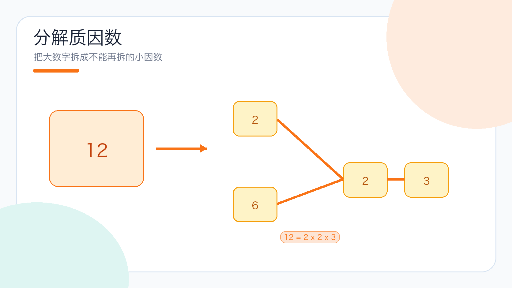

图示：分解质因数：把大数字拆成小因数

#### 学习目标

- 孩子能说出：因数就是能整齐分掉一个数的小数字
- 孩子能用%判断一个数能不能被另一个数整除
- 孩子能用//把已经分掉的部分拿走
- 孩子能理解while循环会一直拆，直到数字变成1
- 孩子能输出一个数字的质因数分解结果

#### 低龄课堂设计

| 项目 | 内容 |
| --- | --- |
| 适合对象 | 7-8岁，一二年级，适合先讲故事再看代码 |
| 节奏安排 | 复习3分钟，生活演示8分钟，代码拆解10分钟，上机练习10分钟，收口3分钟 |
| 统一语言 | 本课统一使用“拆积木塔”作比喻，少说抽象术语，多说动作和结果 |

- 每页演示只抓一个核心点，孩子能复述就进入下一页。
- 右侧老师提示可以照读；主画面给孩子看，不要把备课说明读给孩子。
- 如果孩子卡住，回到生活动作，不要停留在术语解释上。

#### 课堂流程

| 时间 | 环节 | 老师做什么 | 学生做什么 |
| --- | --- | --- | --- |
| 0-5分钟 | 复习连接 | 上一课用字符串和if做了密码判断。 | 说出上一课的关键词，跟老师把旧知识接回来。 |
| 5-12分钟 | 本课故事 | 今天换成数字挑战：把一个大数字拆成几个不能再拆的小因数。 | 回答本课开场问题，先用生活语言理解概念。 |
| 12-24分钟 | 代码拆解 | 展示关键代码：n = int(input()) / d = 2 / while n > 1: /     if n % d == 0: /         print(d) /         n = n // d /     else: /         d += 1。带孩子逐行说出每个零件的作用。 | 指出关键符号、函数名或变量名，预测输出。 |
| 24-34分钟 | 互动演示 | 在黑板上写12，带孩子一步步拆：12 -> 2和6，6 -> 2和3，最后得到2、2、3。 | 用手势、纸条、黑板或口头预测完成一次非电脑演示。 |
| 34-42分钟 | 上机练习 | 让孩子照着模板完成学生端编程题，重点检查本课最容易错的地方。 | 运行代码，看到输出后再交卷。 |
| 42-45分钟 | 收口衔接 | %看能不能整除，//把找到的因数拆掉。 下一课进入Turtle创作，把代码变成海龟画图指令。 | 说出今天带走的一句话。 |

#### 老师话术

##### 1. 开场：先接上一课

上一课用字符串和if做了密码判断。 今天我们继续往前走：今天换成数字挑战：把一个大数字拆成几个不能再拆的小因数。

检查点：孩子能说出上一课关键词。

##### 2. 讲新概念：使用“拆积木塔”比喻

把今天的新知识想成“拆积木塔”。先用生活例子讲明白，再看代码。

检查点：%看能不能整除，//把找到的因数拆掉。

##### 3. 看代码：逐行翻译

不要让孩子整段背。老师逐行问：这一行先做什么？下一行又做什么？

检查点：孩子能说出代码执行顺序。

##### 4. 孩子出错：先定位一个坑

本课最常见的问题是：孩子找到因数后会忘记让n变小，循环就一直拆同一个数。

检查点：孩子知道先检查哪里。

#### 课堂演示稿

##### 演示 1：复习：上一课接到这一课

上一课用字符串和if做了密码判断。

课堂提问：请先说一句：上一课我们最重要学到了什么？

检查点：孩子能说出上一课的一个关键词。

老师提示：

- 你可以照着这样讲
  - 每节课开头先帮孩子把旧知识叫醒，不要直接进入新概念。
  - 上一课用字符串和if做了密码判断。
- 课堂操作
  - 请1位孩子回答上一课关键词。
  - 老师把孩子的话整理成一句清楚的话，再进入本课。
- 新手老师提醒
  - 如果孩子答不上来，不要停太久。你直接给出关键词，让孩子跟读一遍即可。

##### 演示 2：本课任务：分解质因数

今天换成数字挑战：把一个大数字拆成几个不能再拆的小因数。

课堂提问：12先能被2整齐分完吗？拆掉一个2以后还剩多少？

检查点：%看能不能整除，//把找到的因数拆掉。

老师提示：

- 你可以照着这样讲
  - 上一课用字符串和if做了密码判断。
  - 今天换成数字挑战：把一个大数字拆成几个不能再拆的小因数。
- 课堂操作
  - 在黑板上写12，带孩子一步步拆：12 -> 2和6，6 -> 2和3，最后得到2、2、3。
  - 让孩子先预测，再运行或揭晓答案。低龄孩子先说出来，再敲代码，会更稳。
- 容易卡住的地方
  - 孩子找到因数后会忘记让n变小，循环就一直拆同一个数。
  - 孩子回答错时先追问“你是怎么看出来的？”，再带回屏幕上的关键词或符号。
- 过渡
  - 下一课进入Turtle创作，把代码变成海龟画图指令。

##### 演示 3：看代码：把代码拆成小零件

今天的关键词：拆积木塔

```python
n = int(input())
d = 2
while n > 1:
    if n % d == 0:
        print(d)
        n = n // d
    else:
        d += 1
```

课堂提问：你能找到今天最重要的符号或单词吗？

检查点：孩子能说出代码中的一个关键零件。

老师提示：

- 你可以照着这样讲
  - 我们不急着背整段代码，先把它拆成小零件。
  - 每个小零件都有自己的工作，找到它们，代码就不吓人了。
- 课堂操作
  - 先让孩子只看第一行，指出变量名、函数名或符号。
  - 再看第二行，让孩子预测电脑下一步会做什么。
  - 最后把每一行连成完整故事。
- 检查方式
  - 问孩子：这段代码先做什么？再做什么？最后输出什么？

##### 演示 4：互动：先动手，再敲代码

在黑板上写12，带孩子一步步拆：12 -> 2和6，6 -> 2和3，最后得到2、2、3。

课堂提问：12先能被2整齐分完吗？拆掉一个2以后还剩多少？

检查点：孩子能把动作说成步骤。

老师提示：

- 你可以照着这样讲
  - 我们先不用电脑，用手、纸条或黑板把题目演一遍。
  - 演明白以后，再把动作翻译成代码。
- 课堂操作
  - 在黑板上写12，带孩子一步步拆：12 -> 2和6，6 -> 2和3，最后得到2、2、3。
  - 请孩子说出刚才动作里的顺序：第一步、第二步、第三步。
  - 把孩子说的话写成简短关键词。
- 低龄课堂提醒
  - 7-8岁孩子很需要身体动作和可见物品。先做动作，再看代码，理解会更顺。

##### 演示 5：避坑：最容易错在哪里？

孩子找到因数后会忘记让n变小，循环就一直拆同一个数。

课堂提问：如果这里出错，我们第一步检查什么？

检查点：孩子知道本课最常见的错误点。

老师提示：

- 你可以照着这样讲
  - 程序员不是不犯错，程序员是会检查错误。
  - 今天我们先记住最常见的一个坑。
- 带孩子检查
  - 孩子找到因数后会忘记让n变小，循环就一直拆同一个数。
  - 让孩子用手指屏幕上的关键位置，一起检查符号、顺序、括号或缩进。
- 鼓励话术
  - 写错不是失败，能找到错在哪里，就是程序员很厉害的能力。

##### 演示 6：收口：今天带走一句话

%看能不能整除，//把找到的因数拆掉。

- 因数 = 能整齐分掉的数字
- % = 看有没有余数
- 余数0 = 能整除

课堂提问：请选一句你最记得的话读出来。

检查点：孩子能说出本课核心句。

老师提示：

- 收尾方式
  - 先全班齐读本页标题。
  - 请2-3位孩子各说一句自己记住的话。
  - 再切回学生练习，让孩子马上做一道题巩固。
- 衔接下一课
  - 下一课进入Turtle创作，把代码变成海龟画图指令。

#### 概念讲解

##### 1. 因数

如果一个数能被另一个数整齐分完，另一个数就是它的因数。

例子：

```python
12可以被3整除，所以3是12的因数。
```

老师可以这样说：因数像能把积木塔整齐拆开的积木块。

问孩子：12能不能被5整齐分完？

##### 2. % 余数检查

%可以告诉我们有没有剩余。

例子：

```python
12 % 3 得到0，表示能整除。
```

老师可以这样说：余数是0，说明刚好分完；余数不是0，说明还有剩。

问孩子：14 % 2的余数是几？

##### 3. // 拆掉一层

//可以做整除，把已经找到的因数拆掉。

例子：

```python
12 // 2 得到6。
```

老师可以这样说：找到一个2以后，就把12拆成2和6，接着继续拆6。

问孩子：12拆掉一个2以后，还剩几继续拆？

##### 4. 从2开始试

分解质因数通常从最小的质数2开始试。

例子：

```python
d = 2
```

老师可以这样说：我们像拿钥匙开门，从最小钥匙2开始试，打不开再换下一把。

问孩子：第一个要试的因数通常是谁？

##### 5. 拆到1为止

当n变成1，说明已经全部拆完。

例子：

```python
while n > 1:
```

老师可以这样说：n是还没拆完的积木塔，高度变成1就收工。

问孩子：为什么循环条件是n > 1？

##### 6. 把答案排成一行

找到的因数先放进列表，最后用空格连起来输出。

例子：

```python
print(" ".join(factors))
```

老师可以这样说：列表像一个托盘，找到一个因数就放一块，最后排成整齐的一行。

问孩子：如果托盘里是2、2、3，输出应该是什么？

#### 典型错误

##### 1. 找到因数后忘记把n变小

错误写法：

```python
if n % d == 0:
    factors.append(str(d))
```

改正写法：

```python
if n % d == 0:
    factors.append(str(d))
    n = n // d
```

只记录不拆掉，n一直不变，循环就可能停不下来。

##### 2. 不能整除时忘记换下一个数字

错误写法：

```python
else:
    print("不能整除")
```

改正写法：

```python
else:
    d = d + 1
```

当前钥匙打不开，就要换下一把钥匙。

##### 3. 把数字直接join

错误写法：

```python
factors.append(d)
print(" ".join(factors))
```

改正写法：

```python
factors.append(str(d))
print(" ".join(factors))
```

join只能连接字符串，所以放进列表前要str()。

#### 课堂实操：拆积木塔

- 先在黑板写12
- 问孩子：能不能被2整齐分完？可以，就写下2，剩6
- 继续问6能不能被2分完？可以，就写下2，剩3
- 3只能被3分完，写下3，剩1，停止

#### 教学提醒

这节课难度高，但可以用“拆积木塔”降低抽象度。先手算12：12拆成2和6，6拆成2和3，所以12 = 2 x 2 x 3。 低龄课堂建议：孩子找到因数后会忘记让n变小，循环就一直拆同一个数。

#### 板书与课后沟通

板书建议：

- 因数 = 能整齐分掉的数字
- % = 看有没有余数
- 余数0 = 能整除
- // = 拆掉一层
- n变成1就拆完

家长沟通：

今天孩子学习分解质因数。家长可以用12提问：12可以拆成哪几个质因数？

#### 学生练习

##### 1. 12 % 3 的结果是0，说明什么？

A. 12能被3整除
B. 12不能被3整除
C. 3比12大
D. 程序出错

答案：A. 12能被3整除
分值：10
解析：余数为0表示刚好分完。

##### 2. 找到一个因数2后，n = n // 2是在做什么？

A. 把这个2拆掉，继续拆剩下的数
B. 把n变成文字
C. 结束程序
D. 输出答案

答案：A. 把这个2拆掉，继续拆剩下的数
分值：10
解析：整除后，n会变成还没拆完的部分。

##### 3. 分解质因数通常从哪个数字开始试？

A. 2
B. 0
C. 1
D. 10

答案：A. 2
分值：10
解析：2是最小的质数，所以通常从2开始试。

##### 4. while n > 1 表示什么时候停止？

A. n变成1时停止
B. n变成100时停止
C. d变成2时停止
D. 输入为空时停止

答案：A. n变成1时停止
分值：10
解析：n变成1说明已经拆完。

#### 编程挑战：把数字拆成质因数

通关徽章：数字拆解师

分值：80

输入一个大于1的整数，把它拆成质因数，并用空格输出。

例如输入：
12

输出：
2 2 3

再例如输入：
18

输出：
2 3 3

提示：

```python
从2开始试，如果n能被d整除，就记录d，并把n变成n // d；否则d加1：

n = int(input())
factors = []
d = 2
while n > 1:
    if n % d == 0:
        factors.append(str(d))
        n = n // d
    else:
        d = d + 1
print(" ".join(factors))
```

起始代码：

```python
# 分解质因数：把数字拆成小积木

n = int(input())
factors = []
d = 2

while n > 1:
    if n % d == 0:
        factors.append(str(d))
        n = n // d
    else:
        d = d + 1

print(" ".join(factors))
```

测试样例：

| 样例 | 输入 | 期望输出 |
| --- | --- | --- |
| 12 | 12 | 2 2 3 |
| 18 | 18 | 2 3 3 |
| 13 | 13 | 13 |

# Turtle复习与项目创作

## 第 23 课：Turtle复习：正方形指令

章节：Turtle复习与项目创作
课型：拓展挑战
难度：★★
考点：turtle基础、forward前进、right转弯、for循环画图


图示：Turtle 正方形：重复4次前进和转弯

#### 学习目标

- 孩子能说出：Turtle像一支会走路的小画笔
- 孩子能理解forward负责前进画线，right/left负责转方向
- 孩子能用for循环描述正方形的四次重复
- 孩子能把画图动作先写成指令清单
- 孩子能把指令清单迁移到turtle代码

#### 低龄课堂设计

| 项目 | 内容 |
| --- | --- |
| 适合对象 | 7-8岁，一二年级，适合先讲故事再看代码 |
| 节奏安排 | 复习3分钟，生活演示8分钟，代码拆解10分钟，上机练习10分钟，收口3分钟 |
| 统一语言 | 本课统一使用“会走路的小画笔”作比喻，少说抽象术语，多说动作和结果 |

- 每页演示只抓一个核心点，孩子能复述就进入下一页。
- 右侧老师提示可以照读；主画面给孩子看，不要把备课说明读给孩子。
- 如果孩子卡住，回到生活动作，不要停留在术语解释上。

#### 课堂流程

| 时间 | 环节 | 老师做什么 | 学生做什么 |
| --- | --- | --- | --- |
| 0-5分钟 | 复习连接 | 前面的Turtle趣味拓展已经画过线条、正方形、五角星和房子。 | 说出上一课的关键词，跟老师把旧知识接回来。 |
| 5-12分钟 | 本课故事 | 今天不是重新学Turtle，而是把画图动作复习成可检查的指令清单：前进、转弯、重复。 | 回答本课开场问题，先用生活语言理解概念。 |
| 12-24分钟 | 代码拆解 | 展示关键代码：for i in range(4): /     print("前进100") /     print("右转90")。带孩子逐行说出每个零件的作用。 | 指出关键符号、函数名或变量名，预测输出。 |
| 24-34分钟 | 互动演示 | 请孩子站起来当小海龟，按“前进、右转90度”重复4次，身体走出正方形。 | 用手势、纸条、黑板或口头预测完成一次非电脑演示。 |
| 34-42分钟 | 上机练习 | 让孩子照着模板完成学生端编程题，重点检查本课最容易错的地方。 | 运行代码，看到输出后再交卷。 |
| 42-45分钟 | 收口衔接 | forward负责画线，right/left负责转方向；正方形重复4次。 下一课把画一条鱼的动作装进函数，再用循环画多条鱼。 | 说出今天带走的一句话。 |

#### 老师话术

##### 1. 开场：先接上一课

前面的Turtle趣味拓展已经画过线条、正方形、五角星和房子。 今天我们继续往前走：今天不是重新学Turtle，而是把画图动作复习成可检查的指令清单：前进、转弯、重复。

检查点：孩子能说出上一课关键词。

##### 2. 讲新概念：使用“会走路的小画笔”比喻

把今天的新知识想成“会走路的小画笔”。先用生活例子讲明白，再看代码。

检查点：forward负责画线，right/left负责转方向；正方形重复4次。

##### 3. 看代码：逐行翻译

不要让孩子整段背。老师逐行问：这一行先做什么？下一行又做什么？

检查点：孩子能说出代码执行顺序。

##### 4. 孩子出错：先定位一个坑

本课最常见的问题是：孩子会把转弯写在循环外面，结果只转一次。

检查点：孩子知道先检查哪里。

#### 课堂演示稿

##### 演示 1：复习：上一课接到这一课

前面的Turtle趣味拓展已经画过线条、正方形、五角星和房子。

课堂提问：请先说一句：上一课我们最重要学到了什么？

检查点：孩子能说出上一课的一个关键词。

老师提示：

- 你可以照着这样讲
  - 每节课开头先帮孩子把旧知识叫醒，不要直接进入新概念。
  - 前面的Turtle趣味拓展已经画过线条、正方形、五角星和房子。
- 课堂操作
  - 请1位孩子回答上一课关键词。
  - 老师把孩子的话整理成一句清楚的话，再进入本课。
- 新手老师提醒
  - 如果孩子答不上来，不要停太久。你直接给出关键词，让孩子跟读一遍即可。

##### 演示 2：本课任务：Turtle复习：正方形指令

今天不是重新学Turtle，而是把画图动作复习成可检查的指令清单：前进、转弯、重复。

课堂提问：画正方形为什么要重复4次？每次转多少度？

检查点：forward负责画线，right/left负责转方向；正方形重复4次。

老师提示：

- 你可以照着这样讲
  - 前面的Turtle趣味拓展已经画过线条、正方形、五角星和房子。
  - 今天不是重新学Turtle，而是把画图动作复习成可检查的指令清单：前进、转弯、重复。
- 课堂操作
  - 请孩子站起来当小海龟，按“前进、右转90度”重复4次，身体走出正方形。
  - 让孩子先预测，再运行或揭晓答案。低龄孩子先说出来，再敲代码，会更稳。
- 容易卡住的地方
  - 孩子会把转弯写在循环外面，结果只转一次。
  - 孩子回答错时先追问“你是怎么看出来的？”，再带回屏幕上的关键词或符号。
- 过渡
  - 下一课把画一条鱼的动作装进函数，再用循环画多条鱼。

##### 演示 3：看代码：把代码拆成小零件

今天的关键词：会走路的小画笔

```python
for i in range(4):
    print("前进100")
    print("右转90")
```

课堂提问：你能找到今天最重要的符号或单词吗？

检查点：孩子能说出代码中的一个关键零件。

老师提示：

- 你可以照着这样讲
  - 我们不急着背整段代码，先把它拆成小零件。
  - 每个小零件都有自己的工作，找到它们，代码就不吓人了。
- 课堂操作
  - 先让孩子只看第一行，指出变量名、函数名或符号。
  - 再看第二行，让孩子预测电脑下一步会做什么。
  - 最后把每一行连成完整故事。
- 检查方式
  - 问孩子：这段代码先做什么？再做什么？最后输出什么？

##### 演示 4：互动：先动手，再敲代码

请孩子站起来当小海龟，按“前进、右转90度”重复4次，身体走出正方形。

课堂提问：画正方形为什么要重复4次？每次转多少度？

检查点：孩子能把动作说成步骤。

老师提示：

- 你可以照着这样讲
  - 我们先不用电脑，用手、纸条或黑板把题目演一遍。
  - 演明白以后，再把动作翻译成代码。
- 课堂操作
  - 请孩子站起来当小海龟，按“前进、右转90度”重复4次，身体走出正方形。
  - 请孩子说出刚才动作里的顺序：第一步、第二步、第三步。
  - 把孩子说的话写成简短关键词。
- 低龄课堂提醒
  - 7-8岁孩子很需要身体动作和可见物品。先做动作，再看代码，理解会更顺。

##### 演示 5：避坑：最容易错在哪里？

孩子会把转弯写在循环外面，结果只转一次。

课堂提问：如果这里出错，我们第一步检查什么？

检查点：孩子知道本课最常见的错误点。

老师提示：

- 你可以照着这样讲
  - 程序员不是不犯错，程序员是会检查错误。
  - 今天我们先记住最常见的一个坑。
- 带孩子检查
  - 孩子会把转弯写在循环外面，结果只转一次。
  - 让孩子用手指屏幕上的关键位置，一起检查符号、顺序、括号或缩进。
- 鼓励话术
  - 写错不是失败，能找到错在哪里，就是程序员很厉害的能力。

##### 演示 6：收口：今天带走一句话

forward负责画线，right/left负责转方向；正方形重复4次。

- Turtle = 会走路的小画笔
- forward = 前进画线
- right/left = 转方向

课堂提问：请选一句你最记得的话读出来。

检查点：孩子能说出本课核心句。

老师提示：

- 收尾方式
  - 先全班齐读本页标题。
  - 请2-3位孩子各说一句自己记住的话。
  - 再切回学生练习，让孩子马上做一道题巩固。
- 衔接下一课
  - 下一课把画一条鱼的动作装进函数，再用循环画多条鱼。

#### 概念讲解

##### 1. 会走路的小画笔

Turtle会按照代码前进、转弯，并在画布上留下线条。

例子：

```python
t.forward(100)
```

老师可以这样说：小海龟走到哪里，笔迹就留到哪里。

问孩子：小海龟前进时会不会画线？

##### 2. forward 前进

forward(步数)让小海龟向当前方向前进。

例子：

```python
t.forward(80)
```

老师可以这样说：步数越大，线越长；这就像走80步和走120步的区别。

问孩子：forward(50)和forward(100)，哪条线更长？

##### 3. right/left 转弯

right和left只改变方向，不会自己画线。

例子：

```python
t.right(90)
```

老师可以这样说：转弯像原地转身，真正画线还要再forward。

问孩子：right(90)会画出一条线吗？

##### 4. 正方形规律

正方形要重复4次：前进一条边，再转90度。

例子：

```python
for i in range(4):
    t.forward(100)
    t.right(90)
```

老师可以这样说：正方形有4条边，所以同样的动作重复4次。

问孩子：画正方形要重复几次？

##### 5. 先写指令清单

初学画图时，可以先用文字指令描述动作，再换成turtle代码。

例子：

```python
前进100
右转90
```

老师可以这样说：低龄孩子先说动作，再写代码，会比直接敲turtle更稳。

问孩子：前进100对应哪句turtle代码？

#### 典型错误

##### 1. 只前进不转弯

错误写法：

```python
for i in range(4):
    t.forward(100)
```

改正写法：

```python
for i in range(4):
    t.forward(100)
    t.right(90)
```

不转弯只会画一条直线，不会变成正方形。

##### 2. 把转弯写到循环外面

错误写法：

```python
for i in range(4):
    t.forward(100)
t.right(90)
```

改正写法：

```python
for i in range(4):
    t.forward(100)
    t.right(90)
```

每画一条边都要转一次，所以转弯也要在循环里。

##### 3. 把90度写成9度

错误写法：

```python
t.right(9)
```

改正写法：

```python
t.right(90)
```

正方形每个角是90度，少一个0会转得太小。

#### 课堂实操：身体画正方形

- 请一个孩子站起来当小海龟
- 全班发出口令：前进、右转90度，重复4次
- 老师在白板把动作写成指令清单
- 最后展示对应turtle代码

#### 教学提醒

这是第13-16课后的复习迁移课。学生端练习先让孩子输出“海龟指令清单”，这样可判题、可复盘；教师演示时再把清单替换成真实turtle代码。 低龄课堂建议：孩子会把转弯写在循环外面，结果只转一次。

#### 板书与课后沟通

板书建议：

- Turtle = 会走路的小画笔
- forward = 前进画线
- right/left = 转方向
- 正方形 = 重复4次
- 先写动作清单，再换成代码

家长沟通：

今天孩子学习Turtle基础。可以让孩子用身体演示：前进、右转、重复4次。

#### 学生练习

##### 1. t.forward(100)会让小海龟做什么？

A. 前进100步
B. 右转100度
C. 换颜色
D. 停止程序

答案：A. 前进100步
分值：10
解析：forward表示前进。

##### 2. 画正方形时，每次通常转多少度？

A. 90度
B. 45度
C. 144度
D. 10度

答案：A. 90度
分值：10
解析：正方形每个角是90度。

##### 3. 正方形有4条边，所以循环应该重复几次？

A. 4次
B. 3次
C. 5次
D. 1次

答案：A. 4次
分值：10
解析：画4条边，重复4次。

##### 4. right(90)本身会画线吗？

A. 不会，只是转方向
B. 会，画一条直线
C. 会，画圆
D. 会输出文字

答案：A. 不会，只是转方向
分值：10
解析：转弯只改变方向，forward才会前进画线。

#### 编程挑战：复习题：写出海龟正方形指令

通关徽章：海龟指挥官

分值：60

先不用真正打开画布，我们先写“海龟指令清单”。

输入一个边长side。
请输出画正方形需要的8行动作：
前进side
右转90
重复4次。

例如输入：
50

输出：
前进50
右转90
前进50
右转90
前进50
右转90
前进50
右转90

提示：

```python
输入边长后，用for循环重复4次：

side = int(input())
for i in range(4):
    print(f"前进{side}")
    print("右转90")

真实turtle里，可以把print换成：
t.forward(side)
t.right(90)
```

起始代码：

```python
# Turtle复习：正方形指令清单

side = int(input())

for i in range(4):
    print(f"前进{side}")
    print("右转90")
```

测试样例：

| 样例 | 输入 | 期望输出 |
| --- | --- | --- |
| 边长50 | 50 | 前进50<br>右转90<br>前进50<br>右转90<br>前进50<br>右转90<br>前进50<br>右转90 |
| 边长30 | 30 | 前进30<br>右转90<br>前进30<br>右转90<br>前进30<br>右转90<br>前进30<br>右转90 |

## 第 24 课：Turtle项目：海底小鱼

章节：Turtle复习与项目创作
课型：拓展挑战
难度：★★★
考点：函数复用、for循环、图形分解、Turtle综合创作

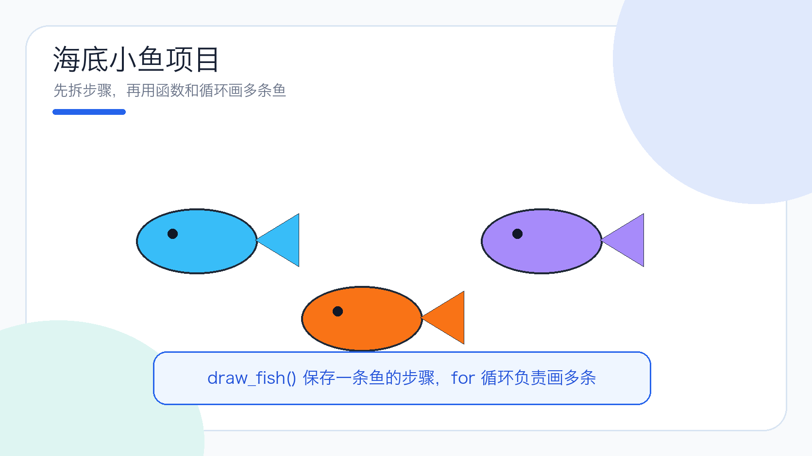

图示：Turtle 项目：拆步骤画多条小鱼

#### 学习目标

- 孩子能把一条小鱼拆成身体、尾巴、移动三步
- 孩子能用函数保存一组画鱼动作
- 孩子能用for循环重复画多条小鱼
- 孩子能理解penup/pendown是移动画笔时常用的开关
- 孩子能先输出创作步骤，再迁移到真实Turtle画图

#### 低龄课堂设计

| 项目 | 内容 |
| --- | --- |
| 适合对象 | 7-8岁，一二年级，适合先讲故事再看代码 |
| 节奏安排 | 复习3分钟，生活演示8分钟，代码拆解10分钟，上机练习10分钟，收口3分钟 |
| 统一语言 | 本课统一使用“海底小鱼印章”作比喻，少说抽象术语，多说动作和结果 |

- 每页演示只抓一个核心点，孩子能复述就进入下一页。
- 右侧老师提示可以照读；主画面给孩子看，不要把备课说明读给孩子。
- 如果孩子卡住，回到生活动作，不要停留在术语解释上。

#### 课堂流程

| 时间 | 环节 | 老师做什么 | 学生做什么 |
| --- | --- | --- | --- |
| 0-5分钟 | 复习连接 | 上一课小海龟会画正方形，知道了前进、转弯和重复。 | 说出上一课的关键词，跟老师把旧知识接回来。 |
| 5-12分钟 | 本课故事 | 今天做综合创作：把一条鱼拆成身体、尾巴、换位置，再用函数和循环画多条。 | 回答本课开场问题，先用生活语言理解概念。 |
| 12-24分钟 | 代码拆解 | 展示关键代码：def draw_fish(number): /     print(f"第{number}条鱼：画身体") /     print(f"第{number}条鱼：画尾巴") /  / for i in range(1, count + 1): /     draw_fish(i)。带孩子逐行说出每个零件的作用。 | 指出关键符号、函数名或变量名，预测输出。 |
| 24-34分钟 | 互动演示 | 先画一条鱼的三张步骤卡：身体、尾巴、换位置。再把三张卡放进draw_fish函数，循环调用多次。 | 用手势、纸条、黑板或口头预测完成一次非电脑演示。 |
| 34-42分钟 | 上机练习 | 让孩子照着模板完成学生端编程题，重点检查本课最容易错的地方。 | 运行代码，看到输出后再交卷。 |
| 42-45分钟 | 收口衔接 | 复杂创作先拆步骤；函数保存一组步骤，循环负责重复。 后面开始从进阶题库里挑适合的题型，改造成低龄孩子也能理解的小挑战。 | 说出今天带走的一句话。 |

#### 老师话术

##### 1. 开场：先接上一课

上一课小海龟会画正方形，知道了前进、转弯和重复。 今天我们继续往前走：今天做综合创作：把一条鱼拆成身体、尾巴、换位置，再用函数和循环画多条。

检查点：孩子能说出上一课关键词。

##### 2. 讲新概念：使用“海底小鱼印章”比喻

把今天的新知识想成“海底小鱼印章”。先用生活例子讲明白，再看代码。

检查点：复杂创作先拆步骤；函数保存一组步骤，循环负责重复。

##### 3. 看代码：逐行翻译

不要让孩子整段背。老师逐行问：这一行先做什么？下一行又做什么？

检查点：孩子能说出代码执行顺序。

##### 4. 孩子出错：先定位一个坑

本课最常见的问题是：孩子会定义函数但没有在for循环里调用，结果只写了工厂没开工。

检查点：孩子知道先检查哪里。

#### 课堂演示稿

##### 演示 1：复习：上一课接到这一课

上一课小海龟会画正方形，知道了前进、转弯和重复。

课堂提问：请先说一句：上一课我们最重要学到了什么？

检查点：孩子能说出上一课的一个关键词。

老师提示：

- 你可以照着这样讲
  - 每节课开头先帮孩子把旧知识叫醒，不要直接进入新概念。
  - 上一课小海龟会画正方形，知道了前进、转弯和重复。
- 课堂操作
  - 请1位孩子回答上一课关键词。
  - 老师把孩子的话整理成一句清楚的话，再进入本课。
- 新手老师提醒
  - 如果孩子答不上来，不要停太久。你直接给出关键词，让孩子跟读一遍即可。

##### 演示 2：本课任务：Turtle项目：海底小鱼

今天做综合创作：把一条鱼拆成身体、尾巴、换位置，再用函数和循环画多条。

课堂提问：如果要画3条鱼，draw_fish要被调用几次？

检查点：复杂创作先拆步骤；函数保存一组步骤，循环负责重复。

老师提示：

- 你可以照着这样讲
  - 上一课小海龟会画正方形，知道了前进、转弯和重复。
  - 今天做综合创作：把一条鱼拆成身体、尾巴、换位置，再用函数和循环画多条。
- 课堂操作
  - 先画一条鱼的三张步骤卡：身体、尾巴、换位置。再把三张卡放进draw_fish函数，循环调用多次。
  - 让孩子先预测，再运行或揭晓答案。低龄孩子先说出来，再敲代码，会更稳。
- 容易卡住的地方
  - 孩子会定义函数但没有在for循环里调用，结果只写了工厂没开工。
  - 孩子回答错时先追问“你是怎么看出来的？”，再带回屏幕上的关键词或符号。
- 过渡
  - 后面开始从进阶题库里挑适合的题型，改造成低龄孩子也能理解的小挑战。

##### 演示 3：看代码：把代码拆成小零件

今天的关键词：海底小鱼印章

```python
def draw_fish(number):
    print(f"第{number}条鱼：画身体")
    print(f"第{number}条鱼：画尾巴")

for i in range(1, count + 1):
    draw_fish(i)
```

课堂提问：你能找到今天最重要的符号或单词吗？

检查点：孩子能说出代码中的一个关键零件。

老师提示：

- 你可以照着这样讲
  - 我们不急着背整段代码，先把它拆成小零件。
  - 每个小零件都有自己的工作，找到它们，代码就不吓人了。
- 课堂操作
  - 先让孩子只看第一行，指出变量名、函数名或符号。
  - 再看第二行，让孩子预测电脑下一步会做什么。
  - 最后把每一行连成完整故事。
- 检查方式
  - 问孩子：这段代码先做什么？再做什么？最后输出什么？

##### 演示 4：互动：先动手，再敲代码

先画一条鱼的三张步骤卡：身体、尾巴、换位置。再把三张卡放进draw_fish函数，循环调用多次。

课堂提问：如果要画3条鱼，draw_fish要被调用几次？

检查点：孩子能把动作说成步骤。

老师提示：

- 你可以照着这样讲
  - 我们先不用电脑，用手、纸条或黑板把题目演一遍。
  - 演明白以后，再把动作翻译成代码。
- 课堂操作
  - 先画一条鱼的三张步骤卡：身体、尾巴、换位置。再把三张卡放进draw_fish函数，循环调用多次。
  - 请孩子说出刚才动作里的顺序：第一步、第二步、第三步。
  - 把孩子说的话写成简短关键词。
- 低龄课堂提醒
  - 7-8岁孩子很需要身体动作和可见物品。先做动作，再看代码，理解会更顺。

##### 演示 5：避坑：最容易错在哪里？

孩子会定义函数但没有在for循环里调用，结果只写了工厂没开工。

课堂提问：如果这里出错，我们第一步检查什么？

检查点：孩子知道本课最常见的错误点。

老师提示：

- 你可以照着这样讲
  - 程序员不是不犯错，程序员是会检查错误。
  - 今天我们先记住最常见的一个坑。
- 带孩子检查
  - 孩子会定义函数但没有在for循环里调用，结果只写了工厂没开工。
  - 让孩子用手指屏幕上的关键位置，一起检查符号、顺序、括号或缩进。
- 鼓励话术
  - 写错不是失败，能找到错在哪里，就是程序员很厉害的能力。

##### 演示 6：收口：今天带走一句话

复杂创作先拆步骤；函数保存一组步骤，循环负责重复。

- 小鱼 = 身体 + 尾巴 + 换位置
- 函数保存画一条鱼
- for循环画多条鱼

课堂提问：请选一句你最记得的话读出来。

检查点：孩子能说出本课核心句。

老师提示：

- 收尾方式
  - 先全班齐读本页标题。
  - 请2-3位孩子各说一句自己记住的话。
  - 再切回学生练习，让孩子马上做一道题巩固。
- 衔接下一课
  - 后面开始从进阶题库里挑适合的题型，改造成低龄孩子也能理解的小挑战。

#### 概念讲解

##### 1. 复杂图形先拆开

一幅画可以拆成几个小动作，逐个完成。

例子：

```python
小鱼 = 身体 + 尾巴 + 换位置
```

老师可以这样说：不要一口气画整片海，先画一条鱼，再复制多条。

问孩子：一条小鱼可以拆成哪几部分？

##### 2. 函数保存动作

把画一条鱼的步骤放进函数，后面就能重复使用。

例子：

```python
def draw_fish(number):
```

老师可以这样说：函数像一个画鱼印章，按一次就画一条。

问孩子：如果要画3条鱼，函数能帮我们少写什么？

##### 3. 循环画多条

for循环可以多次调用画鱼函数。

例子：

```python
for i in range(1, count + 1):
    draw_fish(i)
```

老师可以这样说：循环像连续盖章：第1条、第2条、第3条。

问孩子：count是3时，会调用draw_fish几次？

##### 4. 移动到新位置

画完一个图形后，常常要移动到别的位置再画下一个。

例子：

```python
penup移动，pendown继续画。
```

老师可以这样说：penup像把笔抬起来走路，不会在路上留下乱线。

问孩子：移动位置时，为什么要先把笔抬起来？

##### 5. 创作步骤可检查

先用文字输出创作步骤，可以检查顺序是否清楚。

例子：

```python
第1条鱼：画身体
```

老师可以这样说：低龄课堂先把动作排顺，再进真实画布，孩子更不容易乱。

问孩子：如果步骤顺序乱了，画出来会不会乱？

#### 典型错误

##### 1. 函数定义了但循环里没有调用

错误写法：

```python
def draw_fish(number):
    print(number)

for i in range(3):
    print("鱼")
```

改正写法：

```python
def draw_fish(number):
    print(number)

for i in range(1, count + 1):
    draw_fish(i)
```

函数要在循环里被调用，才会重复画多条鱼。

##### 2. range少写count + 1

错误写法：

```python
for i in range(1, count):
```

改正写法：

```python
for i in range(1, count + 1):
```

range右边不包含，所以要写count + 1才能数到最后一条。

##### 3. 忘记把输入转成数字

错误写法：

```python
count = input()
for i in range(1, count + 1):
```

改正写法：

```python
count = int(input())
for i in range(1, count + 1):
```

range需要数字，input听到的是文字，要先int()。

#### 课堂实操：海底小鱼排队

- 先画一条小鱼：身体、尾巴、换位置
- 让孩子说出重复画3条鱼时，哪些步骤相同
- 把相同步骤装进draw_fish函数
- 再用for循环调用函数，完成多条鱼

#### 教学提醒

这一课是Turtle拓展项目收束课。学生端依旧用可判题的“步骤清单”，教师端可以现场演示如何把这些步骤换成turtle的forward、circle、right、penup。 低龄课堂建议：孩子会定义函数但没有在for循环里调用，结果只写了工厂没开工。

#### 板书与课后沟通

板书建议：

- 小鱼 = 身体 + 尾巴 + 换位置
- 函数保存画一条鱼
- for循环画多条鱼
- range(1, count + 1) 数到count
- 先排清步骤，再进画布

家长沟通：

今天孩子完成Turtle综合创作思维。家长可以问：为什么画多条鱼适合用函数加循环？

#### 学生练习

##### 1. 一条小鱼可以先拆成哪些步骤？

A. 身体、尾巴、换位置
B. 只有一行print
C. 打开文件、关闭文件
D. 加法、减法、乘法

答案：A. 身体、尾巴、换位置
分值：10
解析：复杂图形先拆成可理解的小动作。

##### 2. 把画鱼步骤放进函数，有什么好处？

A. 可以重复使用
B. 一定会变成大写
C. 不用运行代码
D. 不能出错

答案：A. 可以重复使用
分值：10
解析：函数可以保存一组步骤，后面重复调用。

##### 3. count = 3时，for i in range(1, count + 1)会得到哪些i？

A. 1、2、3
B. 0、1、2
C. 1、2
D. 3、4、5

答案：A. 1、2、3
分值：10
解析：range右边不包含，所以count + 1让它数到3。

##### 4. 真实Turtle里，移动位置又不想画乱线，常用什么？

A. penup和pendown
B. upper和lower
C. break和continue
D. read和write

答案：A. penup和pendown
分值：10
解析：penup抬笔移动，pendown落笔继续画。

#### 编程挑战：海龟画鱼步骤清单

通关徽章：海底创作家

分值：70

请用函数和循环写出“画小鱼”的步骤清单。

输入一个数字count，表示要画几条鱼。
每条鱼输出三行：
第i条鱼：画身体
第i条鱼：画尾巴
第i条鱼：换位置

例如输入：
2

输出：
第1条鱼：画身体
第1条鱼：画尾巴
第1条鱼：换位置
第2条鱼：画身体
第2条鱼：画尾巴
第2条鱼：换位置

提示：

```python
把画一条鱼的三步放进函数，再用for循环调用：

def draw_fish(number):
    print(f"第{number}条鱼：画身体")
    print(f"第{number}条鱼：画尾巴")
    print(f"第{number}条鱼：换位置")

count = int(input())
for i in range(1, count + 1):
    draw_fish(i)
```

起始代码：

```python
# Turtle项目：海底小鱼步骤清单

def draw_fish(number):
    print(f"第{number}条鱼：画身体")
    print(f"第{number}条鱼：画尾巴")
    print(f"第{number}条鱼：换位置")

count = int(input())

for i in range(1, count + 1):
    draw_fish(i)
```

测试样例：

| 样例 | 输入 | 期望输出 |
| --- | --- | --- |
| 2条鱼 | 2 | 第1条鱼：画身体<br>第1条鱼：画尾巴<br>第1条鱼：换位置<br>第2条鱼：画身体<br>第2条鱼：画尾巴<br>第2条鱼：换位置 |
| 1条鱼 | 1 | 第1条鱼：画身体<br>第1条鱼：画尾巴<br>第1条鱼：换位置 |

# 题库改造挑战

## 第 25 课：不重复的魔法盒

章节：题库改造挑战
课型：拓展挑战
难度：★★
考点：集合set、去重、len长度、split输入

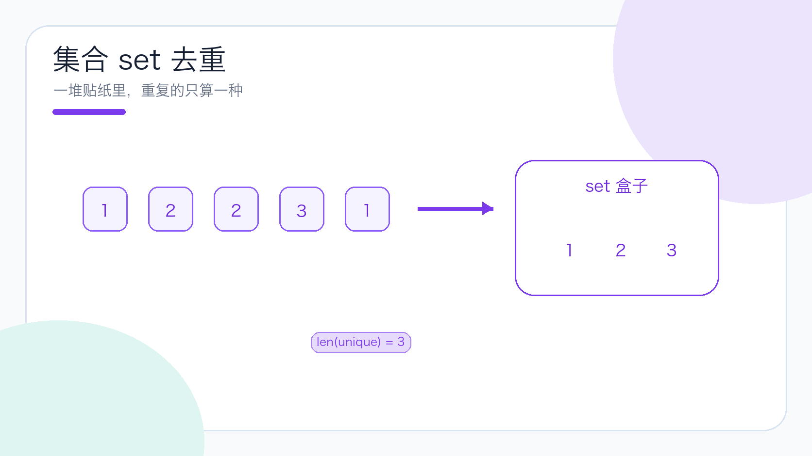

图示：集合 set：重复内容只保留一份

#### 学习目标

- 孩子能说出：set集合像一个不收重复贴纸的盒子
- 孩子能理解：重复元素放进set后只保留一份
- 孩子能使用split()把一行输入拆成许多小贴纸
- 孩子能使用len(set(...))数出不同贴纸的数量
- 孩子能把题库里的“集合不重复”改造成生活小题

#### 低龄课堂设计

| 项目 | 内容 |
| --- | --- |
| 适合对象 | 7-8岁，一二年级，适合先讲故事再看代码 |
| 节奏安排 | 复习3分钟，生活演示8分钟，代码拆解10分钟，上机练习10分钟，收口3分钟 |
| 统一语言 | 本课统一使用“不重复贴纸盒”作比喻，少说抽象术语，多说动作和结果 |

- 每页演示只抓一个核心点，孩子能复述就进入下一页。
- 右侧老师提示可以照读；主画面给孩子看，不要把备课说明读给孩子。
- 如果孩子卡住，回到生活动作，不要停留在术语解释上。

#### 课堂流程

| 时间 | 环节 | 老师做什么 | 学生做什么 |
| --- | --- | --- | --- |
| 0-5分钟 | 复习连接 | 前面我们已经会用列表保存一队东西，也会用len数数量。 | 说出上一课的关键词，跟老师把旧知识接回来。 |
| 5-12分钟 | 本课故事 | 今天认识集合set：它像一个不收重复贴纸的魔法盒，重复的内容只保留一份。 | 回答本课开场问题，先用生活语言理解概念。 |
| 12-24分钟 | 代码拆解 | 展示关键代码：stickers = input().split() / unique = set(stickers) / print(len(unique))。带孩子逐行说出每个零件的作用。 | 指出关键符号、函数名或变量名，预测输出。 |
| 24-34分钟 | 互动演示 | 拿5张贴纸卡片：1、2、2、3、1。先数张数，再把重复的叠在一起，只数种类。 | 用手势、纸条、黑板或口头预测完成一次非电脑演示。 |
| 34-42分钟 | 上机练习 | 让孩子照着模板完成学生端编程题，重点检查本课最容易错的地方。 | 运行代码，看到输出后再交卷。 |
| 42-45分钟 | 收口衔接 | set负责去重，len负责数去重后的数量。 下一课继续题库改造：把一队数字先加工，再用条件筛选。 | 说出今天带走的一句话。 |

#### 老师话术

##### 1. 开场：先接上一课

前面我们已经会用列表保存一队东西，也会用len数数量。 今天我们继续往前走：今天认识集合set：它像一个不收重复贴纸的魔法盒，重复的内容只保留一份。

检查点：孩子能说出上一课关键词。

##### 2. 讲新概念：使用“不重复贴纸盒”比喻

把今天的新知识想成“不重复贴纸盒”。先用生活例子讲明白，再看代码。

检查点：set负责去重，len负责数去重后的数量。

##### 3. 看代码：逐行翻译

不要让孩子整段背。老师逐行问：这一行先做什么？下一行又做什么？

检查点：孩子能说出代码执行顺序。

##### 4. 孩子出错：先定位一个坑

本课最常见的问题是：孩子会直接len原列表，把重复贴纸也算进去。

检查点：孩子知道先检查哪里。

#### 课堂演示稿

##### 演示 1：复习：上一课接到这一课

前面我们已经会用列表保存一队东西，也会用len数数量。

课堂提问：请先说一句：上一课我们最重要学到了什么？

检查点：孩子能说出上一课的一个关键词。

老师提示：

- 你可以照着这样讲
  - 每节课开头先帮孩子把旧知识叫醒，不要直接进入新概念。
  - 前面我们已经会用列表保存一队东西，也会用len数数量。
- 课堂操作
  - 请1位孩子回答上一课关键词。
  - 老师把孩子的话整理成一句清楚的话，再进入本课。
- 新手老师提醒
  - 如果孩子答不上来，不要停太久。你直接给出关键词，让孩子跟读一遍即可。

##### 演示 2：本课任务：不重复的魔法盒

今天认识集合set：它像一个不收重复贴纸的魔法盒，重复的内容只保留一份。

课堂提问：1、2、2、3、1一共有几张贴纸？又有几种贴纸？

检查点：set负责去重，len负责数去重后的数量。

老师提示：

- 你可以照着这样讲
  - 前面我们已经会用列表保存一队东西，也会用len数数量。
  - 今天认识集合set：它像一个不收重复贴纸的魔法盒，重复的内容只保留一份。
- 课堂操作
  - 拿5张贴纸卡片：1、2、2、3、1。先数张数，再把重复的叠在一起，只数种类。
  - 让孩子先预测，再运行或揭晓答案。低龄孩子先说出来，再敲代码，会更稳。
- 容易卡住的地方
  - 孩子会直接len原列表，把重复贴纸也算进去。
  - 孩子回答错时先追问“你是怎么看出来的？”，再带回屏幕上的关键词或符号。
- 过渡
  - 下一课继续题库改造：把一队数字先加工，再用条件筛选。

##### 演示 3：看代码：把代码拆成小零件

今天的关键词：不重复贴纸盒

```python
stickers = input().split()
unique = set(stickers)
print(len(unique))
```

课堂提问：你能找到今天最重要的符号或单词吗？

检查点：孩子能说出代码中的一个关键零件。

老师提示：

- 你可以照着这样讲
  - 我们不急着背整段代码，先把它拆成小零件。
  - 每个小零件都有自己的工作，找到它们，代码就不吓人了。
- 课堂操作
  - 先让孩子只看第一行，指出变量名、函数名或符号。
  - 再看第二行，让孩子预测电脑下一步会做什么。
  - 最后把每一行连成完整故事。
- 检查方式
  - 问孩子：这段代码先做什么？再做什么？最后输出什么？

##### 演示 4：互动：先动手，再敲代码

拿5张贴纸卡片：1、2、2、3、1。先数张数，再把重复的叠在一起，只数种类。

课堂提问：1、2、2、3、1一共有几张贴纸？又有几种贴纸？

检查点：孩子能把动作说成步骤。

老师提示：

- 你可以照着这样讲
  - 我们先不用电脑，用手、纸条或黑板把题目演一遍。
  - 演明白以后，再把动作翻译成代码。
- 课堂操作
  - 拿5张贴纸卡片：1、2、2、3、1。先数张数，再把重复的叠在一起，只数种类。
  - 请孩子说出刚才动作里的顺序：第一步、第二步、第三步。
  - 把孩子说的话写成简短关键词。
- 低龄课堂提醒
  - 7-8岁孩子很需要身体动作和可见物品。先做动作，再看代码，理解会更顺。

##### 演示 5：避坑：最容易错在哪里？

孩子会直接len原列表，把重复贴纸也算进去。

课堂提问：如果这里出错，我们第一步检查什么？

检查点：孩子知道本课最常见的错误点。

老师提示：

- 你可以照着这样讲
  - 程序员不是不犯错，程序员是会检查错误。
  - 今天我们先记住最常见的一个坑。
- 带孩子检查
  - 孩子会直接len原列表，把重复贴纸也算进去。
  - 让孩子用手指屏幕上的关键位置，一起检查符号、顺序、括号或缩进。
- 鼓励话术
  - 写错不是失败，能找到错在哪里，就是程序员很厉害的能力。

##### 演示 6：收口：今天带走一句话

set负责去重，len负责数去重后的数量。

- set = 不重复盒子
- split() = 拆开一行输入
- set(stickers) = 去重

课堂提问：请选一句你最记得的话读出来。

检查点：孩子能说出本课核心句。

老师提示：

- 收尾方式
  - 先全班齐读本页标题。
  - 请2-3位孩子各说一句自己记住的话。
  - 再切回学生练习，让孩子马上做一道题巩固。
- 衔接下一课
  - 下一课继续题库改造：把一队数字先加工，再用条件筛选。

#### 概念讲解

##### 1. 集合 set

set是一种不允许重复内容的容器。

例子：

```python
set([1, 2, 2, 3]) 会得到 {1, 2, 3}
```

老师可以这样说：集合像一个有规则的贴纸盒，同样的贴纸只能放一张。

问孩子：如果盒子里已经有2，再放一个2，会变成两个2吗？

##### 2. 去重

去重就是把重复的东西合并成一份。

例子：

```python
1 2 2 3 1 去重后有 1、2、3。
```

老师可以这样说：我们不是把贴纸丢掉，而是在数种类，不数重复张数。

问孩子：1、1、1 算几种贴纸？

##### 3. split()拆开一行

split()会把一整行文字按空格拆成列表。

例子：

```python
"1 2 2".split() 得到 ['1', '2', '2']。
```

老师可以这样说：一整串贴纸编号先排成队，split负责把它们一个个分开。

问孩子：输入1 2 3，split以后有几个小东西？

##### 4. len()数一数

len()可以数容器里有几个元素。

例子：

```python
len(set(stickers))
```

老师可以这样说：set负责去重，len负责数盒子里还剩几种。

问孩子：去重后是1、2、3，len是多少？

#### 典型错误

##### 1. 直接数原列表，忘记去重

错误写法：

```python
stickers = input().split()
print(len(stickers))
```

改正写法：

```python
stickers = input().split()
print(len(set(stickers)))
```

原列表会把重复贴纸也算进去，set才会先去重。

##### 2. 把set写成字符串

错误写法：

```python
unique = "set(stickers)"
```

改正写法：

```python
unique = set(stickers)
```

引号里只是普通文字，真正调用set不要加引号。

##### 3. 忘记split，整行只算成一个东西

错误写法：

```python
stickers = input()
print(len(set(stickers)))
```

改正写法：

```python
stickers = input().split()
print(len(set(stickers)))
```

没有split时，程序会按字符看，不是按贴纸编号看。

#### 课堂实操：贴纸去重

- 准备几张编号贴纸：1、2、2、3、1
- 让孩子先数一共有几张，再数有几种
- 把“有几种”对应到set去重
- 最后用len数不同贴纸数量

#### 教学提醒

用贴纸或卡片演示最直观：同样编号的贴纸可以拿出来，但种类只算一次。 低龄课堂建议：孩子会直接len原列表，把重复贴纸也算进去。

#### 板书与课后沟通

板书建议：

- set = 不重复盒子
- split() = 拆开一行输入
- set(stickers) = 去重
- len(unique) = 数种类
- 张数和种类不一定一样

家长沟通：

今天孩子学习集合去重。家长可以问：1、1、2、3有几张？有几种？

#### 学生练习

##### 1. 哪种容器最像“不收重复贴纸的盒子”？

A. set集合
B. 普通字符串
C. print
D. if

答案：A. set集合
分值：10
解析：set集合不允许重复元素。

##### 2. 1 2 2 3 1 去重后有几种数字？

A. 3种
B. 5种
C. 2种
D. 1种

答案：A. 3种
分值：10
解析：不同数字是1、2、3，共3种。

##### 3. input().split()的作用更像什么？

A. 把一行内容按空格拆开
B. 让数字变大
C. 停止循环
D. 打开图片

答案：A. 把一行内容按空格拆开
分值：10
解析：split会把一行输入拆成多个小字符串。

#### 编程挑战：数一数不同贴纸

通关徽章：去重小侦探

分值：60

输入一行贴纸编号，编号之间用空格隔开。
请输出一共有几种不同的贴纸。

例如输入：
1 2 2 3 1

输出：
3

提示：

```python
先用split拆开，再用set去重，最后用len数数量：

stickers = input().split()
unique = set(stickers)
print(len(unique))
```

起始代码：

```python
# 不重复的魔法盒：数不同贴纸

stickers = input().split()
unique = set(stickers)

print(len(unique))
```

测试样例：

| 样例 | 输入 | 期望输出 |
| --- | --- | --- |
| 有重复贴纸 | 1 2 2 3 1 | 3 |
| 全都一样 | 5 5 5 5 | 1 |
| 都不重复 | 1 2 3 4 | 4 |

## 第 26 课：糖果加工机

章节：题库改造挑战
课型：拓展挑战
难度：★★★
考点：for循环、列表append、条件筛选、批量处理

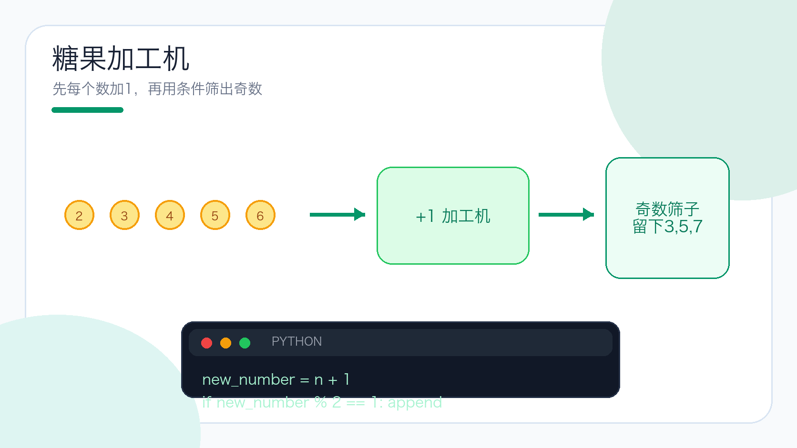

图示：批量处理：先加工，再筛选

#### 学习目标

- 孩子能说出：批量加工就是对一队数字逐个做同一件事
- 孩子能用for循环遍历一行数字
- 孩子能理解：先加1，再筛选奇数
- 孩子能用append把符合条件的结果收集起来
- 孩子能把高阶函数题改写成低龄可理解的循环题

#### 低龄课堂设计

| 项目 | 内容 |
| --- | --- |
| 适合对象 | 7-8岁，一二年级，适合先讲故事再看代码 |
| 节奏安排 | 复习3分钟，生活演示8分钟，代码拆解10分钟，上机练习10分钟，收口3分钟 |
| 统一语言 | 本课统一使用“糖果加工机和筛子”作比喻，少说抽象术语，多说动作和结果 |

- 每页演示只抓一个核心点，孩子能复述就进入下一页。
- 右侧老师提示可以照读；主画面给孩子看，不要把备课说明读给孩子。
- 如果孩子卡住，回到生活动作，不要停留在术语解释上。

#### 课堂流程

| 时间 | 环节 | 老师做什么 | 学生做什么 |
| --- | --- | --- | --- |
| 0-5分钟 | 复习连接 | 上一课我们用set把重复内容去掉，只留下不同种类。 | 说出上一课的关键词，跟老师把旧知识接回来。 |
| 5-12分钟 | 本课故事 | 今天做批量加工：每个数字先进加1机器，再过奇数筛子。 | 回答本课开场问题，先用生活语言理解概念。 |
| 12-24分钟 | 代码拆解 | 展示关键代码：for n in nums: /     new_number = n + 1 /     if new_number % 2 == 1: /         answer.append(str(new_number))。带孩子逐行说出每个零件的作用。 | 指出关键符号、函数名或变量名，预测输出。 |
| 24-34分钟 | 互动演示 | 用数字卡片排队，先每张卡加1，再只留下奇数卡片。让孩子说出加工前、加工后、筛选后三队。 | 用手势、纸条、黑板或口头预测完成一次非电脑演示。 |
| 34-42分钟 | 上机练习 | 让孩子照着模板完成学生端编程题，重点检查本课最容易错的地方。 | 运行代码，看到输出后再交卷。 |
| 42-45分钟 | 收口衔接 | 先加工，再筛选；append把合格结果放进列表。 下一课把进阶大题改小：用滑动窗口找连续几天最接近目标。 | 说出今天带走的一句话。 |

#### 老师话术

##### 1. 开场：先接上一课

上一课我们用set把重复内容去掉，只留下不同种类。 今天我们继续往前走：今天做批量加工：每个数字先进加1机器，再过奇数筛子。

检查点：孩子能说出上一课关键词。

##### 2. 讲新概念：使用“糖果加工机和筛子”比喻

把今天的新知识想成“糖果加工机和筛子”。先用生活例子讲明白，再看代码。

检查点：先加工，再筛选；append把合格结果放进列表。

##### 3. 看代码：逐行翻译

不要让孩子整段背。老师逐行问：这一行先做什么？下一行又做什么？

检查点：孩子能说出代码执行顺序。

##### 4. 孩子出错：先定位一个坑

本课最常见的问题是：孩子会先判断原数字是不是奇数，忘了题目要求先加1。

检查点：孩子知道先检查哪里。

#### 课堂演示稿

##### 演示 1：复习：上一课接到这一课

上一课我们用set把重复内容去掉，只留下不同种类。

课堂提问：请先说一句：上一课我们最重要学到了什么？

检查点：孩子能说出上一课的一个关键词。

老师提示：

- 你可以照着这样讲
  - 每节课开头先帮孩子把旧知识叫醒，不要直接进入新概念。
  - 上一课我们用set把重复内容去掉，只留下不同种类。
- 课堂操作
  - 请1位孩子回答上一课关键词。
  - 老师把孩子的话整理成一句清楚的话，再进入本课。
- 新手老师提醒
  - 如果孩子答不上来，不要停太久。你直接给出关键词，让孩子跟读一遍即可。

##### 演示 2：本课任务：糖果加工机

今天做批量加工：每个数字先进加1机器，再过奇数筛子。

课堂提问：2、3、4、5、6都加1以后，哪些是奇数？

检查点：先加工，再筛选；append把合格结果放进列表。

老师提示：

- 你可以照着这样讲
  - 上一课我们用set把重复内容去掉，只留下不同种类。
  - 今天做批量加工：每个数字先进加1机器，再过奇数筛子。
- 课堂操作
  - 用数字卡片排队，先每张卡加1，再只留下奇数卡片。让孩子说出加工前、加工后、筛选后三队。
  - 让孩子先预测，再运行或揭晓答案。低龄孩子先说出来，再敲代码，会更稳。
- 容易卡住的地方
  - 孩子会先判断原数字是不是奇数，忘了题目要求先加1。
  - 孩子回答错时先追问“你是怎么看出来的？”，再带回屏幕上的关键词或符号。
- 过渡
  - 下一课把进阶大题改小：用滑动窗口找连续几天最接近目标。

##### 演示 3：看代码：把代码拆成小零件

今天的关键词：糖果加工机和筛子

```python
for n in nums:
    new_number = n + 1
    if new_number % 2 == 1:
        answer.append(str(new_number))
```

课堂提问：你能找到今天最重要的符号或单词吗？

检查点：孩子能说出代码中的一个关键零件。

老师提示：

- 你可以照着这样讲
  - 我们不急着背整段代码，先把它拆成小零件。
  - 每个小零件都有自己的工作，找到它们，代码就不吓人了。
- 课堂操作
  - 先让孩子只看第一行，指出变量名、函数名或符号。
  - 再看第二行，让孩子预测电脑下一步会做什么。
  - 最后把每一行连成完整故事。
- 检查方式
  - 问孩子：这段代码先做什么？再做什么？最后输出什么？

##### 演示 4：互动：先动手，再敲代码

用数字卡片排队，先每张卡加1，再只留下奇数卡片。让孩子说出加工前、加工后、筛选后三队。

课堂提问：2、3、4、5、6都加1以后，哪些是奇数？

检查点：孩子能把动作说成步骤。

老师提示：

- 你可以照着这样讲
  - 我们先不用电脑，用手、纸条或黑板把题目演一遍。
  - 演明白以后，再把动作翻译成代码。
- 课堂操作
  - 用数字卡片排队，先每张卡加1，再只留下奇数卡片。让孩子说出加工前、加工后、筛选后三队。
  - 请孩子说出刚才动作里的顺序：第一步、第二步、第三步。
  - 把孩子说的话写成简短关键词。
- 低龄课堂提醒
  - 7-8岁孩子很需要身体动作和可见物品。先做动作，再看代码，理解会更顺。

##### 演示 5：避坑：最容易错在哪里？

孩子会先判断原数字是不是奇数，忘了题目要求先加1。

课堂提问：如果这里出错，我们第一步检查什么？

检查点：孩子知道本课最常见的错误点。

老师提示：

- 你可以照着这样讲
  - 程序员不是不犯错，程序员是会检查错误。
  - 今天我们先记住最常见的一个坑。
- 带孩子检查
  - 孩子会先判断原数字是不是奇数，忘了题目要求先加1。
  - 让孩子用手指屏幕上的关键位置，一起检查符号、顺序、括号或缩进。
- 鼓励话术
  - 写错不是失败，能找到错在哪里，就是程序员很厉害的能力。

##### 演示 6：收口：今天带走一句话

先加工，再筛选；append把合格结果放进列表。

- 批量加工 = 每个数字都做同一件事
- new_number = n + 1
- if new_number % 2 == 1

课堂提问：请选一句你最记得的话读出来。

检查点：孩子能说出本课核心句。

老师提示：

- 收尾方式
  - 先全班齐读本页标题。
  - 请2-3位孩子各说一句自己记住的话。
  - 再切回学生练习，让孩子马上做一道题巩固。
- 衔接下一课
  - 下一课把进阶大题改小：用滑动窗口找连续几天最接近目标。

#### 概念讲解

##### 1. 批量加工

批量加工就是让每个数字都经过同一台机器。

例子：

```python
2、3、4 每个都加1，变成3、4、5。
```

老师可以这样说：这像糖果排队进机器，每颗糖都被加上一层糖衣。

问孩子：2经过“加1机器”后变成几？

##### 2. 筛选

筛选就是只留下符合条件的东西。

例子：

```python
只留下奇数：3、5、7。
```

老师可以这样说：筛子只让合格糖果通过，不合格的留在外面。

问孩子：4是奇数还是偶数？能通过奇数筛子吗？

##### 3. append收集

append可以把新结果放进列表尾巴。

例子：

```python
answer.append(str(new_number))
```

老师可以这样说：answer像一个托盘，符合条件的糖果就放上去。

问孩子：找到一个合格数字以后，要放进哪个托盘？

##### 4. 从map/filter到for

进阶题里会出现map和filter，低龄课堂先用for循环理解同样的动作。

例子：

```python
for n in nums: 先加工，再判断。
```

老师可以这样说：map像加工机，filter像筛子；我们先用for把机器和筛子的过程讲清楚。

问孩子：加工和筛选，哪个先做？

#### 典型错误

##### 1. 先筛选再加1，顺序反了

错误写法：

```python
if n % 2 == 1:
    answer.append(str(n + 1))
```

改正写法：

```python
new_number = n + 1
if new_number % 2 == 1:
    answer.append(str(new_number))
```

题目要求先加1，再看加完后的数字是不是奇数。

##### 2. append数字后直接join

错误写法：

```python
answer.append(new_number)
print(" ".join(answer))
```

改正写法：

```python
answer.append(str(new_number))
print(" ".join(answer))
```

join只能连接字符串，数字要先str()。

##### 3. 没有处理一个都不符合的情况

错误写法：

```python
print(" ".join(answer))
```

改正写法：

```python
if answer:
    print(" ".join(answer))
else:
    print("没有符合的数字")
```

如果托盘是空的，要给出清楚提示。

#### 课堂实操：加1糖衣和奇数筛子

- 拿数字卡片2、3、4、5、6排队
- 每张卡先加1，变成3、4、5、6、7
- 只留下奇数卡片3、5、7
- 把动作翻译成for循环、if判断和append

#### 教学提醒

这题来自进阶题库的map/filter思想，但课堂上先不强调术语。用“加工机+筛子”的故事更适合低龄孩子。 低龄课堂建议：孩子会先判断原数字是不是奇数，忘了题目要求先加1。

#### 板书与课后沟通

板书建议：

- 批量加工 = 每个数字都做同一件事
- new_number = n + 1
- if new_number % 2 == 1
- append = 放进结果托盘
- join = 排成一行输出

家长沟通：

今天孩子练习批量处理和条件筛选。家长可以问：为什么要先加1，再判断奇数？

#### 学生练习

##### 1. 2经过“加1机器”后变成几？

A. 3
B. 2
C. 1
D. 4

答案：A. 3
分值：10
解析：2 + 1 = 3。

##### 2. 筛选奇数时，哪个数字会留下？

A. 5
B. 4
C. 8
D. 10

答案：A. 5
分值：10
解析：5是奇数，会留下。

##### 3. answer.append(...)像在做什么？

A. 把合格结果放进托盘
B. 退出循环
C. 打开文件
D. 画一条线

答案：A. 把合格结果放进托盘
分值：10
解析：append会把元素加入列表。

#### 编程挑战：加1后留下奇数

通关徽章：加工筛选师

分值：70

输入一行数字。
请让每个数字先加1，再只留下加完以后是奇数的数字。
用空格输出留下的数字。
如果一个都没有，输出：没有符合的数字

例如输入：
2 3 4 5 6

输出：
3 5 7

提示：

```python
先循环每个数字，做new_number = n + 1，再判断new_number是不是奇数：

nums = list(map(int, input().split()))
answer = []
for n in nums:
    new_number = n + 1
    if new_number % 2 == 1:
        answer.append(str(new_number))
print(" ".join(answer))
```

起始代码：

```python
# 糖果加工机：加1后留下奇数

nums = list(map(int, input().split()))
answer = []

for n in nums:
    new_number = n + 1
    if new_number % 2 == 1:
        answer.append(str(new_number))

if answer:
    print(" ".join(answer))
else:
    print("没有符合的数字")
```

测试样例：

| 样例 | 输入 | 期望输出 |
| --- | --- | --- |
| 题库风格例子 | 2 3 4 5 6 | 3 5 7 |
| 只有一个留下 | 1 2 7 | 3 |
| 没有留下 | 1 3 5 | 没有符合的数字 |

## 第 27 课：花园浇水计划

章节：题库改造挑战
课型：拓展挑战
难度：★★★★
考点：连续区间、for循环、sum求和、abs绝对值、最小值更新

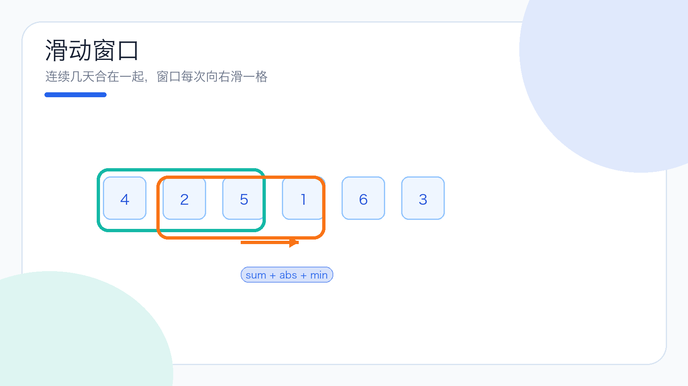

图示：滑动窗口：连续一段向右滑

#### 学习目标

- 孩子能理解：连续P天就是挨在一起的P个数字
- 孩子能用for循环枚举每一个连续小窗口
- 孩子能用sum计算窗口里的总水量
- 孩子能用abs计算和目标值的差距
- 孩子能不断更新最小差距，找到最接近的答案

#### 低龄课堂设计

| 项目 | 内容 |
| --- | --- |
| 适合对象 | 7-8岁，一二年级，适合先讲故事再看代码 |
| 节奏安排 | 复习3分钟，生活演示8分钟，代码拆解10分钟，上机练习10分钟，收口3分钟 |
| 统一语言 | 本课统一使用“会滑动的小尺子”作比喻，少说抽象术语，多说动作和结果 |

- 每页演示只抓一个核心点，孩子能复述就进入下一页。
- 右侧老师提示可以照读；主画面给孩子看，不要把备课说明读给孩子。
- 如果孩子卡住，回到生活动作，不要停留在术语解释上。

#### 课堂流程

| 时间 | 环节 | 老师做什么 | 学生做什么 |
| --- | --- | --- | --- |
| 0-5分钟 | 复习连接 | 上一课我们会让一队数字逐个加工和筛选。 | 说出上一课的关键词，跟老师把旧知识接回来。 |
| 5-12分钟 | 本课故事 | 今天看一段连续的小窗口：连续P天的水量加起来，谁离目标最近就选谁。 | 回答本课开场问题，先用生活语言理解概念。 |
| 12-24分钟 | 代码拆解 | 展示关键代码：for i in range(n - p + 1): /     current_sum = sum(demands[i:i+p]) /     diff = abs(current_sum - target) /     best = min(best, diff)。带孩子逐行说出每个零件的作用。 | 指出关键符号、函数名或变量名，预测输出。 |
| 24-34分钟 | 互动演示 | 把每天水量写成一排卡片，用尺子盖住连续P张。每次向右滑一格，算总和和差距。 | 用手势、纸条、黑板或口头预测完成一次非电脑演示。 |
| 34-42分钟 | 上机练习 | 让孩子照着模板完成学生端编程题，重点检查本课最容易错的地方。 | 运行代码，看到输出后再交卷。 |
| 42-45分钟 | 收口衔接 | 连续窗口不能跳；abs算差距，min留下最小差距。 下一课继续模拟类题目：让程序像电梯一样按顺序移动。 | 说出今天带走的一句话。 |

#### 老师话术

##### 1. 开场：先接上一课

上一课我们会让一队数字逐个加工和筛选。 今天我们继续往前走：今天看一段连续的小窗口：连续P天的水量加起来，谁离目标最近就选谁。

检查点：孩子能说出上一课关键词。

##### 2. 讲新概念：使用“会滑动的小尺子”比喻

把今天的新知识想成“会滑动的小尺子”。先用生活例子讲明白，再看代码。

检查点：连续窗口不能跳；abs算差距，min留下最小差距。

##### 3. 看代码：逐行翻译

不要让孩子整段背。老师逐行问：这一行先做什么？下一行又做什么？

检查点：孩子能说出代码执行顺序。

##### 4. 孩子出错：先定位一个坑

本课最常见的问题是：孩子容易少算最后一个窗口，range要写n - p + 1。

检查点：孩子知道先检查哪里。

#### 课堂演示稿

##### 演示 1：复习：上一课接到这一课

上一课我们会让一队数字逐个加工和筛选。

课堂提问：请先说一句：上一课我们最重要学到了什么？

检查点：孩子能说出上一课的一个关键词。

老师提示：

- 你可以照着这样讲
  - 每节课开头先帮孩子把旧知识叫醒，不要直接进入新概念。
  - 上一课我们会让一队数字逐个加工和筛选。
- 课堂操作
  - 请1位孩子回答上一课关键词。
  - 老师把孩子的话整理成一句清楚的话，再进入本课。
- 新手老师提醒
  - 如果孩子答不上来，不要停太久。你直接给出关键词，让孩子跟读一遍即可。

##### 演示 2：本课任务：花园浇水计划

今天看一段连续的小窗口：连续P天的水量加起来，谁离目标最近就选谁。

课堂提问：连续3天能不能跳着选？如果4、2、5加起来是多少？

检查点：连续窗口不能跳；abs算差距，min留下最小差距。

老师提示：

- 你可以照着这样讲
  - 上一课我们会让一队数字逐个加工和筛选。
  - 今天看一段连续的小窗口：连续P天的水量加起来，谁离目标最近就选谁。
- 课堂操作
  - 把每天水量写成一排卡片，用尺子盖住连续P张。每次向右滑一格，算总和和差距。
  - 让孩子先预测，再运行或揭晓答案。低龄孩子先说出来，再敲代码，会更稳。
- 容易卡住的地方
  - 孩子容易少算最后一个窗口，range要写n - p + 1。
  - 孩子回答错时先追问“你是怎么看出来的？”，再带回屏幕上的关键词或符号。
- 过渡
  - 下一课继续模拟类题目：让程序像电梯一样按顺序移动。

##### 演示 3：看代码：把代码拆成小零件

今天的关键词：会滑动的小尺子

```python
for i in range(n - p + 1):
    current_sum = sum(demands[i:i+p])
    diff = abs(current_sum - target)
    best = min(best, diff)
```

课堂提问：你能找到今天最重要的符号或单词吗？

检查点：孩子能说出代码中的一个关键零件。

老师提示：

- 你可以照着这样讲
  - 我们不急着背整段代码，先把它拆成小零件。
  - 每个小零件都有自己的工作，找到它们，代码就不吓人了。
- 课堂操作
  - 先让孩子只看第一行，指出变量名、函数名或符号。
  - 再看第二行，让孩子预测电脑下一步会做什么。
  - 最后把每一行连成完整故事。
- 检查方式
  - 问孩子：这段代码先做什么？再做什么？最后输出什么？

##### 演示 4：互动：先动手，再敲代码

把每天水量写成一排卡片，用尺子盖住连续P张。每次向右滑一格，算总和和差距。

课堂提问：连续3天能不能跳着选？如果4、2、5加起来是多少？

检查点：孩子能把动作说成步骤。

老师提示：

- 你可以照着这样讲
  - 我们先不用电脑，用手、纸条或黑板把题目演一遍。
  - 演明白以后，再把动作翻译成代码。
- 课堂操作
  - 把每天水量写成一排卡片，用尺子盖住连续P张。每次向右滑一格，算总和和差距。
  - 请孩子说出刚才动作里的顺序：第一步、第二步、第三步。
  - 把孩子说的话写成简短关键词。
- 低龄课堂提醒
  - 7-8岁孩子很需要身体动作和可见物品。先做动作，再看代码，理解会更顺。

##### 演示 5：避坑：最容易错在哪里？

孩子容易少算最后一个窗口，range要写n - p + 1。

课堂提问：如果这里出错，我们第一步检查什么？

检查点：孩子知道本课最常见的错误点。

老师提示：

- 你可以照着这样讲
  - 程序员不是不犯错，程序员是会检查错误。
  - 今天我们先记住最常见的一个坑。
- 带孩子检查
  - 孩子容易少算最后一个窗口，range要写n - p + 1。
  - 让孩子用手指屏幕上的关键位置，一起检查符号、顺序、括号或缩进。
- 鼓励话术
  - 写错不是失败，能找到错在哪里，就是程序员很厉害的能力。

##### 演示 6：收口：今天带走一句话

连续窗口不能跳；abs算差距，min留下最小差距。

- 连续P天 = 挨在一起P个数
- 窗口从左往右滑
- sum算窗口总和

课堂提问：请选一句你最记得的话读出来。

检查点：孩子能说出本课核心句。

老师提示：

- 收尾方式
  - 先全班齐读本页标题。
  - 请2-3位孩子各说一句自己记住的话。
  - 再切回学生练习，让孩子马上做一道题巩固。
- 衔接下一课
  - 下一课继续模拟类题目：让程序像电梯一样按顺序移动。

#### 概念讲解

##### 1. 连续小窗口

连续P天表示从某一天开始，连着看P天。

例子：

```python
4 2 5 1，连续3天可以是4+2+5，也可以是2+5+1。
```

老师可以这样说：窗口像尺子，每次盖住连续几天，然后向右滑一格。

问孩子：连续3天能不能跳过中间一天？

##### 2. 窗口求和

sum可以把窗口里的数字加起来。

例子：

```python
sum(demands[i:i+p])
```

老师可以这样说：窗口盖住哪几天，sum就帮我们把这几天的水量加起来。

问孩子：4、2、5加起来是多少？

##### 3. abs差距

abs可以把差距变成正数。

例子：

```python
abs(current_sum - target)
```

老师可以这样说：不管多了还是少了，我们只关心离目标有多远。

问孩子：8和10差几？12和10差几？

##### 4. 最小差距

每算一个窗口，就和当前最小差距比一比，留下更小的。

例子：

```python
best = min(best, diff)
```

老师可以这样说：best像冠军牌，谁离目标更近，冠军牌就交给谁。

问孩子：差距3和差距1，谁更接近目标？

#### 典型错误

##### 1. 窗口范围少算最后一组

错误写法：

```python
for i in range(n - p):
```

改正写法：

```python
for i in range(n - p + 1):
```

起点要一直滑到最后一个能放下P天窗口的位置。

##### 2. 忘记用abs，负数差距干扰比较

错误写法：

```python
diff = current_sum - target
```

改正写法：

```python
diff = abs(current_sum - target)
```

差距应该是距离，不能有负号。

##### 3. 每次都直接覆盖best

错误写法：

```python
best = diff
```

改正写法：

```python
best = min(best, diff)
```

best要保存目前最小的差距，不是保存最后一次差距。

#### 课堂实操：尺子滑窗口

- 把每天水量写成一排数字卡
- 用一把尺子盖住连续P张卡片
- 每滑一次就算总和与目标的差距
- 把最小差距圈出来，再写成代码

#### 教学提醒

这是大一点的编程题，适合作为独立挑战课。先用纸条摆出7天水量，再拿尺子盖住连续3天滑动。 低龄课堂建议：孩子容易少算最后一个窗口，range要写n - p + 1。

#### 板书与课后沟通

板书建议：

- 连续P天 = 挨在一起P个数
- 窗口从左往右滑
- sum算窗口总和
- abs算离目标多远
- best保存最小差距

家长沟通：

今天孩子挑战滑动窗口思想。家长可以用一排数字问：连续2个数有哪些组合？

#### 学生练习

##### 1. 连续3天是什么意思？

A. 挨在一起的3天
B. 随便挑3天
C. 只看第3天
D. 跳着看3天

答案：A. 挨在一起的3天
分值：10
解析：连续就是中间不能跳过。

##### 2. abs(8 - 10)的结果是多少？

A. 2
B. -2
C. 18
D. 0

答案：A. 2
分值：10
解析：abs会得到正的差距。

##### 3. best = min(best, diff)是在做什么？

A. 留下更小的差距
B. 把数字变成文字
C. 退出循环
D. 打开文件

答案：A. 留下更小的差距
分值：10
解析：min会选出更小的那个。

#### 编程挑战：找最接近目标的连续几天

通关徽章：滑动窗口小园丁

分值：80

花园每天需要不同水量。
输入N和P，表示一共有N天，要选择连续P天。
第二行输入N个水量。
第三行输入目标水量T。
请输出：连续P天水量总和与目标T最接近的差距。

例如输入：
7 3
4 2 5 1 3 6 2
10

输出：
0

提示：

```python
用窗口从左到右滑动：

n, p = map(int, input().split())
demands = list(map(int, input().split()))
target = int(input())
best = 10**9
for i in range(n - p + 1):
    current_sum = sum(demands[i:i+p])
    diff = abs(current_sum - target)
    best = min(best, diff)
print(best)
```

起始代码：

```python
# 花园浇水计划：连续P天最接近目标

n, p = map(int, input().split())
demands = list(map(int, input().split()))
target = int(input())

best = 10**9

for i in range(n - p + 1):
    current_sum = sum(demands[i:i+p])
    diff = abs(current_sum - target)
    best = min(best, diff)

print(best)
```

测试样例：

| 样例 | 输入 | 期望输出 |
| --- | --- | --- |
| 样例窗口 | 7 3<br>4 2 5 1 3 6 2<br>10 | 0 |
| 差距为2 | 5 2<br>1 4 8 2 3<br>7 | 2 |
| 正好命中 | 4 2<br>5 5 1 1<br>10 | 0 |

## 第 28 课：电梯小管家

章节：题库改造挑战
课型：拓展挑战
难度：★★★★
考点：模拟过程、列表遍历、if判断、差值计算、累加总时间

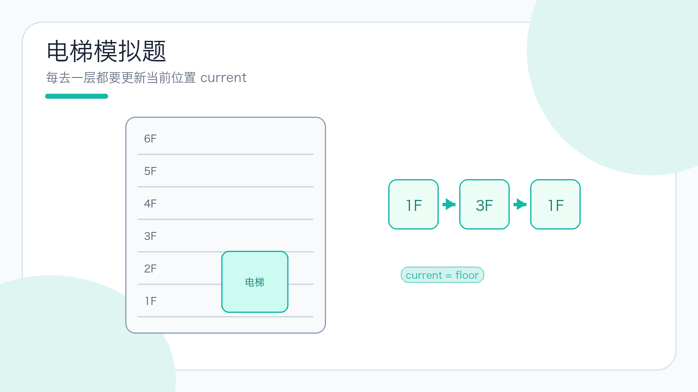

图示：电梯模拟：每到一站更新当前位置

#### 学习目标

- 孩子能理解：模拟题要按事情发生的顺序一步步算
- 孩子能用current记录电梯当前楼层
- 孩子能判断上楼和下楼使用不同时间
- 孩子能把每次移动时间和停留时间累加到total
- 孩子能完成一个简化版电梯调度题

#### 低龄课堂设计

| 项目 | 内容 |
| --- | --- |
| 适合对象 | 7-8岁，一二年级，适合先讲故事再看代码 |
| 节奏安排 | 复习3分钟，生活演示8分钟，代码拆解10分钟，上机练习10分钟，收口3分钟 |
| 统一语言 | 本课统一使用“楼层显示屏”作比喻，少说抽象术语，多说动作和结果 |

- 每页演示只抓一个核心点，孩子能复述就进入下一页。
- 右侧老师提示可以照读；主画面给孩子看，不要把备课说明读给孩子。
- 如果孩子卡住，回到生活动作，不要停留在术语解释上。

#### 课堂流程

| 时间 | 环节 | 老师做什么 | 学生做什么 |
| --- | --- | --- | --- |
| 0-5分钟 | 复习连接 | 上一课我们用窗口按顺序滑动，今天继续按顺序模拟一件事。 | 说出上一课的关键词，跟老师把旧知识接回来。 |
| 5-12分钟 | 本课故事 | 电梯题的关键是记住当前位置。每去一个楼层，先算移动时间，再加停留时间，最后更新当前位置。 | 回答本课开场问题，先用生活语言理解概念。 |
| 12-24分钟 | 代码拆解 | 展示关键代码：current = 1 / for floor in floors: /     if floor > current: /         total += (floor - current) * 6 /     else: /         total += (current - floor) * 4 /     total += 5 /     current = floor。带孩子逐行说出每个零件的作用。 | 指出关键符号、函数名或变量名，预测输出。 |
| 24-34分钟 | 互动演示 | 用楼层卡片让孩子移动小电梯。每到一站就把current卡片换成新楼层。 | 用手势、纸条、黑板或口头预测完成一次非电脑演示。 |
| 34-42分钟 | 上机练习 | 让孩子照着模板完成学生端编程题，重点检查本课最容易错的地方。 | 运行代码，看到输出后再交卷。 |
| 42-45分钟 | 收口衔接 | 模拟题要按真实顺序走；current必须随着电梯位置更新。 下一课进入递归启蒙：把大积木塔拆成小积木塔。 | 说出今天带走的一句话。 |

#### 老师话术

##### 1. 开场：先接上一课

上一课我们用窗口按顺序滑动，今天继续按顺序模拟一件事。 今天我们继续往前走：电梯题的关键是记住当前位置。每去一个楼层，先算移动时间，再加停留时间，最后更新当前位置。

检查点：孩子能说出上一课关键词。

##### 2. 讲新概念：使用“楼层显示屏”比喻

把今天的新知识想成“楼层显示屏”。先用生活例子讲明白，再看代码。

检查点：模拟题要按真实顺序走；current必须随着电梯位置更新。

##### 3. 看代码：逐行翻译

不要让孩子整段背。老师逐行问：这一行先做什么？下一行又做什么？

检查点：孩子能说出代码执行顺序。

##### 4. 孩子出错：先定位一个坑

本课最常见的问题是：孩子会忘记更新current，导致后面的移动都从旧楼层开始算。

检查点：孩子知道先检查哪里。

#### 课堂演示稿

##### 演示 1：复习：上一课接到这一课

上一课我们用窗口按顺序滑动，今天继续按顺序模拟一件事。

课堂提问：请先说一句：上一课我们最重要学到了什么？

检查点：孩子能说出上一课的一个关键词。

老师提示：

- 你可以照着这样讲
  - 每节课开头先帮孩子把旧知识叫醒，不要直接进入新概念。
  - 上一课我们用窗口按顺序滑动，今天继续按顺序模拟一件事。
- 课堂操作
  - 请1位孩子回答上一课关键词。
  - 老师把孩子的话整理成一句清楚的话，再进入本课。
- 新手老师提醒
  - 如果孩子答不上来，不要停太久。你直接给出关键词，让孩子跟读一遍即可。

##### 演示 2：本课任务：电梯小管家

电梯题的关键是记住当前位置。每去一个楼层，先算移动时间，再加停留时间，最后更新当前位置。

课堂提问：电梯从1楼到3楼，再回1楼，每一段方向一样吗？

检查点：模拟题要按真实顺序走；current必须随着电梯位置更新。

老师提示：

- 你可以照着这样讲
  - 上一课我们用窗口按顺序滑动，今天继续按顺序模拟一件事。
  - 电梯题的关键是记住当前位置。每去一个楼层，先算移动时间，再加停留时间，最后更新当前位置。
- 课堂操作
  - 用楼层卡片让孩子移动小电梯。每到一站就把current卡片换成新楼层。
  - 让孩子先预测，再运行或揭晓答案。低龄孩子先说出来，再敲代码，会更稳。
- 容易卡住的地方
  - 孩子会忘记更新current，导致后面的移动都从旧楼层开始算。
  - 孩子回答错时先追问“你是怎么看出来的？”，再带回屏幕上的关键词或符号。
- 过渡
  - 下一课进入递归启蒙：把大积木塔拆成小积木塔。

##### 演示 3：看代码：把代码拆成小零件

今天的关键词：楼层显示屏

```python
current = 1
for floor in floors:
    if floor > current:
        total += (floor - current) * 6
    else:
        total += (current - floor) * 4
    total += 5
    current = floor
```

课堂提问：你能找到今天最重要的符号或单词吗？

检查点：孩子能说出代码中的一个关键零件。

老师提示：

- 你可以照着这样讲
  - 我们不急着背整段代码，先把它拆成小零件。
  - 每个小零件都有自己的工作，找到它们，代码就不吓人了。
- 课堂操作
  - 先让孩子只看第一行，指出变量名、函数名或符号。
  - 再看第二行，让孩子预测电脑下一步会做什么。
  - 最后把每一行连成完整故事。
- 检查方式
  - 问孩子：这段代码先做什么？再做什么？最后输出什么？

##### 演示 4：互动：先动手，再敲代码

用楼层卡片让孩子移动小电梯。每到一站就把current卡片换成新楼层。

课堂提问：电梯从1楼到3楼，再回1楼，每一段方向一样吗？

检查点：孩子能把动作说成步骤。

老师提示：

- 你可以照着这样讲
  - 我们先不用电脑，用手、纸条或黑板把题目演一遍。
  - 演明白以后，再把动作翻译成代码。
- 课堂操作
  - 用楼层卡片让孩子移动小电梯。每到一站就把current卡片换成新楼层。
  - 请孩子说出刚才动作里的顺序：第一步、第二步、第三步。
  - 把孩子说的话写成简短关键词。
- 低龄课堂提醒
  - 7-8岁孩子很需要身体动作和可见物品。先做动作，再看代码，理解会更顺。

##### 演示 5：避坑：最容易错在哪里？

孩子会忘记更新current，导致后面的移动都从旧楼层开始算。

课堂提问：如果这里出错，我们第一步检查什么？

检查点：孩子知道本课最常见的错误点。

老师提示：

- 你可以照着这样讲
  - 程序员不是不犯错，程序员是会检查错误。
  - 今天我们先记住最常见的一个坑。
- 带孩子检查
  - 孩子会忘记更新current，导致后面的移动都从旧楼层开始算。
  - 让孩子用手指屏幕上的关键位置，一起检查符号、顺序、括号或缩进。
- 鼓励话术
  - 写错不是失败，能找到错在哪里，就是程序员很厉害的能力。

##### 演示 6：收口：今天带走一句话

模拟题要按真实顺序走；current必须随着电梯位置更新。

- current = 当前楼层
- floor = 目标楼层
- 上楼每层6秒

课堂提问：请选一句你最记得的话读出来。

检查点：孩子能说出本课核心句。

老师提示：

- 收尾方式
  - 先全班齐读本页标题。
  - 请2-3位孩子各说一句自己记住的话。
  - 再切回学生练习，让孩子马上做一道题巩固。
- 衔接下一课
  - 下一课进入递归启蒙：把大积木塔拆成小积木塔。

#### 概念讲解

##### 1. 模拟过程

模拟就是让程序按真实事情的顺序一步一步走。

例子：

```python
从1楼到3楼，再到1楼。
```

老师可以这样说：我们不是一眼猜答案，而是跟着电梯一站一站走。

问孩子：电梯当前在哪一层，要不要记住？

##### 2. current当前楼层

current用来保存电梯现在的位置。

例子：

```python
current = 1
```

老师可以这样说：current像电梯门口的楼层显示屏，到了新楼层就更新。

问孩子：电梯到3楼后，current应该改成几？

##### 3. 上楼和下楼

上楼和下楼可能花不同时间，所以要用if判断。

例子：

```python
if floor > current: 上楼
else: 下楼
```

老师可以这样说：电梯往上走和往下走，速度不同，不能用同一个公式。

问孩子：从1楼到4楼，是上楼还是下楼？

##### 4. 累加总时间

total负责把每一段移动和停留时间加起来。

例子：

```python
total += move_time + 5
```

老师可以这样说：每完成一次任务，就把这次花的时间倒进总时间桶。

问孩子：为什么每到一层还要加停留时间？

#### 典型错误

##### 1. 忘记更新current

错误写法：

```python
for floor in floors:
    total += abs(floor - current) * 6
```

改正写法：

```python
for floor in floors:
    total += move_time
    current = floor
```

电梯到了新楼层，当前位置必须更新。

##### 2. 上楼下楼都用同一个速度

错误写法：

```python
total += abs(floor - current) * 6
```

改正写法：

```python
if floor > current:
    total += (floor - current) * 6
else:
    total += (current - floor) * 4
```

题目里上楼和下楼速度不同，要分开判断。

##### 3. 漏掉停留时间

错误写法：

```python
total += move_time
```

改正写法：

```python
total += move_time + 5
```

每到一个目标楼层，电梯都要停留5秒。

#### 课堂实操：楼层卡片模拟

- 把1楼、3楼、1楼、4楼写成卡片
- 让孩子拿小电梯从1楼开始移动
- 每移动一段就算时间，每到一站加5秒
- 最后把手动过程写成for循环

#### 教学提醒

这是进阶模拟题的低龄版本。用电梯玩具或楼层卡片走一遍，孩子会更容易理解current为什么要更新。 低龄课堂建议：孩子会忘记更新current，导致后面的移动都从旧楼层开始算。

#### 板书与课后沟通

板书建议：

- current = 当前楼层
- floor = 目标楼层
- 上楼每层6秒
- 下楼每层4秒
- 到站停5秒并更新current

家长沟通：

今天孩子做电梯模拟题。家长可以问：为什么电梯到新楼层后，要更新current？

#### 学生练习

##### 1. current变量最像什么？

A. 电梯当前楼层显示屏
B. 密码
C. 贴纸盒
D. 画笔颜色

答案：A. 电梯当前楼层显示屏
分值：10
解析：current保存电梯现在在哪一层。

##### 2. 从1楼到4楼是上楼还是下楼？

A. 上楼
B. 下楼
C. 不移动
D. 无法判断

答案：A. 上楼
分值：10
解析：目标楼层比当前楼层大，所以是上楼。

##### 3. 每到一个目标楼层为什么要加5秒？

A. 停留开门时间
B. 随机数字
C. 因为必须转弯
D. 因为要去重

答案：A. 停留开门时间
分值：10
解析：简化题里每次到站都要停留5秒。

#### 编程挑战：计算电梯完成任务的总时间

通关徽章：模拟小管家

分值：80

电梯从1楼开始。
输入一行目标楼层，表示电梯要按顺序去这些楼层。
规则：
上楼每层6秒，下楼每层4秒。
每到一个目标楼层，停留5秒。
请输出总时间。

例如输入：
3 1 4

输出：
53

提示：

```python
用current记录当前楼层，用total累加时间：

floors = list(map(int, input().split()))
current = 1
total = 0
for floor in floors:
    if floor > current:
        total += (floor - current) * 6
    else:
        total += (current - floor) * 4
    total += 5
    current = floor
print(total)
```

起始代码：

```python
# 电梯小管家：计算总时间

floors = list(map(int, input().split()))
current = 1
total = 0

for floor in floors:
    if floor > current:
        total += (floor - current) * 6
    else:
        total += (current - floor) * 4
    total += 5
    current = floor

print(total)
```

测试样例：

| 样例 | 输入 | 期望输出 |
| --- | --- | --- |
| 上上下上 | 3 1 4 | 53 |
| 只上楼 | 2 3 | 22 |
| 上下楼 | 5 2 | 46 |

## 第 29 课：递归拆积木

章节：题库改造挑战
课型：拓展挑战
难度：★★★★
考点：递归、递归出口、函数调用自身、计数问题

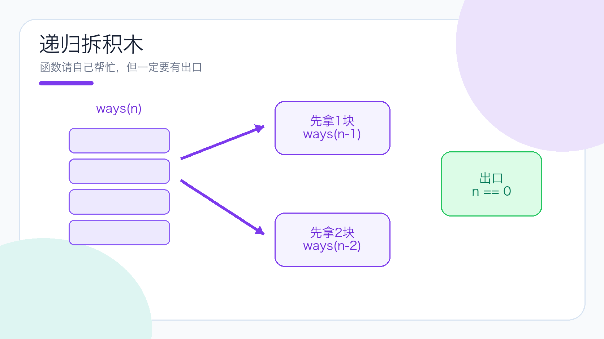

图示：递归拆积木：函数请自己帮忙

#### 学习目标

- 孩子能说出：递归像一个会叫自己的小助手
- 孩子能理解拆n块积木可以先拿1块或先拿2块
- 孩子能说出递归必须有停止条件
- 孩子能看懂ways(n - 1) + ways(n - 2)的含义
- 孩子能完成一个最小版递归计数题

#### 低龄课堂设计

| 项目 | 内容 |
| --- | --- |
| 适合对象 | 7-8岁，一二年级，适合先讲故事再看代码 |
| 节奏安排 | 复习3分钟，生活演示8分钟，代码拆解10分钟，上机练习10分钟，收口3分钟 |
| 统一语言 | 本课统一使用“会叫自己的拆塔小助手”作比喻，少说抽象术语，多说动作和结果 |

- 每页演示只抓一个核心点，孩子能复述就进入下一页。
- 右侧老师提示可以照读；主画面给孩子看，不要把备课说明读给孩子。
- 如果孩子卡住，回到生活动作，不要停留在术语解释上。

#### 课堂流程

| 时间 | 环节 | 老师做什么 | 学生做什么 |
| --- | --- | --- | --- |
| 0-5分钟 | 复习连接 | 上一课我们按顺序模拟电梯移动，知道了大题也可以拆成一步一步。 | 说出上一课的关键词，跟老师把旧知识接回来。 |
| 5-12分钟 | 本课故事 | 今天第一次碰递归：拆n块积木，可以先拿1块，也可以先拿2块，剩下的小塔继续用同样方法拆。 | 回答本课开场问题，先用生活语言理解概念。 |
| 12-24分钟 | 代码拆解 | 展示关键代码：def ways(n): /     if n == 0: /         return 1 /     if n < 0: /         return 0 /     return ways(n - 1) + ways(n - 2)。带孩子逐行说出每个零件的作用。 | 指出关键符号、函数名或变量名，预测输出。 |
| 24-34分钟 | 互动演示 | 拿3块积木现场列出1+1+1、1+2、2+1。再把“先拿1块”和“先拿2块”分成两队。 | 用手势、纸条、黑板或口头预测完成一次非电脑演示。 |
| 34-42分钟 | 上机练习 | 让孩子照着模板完成学生端编程题，重点检查本课最容易错的地方。 | 运行代码，看到输出后再交卷。 |
| 42-45分钟 | 收口衔接 | 递归必须有出口；ways(n)可以拆成ways(n-1)和ways(n-2)。 题库改造到这里先收束，后续可以继续把更多大题拆成低龄可学的小挑战。 | 说出今天带走的一句话。 |

#### 老师话术

##### 1. 开场：先接上一课

上一课我们按顺序模拟电梯移动，知道了大题也可以拆成一步一步。 今天我们继续往前走：今天第一次碰递归：拆n块积木，可以先拿1块，也可以先拿2块，剩下的小塔继续用同样方法拆。

检查点：孩子能说出上一课关键词。

##### 2. 讲新概念：使用“会叫自己的拆塔小助手”比喻

把今天的新知识想成“会叫自己的拆塔小助手”。先用生活例子讲明白，再看代码。

检查点：递归必须有出口；ways(n)可以拆成ways(n-1)和ways(n-2)。

##### 3. 看代码：逐行翻译

不要让孩子整段背。老师逐行问：这一行先做什么？下一行又做什么？

检查点：孩子能说出代码执行顺序。

##### 4. 孩子出错：先定位一个坑

本课最常见的问题是：孩子容易忘记递归出口，函数就会一直叫自己。

检查点：孩子知道先检查哪里。

#### 课堂演示稿

##### 演示 1：复习：上一课接到这一课

上一课我们按顺序模拟电梯移动，知道了大题也可以拆成一步一步。

课堂提问：请先说一句：上一课我们最重要学到了什么？

检查点：孩子能说出上一课的一个关键词。

老师提示：

- 你可以照着这样讲
  - 每节课开头先帮孩子把旧知识叫醒，不要直接进入新概念。
  - 上一课我们按顺序模拟电梯移动，知道了大题也可以拆成一步一步。
- 课堂操作
  - 请1位孩子回答上一课关键词。
  - 老师把孩子的话整理成一句清楚的话，再进入本课。
- 新手老师提醒
  - 如果孩子答不上来，不要停太久。你直接给出关键词，让孩子跟读一遍即可。

##### 演示 2：本课任务：递归拆积木

今天第一次碰递归：拆n块积木，可以先拿1块，也可以先拿2块，剩下的小塔继续用同样方法拆。

课堂提问：3块积木，每次拿1块或2块，一共有哪几种拆法？

检查点：递归必须有出口；ways(n)可以拆成ways(n-1)和ways(n-2)。

老师提示：

- 你可以照着这样讲
  - 上一课我们按顺序模拟电梯移动，知道了大题也可以拆成一步一步。
  - 今天第一次碰递归：拆n块积木，可以先拿1块，也可以先拿2块，剩下的小塔继续用同样方法拆。
- 课堂操作
  - 拿3块积木现场列出1+1+1、1+2、2+1。再把“先拿1块”和“先拿2块”分成两队。
  - 让孩子先预测，再运行或揭晓答案。低龄孩子先说出来，再敲代码，会更稳。
- 容易卡住的地方
  - 孩子容易忘记递归出口，函数就会一直叫自己。
  - 孩子回答错时先追问“你是怎么看出来的？”，再带回屏幕上的关键词或符号。
- 过渡
  - 题库改造到这里先收束，后续可以继续把更多大题拆成低龄可学的小挑战。

##### 演示 3：看代码：把代码拆成小零件

今天的关键词：会叫自己的拆塔小助手

```python
def ways(n):
    if n == 0:
        return 1
    if n < 0:
        return 0
    return ways(n - 1) + ways(n - 2)
```

课堂提问：你能找到今天最重要的符号或单词吗？

检查点：孩子能说出代码中的一个关键零件。

老师提示：

- 你可以照着这样讲
  - 我们不急着背整段代码，先把它拆成小零件。
  - 每个小零件都有自己的工作，找到它们，代码就不吓人了。
- 课堂操作
  - 先让孩子只看第一行，指出变量名、函数名或符号。
  - 再看第二行，让孩子预测电脑下一步会做什么。
  - 最后把每一行连成完整故事。
- 检查方式
  - 问孩子：这段代码先做什么？再做什么？最后输出什么？

##### 演示 4：互动：先动手，再敲代码

拿3块积木现场列出1+1+1、1+2、2+1。再把“先拿1块”和“先拿2块”分成两队。

课堂提问：3块积木，每次拿1块或2块，一共有哪几种拆法？

检查点：孩子能把动作说成步骤。

老师提示：

- 你可以照着这样讲
  - 我们先不用电脑，用手、纸条或黑板把题目演一遍。
  - 演明白以后，再把动作翻译成代码。
- 课堂操作
  - 拿3块积木现场列出1+1+1、1+2、2+1。再把“先拿1块”和“先拿2块”分成两队。
  - 请孩子说出刚才动作里的顺序：第一步、第二步、第三步。
  - 把孩子说的话写成简短关键词。
- 低龄课堂提醒
  - 7-8岁孩子很需要身体动作和可见物品。先做动作，再看代码，理解会更顺。

##### 演示 5：避坑：最容易错在哪里？

孩子容易忘记递归出口，函数就会一直叫自己。

课堂提问：如果这里出错，我们第一步检查什么？

检查点：孩子知道本课最常见的错误点。

老师提示：

- 你可以照着这样讲
  - 程序员不是不犯错，程序员是会检查错误。
  - 今天我们先记住最常见的一个坑。
- 带孩子检查
  - 孩子容易忘记递归出口，函数就会一直叫自己。
  - 让孩子用手指屏幕上的关键位置，一起检查符号、顺序、括号或缩进。
- 鼓励话术
  - 写错不是失败，能找到错在哪里，就是程序员很厉害的能力。

##### 演示 6：收口：今天带走一句话

递归必须有出口；ways(n)可以拆成ways(n-1)和ways(n-2)。

- 递归 = 函数请自己帮忙
- 先拿1块 -> ways(n-1)
- 先拿2块 -> ways(n-2)

课堂提问：请选一句你最记得的话读出来。

检查点：孩子能说出本课核心句。

老师提示：

- 收尾方式
  - 先全班齐读本页标题。
  - 请2-3位孩子各说一句自己记住的话。
  - 再切回学生练习，让孩子马上做一道题巩固。
- 衔接下一课
  - 题库改造到这里先收束，后续可以继续把更多大题拆成低龄可学的小挑战。

#### 概念讲解

##### 1. 递归小助手

递归就是函数在解决大问题时，请同一个函数帮忙解决小一点的问题。

例子：

```python
ways(n) 会用到 ways(n - 1) 和 ways(n - 2)。
```

老师可以这样说：像拆一座高塔，先拆一块后，剩下的小塔还是同一种问题。

问孩子：拆掉1块后，剩下的问题是不是还在拆积木？

##### 2. 两种第一步

每次可以先拿1块，也可以先拿2块。

例子：

```python
ways(n) = ways(n - 1) + ways(n - 2)
```

老师可以这样说：所有拆法可以分成两队：第一步拿1块的，第一步拿2块的。

问孩子：塔高3时，第一步可以拿几块？

##### 3. 递归出口

递归出口告诉函数什么时候停下来。

例子：

```python
if n == 0: return 1
if n < 0: return 0
```

老师可以这样说：如果没有出口，小助手会一直叫下去，程序会迷路。

问孩子：为什么递归一定要有停止条件？

##### 4. 数拆法

不是输出每一种拆法，而是数一共有多少种。

例子：

```python
n=3时：1+1+1、1+2、2+1，共3种。
```

老师可以这样说：我们像裁判一样数方案，不需要把每个动作都打印出来。

问孩子：3块积木有几种拆法？

#### 典型错误

##### 1. 没有写递归出口

错误写法：

```python
def ways(n):
    return ways(n - 1) + ways(n - 2)
```

改正写法：

```python
def ways(n):
    if n == 0:
        return 1
    if n < 0:
        return 0
    return ways(n - 1) + ways(n - 2)
```

递归必须知道什么时候停下来。

##### 2. 把n < 0也算成一种方法

错误写法：

```python
if n < 0:
    return 1
```

改正写法：

```python
if n < 0:
    return 0
```

拆过头不是成功方案，所以返回0。

##### 3. 忘记return

错误写法：

```python
ways(n - 1) + ways(n - 2)
```

改正写法：

```python
return ways(n - 1) + ways(n - 2)
```

函数要把算出的数量交回来，必须return。

#### 课堂实操：拆3块积木

- 拿3块积木，列出1+1+1、1+2、2+1
- 问孩子：如果第一步拿1块，剩下几块？
- 再问：如果第一步拿2块，剩下几块？
- 把两队方案相加，翻译成ways(n-1)+ways(n-2)

#### 教学提醒

这是一节大题独立课。不要把递归讲成抽象定义，直接从3块积木的三种拆法开始，让孩子看到规律。 低龄课堂建议：孩子容易忘记递归出口，函数就会一直叫自己。

#### 板书与课后沟通

板书建议：

- 递归 = 函数请自己帮忙
- 先拿1块 -> ways(n-1)
- 先拿2块 -> ways(n-2)
- n == 0 是成功拆完
- n < 0 是拆过头

家长沟通：

今天孩子初识递归。家长可以问：3块积木每次拿1或2块，有几种拆法？

#### 学生练习

##### 1. 递归最像什么？

A. 函数请自己帮忙解决小问题
B. 只输出文字
C. 打开图片
D. 去掉重复

答案：A. 函数请自己帮忙解决小问题
分值：10
解析：递归是函数调用自己来解决更小的问题。

##### 2. 拆3块积木，每次拿1块或2块，共有几种拆法？

A. 3种
B. 2种
C. 1种
D. 6种

答案：A. 3种
分值：10
解析：1+1+1、1+2、2+1，共3种。

##### 3. 递归为什么必须有出口？

A. 不然会一直调用下去
B. 为了换颜色
C. 为了输入文字
D. 为了排序

答案：A. 不然会一直调用下去
分值：10
解析：没有停止条件，递归会一直继续。

#### 编程挑战：数一数拆积木的方法

通关徽章：递归启蒙师

分值：80

有一座n块高的积木塔。
每次可以拿走1块或2块。
请输出把积木塔完全拆完的不同方法数。

例如输入：
3

输出：
3

提示：

```python
分成两种第一步：先拿1块，或先拿2块。

如果刚好拆完n == 0，说明找到1种方法。
如果拆过头n < 0，说明这条路不行。

def ways(n):
    if n == 0:
        return 1
    if n < 0:
        return 0
    return ways(n - 1) + ways(n - 2)
```

起始代码：

```python
# 递归拆积木：每次拿1块或2块

def ways(n):
    if n == 0:
        return 1
    if n < 0:
        return 0
    return ways(n - 1) + ways(n - 2)

n = int(input())
print(ways(n))
```

测试样例：

| 样例 | 输入 | 期望输出 |
| --- | --- | --- |
| 3块 | 3 | 3 |
| 4块 | 4 | 5 |
| 5块 | 5 | 8 |

# 附录：课程配图索引

| 课时 | 标题 | 配图 | 说明 |
| --- | --- | --- | --- |
| 第 0 课 | Python是什么？ | /course-visuals/python-intro.png | Python 入门：让电脑听懂清楚指令 |
| 第 1 课 | Python安装与IDLE编辑器 | /course-visuals/python-idle-workflow.png | Python 编辑器流程：安装、保存、运行 |
| 第 2 课 | 变量与常量 | /course-visuals/variables-boxes.png | 变量像有名字的小盒子 |
| 第 3 课 | 数据类型与运算符 | /course-visuals/data-types.png | 数据类型和运算符工具箱 |
| 第 4 课 | 整数与浮点数高级运算 | /course-visuals/number-tools.png | 数字工具箱：整除、余数和常用函数 |
| 第 5 课 | 字符串类型 | /course-visuals/string-beads.png | 字符串像一串有编号的珠子 |
| 第 6 课 | 顺序结构 | /course-visuals/sequence-steps.png | 顺序结构：电脑一行一行往下做 |
| 第 7 课 | 选择结构 if/elif/else | /course-visuals/if-road.png | if / else 路口：条件决定走哪条路 |
| 第 8 课 | 循环结构 for 循环 | /course-visuals/for-loop-stamps.png | for 循环：知道次数就重复做 |
| 第 9 课 | 循环结构 while 循环 | /course-visuals/while-stop-loop.png | while 循环：条件还成立就继续 |
| 第 10 课 | 函数定义与调用 | /course-visuals/functions-modules.png | 函数工厂与模块工具箱 |
| 第 11 课 | 变量作用域与常用模块 | /course-visuals/modules-scope.png | 函数房间和模块工具箱 |
| 第 12 课 | 文件操作与异常处理 | /course-visuals/files-exceptions.png | 文件像本子，异常处理像保护罩 |
| 第 13 课 | 算法综合应用 | /course-visuals/algorithm-challenge.png | 综合挑战：把问题拆成步骤 |
| 第 14 课 | Turtle小画家 | /course-visuals/turtle-creative.png | Turtle 创作：把代码变成图画 |
| 第 15 课 | Turtle画正方形 | /course-visuals/turtle-square.png | Turtle 正方形：重复4次前进和转弯 |
| 第 16 课 | Turtle画五角星 | /course-visuals/turtle-star.png | Turtle 五角星：5条线和144度 |
| 第 17 课 | Turtle综合创作 | /course-visuals/turtle-creative.png | Turtle 创作：把代码变成图画 |
| 第 18 课 | 打破无尽的重复 | /course-visuals/break-loop-train.png | break 是循环刹车 |
| 第 19 课 | 初识函数 | /course-visuals/functions-modules.png | 函数工厂与模块工具箱 |
| 第 20 课 | 有问有答 | /course-visuals/return-card-generator.png | 函数返回值：把结果交回来再显示 |
| 第 21 课 | 阿兰的密码 | /course-visuals/password-door.png | 密码门：字符串比较要用 == |
| 第 22 课 | 分解质因数 | /course-visuals/prime-factor-blocks.png | 分解质因数：把大数字拆成小因数 |
| 第 23 课 | Turtle复习：正方形指令 | /course-visuals/turtle-square.png | Turtle 正方形：重复4次前进和转弯 |
| 第 24 课 | Turtle项目：海底小鱼 | /course-visuals/turtle-fish-project.png | Turtle 项目：拆步骤画多条小鱼 |
| 第 25 课 | 不重复的魔法盒 | /course-visuals/set-sticker-box.png | 集合 set：重复内容只保留一份 |
| 第 26 课 | 糖果加工机 | /course-visuals/candy-processor.png | 批量处理：先加工，再筛选 |
| 第 27 课 | 花园浇水计划 | /course-visuals/sliding-window-water.png | 滑动窗口：连续一段向右滑 |
| 第 28 课 | 电梯小管家 | /course-visuals/elevator-simulation.png | 电梯模拟：每到一站更新当前位置 |
| 第 29 课 | 递归拆积木 | /course-visuals/recursion-blocks.png | 递归拆积木：函数请自己帮忙 |
